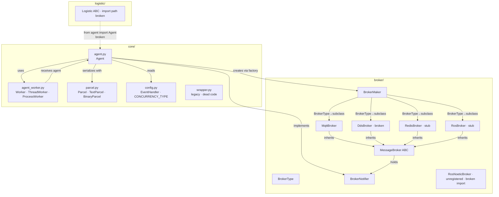

# 01 — Current Architecture

**Scope**: Phase 1 audit — description of the code as it currently exists.
**Rule**: Analysis only. No code modification.
**Evidence rule**: Every claim references an actual file, class, function and (where relevant) line number. Unverified statements are marked **Unknown** or **Confidence: Medium/Low**.

---

## 1.1 Repository Layout (actual)

```
AgentFlow/
├── src/agentflow/
│   ├── __init__.py                 (empty)
│   ├── core/
│   │   ├── __init__.py             (empty)
│   │   ├── agent.py                Agent class, 575 lines
│   │   ├── agent_worker.py         Worker / ThreadWorker / ProcessWorker
│   │   ├── config.py               EventHandler enum + module-level defaults
│   │   ├── parcel.py               Parcel / TextParcel / BinaryParcel
│   │   └── wrapper.py              legacy Wrapper (VERSION undefined, likely dead code)
│   ├── broker/
│   │   ├── __init__.py             exports BrokerType enum only
│   │   ├── broker_maker.py         BrokerMaker factory
│   │   ├── notifier.py             BrokerNotifier ABC
│   │   ├── message_broker.py       MessageBroker ABC
│   │   ├── mqtt_broker.py          only broker with real implementation
│   │   ├── dds_broker.py           incomplete (missing _client, unresolved Client)
│   │   ├── redis_broker.py         stub — log statements only
│   │   ├── ros_broker.py           stub — log statements only
│   │   └── ros_noetic_broker.py    not registered in factory; broken import
│   └── logistic/
│       ├── __init__.py             (empty)
│       └── logistic.py             20-line ABC skeleton (import path broken)
├── unit_test/                      5 files, see 06-test-coverage.md
├── exe_test/                       9 manual demo scripts
├── docs/
│   ├── review/                     (empty)
│   └── audit/                      this audit set
├── setup.py                        name=mas-agentflow, version=2025.8.22.1933
├── pyproject.toml                  build-system only
├── requirements.txt                paho-mqtt==2.1.0
├── README.md
└── AgentFlow-v20.pdf
```

### Naming inconsistencies

| README says | Reality |
|---|---|
| `src/agentflow/logistics/` | `src/agentflow/logistic/` |
| `unittest/` | `unit_test/` |
| MQTT/DDS brokers | Only MQTT is functional; DDS/ROS/Redis are stubs or broken |

Additional in-tree naming drift:
- `src/agentflow/core/config.py` exposes only the module-level constant `CONCURRENCY_TYPE` (`config.py:24`), but `exe_test/*.py` and `agent_worker.py` comments refer to a `ConfigName` class and `ConfigName.START_METHOD` / `ConfigName.CONCURRENCY_TYPE` that do not exist (`exe_test/1pmc.py:8`, `exe_test/1csp.py:8`, `exe_test/mp1c.py:8`, `exe_test/mpmc.py:8`, `exe_test/mpmc-sp.py:8`, `exe_test/1psc.py:8`, `exe_test/test1.py:14`).
- `unit_test/*.py` calls `Agent._publish` / `Agent._subscribe` (e.g. `unit_test/test_parents_children_count.py:25`, `unit_test/test_parcel.py:31,32`), which do not exist. The public methods are `publish` and `subscribe` (`src/agentflow/core/agent.py:305,353`).

---

## 1.2 Module Dependency Graph



Notes:
- `broker/__init__.py` only exposes `BrokerType`. `BrokerMaker`, `MessageBroker`, `BrokerNotifier`, `MqttBroker`, `RedisBroker`, `RosBroker`, `EmptyBroker` are imported by relative paths inside `broker_maker.py`.
- `RosNoeticBroker` is commented out in `broker_maker.py:26–27` and has `from .. import LOGGER_NAME` (`ros_noetic_broker.py:4`) which resolves against `src/agentflow/__init__.py` (empty), so the symbol does not exist → import would fail. Not reachable from the factory.

---

## 1.3 Component Responsibility Table

| Component | File | Responsibilities |
|---|---|---|
| `Agent` | `src/agentflow/core/agent.py:26` | Identity, config, worker creation, broker lifecycle & retry, publish/subscribe, handler dispatch, parent/child registry, interval loop, data store, sync request/response, dynamic event-handler installation |
| `Worker` (ABC) | `src/agentflow/core/agent_worker.py:11` | Contract: `start`, `stop`, `send_data`, `is_working`, `create_event` |
| `ThreadWorker` | `src/agentflow/core/agent_worker.py:81` | `threading.Thread` + `queue.Queue` + `threading.Event` |
| `ProcessWorker` | `src/agentflow/core/agent_worker.py:47` | `multiprocessing.Process` (spawn) + `multiprocessing.Queue` + `multiprocessing.Event` |
| `Parcel` (ABC) | `src/agentflow/core/parcel.py:22` | Payload envelope: `version`, `content`, `topic_return`, `error` |
| `TextParcel` | `src/agentflow/core/parcel.py:159` | JSON payload, `HEAD = b"text/json\|"` |
| `BinaryParcel` | `src/agentflow/core/parcel.py:135` | Pickle payload, `HEAD = b"application/pickle\|"` — see Risk R-01 |
| `MessageBroker` (ABC) | `src/agentflow/broker/message_broker.py:5` | `start`, `stop`, `publish`, `subscribe` (no `unsubscribe`, no `is_connected`, no `reconnect`) |
| `BrokerNotifier` (ABC) | `src/agentflow/broker/notifier.py:4` | `_on_connect`, `_on_message` callbacks that broker fires into agent |
| `BrokerMaker` | `src/agentflow/broker/broker_maker.py:16` | Factory from `BrokerType` to concrete broker subclass |
| `MqttBroker` | `src/agentflow/broker/mqtt_broker.py:10` | paho-mqtt v2 wrapper; only broker with concrete behaviour |
| `EmptyBroker` | `src/agentflow/broker/empty_broker.py:8` | No-op broker |
| `RedisBroker` | `src/agentflow/broker/redis_broker.py:8` | Stub only |
| `RosBroker` | `src/agentflow/broker/ros_broker.py:8` | Stub only |
| `DdsBroker` | `src/agentflow/broker/dds_broker.py:10` | Incomplete; references undefined `_client`, `Client` symbol not imported |
| `RosNoeticBroker` | `src/agentflow/broker/ros_noetic_broker.py:13` | Broken import; not registered in factory |
| `Logistic` (ABC) | `src/agentflow/logistic/logistic.py:7` | 20-line skeleton; `from agent import Agent` (line 5) is not a valid import path from this package |
| `Wrapper` | `src/agentflow/core/wrapper.py:6` | Uses `VERSION` symbol never defined in module → `TextWrapper.wrap` raises `NameError` on invocation; likely dead code |

---

## 1.4 Public vs Private Surface (as inferred from `@final`, `__` prefixes, `_` prefixes)

Explicit `@final` methods on `Agent` (`src/agentflow/core/agent.py`):
- `get_data` (272), `pop_data` (277), `put_data` (287)
- `publish` (304), `publish_sync` (321), `subscribe` (352)
- `_on_message` (536)

Name-mangled (double-underscore) methods and fields — treated as private:
- `__init_config`, `__create_worker`, `__generate_return_topic`, `__activating`, `__deactivating`, `__register_child`, `__register_parent`
- `__data`, `__data_lock`, `__connected_event`, `__terminate_event`, `__topic_handlers`

User-override hooks (documented behaviour is "override in subclass"):
- `on_activating`, `on_activate`, `on_terminating`, `on_terminated`, `on_interval`
- `on_connected`, `on_message`
- `on_register_child`, `on_register_parent`
- `on_children_message`, `on_parents_message`

---

## 1.5 Configuration Surface

Only one flag is defined in `src/agentflow/core/config.py`:
- `CONCURRENCY_TYPE = 'CONCURRENCY_TYPE'` (`config.py:24`)
- `default_config = {CONCURRENCY_TYPE: 'process'}` (`config.py:27–29`)

Broker configuration is nested via free-form dictionaries. The observed shape (from `agent.py:180–186`) is:

```python
broker_config_all = agent.get_config("broker", {'broker_type': BrokerType.Empty})
broker_name       = broker_config_all['broker_name']
broker_config     = broker_config_all[broker_name]
broker_type_enum  = BrokerType(broker_config['broker_type'].lower())
```

**Observation**: the default fallback dict `{'broker_type': BrokerType.Empty}` does not contain `broker_name`, so if `config["broker"]` is missing, `broker_config_all['broker_name']` raises `KeyError` before the fallback ever takes effect. **Confidence: High** — direct read of `agent.py:180–186`.

`EventHandler` enum values (`config.py:12`) can be placed as keys in the config dict; `_on_connect` dynamically translates them into method attributes on the agent (`agent.py:515–517`):

```python
for event in EventHandler:
    attr_name = str(event).lower()[len('EventHandler.'):]
    setattr(self, attr_name, self.get_config(str(event), getattr(self, attr_name, None)))
```

Consequence: any value under an `EventHandler.*` key is bound as a method-shaped attribute. This includes `None`, which would replace the default method.

---

## 1.6 What is NOT in the code

The following concepts are named in the README / paper but have no concrete implementation:

| README / paper concept | Code location | Status |
|---|---|---|
| Selective Request-Response *Logistic* | `logistic/logistic.py` | Only a 20-line ABC; no subclasses; `Agent.publish_sync` (`agent.py:321`) is the only request/response primitive and does not go through `Logistic` |
| Dynamic Election (`s* = argmin Load(s)`) | — | Not present anywhere |
| Composite Coordination | — | Not present |
| Load metrics collection / propagation | — | Not present |
| Task reassignment on failure | — | Not present |
| Heartbeat / liveness detection | — | Not present |
| Unsubscribe | `MessageBroker`, `MqttBroker` | Not defined in ABC; not implemented in MqttBroker |
| Reconnect / re-subscription | `MqttBroker` | `reconnect_on_failure=False` (`mqtt_broker.py:18`); `_on_disconnect` only logs (`mqtt_broker.py:52–53`) |

See `07-readme-implementation-gap.md` for the full comparison.

---

## 1.7 External Dependencies

From `requirements.txt`:
- `paho-mqtt==2.1.0` (only declared dependency)

Not declared but referenced in code:
- `rticonnextdds_connector` (imported at top of `broker/dds_broker.py:1`; the module is unusable without it, and even with it, the class body references `_client`/`Client` that are never defined)
- `rospy`, `std_msgs.msg` (imported at top of `broker/ros_noetic_broker.py:1–2`)

Stdlib usage of note: `multiprocessing` with `spawn` start method forced in `Worker.__init__` (`agent_worker.py:13–14`), `pickle` in `BinaryParcel` / legacy `Wrapper`.

---

## 1.8 Unknowns

- **U-1.1**: Whether the process-mode spawn path can actually pickle the Agent instance together with its `_agent_worker` (which holds a `multiprocessing.Process` handle). Not verified in this phase.
- **U-1.2**: Contents of `unit_test/config_test.py`. The file is `.gitignore`d (line 141) and not present in the working tree. Sample dicts in `comment.txt` suggest a shape, but the actual file is not available.
- **U-1.3**: Whether the `Wrapper` class in `core/wrapper.py` is called anywhere at runtime. No inbound references found by grep in this pass; suspected dead code.
