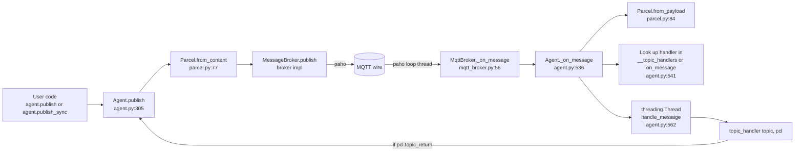
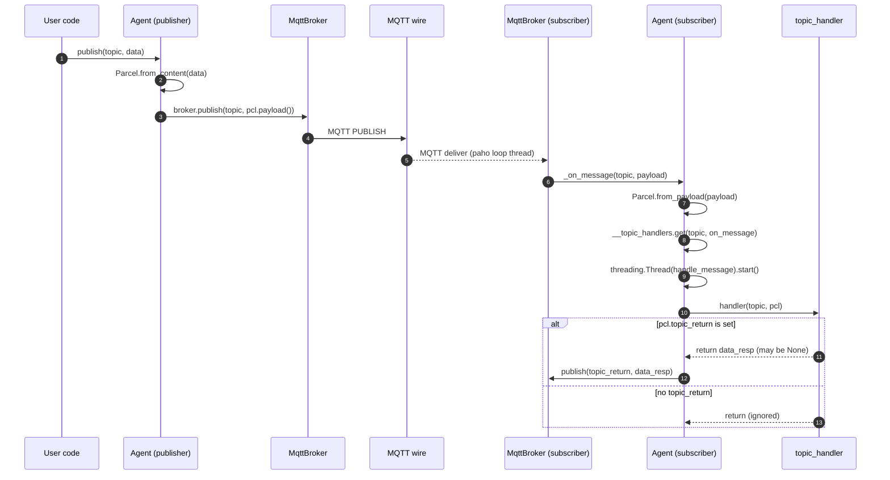
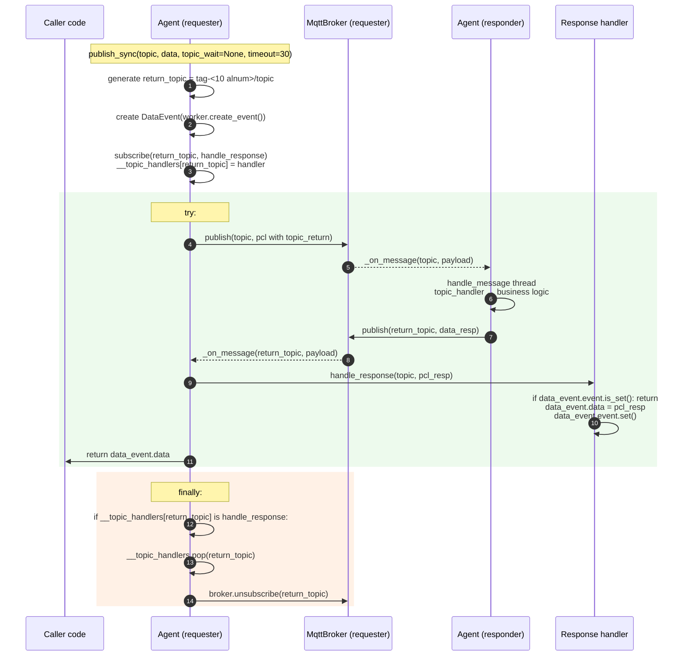
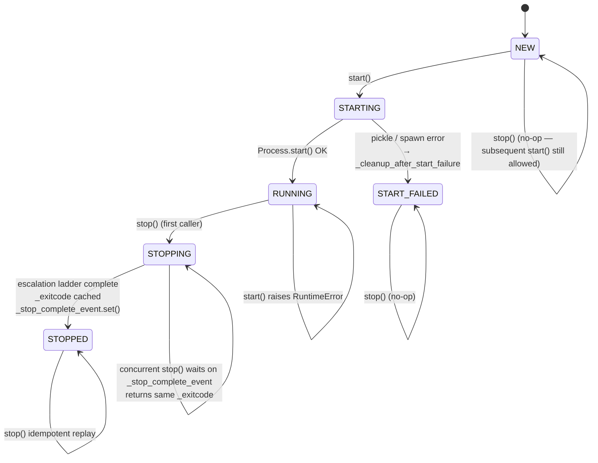
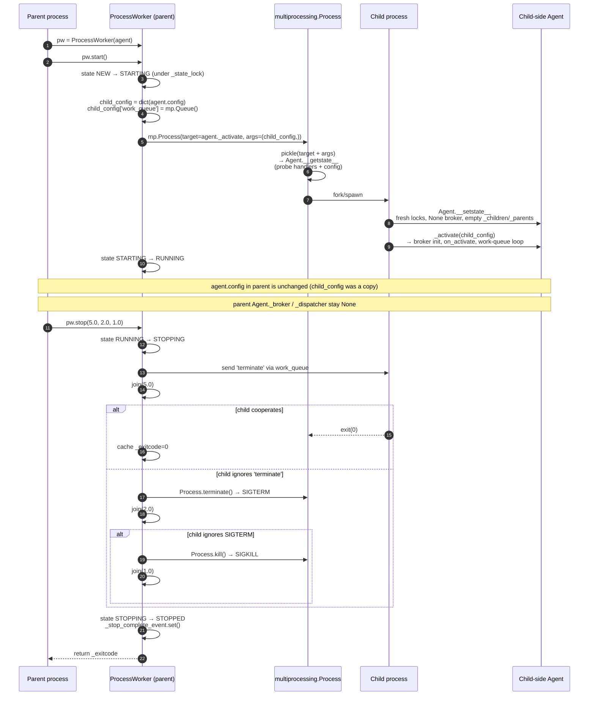
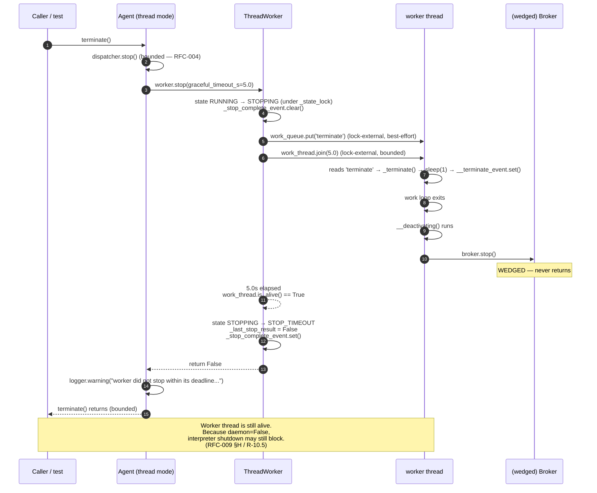
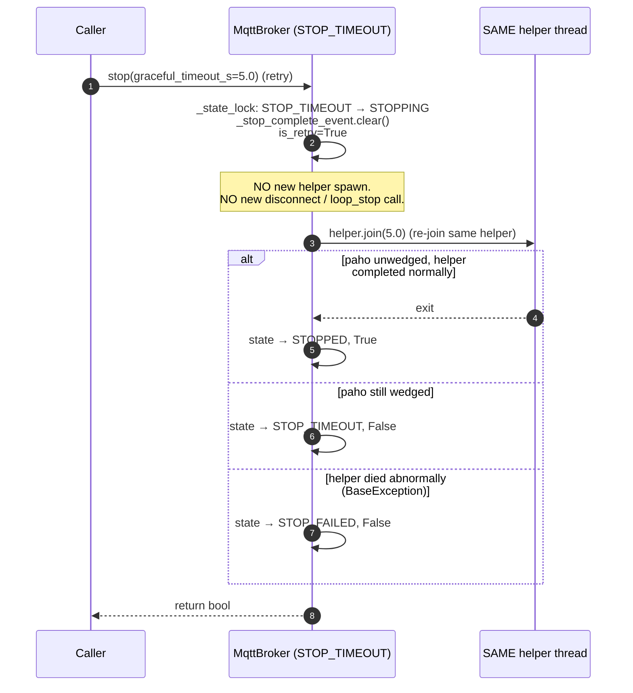
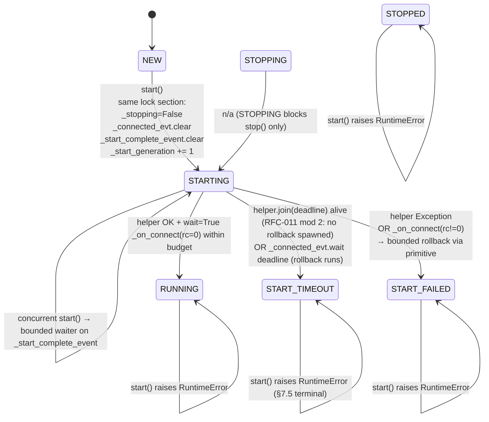

# 02 — Runtime Message Flow

**Scope**: How a message travels from `Agent.publish` to a subscriber's handler, and how `publish_sync` layers a synchronous request/response on top of that.
**Rule**: Analysis only.

---

## 2.1 High-level component pipeline



---

## 2.2 Publish

`Agent.publish` (`src/agentflow/core/agent.py:304–314`):

```python
@final
def publish(self, topic, data=None):
    pcl = data if isinstance(data, Parcel) else Parcel.from_content(data)
    try:
        if self._broker:
            self._broker.publish(topic, pcl.payload())
        else:
            logger.error("Cannot publish: _broker is None.")
    except Exception as ex:
        logger.exception(ex)
```

Observed behaviour:
- Return value is always `None`. paho's `MessageInfo` returned by `MqttBroker.publish` (`mqtt_broker.py:106–107`) is discarded. Fire-and-forget contract is intentional and preserved by [RFC-002](../rfc/RFC-002-publish-error-propagation.md); callers who require raise-on-failure semantics use the internal `Agent._publish_or_raise` (see §2.8).
- If `self._broker` is `None`, the call is silently logged and returns; caller cannot detect this. See Risk R-08.
- Any exception is swallowed via `logger.exception`.

`Parcel.from_content` (`src/agentflow/core/parcel.py:77–81`) chooses:
- `BinaryParcel` if `content` is `bytes` or `bytearray`
- `TextParcel` otherwise

Serialisation:
- `TextParcel.payload()` — `b"text/json|" + utf-8 json` (`parcel.py:179–181`)
- `BinaryParcel.payload()` — `b"application/pickle|" + pickle.dumps(managed_data, HIGHEST_PROTOCOL)` (`parcel.py:155–156`)

The serialized envelope contains `version`, `content`, `topic_return`, `error` (`parcel.py:95–101`).

---

## 2.3 Subscribe

`Agent.subscribe` (`src/agentflow/core/agent.py:352–364`):

```python
@final
def subscribe(self, topic, data_type:str="str", topic_handler=None):
    ...
    if topic_handler:
        if topic in self.__topic_handlers:
            logger.warning(...)
        self.__topic_handlers[topic] = topic_handler
    return self._broker.subscribe(topic, data_type) if self._broker else None
```

Observed:
- Duplicate subscribe on the same **NORMAL-owned** topic still warns and overwrites the handler; no rejection (RFC-006 §7.11 / RFC-007 §7.5 — legitimate rebind).
- `data_type` is a string ("str" by default) and is passed through to `MessageBroker.subscribe`. `MqttBroker.subscribe` ignores it (records it in the RFC-005 registry only). Only `RosNoeticBroker` would use it — but that broker is unregistered.
- ~~`__topic_handlers` is a plain dict with no synchronization~~ — **Post-RFC-007 (2026-07-27)**: `__topic_handlers` values are now `_HandlerRecord(owner_type, handler)` where `owner_type ∈ {NORMAL, PUBLISH_SYNC}`. All mutations and reads happen under `_handlers_lock` (a `threading.RLock` introduced by RFC-006 and generalised by RFC-007). Direct `Agent.subscribe` / `Agent.unsubscribe` on a `PUBLISH_SYNC`-owned topic raise `TopicWaitCollisionError`; `publish_sync` on a `NORMAL`-registered topic also raises. `_on_message` reads `__topic_handlers` under `_handlers_lock` in a single snapshot, closing the pre-RFC-007 TOCTOU. Broker I/O (`broker.subscribe`, `broker.unsubscribe`, `dispatcher.enqueue`, handler invocation) always happens **outside** the lock. See [`docs/audit/05-risk-register.md` R-14](05-risk-register.md#r-14--shared-dictionaries-without-locks) for the full contract, collision table, and lock-hygiene tests. `_children` / `_parents` remain unlocked (R-14 residual, deferred to a future RFC). `Agent.subscribe` / `Agent.unsubscribe` public signatures are unchanged.
- **Broker-side subscription recovery (post-RFC-005, 2026-07-27)**: `MqttBroker.subscribe` now maintains a thread-safe `_registry: dict[topic, data_type]`. When connected, the call forwards to `client.subscribe` as before; when disconnected, only the registry is updated. On the next successful `_on_connect`, the broker snapshots the registry and re-emits `client.subscribe(topic=topic)` for each entry (per-topic try/except; recheck `_stopping` and live-registry membership between iterations). `MqttBroker.unsubscribe` mirrors this: it deletes the registry entry so recovery does not resurrect it. `stop()` sets `_stopping=True` before `client.disconnect()`, so any late `_on_connect` callback observes the flag and skips both recovery and notifier delegation. See [`docs/audit/05-risk-register.md` R-03](05-risk-register.md#r-03--mqtt-reconnect-and-subscription-recovery-are-not-implemented) for the full contract and race analysis; `Agent.subscribe` / `Agent.unsubscribe` public signatures are unchanged.

---

## 2.4 Receive path (MQTT)

paho callback → `MqttBroker._on_message` (`mqtt_broker.py:56–60`):

```python
def _on_message(self, client, db, message):
    try:
        self._notifier._on_message(message.topic, message.payload)
    except Exception as ex:
        logger.exception(ex)
```

This is the correct boundary — a raised handler exception does not kill the paho loop thread.

`Agent._on_message` (`src/agentflow/core/agent.py:536–562`):

```python
@final
def _on_message(self, topic:str, data):
    pcl = Parcel.from_payload(data)
    topic_handler = self.__topic_handlers.get(topic, self.on_message)

    def handle_message(topic_handler, topic, p:Parcel):
        if p.topic_return:
            try:
                data_resp = topic_handler(topic, p)
            except Exception as ex:
                logger.exception(ex)
                p.error = str(ex)
                p.content = None
                data_resp = p
            finally:
                self.publish(pcl.topic_return, data_resp)
        else:
            try:
                topic_handler(topic, p)
            except Exception as ex:
                logger.exception(ex)

    threading.Thread(target=handle_message, args=(topic_handler, topic, pcl)).start()
```

Observed:
- ~~One new `threading.Thread` per received message, no daemon flag, no pool, no upper bound~~ — **RESOLVED 2026-07-26 (RFC-004)**. `_on_message` now enqueues `handle_message` onto a bounded `MessageDispatcher` (`src/agentflow/core/dispatcher.py`) drained by a fixed pool of **daemon** consumer threads (default `workers=8`, `queue_capacity=1024`, overflow policy `drop_newest`). `enqueue()` is linearized under `_state_lock`; the paho callback thread never sees `queue.Full` (RFC-004 §7.3 broker-callback safety invariant). See [`docs/audit/05-risk-register.md` R-04](05-risk-register.md#r-04--per-message-unbounded-thread-creation) for the full contract, race fixes (enqueue check-then-put linearization + concurrent-stop `_stop_complete_event`), and runtime evidence.
- `Parcel.from_payload` raises `TypeError` on unknown HEAD (`parcel.py:89`); the raise happens on the broker's paho loop thread, then it is caught by `MqttBroker._on_message`.
- **BinaryParcel triggers `pickle.loads` on wire bytes** (`parcel.py:146`) → Risk R-01.
- Auto-reply eligibility (**post-RFC-003, 2026-07-26**): an auto-reply is emitted only when both (a) the incoming `pcl.topic_return` is truthy AND (b) the dispatched handler was a **specifically registered** entry in `__topic_handlers` (not the fall-through to `on_message`). See [RFC-003](../rfc/RFC-003-auto-reply-contract.md) and R-05 in the risk register. The pre-RFC-003 behaviour where a fall-through `on_message` also generated an implicit reply is no longer the case.

---

## 2.5 End-to-end sequence — one-shot publish



---

## 2.6 Topic naming rules used by Agent

Extracted from `src/agentflow/core/agent.py`:

| Purpose | Topic template | Line |
|---|---|---|
| Any child → any parent with this name | `to_parent.{self.name}` | 519 |
| A specific parent (targeted) | `{agent_id}.to_parent.{self.name}` | 520 |
| A parent → all its child-name group | `to_child.{self.name}` | 462 (default in `_notify_children`) |
| A parent → children of a specific name | `to_child.{target_child_name}` | 475 |
| A parent → one specific child | `{child_id}.to_child.{self.name}` | 447 |
| A child subscribes: all-parents-of-me | `to_child.{self.parent_name}` | 524 |
| A child subscribes: same-name siblings group | `to_child.{self.name}` | 525 |
| A child subscribes: me-only | `{agent_id}.to_child.{self.parent_name}` | 526 |
| Sync return topic | `{tag}-{10 rand alnum}/{topic}` | 316–319 |

`self.tag` is the first 4 hex chars of `agent_id` (`agent.py:34`). `self.parent_name` is derived by `name.split('.', 1)[1] if '.' in name else None` (`agent.py:37`).

Observations:
- Because subscription uses **agent name** (user-provided), two independently constructed agents that happen to share a name receive each other's parent/child messages. This is by design in `unit_test/test_parents_children_count.py`, but is a **cross-org collision** in any deployment sharing an MQTT broker. See Risk R-09.
- Return topic uses `/` as separator (`agent.py:319`), while all other topics use `.`. If the underlying original `topic` contains `+`, `#`, or `/`, MQTT wildcard semantics take over. No topic sanitisation exists. See Risk R-09.

---

## 2.7 Sync request/response — `publish_sync`

> **Update (2026-07-26)**: sections 2.7's "Explicit lifecycle gaps" #1 and #2 were **Resolved by [RFC-001](../rfc/RFC-001-publish-sync-subscription-lifecycle.md)** — see [`docs/audit/05-risk-register.md` R-02](05-risk-register.md#r-02--publish_sync-leaks-handler-entries-and-broker-subscriptions). Gaps #3 and #4 remain open. The sequence diagram and narrative below have been updated to reflect the resolved cleanup path.

`Agent.publish_sync` (`src/agentflow/core/agent.py:321–353`):



### Explicit lifecycle gaps

1. ~~**No handler cleanup**~~ — **RESOLVED 2026-07-26 (RFC-001).** `publish_sync` now runs an identity-guarded `finally` that pops `__topic_handlers[return_topic]` when it is still the specific `handle_response` this call installed. Verified by `tests/unit/core/test_agent_publish_sync.py::test_topic_handlers_cleaned_after_successful_publish_sync` and `_timed_out_publish_sync`.
2. ~~**No broker unsubscribe**~~ — **RESOLVED 2026-07-26 (RFC-001).** `MessageBroker` now declares `unsubscribe(topic) -> None` as a non-abstract default no-op; `MqttBroker.unsubscribe` delegates to `self._client.unsubscribe(topic)`. Verified by `tests/unit/core/test_agent_publish_sync.py::test_broker_subscribe_and_unsubscribe_grow_together_on_success` and `_on_timeout`, plus `tests/unit/test_mqtt_broker_lifecycle.py::test_unsubscribe_delegates_topic_to_client`.
3. **No correlation id** (still open): return topic is the only demultiplexer. Concurrent requests to the same `topic` with `topic_wait=None` get distinct return topics via random suffix (10 base-36 chars → ~40 bits); with `topic_wait` reused explicitly, they still race — `Agent.subscribe` silently overwrites. RFC-001 added an identity guard so the cleanup path does not make this race worse, but the race itself is unresolved.
4. **Timeout only on `event.wait`** (still open): publish/subscribe I/O has no timeout.

### Post-resolution observable invariants

For every `publish_sync` call, regardless of exit path (success, `TimeoutError`, or broker-`publish` exception):

- `return_topic not in agent._Agent__topic_handlers`
- `broker.unsubscribe_calls` grew by exactly one entry equal to `return_topic`
- Any late or duplicate response arriving after cleanup is routed to the default `Agent.on_message` (no-op) via fall-through, not to the completed `handle_response`.

The one exception is the **identity-guard bypass**: if a foreign handler races onto the same topic between `subscribe` and `finally`, the guard skips both the pop and the unsubscribe. In that case the foreign handler is preserved and the (already lost) subscription is not torn down. Verified by `test_identity_guard_preserves_foreign_handler_on_same_topic`.

### Reply loop — RESOLVED 2026-07-26 (RFC-003)

> **Update (2026-07-26)**: the suspected reply loop was **confirmed by runtime evidence** and then **Resolved by [RFC-003](../rfc/RFC-003-auto-reply-contract.md)** — see [`docs/audit/05-risk-register.md` R-05](05-risk-register.md#r-05--suspected-reply-loop-on-error-paths-and-on-default-handlers).

Three loop patterns were runtime-confirmed under a bounded self-echo broker in `tests/unit/core/test_agent_reply_behavior.py`:

1. **Handler exception + self-echo**: on exception, `agent.py` used to set `data_resp = p` with `p.topic_return` preserved. The echoed error re-arrived and re-raised → loop (previously bounded at 20 dispatches; now terminates in ≤ 3).
2. **Handler returns Parcel-with-topic_return + self-echo**: the reply parcel preserved `topic_return` on the wire → re-arrival triggered another auto-reply → loop (previously bounded at 20; now ≤ 3).
3. **Two-agent mutual reply**: each side's handler produced a Parcel-with-topic_return targeted at the other's topic → ping-pong (previously bounded at 30 via a hub broker; now ≤ 3).

Post-RFC-003 dispatch (`agent.py:_on_message`, `@final`, public signature unchanged) enforces three rules that break every one of these patterns:

- **R-fallback-silent**: auto-reply is emitted only when `topic in self.__topic_handlers` (i.e. a specifically registered handler) AND `pcl.topic_return` is truthy. A subscribed-but-unhandled topic no longer generates implicit replies.
- **R-strip-topic_return**: if `data_resp` is a `Parcel` whose `topic_return` is truthy, the framework reconstructs a fresh parcel of the same subclass (`type(data_resp)(data_resp.content)`), copies `.error`, and uses it as the reply. The handler's original returned object is not mutated.
- **R-exception-fresh**: on handler exception the reply is a brand-new `Parcel.from_content(None)` with `.error = str(ex)`. The incoming `p` is not mutated; handlers holding a reference to `p` observe its original `content`, `error`, and `topic_return`.

`publish_sync` is unaffected: `handle_response` returns `None`, so `Parcel.from_content(None)` produces a reply with `topic_return=None` and R-strip-topic_return is a no-op for the request-response path. `publish_sync`'s specific handler on `return_topic` also prevents R-fallback-silent from ever applying during its lifetime. Verified by `test_publish_sync_happy_path_still_works_under_RFC_003` and `test_publish_sync_late_reply_after_cleanup_is_silently_dropped`.

---

## 2.8 Publish result / error propagation

> **Update (2026-07-26)**: `Agent.publish` → `publish_sync` masking layer was **Resolved by [RFC-002](../rfc/RFC-002-publish-error-propagation.md)** — see [`docs/audit/05-risk-register.md` R-13](05-risk-register.md#r-13--publish-result-is-discarded-at-every-layer). The paho `MessageInfo` (rc/mid) at the broker adapter layer is still discarded; that residual observability gap is deferred to a future RFC on broker-level observability.

| Layer | Failure signal | Propagation (post-RFC-002) |
|---|---|---|
| paho `client.publish` | Returns `MessageInfo(rc, mid)` | Still discarded by `MqttBroker.publish` (out of RFC-002 scope). |
| `MqttBroker.publish` | Returns whatever paho returned | Still ignored by `Agent.publish` / `Agent._publish_or_raise` (out of RFC-002 scope). Broker-raised exceptions, however, do propagate. |
| `Agent._publish_or_raise` (new, internal) | Raises broker exceptions unchanged; raises `RuntimeError("Cannot publish: no broker attached")` when `_broker is None` | Reaches its direct caller (currently `publish_sync`; available to any internal caller that needs raise-on-fail semantics) |
| `Agent.publish` | Wraps `_publish_or_raise` in `try/except Exception: logger.exception(...)` | **Unchanged**: fire-and-forget, returns `None` on every outcome. Preserves the pre-RFC-002 contract byte-for-byte. |
| `Agent.publish_sync` | Calls `_publish_or_raise`; broker exceptions propagate through the RFC-001 `try/finally` (cleanup still runs) | **Original broker exception object** propagates to the caller (same type, message, traceback). True-timeout case (broker accepted the publish but no response) continues to raise `TimeoutError`. |

**Consequence**:
- Fire-and-forget publish (`Agent.publish`) callers see zero behavioural change — success and every failure still return `None`.
- `publish_sync` callers now fast-fail on publish errors with the original exception; only genuine "no response in time" produces `TimeoutError`.
- The residual broker-side observability gap (paho `MessageInfo` rc/mid) is documented and deferred.

Verified by `tests/unit/core/test_agent_publish_errors.py` (46 tests) and the four R-02 crossover tests in `tests/unit/core/test_agent_publish_sync.py`.

---

## 2.9 Process-mode worker lifecycle (post-RFC-008, 2026-07-28)

> **Update (2026-07-28)**: `ProcessWorker` is fully functional under `CONCURRENCY_TYPE='process'`. Agent is pickle-safe via `__getstate__` / `__setstate__`; `ProcessWorker` runs on a `WorkerState` machine with a bounded stop-escalation ladder. See [RFC-008](../rfc/RFC-008-process-worker-lifecycle.md) and [`docs/audit/05-risk-register.md` R-06](05-risk-register.md#r-06--process-mode-pickling-of-agent--processworker-lifecycle).

### Parent-side Agent contract

Under `CONCURRENCY_TYPE='process'`, the parent-side `Agent` instance is a **lifecycle controller stub**:

- Effective runtime state — `_broker`, `_dispatcher`, `__topic_handlers` dispatch — lives in the **child** process, established by `_activate` after unpickling.
- Parent-side `_broker` / `_dispatcher` remain `None`; parent-side `_children` / `_parents` remain `{}`. Parent-side `Agent.publish` / `subscribe` / `publish_sync` are **not proxied** to the child — they operate on empty local state and produce no broker traffic (per R-02 + RFC-002 `_broker is None` fast-fail).
- Callers that need to interact with the running child Agent must construct a **separate Agent** that connects to the same broker (from the same or a different process).

A transparent parent-side publish/subscribe proxy is explicitly out of RFC-008 scope; deferred to a future RFC that would introduce an IPC-based proxy or a `ProcessDispatcher`.

### Pickle contract (Agent)

`Agent.__getstate__` / `__setstate__` (`src/agentflow/core/agent.py`) implement the pickle protocol:

- **Runtime-only fields excluded** from `__getstate__`: `_handlers_lock`, `_dispatcher_init_lock`, `_dispatcher`, `_broker`, `_agent_worker`, `_message_broker`, `_children`, `_parents`.
- **Picklability probe** in `__getstate__`: `config` as a whole; every `_HandlerRecord.handler` in `__topic_handlers` individually. On failure, raises `TypeError` naming the offending topic (or `Agent.config`) and suggests registering the handler / binding the callback inside `on_activate()` (which runs in the child, avoiding the pickle boundary).
- `__setstate__` reinstates every runtime-only field fresh in the child: new `threading.RLock` × 2, `None` for the broker / dispatcher / worker back-references, empty `{}` for `_children` / `_parents`.
- The RFC-006 / RFC-007 `_HandlerRecord(owner_type, handler)` shape survives pickle intact; only the guarding `_handlers_lock` is rebuilt.

### ProcessWorker state machine

`WorkerState(Enum)` = `NEW → STARTING → RUNNING → STOPPING → STOPPED` (or `NEW → STARTING → START_FAILED` on start error). All transitions under `_state_lock: threading.RLock`. Read-only `state` / `exitcode` properties.



Key implementation notes:

- **`agent.config` is NOT mutated**: `start()` builds `child_config = dict(self.initiator_agent.config)` locally and puts the `work_queue` reference on the copy. `Process(daemon=False)`.
- **`stop()` before `start()`** is a pure no-op; state stays `NEW` so a subsequent `start()` is still allowed.
- **Restart is not supported**: `start()` after any of `STOPPING` / `STOPPED` / `START_FAILED` raises `RuntimeError("ProcessWorker cannot be restarted … construct a fresh worker")`.

### Shutdown escalation ladder

`stop(graceful_timeout_s=5.0, terminate_timeout_s=2.0, kill_timeout_s=1.0) -> Optional[int]`:

1. **Cooperative** — `send_data('terminate')` on the child's work queue.
2. `join(graceful_timeout_s)`.
3. If alive → **`Process.terminate()`** (SIGTERM on POSIX / TerminateProcess on Windows).
4. `join(terminate_timeout_s)`.
5. If alive → **`Process.kill()`** (SIGKILL / TerminateProcess with force).
6. `join(kill_timeout_s)`. If still alive after this, log ERROR and abandon.

Total wall time strictly bounded by `graceful + terminate + kill = 8.0s` at defaults; per-call configurable.

**Idempotence**: `STOPPED` state → cached-exitcode replay.
**Concurrent callers**: only the first caller executes the escalation; others block on `_stop_complete_event` and return the same cached exitcode. `finally` sets `STOPPED` and signals the event **even if the escalation body raised** — so concurrent waiters never hang.

### End-to-end sequence — process-mode start / stop



`stop()` runtime evidence: `test_stop_returns_exitcode_zero_when_child_cooperates` (cooperative), `test_stop_escalates_to_terminate_when_child_ignores_terminate_message` (SIGTERM path), `test_stop_escalates_to_kill_when_child_ignores_sigterm` (SIGKILL path), `test_concurrent_stop_all_callers_return_same_result_single_escalation` (concurrent coordination), `test_no_orphan_process_after_stop` (`os.kill(pid, 0) → ProcessLookupError`).

### R-06 sub-risk status

| Sub-risk | Status |
|---|---|
| R-06.1 spawn pickle failure | **Resolved** by pickle protocol above |
| R-06.2 unbounded `Process.join()` | **Resolved** by escalation ladder |
| R-06.3 heartbeat / liveness / automatic restart | **Deferred / Open** (out of RFC-008 scope) |
| R-06.4 parent-child state divergence | **Documented architectural constraint** (§ above) |
| Child exception forwarding | **Deferred / Open** — parent observes only exit code |

---

## 2.10 Thread-mode worker lifecycle (post-RFC-009, 2026-07-28)

> **Update (2026-07-28)**: `ThreadWorker` now matches `ProcessWorker`'s lifecycle contract at the shape level: `WorkerState` state machine, bounded cooperative `stop()`, concurrent-stop coordination, exception observability. Contract differences that cannot be aligned (thread-mode shared-instance model, no forced cancellation) are explicitly documented. See [RFC-009](../rfc/RFC-009-thread-worker-lifecycle.md) and [`docs/audit/05-risk-register.md` R-10](05-risk-register.md#r-10--workerstop-uses-join-without-timeout).

### Shared-instance vs controller-stub

The two worker strategies now have symmetric lifecycle machinery but preserve their **opposing state-sharing contracts** on purpose:

| Aspect | ProcessWorker (RFC-008) | ThreadWorker (RFC-009) |
|---|---|---|
| Agent instance | Copy via pickle (child holds its own) | **Shared** (same Python object) |
| Parent-side publish/subscribe | Not proxied (silent no-op; §2.9) | **Effective** — parent and worker share `_broker` / `_dispatcher` / `__topic_handlers` |
| `agent.config['work_queue']` | Copy — `child_config = dict(agent.config)` | **In-place mutation** — same dict, same queue reference |
| Runtime state (broker/dispatcher/handlers) | Populated in child only | **Populated in shared object** — visible to caller |
| Cancellation primitive | `Process.terminate() / kill()` (SIGTERM/SIGKILL) | **None** — Python threads cannot be safely cancelled |

The shared-instance contract is the reason parent-side `agent.publish()` / `subscribe()` / `publish_sync()` *work* in thread mode but not in process mode; RFC-009 §7.15 preserves this deliberately.

### ThreadWorker state machine

Reuses the RFC-008 `WorkerState` enum and adds two ThreadWorker-only terminal states:

- `STOP_TIMEOUT` — cooperative stop deadline expired; thread still alive; retriable.
- `FAILED` — `_activate` raised an `Exception` (not `BaseException`); captured into `last_exception`; thread ended.

```mermaid
stateDiagram-v2
    [*] --> NEW
    NEW --> STARTING: start()
    STARTING --> RUNNING: state set BEFORE thread.start()<br/>(closes _run_target self-exit race)
    STARTING --> START_FAILED: thread.start() raised<br/>→ work_thread cleared
    NEW --> NEW: stop() (no-op returns True — RFC-009 §7.6)
    RUNNING --> STOPPING: stop() (first caller)
    STOPPING --> STOPPED: join(graceful_timeout) OK<br/>_last_exception is None
    STOPPING --> FAILED: join(graceful_timeout) OK<br/>_last_exception set (from _run_target)
    STOPPING --> STOP_TIMEOUT: join(graceful_timeout) expired<br/>thread still alive; ref retained
    RUNNING --> FAILED: _run_target caught Exception<br/>→ state=FAILED, last_exception set
    RUNNING --> STOPPED: _activate self-exit<br/>→ RUNNING → STOPPED (only from RUNNING)
    STOP_TIMEOUT --> STOPPING: stop() retry allowed<br/>fresh budget, best-effort re-send terminate
    STOPPED --> STOPPED: idempotent replay (returns cached True)
    FAILED --> FAILED: stop() returns True if thread not alive
    START_FAILED --> START_FAILED: stop() no-op returning True
    STARTING --> STARTING: stop() raises RuntimeError<br/>start() raises RuntimeError
    STOPPING --> STOPPING: concurrent stop() bounded-wait<br/>on _stop_complete_event
```



Key implementation notes (RFC-009 §0 divergences from the RFC design):

- **`start()` sets `RUNNING` BEFORE `thread.start()`** (not after) to close a race where `_run_target` may run immediately, self-exit, and try to transition to `STOPPED` — but observe `STARTING` and skip.
- **`_run_target` catches `Exception` only** — RFC-009 §7.11; `BaseException` propagates and the thread dies without state update.
- **Thread reference retained on `STOP_TIMEOUT`** — `is_working()` still reflects real liveness; retry `stop()` re-joins the same thread with a fresh budget.

### Bounded stop contract

`stop(graceful_timeout_s: float = 5.0) -> bool`:

1. **Short state-lock section** (no I/O / join / send_data / logger inside — RFC-009 §F lock hygiene): dispatch on current state, transition first caller `RUNNING`/`STOP_TIMEOUT` → `STOPPING` and clear `_stop_complete_event`.
2. **Lock-external**: best-effort `send_data('terminate')` (swallow exceptions).
3. **Lock-external**: `work_thread.join(graceful_timeout_s)` (swallow exceptions).
4. **Read** `work_thread.is_alive()`.
5. **Under lock, atomic**:
   - alive → `STOP_TIMEOUT`, `_last_stop_result = False`
   - dead + `last_exception` → `FAILED`, `_last_stop_result = True`
   - dead → `STOPPED`, `_last_stop_result = True`
6. **`finally` (unconditional)**: `_stop_complete_event.set()` — concurrent waiters never hang even if the escalation body raised.
7. Lock-external log (INFO on success; **WARNING on timeout** including the daemon interpreter-exit caveat).

**Concurrent stop waiter (bounded)**: `_stop_complete_event.wait(graceful_timeout_s + 0.1)` — coordination margin 0.1s. On event completion → return cached `_last_stop_result`. On event timeout → read `Thread.is_alive()`, log WARNING, return `not alive`. **Never unbounded**.

### Agent.terminate contract

- **Signature unchanged**; never-raise contract preserved.
- **Order preserved**: `dispatcher.stop()` (RFC-004 bounded) before `worker.stop()` (RFC-008 / RFC-009 bounded).
- `dispatcher.stop()` wrapped in `try: … except Exception:` — a broken dispatcher does not block the worker cleanup path.
- `worker.stop()` wrapped in `try: … except Exception:` — misbehaving worker `.stop()` never propagates to the caller.
- Observes `worker.stop()` return value: **`False` → WARNING** with `state`, `work_thread`, and the daemon interpreter-exit caveat; `True` / `None` (legacy `FakeWorker`) → silent.
- **Bounded total wall time** ≈ `dispatcher.shutdown_timeout_s + worker.graceful_timeout_s ≈ 10s` at defaults.
- **Bounded return only guarantees `terminate()` itself returns**. If worker ended at `STOP_TIMEOUT` and `daemon=False`, Python interpreter shutdown may still block on that thread. This is a documented architectural limitation (see below).

### End-to-end sequence — thread-mode terminate under `broker.stop()` wedge



Runtime evidence: `test_F1_agent_terminate_returns_bounded_when_broker_stop_wedges_and_logs_WARNING`, `test_F4_agent_terminate_never_raises_when_worker_stop_returns_False`, `test_C3_wedged_thread_returns_False_bounded_and_state_STOP_TIMEOUT`, `test_D1_STOP_TIMEOUT_retry_reaches_STOPPED_when_blocker_released`.

### Exception observability

- `_run_target` wrapper catches `Exception` only (RFC-009 §7.11 — deliberate; `BaseException` propagates).
- On `Exception`: `self._last_exception = ex`, `logger.exception(...)`, state → `FAILED`.
- New read-only properties on `ThreadWorker`: `state: WorkerState`, `last_exception: Optional[BaseException]`.
- `is_working()` contract unchanged — reflects real `Thread.is_alive()`, not the abstract state.
- **Limitation**: a `BaseException` (`KeyboardInterrupt` / `SystemExit` / `GeneratorExit`) crash in `_activate` leaves state unchanged and, after `stop()`, gets marked `STOPPED` — masking the crash. Signal-based cleanup or a separate tracker would be needed; deferred.

### Daemon / interpreter-exit limitation

- `work_thread.daemon = False` preserved (RFC-009 §7.13). Daemonising would trade a visible hang for silent mid-`__deactivating` corruption (broker teardown interrupted at interpreter exit).
- **`stop()` returning bounded only guarantees `Agent.terminate()` itself returns.** A worker left in `STOP_TIMEOUT` is a live non-daemon thread; Python interpreter shutdown blocks on it.
- **This risk is NOT resolved by RFC-009.** It is deliberately documented in `ThreadWorker` docstring, `stop()` docstring, `Agent.terminate` docstring, and every WARNING log emitted by the timeout path. Tracked as [R-10.5](05-risk-register.md#r-10--workerstop-uses-join-without-timeout).

### R-10 sub-risk status

| Sub-risk | Status |
|---|---|
| R-10.1 `ProcessWorker.stop` unbounded join | **Resolved** by RFC-008 escalation ladder (SIGTERM / SIGKILL) |
| R-10.2 `ThreadWorker.stop` unbounded join | **Resolved** by RFC-009 cooperative bounded stop |
| R-10.3 `Agent.terminate` unbounded worker wait | **Resolved** — bounded by `dispatcher.shutdown_timeout_s + worker.graceful_timeout_s` |
| R-10.4 broker.stop() itself wedges | **Open / Runtime Confirmed** — surrounded by bounded worker; broker itself not bounded |
| R-10.5 non-daemon interpreter-exit blocking under STOP_TIMEOUT | **Open / Documented architectural limitation** — deliberate |

---

## 2.11 MqttBroker bounded-shutdown lifecycle (post-RFC-010, 2026-07-28)

> **Update (2026-07-28)**: `MqttBroker.stop()` now has a bounded, deterministic contract that mirrors the RFC-008 / RFC-009 worker-layer shape. The R-10.4 "wedged broker.stop hangs everything" scenario is closed. Only R-10.5 (non-daemon worker thread blocking interpreter exit) remains open — RFC-010 explicitly does NOT resolve it. See [RFC-010](../rfc/RFC-010-broker-bounded-shutdown.md) and [`docs/audit/05-risk-register.md` R-10](05-risk-register.md#r-10--workerstop-uses-join-without-timeout).

### Broker-side state machine

Reuses the RFC-008 / RFC-009 `WorkerState` enum with one MqttBroker-only addition:

- `STOP_TIMEOUT` (existing) — helper thread survived the deadline; retriable.
- `STOP_FAILED` (new in RFC-010) — helper thread exited abnormally without setting `_stop_helper_completed_normally=True` (e.g. `BaseException` propagated). Terminal; cached `False`.

```mermaid
stateDiagram-v2
    [*] --> NEW
    NEW --> STARTING: start()
    STARTING --> RUNNING: _on_connect(rc=0)<br/>(same lock section sets _connected=True)
    STARTING --> START_FAILED: start() raised (TimeoutError / ConnectionError)<br/>→ start's inline cleanup runs
    NEW --> NEW: stop() (pure no-op returns True — RFC-010 §7.5)
    STARTING --> STARTING: stop() raises RuntimeError<br/>(RFC-010 modification 3)
    RUNNING --> STOPPING: stop() (first caller)<br/>same lock section:<br/>_stopping=True<br/>_connected=False<br/>_connect_ok=False<br/>_connected_evt.clear()<br/>_stop_complete_event.clear()
    STOPPING --> STOPPED: helper join OK + completed_normally=True<br/>(with or without captured paho Exception)
    STOPPING --> STOP_FAILED: helper join OK + completed_normally=False<br/>(BaseException propagated)
    STOPPING --> STOP_TIMEOUT: helper join(graceful_timeout_s) expired<br/>helper still alive; retained
    STOP_TIMEOUT --> STOPPING: stop() retry — SAME helper re-joined<br/>(RFC-010 modification 1)<br/>no new spawn; no new paho calls
    STOPPED --> STOPPED: idempotent replay (returns cached True)
    STOP_FAILED --> STOP_FAILED: idempotent replay (returns cached False)
    START_FAILED --> START_FAILED: stop() no-op returning True<br/>(fences _stopping for late callbacks)
    STOPPING --> STOPPING: concurrent stop() bounded-wait on _stop_complete_event
```



**Single-helper invariant (RFC-010 modification 1)**: same MqttBroker lifecycle → at most ONE helper thread → at most ONE (`disconnect` + `loop_stop`) pair reaches paho. Verified by `test_C23_STOP_TIMEOUT_retry_reuses_same_helper_no_new_disconnect_loop_stop`.

### Bounded stop contract

`stop(graceful_timeout_s: float = 5.0) -> bool`:

1. **Short state-lock section** (no I/O / join / logger — lock hygiene). Dispatch on current state; at RUNNING → STOPPING transition, fence **all** active-connection flags in the SAME lock section (§G modification 4).
2. **Lock-external** first-caller path: spawn `daemon=True` helper (or re-join existing helper on `STOP_TIMEOUT` retry).
3. **Bounded** `helper.join(graceful_timeout_s)`.
4. **Under lock**, atomic outcome:
   - alive → `STOP_TIMEOUT`, `_last_stop_result=False`
   - dead + `completed_normally=True` → `STOPPED`, `True`
   - dead + `completed_normally=False` → `STOP_FAILED`, `False`
5. **`finally` (unconditional)**: `_stop_complete_event.set()` — waiters never hang.
6. Lock-external log (INFO / WARNING with daemon caveat / ERROR on STOP_FAILED).

**Concurrent stop waiter (bounded)**: `_stop_complete_event.wait(graceful_timeout_s + 0.1)`. On event timeout → read `helper.is_alive()`, log WARNING, return `not alive`. Never unbounded.

### Callback-after-stop fencing

Three paths fixed (RFC-010 §F modification 4):

- **`_on_message`** — silent drop under `_stopping` check; notifier NOT invoked (fixes pre-RFC-010 leak).
- **`_on_connect(rc=0)`** — entire callback body gated by initial `_stopping` check. Set → skip: no `_connect_ok=True`, no `_connected=True`, no state transition, no recovery, no notifier call, no `_connected_evt.set()`.
- **`_on_connect(rc!=0)`** — also gated: skip → no writes.

**`_on_disconnect`** — unchanged (RFC-005 semantics preserved). Diagnostic-only:
- Updates `_connected=False` (allowed)
- Updates `_last_disconnect_was_planned` (allowed)
- Does NOT touch `_stopping`
- Does NOT trigger recovery

### End-to-end sequence — wedged paho disconnect

```mermaid
sequenceDiagram
    autonumber
    participant P as Caller (worker thread or test)
    participant B as MqttBroker
    participant H as helper thread (daemon=True)
    participant C as paho Client
    P->>B: stop(graceful_timeout_s=5.0)
    B->>B: _state_lock: state RUNNING → STOPPING<br/>_stopping=True<br/>_connected=False, _connect_ok=False<br/>_connected_evt.clear()<br/>_stop_complete_event.clear()
    B->>H: threading.Thread(daemon=True).start()
    H->>C: client.disconnect()
    Note over C: WEDGED — never returns
    B->>B: helper.join(5.0)  (bounded)
    B-->>B: 5.0s elapsed; helper still alive
    B->>B: _state_lock: state → STOP_TIMEOUT<br/>_last_stop_result=False<br/>_stop_complete_event.set()
    B-->>P: return False
    Note over P: caller returned bounded.<br/>Agent.__deactivating observes False,<br/>logs WARNING with state + last_stop_exception.<br/>Helper thread stays alive (daemon — won't block exit).<br/>Worker thread (daemon=False) STILL alive → R-10.5 residual.
```

Retry semantics (RFC-010 modification 1):



Runtime evidence: `test_C21` / `test_C22` (bounded timeout for disconnect/loop_stop wedges), `test_C23` (single-helper retry — verified via `fake_client.disconnect.call_count == 1` across timeout + retry + cleanup), `test_C24` (retry reaches STOPPED after release), `test_D33_BaseException_in_helper_marks_STOP_FAILED_not_STOPPED`.

### Agent.__deactivating integration

`Agent.terminate` signature and behaviour **unchanged**; never-raise contract preserved.

`Agent.__deactivating` (private) observes `broker.stop()`'s new `bool` return:

- `False` → log WARNING with `state`, `last_stop_exception`, and daemon interpreter-exit caveat.
- `True` → silent.
- `None` (legacy `EmptyBroker` / third-party brokers) → treated as success via `stopped is False` guard.
- Any exception from `broker.stop()` → `logger.exception` + swallow (never-raise preserved).

**Bounded return of `__deactivating()` only guarantees this method returns.** If the broker ended at `STOP_TIMEOUT` and a worker thread with `daemon=False` is waiting on it, Python interpreter shutdown may still block on the worker thread. RFC-010 explicitly does NOT resolve this (R-10.5 residual).

### R-10 sub-risk status (post-RFC-010)

| Sub-risk | Status |
|---|---|
| R-10.1 `ProcessWorker.stop` unbounded join | **Resolved** (RFC-008) |
| R-10.2 `ThreadWorker.stop` unbounded join | **Resolved** (RFC-009) |
| R-10.3 `Agent.terminate` unbounded worker wait | **Resolved** (RFC-008 + RFC-009) |
| R-10.4 broker.stop() itself wedges | **Resolved 2026-07-28** (RFC-010 — daemon helper, `bool` return, `STOP_TIMEOUT` + `STOP_FAILED`, single-helper retry, callback fencing) |
| R-10.5 non-daemon interpreter-exit blocking under STOP_TIMEOUT | **Open / Documented architectural limitation** — RFC-010 helper is `daemon=True` (so helper alone does not block exit), but the worker thread waiting on broker still does |

---

## 2.12 MqttBroker bounded-startup lifecycle (post-RFC-011, 2026-07-29)

> **Update (2026-07-29)**: `MqttBroker.start()` now has a bounded, deterministic contract that mirrors the RFC-010 stop-side shape. The R-10.6 "`connect` / `loop_start` wedge blocks `start()` forever" scenario is closed. See [RFC-011](../rfc/RFC-011-mqtt-broker-bounded-startup.md) and [`docs/audit/05-risk-register.md` R-10](05-risk-register.md#r-10--workerstop-uses-join-without-timeout).

### Broker-side startup state machine

Extends the RFC-008/009/010 `WorkerState` enum with `START_TIMEOUT` (MqttBroker-only):



**Failed instance is TERMINAL** (RFC-011 §7.5). Any non-NEW `start()` raises `RuntimeError` WITHOUT modifying lifecycle flags. Structurally closes the E.50 cross-round callback contamination hazard: no "second round" can occur on the same instance. `Agent.__activating` retries via `BrokerMaker.create_broker()` (fresh instance per attempt) — fully compatible.

### Bounded startup contract

`start(options, *, startup_timeout_s: Optional[float] = None) -> bool`:

- `startup_timeout_s=None` falls back to `self._timeout` (constructor arg default 10.0) for backward compat with `MqttBroker(wait=True, timeout=0.1)`.
- Runs `connect + loop_start` on a `daemon=True` helper thread; caller bounded-joins with the shared deadline.
- **Single monotonic deadline** covers BOTH phases: helper join AND (wait=True) subsequent `_connected_evt.wait` — no way to blow past `startup_timeout_s`.
- **wait=False contract clarified** (RFC-011 §4): True ONLY means connect + loop_start were initiated. State stays STARTING until `_on_connect(rc=0)` fires.
- **wait=True success** requires `_on_connect(rc=0)` within the budget → state transitions to RUNNING.

### Failed-start rollback (bounded primitive)

`_run_client_shutdown_primitive(rollback_timeout_s=5.0) -> bool` (RFC-011 §6.4):

- State-agnostic, coordination-free daemon-helper wrapper around `disconnect + loop_stop`.
- Per-call `try/except Exception` isolation.
- Bounded-join with `rollback_timeout_s`; returns True if primitive helper completed.
- Does NOT touch `_state`, `_stop_complete_event`, or `_start_complete_event`.
- Does NOT overwrite failure state to STOPPED (§E requirement).
- Called by `START_FAILED`, callback-timeout, `rc!=0` paths (where startup helper is finished).
- **NOT called** for `START_TIMEOUT` when startup helper is still alive (RFC-011 modification 2 — avoids two helpers concurrently touching the same paho client). Deferred to a later `stop()` call.

**Rollback trigger matrix (post-RFC-011)**:

| Failure path | Startup helper state | Rollback timing |
|---|---|---|
| `connect` raise | Finished (helper set `completed_normally=True` and returned early) | Immediate — primitive runs |
| `loop_start` raise | Finished (`connect` succeeded first) | Immediate — primitive runs (fixes pre-RFC-011 TCP leak) |
| Callback wait timeout (wait=True) | Finished (both paho calls succeeded) | Immediate — primitive runs |
| `_on_connect(rc!=0)` | Finished | Immediate — primitive runs |
| Helper wedge (helper still alive past `startup_timeout_s`) | **Still alive** | **DEFERRED** — `_stopping=True` fence set; `stop()` runs primitive later after bounded-joining the helper |
| BaseException in helper | Dead (uncaught) | Immediate — primitive runs |

### Callback fencing after failed startup

`_transition_to_start_failure(new_state, exception)` sets `_stopping=True` in the SAME `_state_lock` section as the state transition. RFC-010 fencing kicks in immediately for late callbacks:

- `_on_connect(rc=0)` — skip (no `_connect_ok` write, no `_connected=True`, no state transition, no recovery, no notifier call, no `_connected_evt.set()`)
- `_on_connect(rc!=0)` — skip
- `_on_message` — silent drop
- `_on_disconnect` — still updates diagnostics (RFC-005 semantics preserved)

### END-to-end sequence — wedged connect + subsequent stop

```mermaid
sequenceDiagram
    autonumber
    participant P as Caller (Agent.__activating, test)
    participant B as MqttBroker
    participant H as startup helper (daemon)
    participant C as paho Client
    P->>B: start({}, startup_timeout_s=10.0)
    B->>B: _state_lock: NEW → STARTING<br/>_stopping=False, event.clear, gen+1
    B->>H: threading.Thread(daemon=True).start()
    H->>C: client.connect(...)
    Note over C: WEDGED — never returns
    B->>B: helper.join(10.0)  (bounded)
    B-->>B: 10.0s elapsed; helper still alive
    B->>B: _transition_to_start_failure(START_TIMEOUT, exc)<br/>_stopping=True<br/>_connected_evt.clear<br/>_last_start_exception=exc
    Note over B: NO rollback spawned<br/>(RFC-011 mod 2: helper still touching client)
    B->>B: _start_complete_event.set() (finally)
    B-->>P: raise TimeoutError

    P->>B: stop(graceful_timeout_s=5.0)
    B->>B: state = START_TIMEOUT → _start_timeout_recovery()
    B->>H: helper.join(5.0)  (bounded)
    alt helper still alive after wait
        B-->>P: return False (cleanup deferred)
    else helper finished (paho unwedged)
        B->>B: acquire _start_timeout_recovery_lock (bounded)
        B->>B: _run_client_shutdown_primitive_and_cache()
        Note over B: primitive helper (daemon)<br/>runs disconnect + loop_stop bounded
        B-->>P: return True (cleanup completed)
    end
```

### Concurrent start coordination

Same shape as RFC-010 `stop()`:

- First caller (NEW → STARTING) spawns helper.
- Concurrent callers observe STARTING → waiter path: `_start_complete_event.wait(startup_timeout_s + 0.1)` — bounded margin.
- Event completed → success returns cached `True`; failure **raises new `RuntimeError from _last_start_exception`** (RFC-011 modification 3 — never shares exception instance across threads).
- Event timeout → read `helper.is_alive()`, log WARNING, raise `TimeoutError`.
- **Invariant**: N callers → 1 helper → 1 `(connect + loop_start)` pair to paho. Runtime-verified in `test_D36` / `test_D37`.

### START_TIMEOUT.stop() recovery (RFC-011 §F)

Dedicated `stop()` path when state is `START_TIMEOUT`:

1. Fast path: check `_last_start_cleanup_result` cache — return cached if already computed.
2. Acquire `_start_timeout_recovery_lock` (bounded) — serialise concurrent stop callers.
3. Re-check cache after acquiring.
4. **Bounded-wait startup helper** (`helper.join(graceful_timeout_s)`) — MUST NOT run primitive while helper is alive (RFC-011 modification 2).
5. If helper still alive → return `False` (do not cache — later retry can try again).
6. Otherwise → run `_run_client_shutdown_primitive_and_cache(rollback_timeout_s=graceful_timeout_s)` — at most once → cache result → return.

**Modification 1**: `START_TIMEOUT.stop()` MUST NOT shortcut True. Return value reflects `_last_start_cleanup_result` accurately (`test_G62`).

### Agent.__activating integration

**Agent.__activating is UNCHANGED** (RFC-011 §7.21). The existing retry loop (`agent.py:353-356`, `max_retries=3`) works unmodified:

- `TimeoutError` (bounded RFC-011 result) → retry loop → **new** `BrokerMaker().create_broker()` iteration → fresh MqttBroker instance (RFC-011 §7.5 no-same-instance-retry is compatible).
- `ConnectionError` (rc!=0 path) → same retry loop.
- Any other paho `Exception` (unwrapped from START_FAILED) → existing `except Exception` handler.

`ThreadWorker`'s `_activate → __activating → broker.start` is now bounded → work_thread reaches the `while queue.get(...)` loop → `ThreadWorker.stop`'s `send terminate` has a consumer → clean STOPPED path (no more STOP_TIMEOUT via wedged broker startup).

### R-10 sub-risk status (post-RFC-011)

| Sub-risk | Status |
|---|---|
| R-10.1 `ProcessWorker.stop` unbounded join | **Resolved** (RFC-008) |
| R-10.2 `ThreadWorker.stop` unbounded join | **Resolved** (RFC-009) |
| R-10.3 `Agent.terminate` unbounded worker wait | **Resolved** (RFC-008 + RFC-009) |
| R-10.4 broker.stop() itself wedges | **Resolved** (RFC-010) |
| R-10.5 non-daemon interpreter-exit blocking under STOP_TIMEOUT / START_TIMEOUT | **Open / Documented architectural limitation** — RFC-010 stop helper `daemon=True`; RFC-011 startup helper `daemon=True`; but the worker thread waiting on broker is `daemon=False` (RFC-009 §7.13) |
| R-10.6 `MqttBroker.start()` unbounded on connect/loop_start | **Resolved 2026-07-29** (RFC-011 — daemon startup helper, single-deadline, terminal-instance contract, bounded rollback primitive, callback fencing) |

---

## 2.13 Unknowns

- ~~**U-2.1**: Actual behaviour of the suspected reply loop in Risk R-05~~ — **Resolved**: reproduced against a bounded self-echo FakeBroker in `tests/unit/core/test_agent_reply_behavior.py`, then fixed by RFC-003 (§2.7 update above).
- **U-2.2**: Behaviour of MQTT topics containing `.` under paho v2 — assumed to be a normal character (only `+ # / $` are special), but not empirically tested against a broker.
- **U-2.3**: Whether `handle_response` ever sees its own publish echoed back — depends on broker semantics (MQTT typically does deliver self-published messages).
