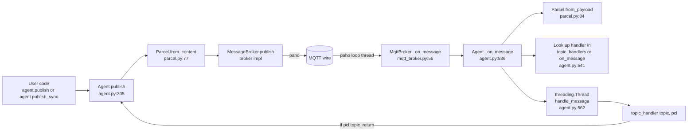
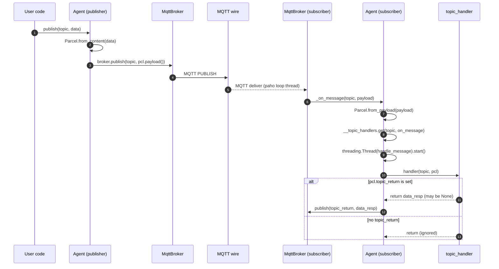
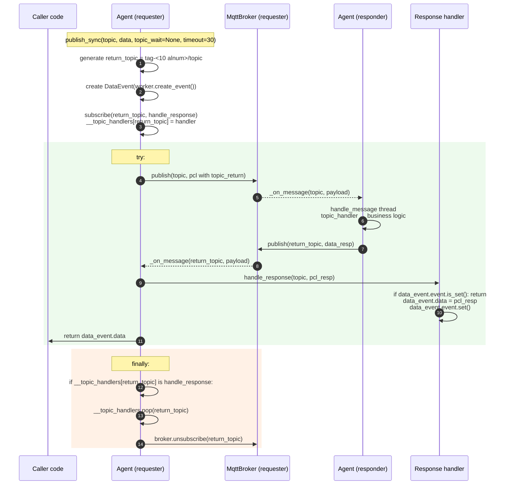

# 02 — Runtime Message Flow

**Scope**: How a message travels from `Agent.publish` to a subscriber's handler, and how `publish_sync` layers a synchronous request/response on top of that.
**Rule**: Analysis only.

---

## 2.1 High-level component pipeline



---

## 2.2 Publish

`Agent.publish` (`src/agentflow/core/agent.py:304–314`):

```python
@final
def publish(self, topic, data=None):
    pcl = data if isinstance(data, Parcel) else Parcel.from_content(data)
    try:
        if self._broker:
            self._broker.publish(topic, pcl.payload())
        else:
            logger.error("Cannot publish: _broker is None.")
    except Exception as ex:
        logger.exception(ex)
```

Observed behaviour:
- Return value is always `None`. paho's `MessageInfo` returned by `MqttBroker.publish` (`mqtt_broker.py:106–107`) is discarded. Fire-and-forget contract is intentional and preserved by [RFC-002](../rfc/RFC-002-publish-error-propagation.md); callers who require raise-on-failure semantics use the internal `Agent._publish_or_raise` (see §2.8).
- If `self._broker` is `None`, the call is silently logged and returns; caller cannot detect this. See Risk R-08.
- Any exception is swallowed via `logger.exception`.

`Parcel.from_content` (`src/agentflow/core/parcel.py:77–81`) chooses:
- `BinaryParcel` if `content` is `bytes` or `bytearray`
- `TextParcel` otherwise

Serialisation:
- `TextParcel.payload()` — `b"text/json|" + utf-8 json` (`parcel.py:179–181`)
- `BinaryParcel.payload()` — `b"application/pickle|" + pickle.dumps(managed_data, HIGHEST_PROTOCOL)` (`parcel.py:155–156`)

The serialized envelope contains `version`, `content`, `topic_return`, `error` (`parcel.py:95–101`).

---

## 2.3 Subscribe

`Agent.subscribe` (`src/agentflow/core/agent.py:352–364`):

```python
@final
def subscribe(self, topic, data_type:str="str", topic_handler=None):
    ...
    if topic_handler:
        if topic in self.__topic_handlers:
            logger.warning(...)
        self.__topic_handlers[topic] = topic_handler
    return self._broker.subscribe(topic, data_type) if self._broker else None
```

Observed:
- Duplicate subscribe on the same topic only warns and overwrites the handler; no rejection.
- `data_type` is a string ("str" by default) and is passed through to `MessageBroker.subscribe`. `MqttBroker.subscribe` ignores it (`mqtt_broker.py:109–110`). Only `RosNoeticBroker` uses it — but that broker is unregistered.
- `__topic_handlers` is a plain dict (`agent.py:45`) with no synchronization — see Risk R-14.

---

## 2.4 Receive path (MQTT)

paho callback → `MqttBroker._on_message` (`mqtt_broker.py:56–60`):

```python
def _on_message(self, client, db, message):
    try:
        self._notifier._on_message(message.topic, message.payload)
    except Exception as ex:
        logger.exception(ex)
```

This is the correct boundary — a raised handler exception does not kill the paho loop thread.

`Agent._on_message` (`src/agentflow/core/agent.py:536–562`):

```python
@final
def _on_message(self, topic:str, data):
    pcl = Parcel.from_payload(data)
    topic_handler = self.__topic_handlers.get(topic, self.on_message)

    def handle_message(topic_handler, topic, p:Parcel):
        if p.topic_return:
            try:
                data_resp = topic_handler(topic, p)
            except Exception as ex:
                logger.exception(ex)
                p.error = str(ex)
                p.content = None
                data_resp = p
            finally:
                self.publish(pcl.topic_return, data_resp)
        else:
            try:
                topic_handler(topic, p)
            except Exception as ex:
                logger.exception(ex)

    threading.Thread(target=handle_message, args=(topic_handler, topic, pcl)).start()
```

Observed:
- ~~One new `threading.Thread` per received message, no daemon flag, no pool, no upper bound~~ — **RESOLVED 2026-07-26 (RFC-004)**. `_on_message` now enqueues `handle_message` onto a bounded `MessageDispatcher` (`src/agentflow/core/dispatcher.py`) drained by a fixed pool of **daemon** consumer threads (default `workers=8`, `queue_capacity=1024`, overflow policy `drop_newest`). `enqueue()` is linearized under `_state_lock`; the paho callback thread never sees `queue.Full` (RFC-004 §7.3 broker-callback safety invariant). See [`docs/audit/05-risk-register.md` R-04](05-risk-register.md#r-04--per-message-unbounded-thread-creation) for the full contract, race fixes (enqueue check-then-put linearization + concurrent-stop `_stop_complete_event`), and runtime evidence.
- `Parcel.from_payload` raises `TypeError` on unknown HEAD (`parcel.py:89`); the raise happens on the broker's paho loop thread, then it is caught by `MqttBroker._on_message`.
- **BinaryParcel triggers `pickle.loads` on wire bytes** (`parcel.py:146`) → Risk R-01.
- Auto-reply eligibility (**post-RFC-003, 2026-07-26**): an auto-reply is emitted only when both (a) the incoming `pcl.topic_return` is truthy AND (b) the dispatched handler was a **specifically registered** entry in `__topic_handlers` (not the fall-through to `on_message`). See [RFC-003](../rfc/RFC-003-auto-reply-contract.md) and R-05 in the risk register. The pre-RFC-003 behaviour where a fall-through `on_message` also generated an implicit reply is no longer the case.

---

## 2.5 End-to-end sequence — one-shot publish



---

## 2.6 Topic naming rules used by Agent

Extracted from `src/agentflow/core/agent.py`:

| Purpose | Topic template | Line |
|---|---|---|
| Any child → any parent with this name | `to_parent.{self.name}` | 519 |
| A specific parent (targeted) | `{agent_id}.to_parent.{self.name}` | 520 |
| A parent → all its child-name group | `to_child.{self.name}` | 462 (default in `_notify_children`) |
| A parent → children of a specific name | `to_child.{target_child_name}` | 475 |
| A parent → one specific child | `{child_id}.to_child.{self.name}` | 447 |
| A child subscribes: all-parents-of-me | `to_child.{self.parent_name}` | 524 |
| A child subscribes: same-name siblings group | `to_child.{self.name}` | 525 |
| A child subscribes: me-only | `{agent_id}.to_child.{self.parent_name}` | 526 |
| Sync return topic | `{tag}-{10 rand alnum}/{topic}` | 316–319 |

`self.tag` is the first 4 hex chars of `agent_id` (`agent.py:34`). `self.parent_name` is derived by `name.split('.', 1)[1] if '.' in name else None` (`agent.py:37`).

Observations:
- Because subscription uses **agent name** (user-provided), two independently constructed agents that happen to share a name receive each other's parent/child messages. This is by design in `unit_test/test_parents_children_count.py`, but is a **cross-org collision** in any deployment sharing an MQTT broker. See Risk R-09.
- Return topic uses `/` as separator (`agent.py:319`), while all other topics use `.`. If the underlying original `topic` contains `+`, `#`, or `/`, MQTT wildcard semantics take over. No topic sanitisation exists. See Risk R-09.

---

## 2.7 Sync request/response — `publish_sync`

> **Update (2026-07-26)**: sections 2.7's "Explicit lifecycle gaps" #1 and #2 were **Resolved by [RFC-001](../rfc/RFC-001-publish-sync-subscription-lifecycle.md)** — see [`docs/audit/05-risk-register.md` R-02](05-risk-register.md#r-02--publish_sync-leaks-handler-entries-and-broker-subscriptions). Gaps #3 and #4 remain open. The sequence diagram and narrative below have been updated to reflect the resolved cleanup path.

`Agent.publish_sync` (`src/agentflow/core/agent.py:321–353`):



### Explicit lifecycle gaps

1. ~~**No handler cleanup**~~ — **RESOLVED 2026-07-26 (RFC-001).** `publish_sync` now runs an identity-guarded `finally` that pops `__topic_handlers[return_topic]` when it is still the specific `handle_response` this call installed. Verified by `tests/unit/core/test_agent_publish_sync.py::test_topic_handlers_cleaned_after_successful_publish_sync` and `_timed_out_publish_sync`.
2. ~~**No broker unsubscribe**~~ — **RESOLVED 2026-07-26 (RFC-001).** `MessageBroker` now declares `unsubscribe(topic) -> None` as a non-abstract default no-op; `MqttBroker.unsubscribe` delegates to `self._client.unsubscribe(topic)`. Verified by `tests/unit/core/test_agent_publish_sync.py::test_broker_subscribe_and_unsubscribe_grow_together_on_success` and `_on_timeout`, plus `tests/unit/test_mqtt_broker_lifecycle.py::test_unsubscribe_delegates_topic_to_client`.
3. **No correlation id** (still open): return topic is the only demultiplexer. Concurrent requests to the same `topic` with `topic_wait=None` get distinct return topics via random suffix (10 base-36 chars → ~40 bits); with `topic_wait` reused explicitly, they still race — `Agent.subscribe` silently overwrites. RFC-001 added an identity guard so the cleanup path does not make this race worse, but the race itself is unresolved.
4. **Timeout only on `event.wait`** (still open): publish/subscribe I/O has no timeout.

### Post-resolution observable invariants

For every `publish_sync` call, regardless of exit path (success, `TimeoutError`, or broker-`publish` exception):

- `return_topic not in agent._Agent__topic_handlers`
- `broker.unsubscribe_calls` grew by exactly one entry equal to `return_topic`
- Any late or duplicate response arriving after cleanup is routed to the default `Agent.on_message` (no-op) via fall-through, not to the completed `handle_response`.

The one exception is the **identity-guard bypass**: if a foreign handler races onto the same topic between `subscribe` and `finally`, the guard skips both the pop and the unsubscribe. In that case the foreign handler is preserved and the (already lost) subscription is not torn down. Verified by `test_identity_guard_preserves_foreign_handler_on_same_topic`.

### Reply loop — RESOLVED 2026-07-26 (RFC-003)

> **Update (2026-07-26)**: the suspected reply loop was **confirmed by runtime evidence** and then **Resolved by [RFC-003](../rfc/RFC-003-auto-reply-contract.md)** — see [`docs/audit/05-risk-register.md` R-05](05-risk-register.md#r-05--suspected-reply-loop-on-error-paths-and-on-default-handlers).

Three loop patterns were runtime-confirmed under a bounded self-echo broker in `tests/unit/core/test_agent_reply_behavior.py`:

1. **Handler exception + self-echo**: on exception, `agent.py` used to set `data_resp = p` with `p.topic_return` preserved. The echoed error re-arrived and re-raised → loop (previously bounded at 20 dispatches; now terminates in ≤ 3).
2. **Handler returns Parcel-with-topic_return + self-echo**: the reply parcel preserved `topic_return` on the wire → re-arrival triggered another auto-reply → loop (previously bounded at 20; now ≤ 3).
3. **Two-agent mutual reply**: each side's handler produced a Parcel-with-topic_return targeted at the other's topic → ping-pong (previously bounded at 30 via a hub broker; now ≤ 3).

Post-RFC-003 dispatch (`agent.py:_on_message`, `@final`, public signature unchanged) enforces three rules that break every one of these patterns:

- **R-fallback-silent**: auto-reply is emitted only when `topic in self.__topic_handlers` (i.e. a specifically registered handler) AND `pcl.topic_return` is truthy. A subscribed-but-unhandled topic no longer generates implicit replies.
- **R-strip-topic_return**: if `data_resp` is a `Parcel` whose `topic_return` is truthy, the framework reconstructs a fresh parcel of the same subclass (`type(data_resp)(data_resp.content)`), copies `.error`, and uses it as the reply. The handler's original returned object is not mutated.
- **R-exception-fresh**: on handler exception the reply is a brand-new `Parcel.from_content(None)` with `.error = str(ex)`. The incoming `p` is not mutated; handlers holding a reference to `p` observe its original `content`, `error`, and `topic_return`.

`publish_sync` is unaffected: `handle_response` returns `None`, so `Parcel.from_content(None)` produces a reply with `topic_return=None` and R-strip-topic_return is a no-op for the request-response path. `publish_sync`'s specific handler on `return_topic` also prevents R-fallback-silent from ever applying during its lifetime. Verified by `test_publish_sync_happy_path_still_works_under_RFC_003` and `test_publish_sync_late_reply_after_cleanup_is_silently_dropped`.

---

## 2.8 Publish result / error propagation

> **Update (2026-07-26)**: `Agent.publish` → `publish_sync` masking layer was **Resolved by [RFC-002](../rfc/RFC-002-publish-error-propagation.md)** — see [`docs/audit/05-risk-register.md` R-13](05-risk-register.md#r-13--publish-result-is-discarded-at-every-layer). The paho `MessageInfo` (rc/mid) at the broker adapter layer is still discarded; that residual observability gap is deferred to a future RFC on broker-level observability.

| Layer | Failure signal | Propagation (post-RFC-002) |
|---|---|---|
| paho `client.publish` | Returns `MessageInfo(rc, mid)` | Still discarded by `MqttBroker.publish` (out of RFC-002 scope). |
| `MqttBroker.publish` | Returns whatever paho returned | Still ignored by `Agent.publish` / `Agent._publish_or_raise` (out of RFC-002 scope). Broker-raised exceptions, however, do propagate. |
| `Agent._publish_or_raise` (new, internal) | Raises broker exceptions unchanged; raises `RuntimeError("Cannot publish: no broker attached")` when `_broker is None` | Reaches its direct caller (currently `publish_sync`; available to any internal caller that needs raise-on-fail semantics) |
| `Agent.publish` | Wraps `_publish_or_raise` in `try/except Exception: logger.exception(...)` | **Unchanged**: fire-and-forget, returns `None` on every outcome. Preserves the pre-RFC-002 contract byte-for-byte. |
| `Agent.publish_sync` | Calls `_publish_or_raise`; broker exceptions propagate through the RFC-001 `try/finally` (cleanup still runs) | **Original broker exception object** propagates to the caller (same type, message, traceback). True-timeout case (broker accepted the publish but no response) continues to raise `TimeoutError`. |

**Consequence**:
- Fire-and-forget publish (`Agent.publish`) callers see zero behavioural change — success and every failure still return `None`.
- `publish_sync` callers now fast-fail on publish errors with the original exception; only genuine "no response in time" produces `TimeoutError`.
- The residual broker-side observability gap (paho `MessageInfo` rc/mid) is documented and deferred.

Verified by `tests/unit/core/test_agent_publish_errors.py` (46 tests) and the four R-02 crossover tests in `tests/unit/core/test_agent_publish_sync.py`.

---

## 2.9 Unknowns

- ~~**U-2.1**: Actual behaviour of the suspected reply loop in Risk R-05~~ — **Resolved**: reproduced against a bounded self-echo FakeBroker in `tests/unit/core/test_agent_reply_behavior.py`, then fixed by RFC-003 (§2.7 update above).
- **U-2.2**: Behaviour of MQTT topics containing `.` under paho v2 — assumed to be a normal character (only `+ # / $` are special), but not empirically tested against a broker.
- **U-2.3**: Whether `handle_response` ever sees its own publish echoed back — depends on broker semantics (MQTT typically does deliver self-published messages).
