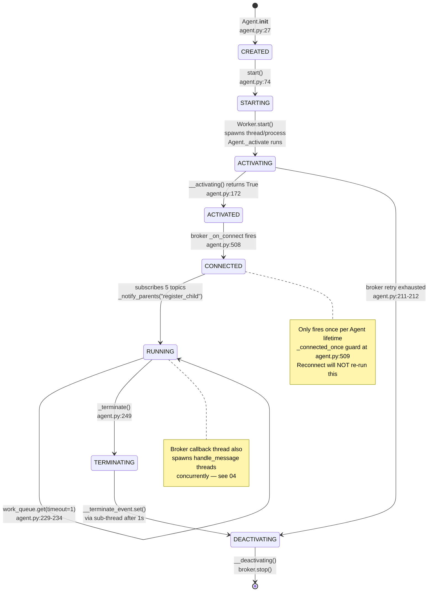
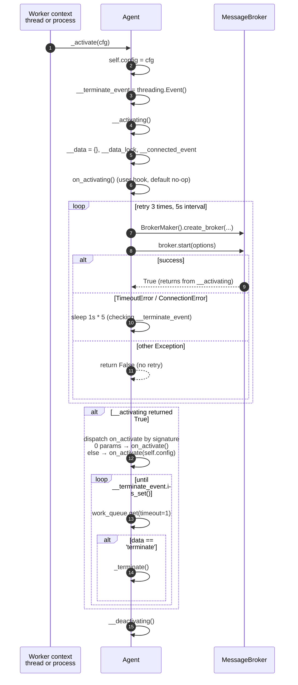
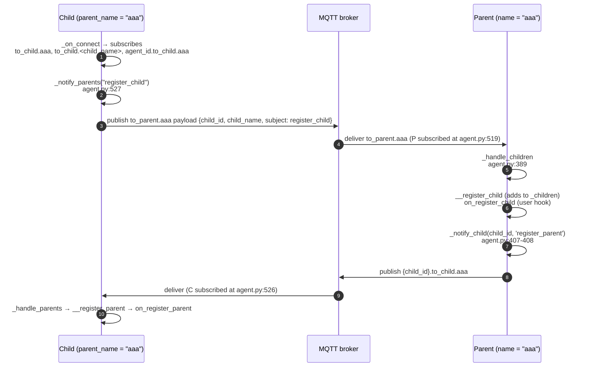

# 03 — Agent Lifecycle

**Scope**: Agent construction → start → activate → broker connect → run → terminate → deactivate.
**Rule**: Analysis only.

---

## 3.1 State diagram



---

## 3.2 Construction phase

`Agent.__init__` (`src/agentflow/core/agent.py:27–48`):

| Field | Purpose | Notes |
|---|---|---|
| `agent_id` | UUID4 hex, no dashes | line 30 |
| `config` | Populated by `__init_config` from `default_config.copy()` + user dict | lines 32, 55–58 |
| `name` | User-provided | line 33 |
| `tag` | First 4 chars of agent_id | line 34 |
| `name_tag` | `f"{name}:{tag}"` | line 35 |
| `parent_name` | `name.split('.', 1)[1] if '.' in name else None` | line 37 |
| `interval_seconds` | `0` | line 38 |
| `_agent_worker` | `None` | line 39 |
| `_children`, `_parents` | Empty dicts | lines 41–42 |
| `_message_broker` | `None` (unused; distinct from `_broker`) | line 44 |
| `__topic_handlers` | Empty dict, type-annotated `dict[str, function]` | line 45 (**Note**: `function` is not a real type; see Risk R-17) |
| `_broker` | `None` | line 47 |
| `_connected_once` | `False` | line 48 |

**No broker, no worker, no threads are created in `__init__`.**

---

## 3.3 Start phase

`Agent.start` (`agent.py:74–80`):
1. If `CONCURRENCY_TYPE` not present in config, forces `'process'`.
2. Calls `_get_worker()` → lazily creates `ProcessWorker(self)` or `ThreadWorker(self)` (`agent.py:61–71`).
3. Calls `worker.start()` — this **spawns** the worker and stores `self.work_process` on the agent (also the worker holds it).
4. Calls `_on_start()` (default no-op).

Convenience wrappers: `start_process` (`agent.py:87–89`), `start_thread` (`agent.py:92–94`).

### Worker start details

`ThreadWorker.start` (`agent_worker.py:90–99`):
- Creates `queue.Queue`.
- Injects `work_queue` into `agent.config['work_queue']`.
- `threading.Thread(target=agent._activate, args=(cfg,)).start()`.
- Thread is **not marked daemon**.

`ProcessWorker.start` (`agent_worker.py:56–65`):
- Ensures `multiprocessing.set_start_method('spawn')` (done in `Worker.__init__`).
- Creates `multiprocessing.Queue`.
- Injects `work_queue` into `agent.config['work_queue']`.
- `multiprocessing.Process(target=agent._activate, args=(cfg,)).start()`.

**Confidence Medium**: whether the spawned process can actually pickle the bound method (which requires pickling `self`, which references `self._agent_worker`, which references the spawned Process object itself) has not been verified in this audit. Filed as Risk R-06 / Unknown U-3.1.

---

## 3.4 Activate phase (inside worker)

`Agent._activate` (`agent.py:214–240`):



Observations:
- The signature branch `elif isinstance(sig.parameters.get('self'), Agent)` (`agent.py:222`) is **always false** — `sig.parameters['self']` returns a `Parameter` object, not an Agent. Dead branch (Risk R-12).
- User exceptions in `on_activate` are not caught — they propagate up and kill the worker without notifying the parent process (Risk R-07 related).
- `KeyboardInterrupt` inside `work_queue.get` triggers `self._terminate()` (agent.py:236). No other exception is caught in the loop.

### Broker retry policy

Loop at `agent.py:191–209`:
- `max_retries = 3`, `interval = 5` seconds.
- Retries only `TimeoutError` and `ConnectionError`.
- Any other exception → `return False` immediately (no retry).
- The interval sleep is split into `for _ in range(interval): sleep(1)` so it can bail out early on `__terminate_event`.

---

## 3.5 Broker connect callback

`Agent._on_connect` (`agent.py:508–533`):

```python
def _on_connect(self):
    if self._connected_once:
        logger.warning(self.M("Already connected to the broker."))
        return
    self._connected_once = True
    logger.info(self.M("Connected to the broker."))

    for event in EventHandler:
        attr_name = str(event).lower()[len('EventHandler.'):]
        setattr(self, attr_name, self.get_config(str(event), getattr(self, attr_name, None)))

    self.subscribe(f'to_parent.{self.name}', topic_handler=self._handle_children)
    self.subscribe(f'{self.agent_id}.to_parent.{self.name}', topic_handler=self._handle_children)

    if self.parent_name:
        self.subscribe(f'to_child.{self.parent_name}', topic_handler=self._handle_parents)
        self.subscribe(f'to_child.{self.name}', topic_handler=self._handle_parents)
        self.subscribe(f'{self.agent_id}.to_child.{self.parent_name}', topic_handler=self._handle_parents)
        self._notify_parents("register_child")

    def handle_connected():
        time.sleep(1)
        self.__connected_event.set()
        self.on_connected()
    threading.Thread(target=handle_connected).start()
```

Observations:
- `_connected_once` guard means **any subsequent broker connect (after a reconnect) will do nothing**: no re-subscribe, no re-register with parents (Risk R-03).
- The dynamic `setattr` (lines 515–517) will replace `self.on_activate`, `self.on_connected`, `self.on_message`, `self.on_children_message`, `self.on_parents_message`, `self.on_register_child`, `self.on_register_parent` with whatever the config holds for their `EventHandler.*` keys — including `None` (Risk R-11).
- The final `handle_connected` thread has an unexplained `time.sleep(1)` before firing `on_connected` (Risk R-24). This is likely to mask a subscribe race, but there is no comment stating that.

---

## 3.6 Parent/child registration flow



Observations:
- If two Parent agents in the system share the name `"aaa"`, both receive the child's `to_parent.aaa` and both register it → the child ends up registered under two parents. This is exercised by `unit_test/test_parents_children_count.py` (two `AgentB` instances) — see also Risk R-09.
- **There is no unregister path.** No child-death detection, no heartbeat, no timeout. `_children` grows monotonically. See Risk R-18 (fault isolation).

---

## 3.7 Terminate phase

`Agent.terminate` (`agent.py:97–103`) — called from parent context:

```python
def terminate(self):
    if self._agent_worker:
        self._agent_worker.stop()
    else:
        logger.warning(...)
```

`Worker.stop` (both variants, `agent_worker.py:72–76, 107–111`):
```python
self.send_data('terminate')   # puts 'terminate' on work_queue
self.work_process.join()      # no timeout
```

Inside the worker, `_activate`'s loop calls `_on_worker_data('terminate')` (`agent.py:243–246`) → `_terminate()`.

`Agent._terminate` (`agent.py:249–256`):
```python
def _terminate(self):
    self._notify_children('terminate')
    def stop():
        time.sleep(1)
        self.__terminate_event.set()
    threading.Thread(target=stop).start()
```

Observations:
- **Sub-thread with `time.sleep(1)`** before setting the event — the 1s is intended to give the "terminate" broadcast to children time to actually go out; but there is no acknowledgment loop. If the broker publish is slow, children may not receive the notification.
- Multiple calls to `_terminate` spawn multiple sub-threads (not idempotent).
- **`stop()` has no join timeout** (`agent_worker.py:75, 110`) → if the worker is blocked in a user handler, `terminate()` blocks forever (Risk R-10).

The `_handle_parents` path (`agent.py:430–431`) also calls `_terminate` when a parent sends `subject == "terminate"`. So a parent's `_terminate` propagates down via `_notify_children('terminate')`, triggering child's `_handle_parents → _terminate` chain.

---

## 3.8 Deactivate phase

`Agent.__deactivating` (`agent.py:259–265`):
1. `on_terminating()` (user hook, default no-op).
2. `self._broker.stop()` if broker exists.
3. `on_terminated()` (user hook, default no-op).

`MqttBroker.stop` (`mqtt_broker.py:101–104`):
```python
self._client.disconnect()
self._client.loop_stop()
```

Observations:
- Order is `disconnect` then `loop_stop`. paho typically stops the loop cleanly on `disconnect`; explicit `loop_stop` is defensive and safe.
- **No timeout, no `loop_stop(force=True)` fallback.** If the loop thread is wedged, `loop_stop` may hang. **Confidence: Medium**.
- `interval_loop` thread (`agent.py:160–165`) is only signalled by `is_active()` becoming false (which requires `_agent_worker.is_working()` to return false — i.e. the whole worker to die). Nothing in `__deactivating` explicitly stops it.

---

## 3.9 Data access API

`Agent` maintains an internal keyed store with an explicit lock:

| Method | Line | Behaviour |
|---|---|---|
| `get_data(key)` | 272 | Read without lock |
| `pop_data(key)` | 277 | Acquire lock → pop → release |
| `put_data(key, data)` | 287 | Acquire lock → assign → release |

Observations:
- `get_data` bypasses the lock, so it can read torn state relative to `put_data`. **Confidence: Medium** — Python dict reads/writes on distinct keys are usually safe due to the GIL, but `get_data` combined with `pop_data` on the same key can miss.
- `__data` is created inside `__activating` (`agent.py:173`), meaning it does not exist until the worker starts. Calling `get_data` before `start()` raises `AttributeError`.

---

## 3.10 Unknowns

- **U-3.1**: Process-mode pickling of the Agent instance + `_agent_worker` referencing the spawned Process. Not verified.
- **U-3.2**: Whether `interval_loop` really crashes when calling `Process.is_alive()` from inside the child process. Suspected `AssertionError: can only test a child process`. Not verified.
- **U-3.3**: Whether `broker.stop()` on a wedged paho loop hangs — depends on paho internals.
