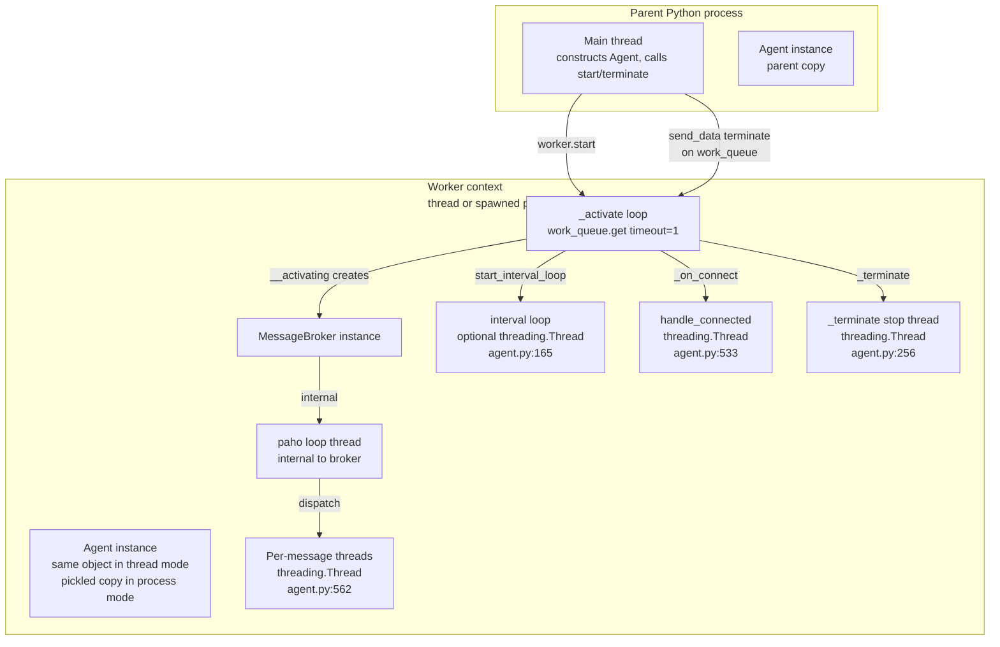

# 04 — Concurrency & Execution Model

**Scope**: Threads, processes, queues, events, shared state, and observed race / leak risks.
**Rule**: Analysis only.

---

## 4.1 Execution contexts



---

## 4.2 ThreadWorker vs ProcessWorker

| Concern | `ThreadWorker` | `ProcessWorker` |
|---|---|---|
| File / line | `agent_worker.py:81` | `agent_worker.py:47` |
| Execution | `threading.Thread(target=agent._activate, args=(cfg,))` | `multiprocessing.Process(target=agent._activate, args=(cfg,))` |
| Start method | N/A | `spawn` forced in `Worker.__init__` (`agent_worker.py:13–14`) |
| Queue | `queue.Queue` | `multiprocessing.Queue` |
| Event factory | `threading.Event` (`create_event`, line 87) | `multiprocessing.Event` (`create_event`, line 53) |
| Daemon flag | not set | not set |
| `stop()` semantics | send 'terminate' + `join()` (no timeout, line 110) | send 'terminate' + `join()` (no timeout, line 75) |
| Broker location | same process | child process only |
| Shared state | Agent instance is shared | Agent instance is pickled → parent and child diverge |

---

## 4.3 Object ownership and visibility

| Object | Created where | Visible to parent? | Visible to worker? | Note |
|---|---|---|---|---|
| Agent instance | Parent `__init__` | Yes | Yes — same object (thread) or pickled copy (process) | Process mode makes parent's copy diverge over time |
| `config` dict | Parent `__init__` | Yes | Yes — receives `work_queue` key added by worker start (parent sees this too) | Same dict reference in thread mode |
| `_broker` | Worker via `__activating` (`agent.py:193`) | Thread mode: yes; Process mode: **No** | Yes | Parent-side publish in process mode always hits `_broker is None` (Risk R-08) |
| `_children`, `_parents` | Populated in worker via `_handle_children` / `_handle_parents` | Thread mode: yes; Process mode: **No** | Yes | Parent-side introspection in process mode returns empty dicts |
| `__topic_handlers` | Populated in worker via `subscribe` | Thread mode: yes; Process mode: **No** | Yes | Same as above |
| `__data`, `__data_lock`, `__connected_event`, `__terminate_event` | Worker via `__activating` (`agent.py:173–175`) and `_activate` (`agent.py:216`) | Thread mode: yes; Process mode: **No** (created after fork of state) | Yes | Parent-side `get_data` in process mode raises `AttributeError` |
| `work_queue` | Worker `start` (`agent_worker.py:58, 92`) | Yes (added to `cfg` and stored in Worker) | Yes | Multiprocessing.Queue is spawn-safe |
| `_agent_worker` | Parent `_get_worker` (`agent.py:70`) | Yes | Yes | Cross-references Agent, forming a cycle |

---

## 4.4 Message dispatch concurrency

For every message that reaches `Agent._on_message` (`agent.py:536–562`):
1. The broker's paho loop thread runs `MqttBroker._on_message` (`mqtt_broker.py:56`).
2. That calls the Agent's `_on_message`, which builds a Parcel and looks up the handler.
3. Then unconditionally does:
   ```python
   threading.Thread(target=handle_message, args=(topic_handler, topic, pcl)).start()
   ```

Consequences (Risk R-04):
- **No upper bound on live threads**. A message burst produces one native thread per message.
- **Threads are not daemon** and their handles are not stored → they cannot be joined or accounted.
- Program exit will wait on any handler that never returns.

---

## 4.5 Shared mutable state without synchronization

| State | Line | Writers | Readers |
|---|---|---|---|
| `__topic_handlers` | 45, 362 | user threads calling `subscribe`; `publish_sync` internal path | broker loop thread inside `_on_message` (line 541) |
| `_children` | 42, 369 | broker loop thread inside `_handle_children` → `__register_child` | user code (e.g., `agent._children`), also serialised in `_notify_child` (line 446) |
| `_parents` | 42, 380 | broker loop thread inside `_handle_parents` → `__register_parent` | user code, also `_notify_parent` (line 483) |
| `interval_seconds` | 38, 158, 169 | `start_interval_loop`, `stop_interval_loop` (main thread) | `interval_loop` thread |
| `_connected_once` | 48, 509, 512 | broker loop thread | broker loop thread |
| `__data` | 173 (created in worker) | worker + user via `put_data`/`pop_data` (with `__data_lock`) | `get_data` **without lock** (line 273) |

None of the plain dicts have a `Lock` around them. Python's GIL makes individual dict assignments atomic, but compound operations (`if topic in d: ... d[topic] = ...` at lines 360–362; append-style updates in test fixtures) are not.

Filed as Risk R-14.

---

## 4.6 Broker loop safety

`MqttBroker._on_message` (`mqtt_broker.py:56–60`) wraps the notifier call in `try/except Exception → logger.exception`. This means:
- Handler exceptions in `_on_message` do NOT kill the paho loop thread.
- **But** the per-message thread created by `Agent._on_message` (line 562) has its own try/except inside `handle_message` (`agent.py:544–560`), so exceptions there also do not propagate.
- Exceptions that occur *before* the thread is spawned (e.g., `Parcel.from_payload` raising `TypeError` on unknown HEAD, `parcel.py:89`) do propagate to `MqttBroker._on_message` and are caught there.

`MqttBroker._on_connect` (`mqtt_broker.py:35–49`) has a `try/finally` that always sets `_connected_evt`, so a raise from `notifier._on_connect` will still allow the start-side `_connected_evt.wait` to complete. However, the exception itself is not caught (`try` has no `except`), so it propagates back to paho's loop thread and is lost.

---

## 4.7 Reconnect and subscription persistence

`MqttBroker` sets `reconnect_on_failure=False` (`mqtt_broker.py:18`).
`_on_disconnect` (`mqtt_broker.py:52–53`) only logs a warning.
`Agent._on_connect` early-returns on second invocation via `_connected_once` (`agent.py:509–512`).

Consequences (Risk R-03):
- If the broker connection drops and paho reconnects (which it will not, because the flag is off), subscriptions would still be lost — but the code path to re-subscribe does not exist regardless.
- Any parent/child registration completed before disconnect is lost on the broker side.

---

## 4.8 Terminate concurrency

`Agent._terminate` (`agent.py:249–256`) spawns a `stop` thread that sleeps 1s before setting `__terminate_event`. Multiple concurrent invocations produce multiple sleep threads.

`Worker.stop` (`agent_worker.py:72–76, 107–111`) calls `join()` with **no timeout**.

Consequences:
- A handler that blocks (deadlock, infinite loop, blocking I/O) makes `terminate()` block forever (Risk R-10).
- `handle_message` threads (line 562) are not tracked; even after `_activate` returns, those threads may still be alive, keeping the process from exiting.

---

## 4.9 Interval loop

`start_interval_loop` (`agent.py:156–165`):

```python
def interval_loop():
    while self.is_active() and self.interval_seconds > 0:
        self.on_interval()
        time.sleep(self.interval_seconds)
    self.interval_seconds = 0
threading.Thread(target=interval_loop).start()
```

Observations:
- Thread is not daemon.
- No handle is stored — cannot be joined.
- Loop exit depends on `self.is_active()` returning false, which requires `_agent_worker.is_working()` to return false (Worker's `.is_alive()`). In process mode this is a call to `multiprocessing.Process.is_alive()` from **inside the child process**; based on CPython's implementation this raises `AssertionError` (Risk R-06 / Unknown U-3.2).
- `time.sleep(self.interval_seconds)` cannot be interrupted → shutdown latency is at least `interval_seconds`.

---

## 4.10 Process-mode pickling concerns (Confidence: Medium — not verified)

`ProcessWorker.start` (`agent_worker.py:56–65`) calls
```python
multiprocessing.Process(target=self.initiator_agent._activate, args=(cfg,)).start()
```

With `spawn`, Python pickles the target and args. The target is a bound method of the Agent, so `self.initiator_agent` (the Agent) must be picklable. That Agent references `_agent_worker` (this ProcessWorker), which now references `work_process = multiprocessing.Process(...)`.

Fields inside the Agent that may pose problems for `spawn`:
- Any `EventHandler.*` callback in `config` that is a closure or a lambda (e.g. `unit_test/test_parcel.py:57` puts a closure into `EventHandler.ON_CONNECTED`) — closures are not picklable.
- The `_agent_worker → work_process → Process` chain. `multiprocessing.Process` is generally picklable **before** `start()`, but `start()` initializes `_popen` which is not, and `spawn` serialises `target` when constructing the child's launcher. Whether the current sequence orders this correctly is not verified here.

Filed as Risk R-06 with a concrete reproduction step.

---

## 4.11 Unknowns

- **U-4.1**: Actual pickling behaviour of the Agent object graph in process mode (Risk R-06).
- **U-4.2**: Whether `Process.is_alive()` from inside the child truly raises the expected AssertionError.
- **U-4.3**: Impact of the `handle_message` per-message thread cost under real MQTT throughput; needs a benchmark.
- **U-4.4**: Whether `queue.Queue.get(timeout=1)` in the `_activate` loop introduces measurable latency under load — the 1-second poll is fine for idle agents but caps termination latency.
