# 06 — Test Coverage

**Scope**: What tests exist, what actually runs, what they cover, and what they leave unverified.
**Rule**: Analysis only.

---

## 6.0 Status update (2026-07-27)

The original Phase-1 baseline captured in §6.1–6.7 (below) reflects the state before any test-infrastructure work landed. Subsequent phases added a deterministic suite under `tests/` and resolved:

- R-02 via [RFC-001](../rfc/RFC-001-publish-sync-subscription-lifecycle.md)
- R-13 via [RFC-002](../rfc/RFC-002-publish-error-propagation.md)
- R-05 via [RFC-003](../rfc/RFC-003-auto-reply-contract.md)
- R-04 via [RFC-004](../rfc/RFC-004-bounded-message-dispatch.md)
- R-03 via [RFC-005](../rfc/RFC-005-mqtt-subscription-recovery.md)
- R.4 (publish_sync-vs-publish_sync collision) via [RFC-006](../rfc/RFC-006-publish-sync-topic-collision.md)
- R-14 (partially — `__topic_handlers` slice) via [RFC-007](../rfc/RFC-007-handler-registry-ownership.md), which also closed the R.6-1 / R.6-2 / R.6-3 residual risks from the RFC-006 cross-API characterisation

Current authoritative pytest command:

```bash
PYTHONPATH=src /home/eric/anaconda3/envs/actbot/bin/python -m pytest tests/unit -v
```

Result as of 2026-07-27 (after RFC-007 implementation):

```
256 passed, 0 failed, 0 xfailed(strict-pass), 2 xfailed  in 12.03s
```

The two remaining xfails (`test_both_callers_should_receive_own_response_with_shared_topic_wait`, `test_framework_should_support_multiple_handlers_per_topic`) are deferred to a future RFC on correlation ID / multi-handler fan-out.

Historical intermediate result (pre-RFC-006/007) was 216 passed / 0 xfailed. RFC-006 added 21 passing publish_sync-vs-publish_sync collision tests + 2 aspirational xfails; RFC-007 added 19 cross-API tests and migrated ~5 existing tests for the new `_HandlerRecord` shape.

Suite composition:

| File | Purpose | Tests |
|---|---:|---:|
| `tests/unit/core/test_agent_publish_sync.py` | R-02 characterization + fix invariants | 27 |
| `tests/unit/core/test_agent_publish_errors.py` | R-13 characterization + `_publish_or_raise` API | 46 |
| `tests/unit/core/test_agent_reply_behavior.py` | R-05 characterization + auto-reply contract (RFC-003) | 21 |
| `tests/unit/core/test_agent_message_threading.py` | R-04 characterization + bounded dispatcher + linearization / concurrent-stop race fixes (RFC-004) | 33 |
| `tests/unit/core/test_agent_publish_sync_concurrency.py` | R.4 (publish_sync-vs-publish_sync) characterization + fail-fast collision (RFC-006) + 2 aspirational xfails (correlation ID / multi-handler fan-out) | 21 + 2 xfail |
| `tests/unit/core/test_agent_publish_sync_cross_api.py` | R.6-1 / R.6-2 / R.6-3 residual risks + handler registry ownership (RFC-007): fail-fast cross-API protection, HandlerRecord shape, atomic _on_message snapshot, lock hygiene | 19 |
| `tests/unit/test_mqtt_broker_reconnect.py` | R-03 characterization + subscription registry + reconnect recovery + planned/unexpected disconnect classification + stop-vs-callback races (RFC-005) | 48 |
| `tests/unit/test_mqtt_broker_start.py` | MqttBroker start + wait paths | 13 |
| `tests/unit/test_mqtt_broker_auth.py` | username / password walrus edges | 6 |
| `tests/unit/test_mqtt_broker_lifecycle.py` | stop / publish / subscribe / **unsubscribe** delegation | 11 |
| `tests/unit/test_mqtt_broker_callbacks.py` | `_on_connect` / `_on_message` / exception isolation | 8 |
| `tests/unit/test_empty_broker.py` | `MessageBroker.unsubscribe` default no-op via EmptyBroker | 3 |

Coverage changes since baseline:

- **R-02** — was uncovered; now covered by `tests/unit/core/test_agent_publish_sync.py` (success cleanup, timeout cleanup, publish-exception cleanup, late-response fallback, duplicate-response fallback, identity guard, concurrent cleanup). See §6.4 for the updated matrix.
- **R-13** — was uncovered; now covered by `tests/unit/core/test_agent_publish_errors.py` (Agent.publish fire-and-forget contract preserved; `publish_sync` propagates the broker's original exception object with fast-fail timing; `_publish_or_raise` internal method verified for success, all four exception types, missing broker; R-02 cleanup verified on the new fast-fail path).
- **R-05** — was uncovered; now covered by `tests/unit/core/test_agent_reply_behavior.py` (three loop patterns previously observed under a bounded self-echo broker now terminate in ≤ 3 publishes; R-fallback-silent verified; R-strip-topic_return verified across TextParcel / BinaryParcel / content / error field preservation; R-exception-fresh verified with non-mutation of incoming parcel; RFC-003 × RFC-001 interaction verified).
- **R-04** — was uncovered; now covered by `tests/unit/core/test_agent_message_threading.py` (bounded dispatcher: workers cap, queue capacity, drop_newest metric, broker-callback safety invariant, two-layer exception isolation, metrics snapshot, graceful drain, bounded shutdown timeout, idempotent stop, post-stop rejection, legacy per-message-thread mode + DeprecationWarning). Two race fixes verified with deterministic reproductions: `test_race_stop_wins_between_enqueue_check_and_put_deterministic` and `test_concurrent_stop_calls_execute_actual_shutdown_only_once`; a 25-trial concurrency stress test (`test_stop_and_enqueue_linearization_under_concurrency_stress`) plus 5 independent re-runs confirmed no flakes.
- **R-03** — was uncovered; now covered by `tests/unit/test_mqtt_broker_reconnect.py` (registry maintenance, first-connect vs reconnect classification, disconnected subscribe/unsubscribe, per-topic recovery failure isolation, planned/unexpected disconnect classification, stop short-circuit, post-stop rejection, `_state_lock` never held across paho client calls, stop-during-recovery / unsubscribe-during-recovery / subscribe-during-recovery races, concurrent producer thread safety, metrics snapshot). The 6 aspirational strict xfails from the R-03 characterization phase all converted to positive assertions.
- **R.4** (RFC-001 §10 pre-existing race) — was documented as an unresolvable side-effect of RFC-001; now covered by `tests/unit/core/test_agent_publish_sync_concurrency.py` (RFC-006): publish_sync-vs-publish_sync collision raises `TopicWaitCollisionError` fast-fail; 21 pass + 2 aspirational xfails (correlation ID, multi-handler fan-out).
- **R-14 (`__topic_handlers` slice)** — was uncovered; now covered by `tests/unit/core/test_agent_publish_sync_cross_api.py` (RFC-007): `_HandlerRecord` + `_HandlerOwnerType.{NORMAL, PUBLISH_SYNC}` ownership tagging; all registry mutations and reads under `_handlers_lock`; direct subscribe/unsubscribe on PUBLISH_SYNC-owned topic fail-fast; NORMAL rebind preserved; `_on_message` reads single snapshot (closing R.6-3 TOCTOU); four lock-hygiene tests verify `_handlers_lock` is never held across `broker.subscribe`/`broker.unsubscribe`/`dispatcher.enqueue`/handler invocation. R-14 remains partially open for `_children` / `_parents` (out of RFC-007 scope).

Legacy trees (`unit_test/`, `exe_test/`) remain excluded from pytest collection via `pyproject.toml` `norecursedirs`. No change to §6.1–6.7 inventory.

---

## 6.1 Inventory

### `unit_test/`

| File | Style | Depends on |
|---|---|---|
| `unit_test/test_parcel.py` | `unittest.TestCase` | `unit_test.config_test` (not present), `Agent._subscribe`/`_publish` (not present) |
| `unit_test/test_parents_children.py` | `unittest.TestCase` | same |
| `unit_test/test_parents_children_count.py` | `unittest.TestCase` | same |
| `unit_test/mqtt_broker_test.py` | `pytest` + `unittest.mock` | Placeholder `MODULE_PATH = "yourpkg.mqtt_broker"` (`mqtt_broker_test.py:6`) |
| `unit_test/mqtt_client_test.py` | Manual script | Live MQTT broker at `localhost:1884` |

### `exe_test/`

| File | Purpose | Depends on |
|---|---|---|
| `exe_test/1pmc.py` | 1 parent, many children (manual demo) | `helper` module (not present), `ConfigName` (not defined) |
| `exe_test/1psc.py` | 1 parent, single child | `helper`, `test_config`, `ConfigName` |
| `exe_test/1csp.py` | 1 child, multiple parents | `helper`, `ConfigName` |
| `exe_test/mp1c.py` | Multiple parents, 1 child (thread mode) | `helper`, `ConfigName` |
| `exe_test/mpmc.py` | Many-to-many (thread mode) | `helper`, `ConfigName` |
| `exe_test/mpmc-sp.py` | Many-to-many with targeting | `helper`, `ConfigName` |
| `exe_test/test1.py` | Minimal process-mode start | `AgentFlow.log_helper`, `config_test`, `ConfigName` |
| `exe_test/test_log.py` | Notifier demo | `AgentFlow.log_helper`, `config_test` |
| `exe_test/process_test.py` | Freestanding thread/process strategy demo | Only stdlib |

---

## 6.2 Runnability audit

```mermaid
flowchart LR
    subgraph unit_test
      tp[test_parcel.py]
      tpc[test_parents_children.py]
      tpcc[test_parents_children_count.py]
      mbt[mqtt_broker_test.py]
      mct[mqtt_client_test.py]
    end
    subgraph blockers
      cfg[unit_test/config_test.py<br/>gitignored line 141]
      priv[Agent._publish and _subscribe<br/>not defined]
      ph[MODULE_PATH placeholder]
      liveb[localhost:1884<br/>with credentials eric/eric123]
    end
    tp --> cfg
    tp --> priv
    tpc --> cfg
    tpc --> priv
    tpcc --> cfg
    tpcc --> priv
    mbt --> ph
    mct --> liveb

    subgraph exe_test
      ex[1pmc, 1psc, 1csp,<br/>mp1c, mpmc, mpmc-sp,<br/>test1, test_log]
      pt[process_test.py]
    end
    subgraph exe_blockers
      helper[helper module missing]
      logh[AgentFlow.log_helper missing]
      cn[ConfigName missing]
    end
    ex --> helper
    ex --> cn
    ex --> logh
```



### Detailed reasons

- **`unit_test/config_test.py`**: `.gitignore:141` explicitly excludes it. Not present in the working tree. Tests import via `from unit_test.config_test import config_test` (`test_parcel.py:13`, `test_parents_children.py:10`, `test_parents_children_count.py:10`). This is the first `ImportError` the test suite hits.
- **`Agent._publish` / `Agent._subscribe`**: `Agent` (`src/agentflow/core/agent.py:305, 353`) defines `publish` and `subscribe`, not the underscore-prefixed variants. Tests calling `self._subscribe('binary_payload')` (`test_parcel.py:31`) and `self._publish('children_count', …)` (`test_parents_children_count.py:25`) hit `AttributeError` even if the earlier import were satisfied.
- **`ConfigName`**: not defined in `src/agentflow/core/config.py`. Every `exe_test` file that does `from agentflow.core.config import ConfigName, EventHandler` fails immediately.
- **`helper` / `AgentFlow.log_helper`**: no such module exists in the tree.
- **`mqtt_broker_test.py:6`**: `MODULE_PATH = "yourpkg.mqtt_broker"` is a placeholder string; the fixture's `__import__` will fail.
- **`mqtt_client_test.py`**: not a test — imports `paho.mqtt.client` directly, connects to `localhost:1884` with `eric/eric123`, runs `sleep(50)`. It is a manual script.

**Net effect**: `python -m unittest discover -s unit_test` and `pytest unit_test/` will each fail on the first import that reaches the missing modules. No test runs to completion out of the box.

---

## 6.3 Coverage matrix (what would be covered if the tests ran)

| Behaviour | Covered by | Notes |
|---|---|---|
| `Parcel.from_content` / `from_payload` for text and binary | `test_parcel.py` (would) | Only through the full agent flow; no direct unit test for `Parcel` |
| Parent registers child; child registers parent | `test_parents_children.py`, `test_parents_children_count.py` (would) | Requires MQTT broker; asserts final `_children`/`_parents` counts |
| Multiple same-name siblings, same-name parents | `test_parents_children.py` (would) | Relies on the naming-collision behaviour also noted in R-09 |
| `MqttBroker.start / stop / publish / subscribe / _on_message` (mock paho) | `mqtt_broker_test.py` (would, after fixing `MODULE_PATH`) | Would cover happy path of the paho wrapper |
| Manual paho smoke test | `mqtt_client_test.py` | Not automated |

---

## 6.4 High-risk behaviour with NO test coverage

Cross-referenced with `05-risk-register.md`.

| Risk | Not covered by any test |
|---|---|
| R-01 pickle payload | ✓ no malformed payload test |
| R-02 `publish_sync` leaks | **Resolved 2026-07-26 (RFC-001); covered by `tests/unit/core/test_agent_publish_sync.py`** |
| R-03 broker reconnect / re-subscribe | **Resolved 2026-07-27 (RFC-005); covered by `tests/unit/test_mqtt_broker_reconnect.py`.** MqttBroker owns a thread-safe subscription registry; reconnect drives per-topic recovery with per-topic failure isolation; stop / unsubscribe / subscribe races against recovery covered by dedicated tests; `_state_lock` never held across paho client calls (verified). |
| R-04 unbounded per-message threads | **Resolved 2026-07-26 (RFC-004); covered by `tests/unit/core/test_agent_message_threading.py`.** MessageDispatcher with fixed daemon consumer pool + bounded queue + drop_newest + graceful shutdown. Two race fixes (enqueue check-then-put linearization + concurrent-stop `_stop_complete_event`) verified with deterministic reproductions. |
| R-05 suspected reply loop | **Resolved 2026-07-26 (RFC-003); covered by `tests/unit/core/test_agent_reply_behavior.py`.** Three loop patterns (handler exception, handler-returns-loopy-Parcel, two-agent mutual reply) are verified to terminate in ≤ 3 publishes each under a bounded self-echo broker. |
| R-06 process-mode pickling | ✓ (all tests use `start_thread`) |
| R-07 handler BaseException | ✓ |
| R-08 parent-side publish silent failure | ✓ |
| R-09 topic sanitisation | ✓ |
| R-10 `join()` without timeout on stuck handler | ✓ |
| R-13 publish-result observability | **Resolved 2026-07-26 (RFC-002); covered by `tests/unit/core/test_agent_publish_errors.py`.** Note: broker-side paho `MessageInfo` (rc/mid) is still discarded — that residual observability gap is deferred to a future RFC. |
| R-14 dict concurrency | **Partially Resolved 2026-07-27 (RFC-007); `__topic_handlers` slice covered by `tests/unit/core/test_agent_publish_sync_cross_api.py`.** All registry mutations and reads under `_handlers_lock`; `_HandlerRecord` ownership tagging; cross-API fail-fast on PUBLISH_SYNC-reserved topics; NORMAL rebind preserved; `_on_message` single-snapshot lookup. `_children` and `_parents` slice remains Open — deferred to a future RFC. |
| R-18 no unregister / heartbeat | ✓ |
| R-19 parcel version drift | ✓ |
| R-20 message-level tracing metadata | ✓ (not present in schema) |
| R-25 broker config default shape mismatch | ✓ |

---

## 6.5 README experimental numbers vs test suite

README (`README.md:59–69`) claims:
- Task Success Rate 98.5%
- Task Assignment Latency 30–63 ms
- Election Convergence Time ~18 ms
- MTTR under failure < 30 s
- Orphaned Tasks under 30% failure: 14 of 1000+

None of these can be reproduced from this repository because:
- No workload driver / task generator exists in `src/`, `unit_test/`, or `exe_test/`.
- No latency / convergence measurement code exists.
- No election implementation exists (see `07-readme-implementation-gap.md`).
- No orphan detection exists (there is no unregister / heartbeat path — R-18).
- No fault-injection harness exists.

**Confidence: High** — the code required to produce these numbers is simply absent. They may have been measured with an external harness not included in this repository (**Unknown**).

---

## 6.6 Environmental dependencies (implicit)

| Dependency | Referenced in | Impact |
|---|---|---|
| MQTT broker on `localhost:1884` with `eric/eric123` | `unit_test/mqtt_client_test.py`, `exe_test/1pmc.py:23–26`, others | Tests silently fail without it |
| MQTT broker on `localhost:1883` | Suggested by `comment.txt` `test_config_bulldog` | Alternate test config |
| `LOGGER_NAME` env var | `agent.py:22`, all broker modules | If unset, uses root logger; not blocking, but changes logging behaviour |
| `Tkinter` availability | `agent.py:8` `from tkinter import N` | Blocks import in minimal environments — R-16 |

---

## 6.7 Unknowns

- **U-6.1**: Whether the maintainer runs tests through a private script that first creates `config_test.py`. Not visible in this repository.
- **U-6.2**: Whether an external benchmark harness produced the README numbers.
- **U-6.3**: Whether `MODULE_PATH = "yourpkg.mqtt_broker"` was intended to be a project-scoped placeholder that was never wired up.
