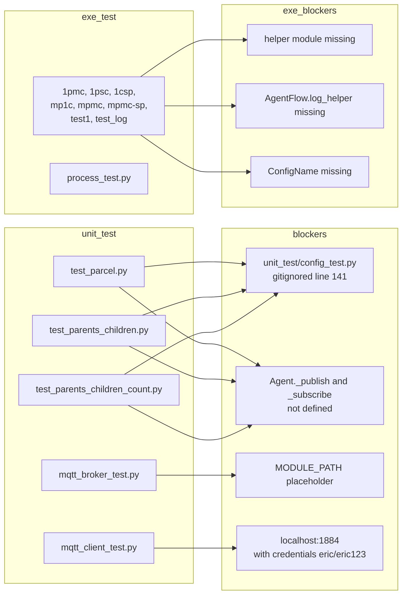

# 06 — Test Coverage

**Scope**: What tests exist, what actually runs, what they cover, and what they leave unverified.
**Rule**: Analysis only.

---

## 6.0 Status update (2026-07-28)

The original Phase-1 baseline captured in §6.1–6.7 (below) reflects the state before any test-infrastructure work landed. Subsequent phases added a deterministic suite under `tests/` and resolved:

- R-02 via [RFC-001](../rfc/RFC-001-publish-sync-subscription-lifecycle.md)
- R-13 via [RFC-002](../rfc/RFC-002-publish-error-propagation.md)
- R-05 via [RFC-003](../rfc/RFC-003-auto-reply-contract.md)
- R-04 via [RFC-004](../rfc/RFC-004-bounded-message-dispatch.md)
- R-03 via [RFC-005](../rfc/RFC-005-mqtt-subscription-recovery.md)
- R.4 (publish_sync-vs-publish_sync collision) via [RFC-006](../rfc/RFC-006-publish-sync-topic-collision.md)
- R-14 (partially — `__topic_handlers` slice) via [RFC-007](../rfc/RFC-007-handler-registry-ownership.md), which also closed the R.6-1 / R.6-2 / R.6-3 residual risks from the RFC-006 cross-API characterisation
- R-06 (partially — R-06.1 spawn pickle failure / R-06.2 unbounded `Process.join` / R-06.4 parent-child state divergence) via [RFC-008](../rfc/RFC-008-process-worker-lifecycle.md); R-06.3 heartbeat/watchdog and child-exception IPC remain Deferred / Open
- R-10 (fully — R-10.1 ProcessWorker + R-10.2 ThreadWorker + R-10.3 Agent.terminate + R-10.4 MqttBroker.stop + R-10.6 MqttBroker.start + **R-10.7 MqttBroker.publish result contract** all resolved) via [RFC-008](../rfc/RFC-008-process-worker-lifecycle.md) + [RFC-009](../rfc/RFC-009-thread-worker-lifecycle.md) + [RFC-010](../rfc/RFC-010-broker-bounded-shutdown.md) + [RFC-011](../rfc/RFC-011-mqtt-broker-bounded-startup.md) + [RFC-012](../rfc/RFC-012-mqtt-publish-result-contract.md); **R-10.5 non-daemon interpreter-exit blocking Partially Resolved / Operationally Mitigated** via [RFC-013](../rfc/RFC-013-thread-worker-process-exit-policy.md) (2026-08-03 — detection + diagnostics + operator guidance; in-process forced thread termination not supported by design; containment via ProcessWorker or external supervisor); remaining residual: publish-vs-stop full linearisation barrier (Open / Documented — RFC-012 §B modification 2 acknowledges the race)

Current authoritative pytest command:

```bash
PYTHONPATH=src /home/eric/anaconda3/envs/actbot/bin/python -m pytest tests/unit -v
```

Result as of 2026-08-03 (after RFC-013 implementation):

```
598 passed, 0 failed, 0 xfailed(strict-pass), 2 xfailed  in ~72s
```

Broken down (single collected run):
- **RFC-013 suite (`tests/unit/core/test_thread_worker_process_exit.py`): 73 passed** in ~15 s — 44 subprocess characterisation cases retained + extended, plus the RFC-013 property / `Agent.terminate` diagnostics / source-pin categories
- RFC-012 suite (`tests/unit/test_mqtt_broker_publish_result.py`): **74 passed** in ~0.15 s (unchanged)
- RFC-011 suite (`tests/unit/test_mqtt_broker_startup_bounded.py`): **74 passed** in ~15 s (unchanged)
- RFC-010 suite (`tests/unit/test_mqtt_broker_shutdown.py`): **53 passed** in ~2 s (unchanged)
- RFC-009 suite (`tests/unit/core/test_thread_worker_lifecycle.py`): **35 passed** in ~6 s (**unchanged — no refactor needed**; the RFC-013 §7.20 / §9 concern that `test_F1` might have to accept ERROR-or-WARNING did not materialise)
- RFC-008 suite (`tests/unit/core/test_process_worker_lifecycle.py`): **33 passed** in ~14 s (unchanged)
- MqttBroker reconnect / lifecycle / start / auth / callbacks / empty: **48 + 11 + 13 + 6 + 8 + 3 = 89 passed** (unchanged)
- Agent publish suites (`test_agent_publish_errors.py` + `test_agent_publish_sync.py`): **46 + 27 = 73 passed** unchanged (use `FakeBroker`, not `MqttBroker`)
- All other suites: **97 passed, 2 xfailed** (unchanged)

The two remaining xfails (`test_both_callers_should_receive_own_response_with_shared_topic_wait`, `test_framework_should_support_multiple_handlers_per_topic`) are deferred to a future RFC on correlation ID / multi-handler fan-out. **Both retained unchanged under RFC-013.**

> **Resolved test-quality defect (2026-08-03) — R-14 / RFC-006 area, NOT part of RFC-013.**
> `tests/unit/core/test_agent_publish_sync_concurrency.py::test_atomic_ownership_under_concurrent_race_stress`
> was flaking at roughly **7% per run** with `completed == 2`. It was first
> reproduced **failing at clean `HEAD` in a separate worktree with none of the
> RFC-013 changes applied**, confirming it was pre-existing and unrelated to
> RFC-013.
>
> **Root cause — a test defect, not a product defect.** `barrier.wait()` only
> synchronised *entry* to `publish_sync`; nothing kept the 8 callers
> overlapping. The owner's full round-trip (register → subscribe → publish →
> `FakeBroker`'s synchronous inline auto-response → return → pop at
> `agent.py:705-710`) measured ~250 µs, the same order as post-barrier thread
> wake-up jitter (~265 µs observed). A straggler scheduled after the owner's
> `finally` released the topic then legitimately acquired ownership as the
> *next* owner. Event-timeline instrumentation confirmed this directly:
> `collisions == 6` for the genuinely-overlapping callers, no orphan handler,
> and zero unexpected errors in every failing trial — i.e. **sequential
> ownership transfer**, the behaviour
> `test_check_and_pop_atomicity_prevents_torn_state` asserts as correct.
> **RFC-006's ownership guard was never at fault**; the atomic check+register
> (`agent.py:669-685`) and identity-check+pop (`705-710`) both held throughout.
>
> **Fix** — the test now *enforces* the overlap it was written to observe: a
> second barrier (`overlap_gate`) holds the owner inside `broker.publish`,
> after it has registered ownership and before it can receive its response
> and release it, until all 7 other callers have passed their ownership
> check. `completed == 1` / `collisions == 7` are now deterministic. No
> production code changed. Verified 40/40 sequential runs plus 4 concurrent
> runs under CPU contention, against the ~7% pre-fix rate.

Historical intermediate results:
- Pre-RFC-006/007: 216 passed / 0 xfailed.
- Post-RFC-007 (2026-07-27): 256 passed / 2 xfailed.
- Post-RFC-008 (2026-07-28): 289 passed / 2 xfailed (added 33 ProcessWorker tests).
- Post-RFC-009 characterisation (2026-07-28): 312 passed / 2 xfailed (added 23 characterisation tests for the *broken* ThreadWorker).
- Post-RFC-009 implementation (2026-07-28): 324 passed / 2 xfailed (characterisation rewritten; net +12 tests).
- Post-R-10.4 characterisation (2026-07-28): 366 passed / 2 xfailed (added 42 characterisation tests for the *broken* MqttBroker.stop).
- Post-RFC-010 implementation (2026-07-28): 377 passed / 2 xfailed (characterisation rewritten; net +11 tests).
- Post-R-10.6 characterisation (2026-07-28): 442 passed / 2 xfailed (added 65 characterisation tests for the *broken* MqttBroker.start).
- Post-RFC-011 implementation (2026-07-29): 451 passed / 2 xfailed (characterisation rewritten; net +9 tests).
- Post-R-10.7 characterisation (2026-07-31): 526 passed / 2 xfailed (added 75 characterisation tests for the *broken* MqttBroker.publish result observability).
- Post-RFC-012 implementation (2026-08-02): **525 passed / 2 xfailed** (75 characterisation rewritten to 74 post-RFC-012 tests; 3 lifecycle tests refactored; all other suites zero regression).
- Post-R-10.5 characterisation (2026-08-03): 569 passed / 2 xfailed (added 44 subprocess characterisation tests for the R-10.5 process-exit residual).
- Post-RFC-013 implementation (2026-08-03): **598 passed / 2 xfailed** (44 characterisation retained and extended to 73 tests; **zero** adjacent test refactors needed; all other suites zero regression).

Suite composition:

| File | Purpose | Tests |
|---|---:|---:|
| `tests/unit/core/test_agent_publish_sync.py` | R-02 characterization + fix invariants | 27 |
| `tests/unit/core/test_agent_publish_errors.py` | R-13 characterization + `_publish_or_raise` API | 46 |
| `tests/unit/core/test_agent_reply_behavior.py` | R-05 characterization + auto-reply contract (RFC-003) | 21 |
| `tests/unit/core/test_agent_message_threading.py` | R-04 characterization + bounded dispatcher + linearization / concurrent-stop race fixes (RFC-004) | 33 |
| `tests/unit/core/test_agent_publish_sync_concurrency.py` | R.4 (publish_sync-vs-publish_sync) characterization + fail-fast collision (RFC-006) + 2 aspirational xfails (correlation ID / multi-handler fan-out) | 21 + 2 xfail |
| `tests/unit/core/test_agent_publish_sync_cross_api.py` | R.6-1 / R.6-2 / R.6-3 residual risks + handler registry ownership (RFC-007): fail-fast cross-API protection, HandlerRecord shape, atomic _on_message snapshot, lock hygiene | 19 |
| `tests/unit/core/test_process_worker_lifecycle.py` | **R-06 (R-06.1 / R-06.2 / R-06.4) + Agent pickle protocol + ProcessWorker state machine / bounded escalation / concurrent-stop coordination / start-failure rollback / parent-child contract (RFC-008)** — 10 categories: A pickle × 8, B state-machine × 5, C real-spawn × 3, D restart guards × 2, E escalation × 3, F concurrent × 2, G start-failure × 3, H observability × 2, I parent-child × 1, J baseline × 4 | 33 |
| `tests/unit/core/test_thread_worker_lifecycle.py` | **R-10 (R-10.1–R-10.3) + ThreadWorker WorkerState state machine (STOP_TIMEOUT + FAILED added) / bounded cooperative stop / STOP_TIMEOUT retry / concurrent-stop bounded coordination / start-failure rollback / `_run_target` Exception-only capture / `Agent.terminate` observes stop result and logs WARNING (RFC-009)** — 10 categories: A start × 4, B state machine + restart × 5, C bounded stop / STOP_TIMEOUT × 5, D retry × 3, E concurrent × 3, F Agent.terminate × 4, G self-exit × 1, H exception + FAILED × 6, I observability API × 2, J baseline × 2 | 35 |
| `tests/unit/test_mqtt_broker_shutdown.py` | **R-10.4 MqttBroker bounded stop lifecycle (RFC-010): state machine (STOP_TIMEOUT + STOP_FAILED added), daemon helper-thread wrapper, single-helper retry (same helper re-joined, no new paho calls), concurrent-stop bounded coordination via `_stop_complete_event`, per-paho `try/except Exception` isolation (disconnect raise does NOT prevent loop_stop), full callback fencing (`_on_message` silent drop / `_on_connect` entire body gated / `_on_disconnect` diagnostics only), linearization state cleanup, `Agent.__deactivating` observes bool return + WARNING** — 9 categories: A basic lifecycle × 10, B idempotency + concurrency × 10, C bounded stop + STOP_TIMEOUT retry × 7, D exception behaviour × 6, E callback fencing × 7, F concurrent waiter bounded × 2, G linearization state cleanup × 3, H observability × 6, I Agent integration × 2 | 53 |
| `tests/unit/test_mqtt_broker_startup_bounded.py` | **R-10.6 MqttBroker bounded startup lifecycle (RFC-011): WorkerState.START_TIMEOUT added, daemon startup helper thread, single monotonic deadline covers connect + loop_start + callback wait, `startup_timeout_s=None` fallback to `self._timeout` for backward compat, terminal failed-instance contract (non-NEW start raises RuntimeError), bounded rollback primitive `_run_client_shutdown_primitive` (loop_start raise → disconnect called — fixes TCP leak), `_transition_to_start_failure` sets `_stopping=True` in same lock section for immediate RFC-010 callback fencing, START_TIMEOUT recovery path in stop (bounded-wait helper then run primitive at most once with `_last_start_cleanup_result` cache), concurrent-start coordination (N callers → 1 helper → 1 connect + 1 loop_start), waiter raises new `RuntimeError from _last_start_exception` never shared instance, wait=False True only means startup initiated** — 9 categories: A basic × 12, B bounded startup × 8, C exception rollback × 13, D concurrency + no-retry × 13, E callback fencing × 6, F rollback primitive × 9, G START_TIMEOUT stop × 4, H observability × 6, I ABC × 3 | 74 |
| `tests/unit/test_mqtt_broker_publish_result.py` | **R-10.7 MqttBroker publish result contract (RFC-012): `MqttPublishReason` enum (stable short codes) + `MqttPublishError(RuntimeError)` with 7 structured fields (topic, reason, rc, mid, state, result_type, detail) re-exported from `agentflow.broker`; pre-call state gate under `_state_lock` snapshot (stopping > state > connected priority); lock released before `client.publish` (source-verified — parity with RFC-005/010/011 lock hygiene); `_normalise_publish_result` handles v2 MessageInfo + v1 tuple + rc/mid coercion failures (with `__cause__` preservation via `raise ... from`); `rc != MQTT_ERR_SUCCESS` fast-fails as `MqttPublishError(PAHO_REJECTED)`; unsupported result shape (None / unknown object) raises with `result_type` field; success returns paho's original result unchanged; `Agent.publish` fire-and-forget preserved (catches via `except Exception`); `Agent._publish_or_raise` naturally propagates `MqttPublishError`; `Agent.publish_sync` restored to RFC-002 fast-fail (< 50 ms elapsed on rc failure — verified against 5 s timeout); waiter cleanup in finally still runs; auto-reply / dispatcher contained; each publish call gets its own exception instance (no shared `last_publish_error` field); pre-call snapshot is best-effort, NOT full stop linearisation barrier (documented residual race)** — 9 categories: A basic × 10, B rc validation × 13, C state gate × 11, D QoS unchanged × 4, E Agent integration × 10, F auto-reply/dispatcher × 3, G exception contract × 13, H payload × 4, I concurrency × 6 | 74 |
| `tests/unit/core/test_thread_worker_process_exit.py` | **R-10.5 ThreadWorker process-exit policy (RFC-013): four additive read-only `ThreadWorker` properties (`thread_alive`, `thread_daemon`, `worker_thread_ident`, `requires_process_restart`) computed per-read with no cache / no logging / no state mutation and no lock held across `Thread.is_alive()`; `requires_process_restart` = `STOP_TIMEOUT` AND `thread_alive` AND `thread_daemon is False`, self-clearing when the blocker releases (even before a retry, while `state` still reads `STOP_TIMEOUT`) or when a retried `stop()` reaches `STOPPED`; `Agent.terminate` capability-based diagnostics — ERROR on restart-required (worker type / state / ident / alive / daemon / supervisor phrase / RFC reference, at most one per invocation), pre-existing WARNING otherwise, never-raise preserved under a raising property, no `os._exit`; source pins on `daemon=False` marker, absence of `WorkerState.UNRECOVERABLE`, absence of `os._exit` and ctypes async cancellation in core; 44 subprocess characterisation cases retained proving non-daemon wedge blocks interpreter exit, `sys.exit` cannot bypass it, daemon threads exit but may truncate `finally`, `os._exit` skips `atexit`, and ProcessWorker offers bounded terminate/kill escalation while ThreadWorker cannot** — 13 categories: A interpreter baseline × 8, B ThreadWorker normal × 4, C wedged handler × 4, D broker-start source × 2, E broker-stop source × 2, F ProcessWorker contrast × 4, G daemon experiment × 4, H supervisor containment × 6, I policy source pins × 10, J property scenarios × 7, K property unit contracts × 11, L `Agent.terminate` diagnostics × 7, M RFC-013 policy pins × 4 | 73 |
| `tests/unit/test_mqtt_broker_reconnect.py` | R-03 characterization + subscription registry + reconnect recovery + planned/unexpected disconnect classification + stop-vs-callback races (RFC-005) | 48 |
| `tests/unit/test_mqtt_broker_start.py` | MqttBroker start + wait paths | 13 |
| `tests/unit/test_mqtt_broker_auth.py` | username / password walrus edges | 6 |
| `tests/unit/test_mqtt_broker_lifecycle.py` | stop / publish / subscribe / **unsubscribe** delegation | 11 |
| `tests/unit/test_mqtt_broker_callbacks.py` | `_on_connect` / `_on_message` / exception isolation | 8 |
| `tests/unit/test_empty_broker.py` | `MessageBroker.unsubscribe` default no-op via EmptyBroker | 3 |

Coverage changes since baseline:

- **R-02** — was uncovered; now covered by `tests/unit/core/test_agent_publish_sync.py` (success cleanup, timeout cleanup, publish-exception cleanup, late-response fallback, duplicate-response fallback, identity guard, concurrent cleanup). See §6.4 for the updated matrix.
- **R-13** — was uncovered; now covered by `tests/unit/core/test_agent_publish_errors.py` (Agent.publish fire-and-forget contract preserved; `publish_sync` propagates the broker's original exception object with fast-fail timing; `_publish_or_raise` internal method verified for success, all four exception types, missing broker; R-02 cleanup verified on the new fast-fail path).
- **R-05** — was uncovered; now covered by `tests/unit/core/test_agent_reply_behavior.py` (three loop patterns previously observed under a bounded self-echo broker now terminate in ≤ 3 publishes; R-fallback-silent verified; R-strip-topic_return verified across TextParcel / BinaryParcel / content / error field preservation; R-exception-fresh verified with non-mutation of incoming parcel; RFC-003 × RFC-001 interaction verified).
- **R-04** — was uncovered; now covered by `tests/unit/core/test_agent_message_threading.py` (bounded dispatcher: workers cap, queue capacity, drop_newest metric, broker-callback safety invariant, two-layer exception isolation, metrics snapshot, graceful drain, bounded shutdown timeout, idempotent stop, post-stop rejection, legacy per-message-thread mode + DeprecationWarning). Two race fixes verified with deterministic reproductions: `test_race_stop_wins_between_enqueue_check_and_put_deterministic` and `test_concurrent_stop_calls_execute_actual_shutdown_only_once`; a 25-trial concurrency stress test (`test_stop_and_enqueue_linearization_under_concurrency_stress`) plus 5 independent re-runs confirmed no flakes.
- **R-03** — was uncovered; now covered by `tests/unit/test_mqtt_broker_reconnect.py` (registry maintenance, first-connect vs reconnect classification, disconnected subscribe/unsubscribe, per-topic recovery failure isolation, planned/unexpected disconnect classification, stop short-circuit, post-stop rejection, `_state_lock` never held across paho client calls, stop-during-recovery / unsubscribe-during-recovery / subscribe-during-recovery races, concurrent producer thread safety, metrics snapshot). The 6 aspirational strict xfails from the R-03 characterization phase all converted to positive assertions.
- **R.4** (RFC-001 §10 pre-existing race) — was documented as an unresolvable side-effect of RFC-001; now covered by `tests/unit/core/test_agent_publish_sync_concurrency.py` (RFC-006): publish_sync-vs-publish_sync collision raises `TopicWaitCollisionError` fast-fail; 21 pass + 2 aspirational xfails (correlation ID, multi-handler fan-out).
- **R-14 (`__topic_handlers` slice)** — was uncovered; now covered by `tests/unit/core/test_agent_publish_sync_cross_api.py` (RFC-007): `_HandlerRecord` + `_HandlerOwnerType.{NORMAL, PUBLISH_SYNC}` ownership tagging; all registry mutations and reads under `_handlers_lock`; direct subscribe/unsubscribe on PUBLISH_SYNC-owned topic fail-fast; NORMAL rebind preserved; `_on_message` reads single snapshot (closing R.6-3 TOCTOU); four lock-hygiene tests verify `_handlers_lock` is never held across `broker.subscribe`/`broker.unsubscribe`/`dispatcher.enqueue`/handler invocation. R-14 remains partially open for `_children` / `_parents` (out of RFC-007 scope).
- **R-06 (R-06.1 / R-06.2 / R-06.4 slices)** — was uncovered (all previous tests used `start_thread` — see §6.4 baseline row); now covered by `tests/unit/core/test_process_worker_lifecycle.py` (RFC-008):
  - **A. Agent pickle round-trip (8 tests)** — `__getstate__` / `__setstate__` produce a functional child-side Agent; runtime-only fields excluded and reinstated fresh; `_children` / `_parents` reset to empty; RFC-006 / RFC-007 `_HandlerRecord` ownership shape preserved across pickle; **fail-fast** on non-picklable handler (`TypeError` naming the topic + `on_activate()` suggestion); fail-fast on non-picklable value in `config`.
  - **B. Worker state machine (5 tests)** — `NEW` initial state; `stop()` before `start()` is a no-op that keeps `NEW` and allows a subsequent `start()`; `START_FAILED` after pickle failure; restart guards raise `RuntimeError`.
  - **C. Real spawn success path (3 tests)** — end-to-end: child unpickles Agent, runs `_activate`, exits cleanly on `terminate`; `Process.daemon = False`; **`agent.config` is not mutated** (no `work_queue` key added / left behind on the parent-side dict).
  - **D. Repeated / restart guards (2 tests)** — repeated `start()` while `RUNNING` raises; `start()` after successful `stop()` raises.
  - **E. Stop escalation ladder (3 tests)** — escalates to `Process.terminate()` when child ignores `terminate` message (verified with wedged child); escalates to `Process.kill()` when child installs `SIG_IGN` for SIGTERM; returns `exitcode=0` when child cooperates. Total wall time bounded per-call.
  - **F. Concurrent stop semantics (2 tests)** — idempotent `stop()` returns cached exitcode; 5 concurrent callers through a `threading.Barrier` all observe the same result — escalation body runs exactly once (verified via `_stop_complete_event` coordination).
  - **G. Start failure cleanup (3 tests)** — lambda in `config` → pickle fails → `work_process` / `work_queue` cleared; `agent.config` remains uncontaminated; lambda handler → `TypeError` at `start()` naming the topic; state `START_FAILED`.
  - **H. Observability + orphan sanity (2 tests)** — `exitcode` property is `None` before `stop()`, `int` after; no orphan process (`os.kill(pid, 0) → ProcessLookupError`).
  - **I. Parent-child contract (1 test)** — parent-side `Agent._broker` / `_dispatcher` / `__topic_handlers` / `_children` / `_parents` all stay uninitialised after child starts (RFC-008 §6.5 architectural constraint verified).
  - **J. Baseline preservation (4 tests)** — `Worker.__init__` still forces `spawn`; `ThreadWorker` still returns `threading.Event`; `ProcessWorker` still returns `mp.Event`; `_HandlerRecord` ownership survives pickle across the process boundary.
  - **R-06.3** (heartbeat / liveness / automatic restart) and **child exception forwarding** remain uncovered — Deferred / Open per RFC-008 scope.
- **R-10 (R-10.2 + R-10.3 slices, ThreadWorker side)** — was uncovered by any bounded-lifecycle test until this phase; now covered by `tests/unit/core/test_thread_worker_lifecycle.py` (RFC-009):
  - **A. Startup / thread properties (4 tests)** — `start()` creates a non-daemon `threading.Thread` and transitions state to `RUNNING`; original agent instance is used by identity; `agent.config['work_queue']` is mutated in place (shared-instance model preserved); broker / dispatcher / handler registry are shared by reference between caller and worker thread.
  - **B. State machine + restart guards (5 tests)** — `stop()` before `start()` is a no-op returning `True`, state stays `NEW`, subsequent `start()` allowed; `start()` twice while `RUNNING` raises `RuntimeError`; `start()` after `STOPPED` raises `RuntimeError`; `start()` after `START_FAILED` (Thread.start OSError) raises `RuntimeError`; `START_FAILED` transition observed on `Thread.start()` failure.
  - **C. Bounded stop / STOP_TIMEOUT (5 tests)** — source inspection: `stop` uses `join(graceful_timeout_s)` (no unbounded `.join()`); cooperative stop returns `True` fast; wedged `_activate` → `stop()` returns `False` within `~graceful_timeout_s`, state becomes `STOP_TIMEOUT`; thread reference retained on `STOP_TIMEOUT`; `is_working()` returns `True` during `STOP_TIMEOUT` (reflects real `Thread.is_alive()`).
  - **D. STOP_TIMEOUT retry (3 tests)** — retry after blocker released → `STOPPED`; retry while still wedged → stays `STOP_TIMEOUT`; repeated `stop()` after `STOPPED` returns `True` idempotently with no extra 'terminate' sentinel enqueued (queue size preserved).
  - **E. Concurrent stop semantics (3 tests)** — 5 concurrent callers through a `threading.Barrier` all observe the same cached `bool`, and **exactly 1** `'terminate'` sentinel reaches the queue (state-lock linearisation); source inspection: waiter uses `_stop_complete_event.wait(<timeout>)` — never bare `.wait()`; behavioural: waiter returns bounded within `graceful_timeout_s + 0.1s` coordination margin even when the completion event never fires (bypass first-caller flow via direct state manipulation).
  - **F. Agent.terminate (4 tests)** — wedged `broker.stop` → `terminate()` returns bounded (`worker.stop` timeout ~0.3s) and logs a WARNING containing `stop_timeout` / `did not stop`; wedged handler alone does NOT hang `terminate` (dispatcher.stop is bounded, worker thread cooperates); source-inspection: `dispatcher.stop()` still precedes `worker.stop()`; `terminate()` **never raises** when `worker.stop()` returns `False`.
  - **G. Self-exit (1 test)** — `_activate` returns without receiving `'terminate'` → `_run_target` marks `RUNNING → STOPPED`; subsequent `stop()` reaches the `STOPPED` shortcut in `< 50ms`.
  - **H. Exception observability + FAILED state (6 tests)** — `Thread.start()` failure → `START_FAILED`, `work_thread` cleared, original exception re-raised; `_activate` raises `Exception` → captured into `last_exception`, state → `FAILED`, `logger.exception` fired; source inspection: `_run_target` uses `except Exception` (not `except BaseException`, not bare `except:`); `stop()` from `FAILED` returns `True` without another join; `last_exception` is `None` after a clean run; `STOP_TIMEOUT` is NOT `STOPPED` when thread is still alive (guards against silently marking clean-exit).
  - **I. Observability API surface (2 tests)** — `ThreadWorker` exposes `state` and `last_exception` properties (parity with `ProcessWorker.state` / `.exitcode`); `daemon=False` baseline preserved (R-10.5 open residual documentation).
  - **J. Baseline preservation (2 tests)** — `Worker.__init__` still forces `spawn` (unchanged by RFC-009); `ThreadWorker.create_event()` returns `threading.Event`.
  - **R-10.4** (broker.stop wedge — root cause) **RESOLVED 2026-07-28** by [RFC-010](../rfc/RFC-010-broker-bounded-shutdown.md); see the RFC-010 bullet below.
  - **R-10.5** (non-daemon interpreter-exit blocking under STOP_TIMEOUT / START_TIMEOUT) is **Partially Resolved / Operationally Mitigated 2026-08-03** by [RFC-013](../rfc/RFC-013-thread-worker-process-exit-policy.md), covered by `tests/unit/core/test_thread_worker_process_exit.py` (**73 passed**). The in-process blocking behaviour is **unchanged and permanent** — a documented architectural trade-off across `ThreadWorker` / `stop()` / `Agent.terminate` / `Agent.__deactivating` / `MqttBroker.start` docstrings and every timeout-path log. RFC-010's stop helper and RFC-011's startup helper are both `daemon=True` (so helpers alone don't block interpreter exit), but a worker thread waiting on `broker.start()` or `broker.stop()` still does. What RFC-013 adds: **detection** (`requires_process_restart` + `thread_alive` / `thread_daemon` / `worker_thread_ident`, and an `Agent.terminate` ERROR carrying the supervisor-action phrase); **in-process forced thread termination remains Not supported by design** (daemon flip / `os._exit` / ctypes async cancellation all rejected — §5 B/F/J); **operational containment is Supported** via ProcessWorker or an external supervisor ([`docs/deployment/`](../deployment/worker-type-selection.md)). Deliberately **not** marked fully Resolved.
  - **R-10.6** (broker.start wedge on connect / loop_start) **RESOLVED 2026-07-29** by [RFC-011](../rfc/RFC-011-mqtt-broker-bounded-startup.md); see the RFC-011 bullet below.
  - **R-10.7** (broker.publish result observability — rc silently swallowed / `publish_sync` full-timeout wait / no state gate) **RESOLVED 2026-08-02** by [RFC-012](../rfc/RFC-012-mqtt-publish-result-contract.md); see the RFC-012 bullet below.
- **R-10.7 (MqttBroker publish result contract)** — was uncovered by any dedicated observability test until R-10.7 characterisation (75 tests); rewritten under RFC-012 to 74 post-implementation tests covered by `tests/unit/test_mqtt_broker_publish_result.py`:
  - **A. Basic publish lifecycle (10 tests)** — `client.publish` delegated with keyword args (`topic=`, `payload=`); qos/retain still NOT passed (deferred); TextParcel `text/json|` head + BinaryParcel `application/pickle|` head preserved; success returns paho's original result unchanged; `wait_for_publish` / `is_published` still NOT called (deferred); source-verified `MQTT_ERR_SUCCESS` + `_normalise_publish_result` now present; paho `Exception` still propagates unwrapped.
  - **B. rc validation — INVERTED characterisation (13 tests)** — rc SUCCESS returns; rc NO_CONN / QUEUE_SIZE / PROTOCOL / unknown-nonzero → `MqttPublishError(PAHO_REJECTED)` with topic/rc/mid fields; object without `.rc` → `UNSUPPORTED_RESULT`; `None` → `UNSUPPORTED_RESULT`; paho v1 tuple success returns original tuple; paho v1 tuple rc failure raises; **no shared `last_publish_error` field**; malformed rc / mid / tuple[0] → `UNSUPPORTED_RESULT` with `detail='invalid rc'`/`'invalid mid'` and `__cause__` preserved via `raise ... from ex`.
  - **C. State gate (11 tests)** — NEW / STARTING → `BROKER_NOT_RUNNING`, client.publish NOT invoked; RUNNING + connected + not stopping → allowed; RUNNING + disconnected → `BROKER_DISCONNECTED`; STOPPED → `BROKER_STOPPING` (because RFC-010 stop sets `_stopping=True`); START_FAILED → `BROKER_STOPPING`; **`_stopping=True` priority over state check** (RFC-012 §B modification 2); state=RUNNING but `_connected=False` → gate rejects with `BROKER_DISCONNECTED` (rc=None, not `PAHO_REJECTED`); **source-verified lock hygiene — `client.publish` NOT inside `with self._state_lock` block**; **source-verified docstring** documents pre-call snapshot / concurrent stop / linearisation caveat; **runtime-verified race** — publish invoked after snapshot with concurrent stop mimicry catches as `PAHO_REJECTED` via second-layer paho rc validation.
  - **D. QoS unchanged (4 tests)** — `qos` / `retain` still not passed; `wait_for_publish` / `is_published` source-checked absent (RFC-012 explicitly out of scope).
  - **E. Agent integration (10 tests)** — `Agent.publish` swallows MqttPublishError via `except Exception` and returns None (fire-and-forget preserved); `Agent._publish_or_raise` naturally propagates MqttPublishError; **`publish_sync` on rc failure fast-fails within < 50 ms** (elapsed timing verified against 5 s / 10 s timeouts — RFC-002 fast-fail contract **RESTORED**); positive control: broker.publish raise still fast-fails (RFC-002 works); rc failure and Exception now uniform at Agent layer; source-stable fire-and-forget shape; **`publish_sync` finally cleanup still runs on MqttPublishError** — registry cleanup + broker.unsubscribe both verified; `publish_sync` never enters `event.wait` on rc failure; `Agent.publish` from STOPPED broker silent.
  - **F. Auto-reply / dispatcher containment (3 tests)** — RFC-003 auto-reply MqttPublishError swallowed by `Agent.publish`; multiple successive publish failures don't stop callback context; **RFC-004 dispatcher worker continues to next task** after MqttPublishError in handler (`error_count += 1`; second task runs).
  - **G. Exception contract (13 tests)** — `MqttPublishError` is `RuntimeError` subclass (so `except Exception` catches); `reason` is `MqttPublishReason` enum (stable short-code); 7 fields all queryable (`topic`, `reason`, `rc`, `mid`, `state`, `result_type`, `detail`); message format frozen — includes topic/rc/mid/reason always; optional context fields (state, result_type, detail) appended only when present, in declared order; **re-exported from `agentflow.broker`** — `from agentflow.broker import MqttPublishError, MqttPublishReason` works; no return annotation on `MqttBroker.publish` (unchanged); **`MessageBroker` ABC unchanged**; `EmptyBroker.publish` / `FakeBroker.publish` unchanged (return None).
  - **H. Payload / serialization boundaries (4 tests)** — pickle failure raises at Parcel constructor (before broker); non-Parcel payload passed through; BinaryParcel bytes preserved; TextParcel UTF-8 JSON preserved.
  - **I. Concurrency (6 tests)** — 20 parallel publishers all delegated to paho (paho thread-safe); concurrent rc failures produce independent exception instances (verified via distinct object IDs); no shared `last_publish_error` field post-failure; source-verified only ONE `with self._state_lock:` in publish body (snapshot); publish inline in stop callback observes `_stopping=True` → gate rejects with `BROKER_STOPPING` (no leak); publish never transitions state.
- **R-10.4 (broker layer)** — was uncovered by any bounded-shutdown test until R-10.4 characterisation phase (42 tests); rewritten under RFC-010 to 53 post-implementation tests covered by `tests/unit/test_mqtt_broker_shutdown.py`:
  - **A. Basic lifecycle (10 tests)** — `stop()` from RUNNING reaches paho `disconnect` then `loop_stop`; linearization at RUNNING → STOPPING atomically flips `_stopping=True` and clears `_connected` / `_connect_ok` / `_connected_evt` (§G modification 4); NEW.stop() is a pure no-op returning True without touching paho; STOPPED.stop() is idempotent replay; state transitions `NEW → STARTING → RUNNING → STOPPING → STOPPED` verified end-to-end; post-stop `_on_disconnect` classifies planned regardless of reasonCode; subscription registry preserved across stop; post-stop subscribe/unsubscribe return None.
  - **B. Idempotency + concurrency (10 tests)** — repeated `stop()` after STOPPED fires **exactly one** disconnect + loop_stop pair (idempotence via cached True); concurrent N=5 callers share **one helper thread** and **one paho pair** (verified via `fake_client.call_count == 1`); every concurrent caller returns the same cached `bool`; stop-before-start is a no-op; stop after `start(wait=True)` timeout is a no-op returning True (no paho double-call); `STARTING.stop()` raises `RuntimeError` (first-phase, RFC-010 modification 3); concurrent `_on_disconnect` during stop still classifies as planned; concurrent `subscribe()` during stop observes `_stopping` → no-op; concurrent subscribe from inside recovery-loop is aborted by stop; inline `_on_disconnect` from `disconnect()` does NOT deadlock (`_state_lock` hygiene).
  - **C. Bounded stop + STOP_TIMEOUT retry (7 tests)** — wedged `client.disconnect` → `stop(0.3)` returns False bounded, state `STOP_TIMEOUT`; wedged `client.loop_stop` → same (disconnect succeeded first); **retry re-joins SAME helper — no new paho calls** (RFC-010 modification 1 verified via `call_count`); retry after blocker released reaches STOPPED; retry while still wedged stays STOP_TIMEOUT; source-inspection cross-references showing `Agent.__deactivating` bounds via `broker.stop()` bool + `ProcessWorker` retains hard `terminate()/kill()` containment.
  - **D. Exception behaviour (6 tests)** — `disconnect` `Exception` captured into `last_stop_exception` and helper continues to loop_stop (§7.8); loop_stop still runs after disconnect raise (resource-leak fix vs pre-RFC-010); loop_stop `Exception` captured, state = STOPPED; first `Exception` retained when both raise (§7.9); `_stopping=True` + `state=STOPPED` preserved after captured exception; **BaseException in helper marks STOP_FAILED not STOPPED** — cached False replay on subsequent stop() (RFC-010 modification 2).
  - **E. Callback fencing (7 tests)** — post-stop `_on_connect(rc=0)` skips notifier + recovery; post-stop `_on_disconnect` marks planned; post-stop `_on_message` **silently drops** (bug fix — modification 4 rule 1); post-stop `_on_connect` does NOT set `_connected_evt` (modification 4 rule 3); post-stop `_on_connect(rc=0)` does NOT write `_connect_ok` (modification 4 rule 2); post-stop `_on_connect` does NOT transition state back to RUNNING; post-stop `_on_connect(rc!=0)` also fences.
  - **F. Concurrent waiter bounded (2 tests)** — source-inspection: waiter uses `_stop_complete_event.wait(<timeout>)` never bare `.wait()`; behavioural: two concurrent callers where first wedges — both return within bounded window (`graceful_timeout_s + 0.1s` coordination margin), both observe the same cached `False`, and helper's paho `disconnect` is invoked exactly once.
  - **G. State cleanup at linearization (3 tests)** — RUNNING → STOPPING transition atomically clears `_connected`, `_connect_ok`, and `_connected_evt` in the same lock section (all three verified independently).
  - **H. Observability (6 tests)** — `state` is a read-only lock-protected property; `last_stop_exception` is None after clean stop; helper thread is `daemon=True` (§7.13 — verified via `helper.daemon`); `EmptyBroker.stop` is idempotent and bounded by construction (no state); `MessageBroker` ABC signature preserved as `stop(self)` (§7.16); `MqttBroker.stop` signature has `graceful_timeout_s=5.0` default and `bool` return annotation.
  - **I. Agent integration (2 tests)** — source-inspection: `Agent.__deactivating` observes `stopped is False` (not `not stopped`), logs WARNING, wraps in `try/except Exception` — never-raise preserved; legacy `None`-returning brokers (like `EmptyBroker`) are treated as success via the `is False` guard.
  - **R-10.5** (non-daemon interpreter-exit blocking) — RFC-010's helper thread is `daemon=True` (verified in H); worker thread waiting on `broker.stop()` remains `daemon=False` per RFC-009 §7.13. Documented architectural trade-off.
- **R-10.6 (MqttBroker startup)** — was uncovered by any bounded-lifecycle test until R-10.6 characterisation (65 tests); rewritten under RFC-011 to 74 post-implementation tests covered by `tests/unit/test_mqtt_broker_startup_bounded.py`:
  - **A. Basic startup lifecycle (12 tests)** — paho `Client` created in `__init__` (not `start()`); callbacks bound BEFORE helper runs `connect` (verified runtime); `connect` called before `loop_start` (order preserved); state transitions `NEW → STARTING` at entry; `_connected_evt` cleared + `_connect_ok` reset in start; **`_stopping` reset ONLY inside NEW→STARTING lock section** (modification 5); wait=False `True` only means startup initiated (state stays STARTING — modification 4); wait=True timeout raises `TimeoutError` and state=`START_TIMEOUT` (not START_FAILED); successful `_on_connect(rc=0)` transitions STARTING→RUNNING; failed `_on_connect(rc!=0)` does not transition; successful start returns True.
  - **B. Bounded startup — hang scenarios (8 tests)** — wedged `client.connect` → bounded `TimeoutError`, state `START_TIMEOUT`, `loop_start` never invoked, helper still alive with rollback deferred (modification 2); wedged `client.loop_start` → same bounded behaviour; slow paho eventually succeeds within budget (positive controls); **`startup_timeout_s` bounds BOTH helper AND callback wait via single monotonic deadline** (verified via source `deadline = time.monotonic() + startup_timeout_s` + runtime); Agent / ThreadWorker / ProcessWorker cascade cross-refs.
  - **C. Exception rollback (13 tests)** — `connect Exception` captured into `_last_start_exception`, state `START_FAILED`, exception re-raised; `connect` raise does NOT call `loop_start` (helper returns early); state cleaned + `_stopping=True` after connect raise; `loop_start Exception` captured, state `START_FAILED`; **`loop_start` raise NOW calls `disconnect` via rollback primitive** (fixes pre-RFC-011 TCP leak); wait=True callback timeout → rollback calls both `loop_stop` and `disconnect`; client reference preserved; callbacks still bound; **start after `START_FAILED` raises `RuntimeError` (no retry)**; wait=True callback timeout cleanup is now bounded via primitive (source-verified).
  - **D. Concurrency + no-retry (13 tests)** — repeated `start()` while RUNNING raises `RuntimeError` with no new paho calls; `STARTING` waiter path completes with no extra paho calls; **concurrent N=5 callers share exactly one helper → 1 `connect` + 1 `loop_start` reach paho** (RFC-011 §E invariant runtime-verified); all concurrent callers return the same result; start after `START_TIMEOUT` raises RuntimeError; **start after `STOPPED` raises RuntimeError — closes A.7 restart-after-stop bug structurally**; start after `NEW.stop()` unaffected (NEW.stop is pure no-op); `STARTING.stop()` still raises RuntimeError (RFC-010 mod 3 preserved); stop during connect/loop_start wedge is deferred via START_TIMEOUT recovery path; late callback after stop fenced by RFC-010; **concurrent waiter that observes failure raises new `RuntimeError` chained via `from` — never re-raises same exception instance** (modification 3 runtime-verified via original-identity check).
  - **E. Callback fencing after failure (6 tests)** — late `_on_connect` after `START_TIMEOUT` does NOT set `_connected_evt`; does NOT notify notifier; late `_on_connect` after `START_FAILED` does NOT write `_connect_ok`; **failed instance is terminal — cross-round callback contamination structurally impossible** (§7.5); `_start_generation` is diagnostic-only (source-check: callbacks do NOT filter by generation — see RFC-011 Appendix C); post-failure `_on_message` silent-drops (RFC-010 fencing extended).
  - **F. Rollback primitive + resource cleanup (9 tests)** — connect success + loop_start fail → rollback calls both disconnect AND loop_stop; rollback bounded even when disconnect wedges (5.0 s rollback budget); rollback primitive uses `daemon=True` helper (source-verified); wait=True callback timeout rollback is bounded (rollback wedge respects 5.0 s budget); start body uses `_run_client_shutdown_primitive_and_cache`; startup helper is `daemon=True` (source-verified); paho client reused after failed start (§7.5 terminal contract makes retry impossible so no contamination); no fresh Client per start (Option D deferred); registry preserved after failed start.
  - **G. START_TIMEOUT stop behaviour (4 tests)** — `stop()` from `START_TIMEOUT` bounded-waits for startup helper before running cleanup (mod 2 — prevents two helpers concurrently touching paho); **stop reports actual `_last_start_cleanup_result` — no false True** (modification 1); concurrent N stops share cleanup primitive → **exactly 1 disconnect + 1 loop_stop reach paho** (verified via call counts); `_last_start_cleanup_result` cached; second stop returns cached without re-running primitive.
  - **H. Observability + terminal states (6 tests)** — `state` is read-only property; `last_start_exception` is None after clean start; startup helper is `daemon=True`; `start_generation` increments per attempt (diagnostic-only); signature has `startup_timeout_s` keyword-only with default `None` (fallback to `self._timeout` for backward compat); return type is `bool`.
  - **I. ABC / other brokers (3 tests)** — `MessageBroker` ABC signature preserved as `start(self, options)` (§7.16); `EmptyBroker.start` is bounded by construction (no state, no network); `Agent.__activating` source unchanged and continues to use `BrokerMaker.create_broker` in retry loop.

Legacy trees (`unit_test/`, `exe_test/`) remain excluded from pytest collection via `pyproject.toml` `norecursedirs`. No change to §6.1–6.7 inventory.

---

## 6.1 Inventory

### `unit_test/`

| File | Style | Depends on |
|---|---|---|
| `unit_test/test_parcel.py` | `unittest.TestCase` | `unit_test.config_test` (not present), `Agent._subscribe`/`_publish` (not present) |
| `unit_test/test_parents_children.py` | `unittest.TestCase` | same |
| `unit_test/test_parents_children_count.py` | `unittest.TestCase` | same |
| `unit_test/mqtt_broker_test.py` | `pytest` + `unittest.mock` | Placeholder `MODULE_PATH = "yourpkg.mqtt_broker"` (`mqtt_broker_test.py:6`) |
| `unit_test/mqtt_client_test.py` | Manual script | Live MQTT broker at `localhost:1884` |

### `exe_test/`

| File | Purpose | Depends on |
|---|---|---|
| `exe_test/1pmc.py` | 1 parent, many children (manual demo) | `helper` module (not present), `ConfigName` (not defined) |
| `exe_test/1psc.py` | 1 parent, single child | `helper`, `test_config`, `ConfigName` |
| `exe_test/1csp.py` | 1 child, multiple parents | `helper`, `ConfigName` |
| `exe_test/mp1c.py` | Multiple parents, 1 child (thread mode) | `helper`, `ConfigName` |
| `exe_test/mpmc.py` | Many-to-many (thread mode) | `helper`, `ConfigName` |
| `exe_test/mpmc-sp.py` | Many-to-many with targeting | `helper`, `ConfigName` |
| `exe_test/test1.py` | Minimal process-mode start | `AgentFlow.log_helper`, `config_test`, `ConfigName` |
| `exe_test/test_log.py` | Notifier demo | `AgentFlow.log_helper`, `config_test` |
| `exe_test/process_test.py` | Freestanding thread/process strategy demo | Only stdlib |

---

## 6.2 Runnability audit



### Detailed reasons

- **`unit_test/config_test.py`**: `.gitignore:141` explicitly excludes it. Not present in the working tree. Tests import via `from unit_test.config_test import config_test` (`test_parcel.py:13`, `test_parents_children.py:10`, `test_parents_children_count.py:10`). This is the first `ImportError` the test suite hits.
- **`Agent._publish` / `Agent._subscribe`**: `Agent` (`src/agentflow/core/agent.py:305, 353`) defines `publish` and `subscribe`, not the underscore-prefixed variants. Tests calling `self._subscribe('binary_payload')` (`test_parcel.py:31`) and `self._publish('children_count', …)` (`test_parents_children_count.py:25`) hit `AttributeError` even if the earlier import were satisfied.
- **`ConfigName`**: not defined in `src/agentflow/core/config.py`. Every `exe_test` file that does `from agentflow.core.config import ConfigName, EventHandler` fails immediately.
- **`helper` / `AgentFlow.log_helper`**: no such module exists in the tree.
- **`mqtt_broker_test.py:6`**: `MODULE_PATH = "yourpkg.mqtt_broker"` is a placeholder string; the fixture's `__import__` will fail.
- **`mqtt_client_test.py`**: not a test — imports `paho.mqtt.client` directly, connects to `localhost:1884` with `eric/eric123`, runs `sleep(50)`. It is a manual script.

**Net effect**: `python -m unittest discover -s unit_test` and `pytest unit_test/` will each fail on the first import that reaches the missing modules. No test runs to completion out of the box.

---

## 6.3 Coverage matrix (what would be covered if the tests ran)

| Behaviour | Covered by | Notes |
|---|---|---|
| `Parcel.from_content` / `from_payload` for text and binary | `test_parcel.py` (would) | Only through the full agent flow; no direct unit test for `Parcel` |
| Parent registers child; child registers parent | `test_parents_children.py`, `test_parents_children_count.py` (would) | Requires MQTT broker; asserts final `_children`/`_parents` counts |
| Multiple same-name siblings, same-name parents | `test_parents_children.py` (would) | Relies on the naming-collision behaviour also noted in R-09 |
| `MqttBroker.start / stop / publish / subscribe / _on_message` (mock paho) | `mqtt_broker_test.py` (would, after fixing `MODULE_PATH`) | Would cover happy path of the paho wrapper |
| Manual paho smoke test | `mqtt_client_test.py` | Not automated |

---

## 6.4 High-risk behaviour with NO test coverage

Cross-referenced with `05-risk-register.md`.

| Risk | Not covered by any test |
|---|---|
| R-01 pickle payload | ✓ no malformed payload test |
| R-02 `publish_sync` leaks | **Resolved 2026-07-26 (RFC-001); covered by `tests/unit/core/test_agent_publish_sync.py`** |
| R-03 broker reconnect / re-subscribe | **Resolved 2026-07-27 (RFC-005); covered by `tests/unit/test_mqtt_broker_reconnect.py`.** MqttBroker owns a thread-safe subscription registry; reconnect drives per-topic recovery with per-topic failure isolation; stop / unsubscribe / subscribe races against recovery covered by dedicated tests; `_state_lock` never held across paho client calls (verified). |
| R-04 unbounded per-message threads | **Resolved 2026-07-26 (RFC-004); covered by `tests/unit/core/test_agent_message_threading.py`.** MessageDispatcher with fixed daemon consumer pool + bounded queue + drop_newest + graceful shutdown. Two race fixes (enqueue check-then-put linearization + concurrent-stop `_stop_complete_event`) verified with deterministic reproductions. |
| R-05 suspected reply loop | **Resolved 2026-07-26 (RFC-003); covered by `tests/unit/core/test_agent_reply_behavior.py`.** Three loop patterns (handler exception, handler-returns-loopy-Parcel, two-agent mutual reply) are verified to terminate in ≤ 3 publishes each under a bounded self-echo broker. |
| R-06 process-mode pickling + ProcessWorker lifecycle | **Partially Resolved 2026-07-28 (RFC-008); covered by `tests/unit/core/test_process_worker_lifecycle.py` (33 tests across 10 categories A–J).** R-06.1 spawn pickle failure — Agent `__getstate__` / `__setstate__` with runtime-only field whitelist + fail-fast picklability probe on `config` and every handler. R-06.2 unbounded `Process.join` — `ProcessWorker.stop` bounded escalation ladder (`send terminate → join(graceful) → terminate + join → kill + join`), total ≤ 8 s at defaults; concurrent callers coordinate via `_stop_complete_event`. R-06.4 parent-child state divergence — documented architectural constraint; parent-side Agent stays a lifecycle controller stub. `agent.config` is not mutated. `_HandlerRecord` ownership survives pickle. No orphan process after `stop()`. R-06.3 heartbeat / watchdog / automatic restart and child-exception IPC remain **Open — deferred to a future RFC**. |
| R-07 handler BaseException | ✓ |
| R-08 parent-side publish silent failure | ✓ |
| R-09 topic sanitisation | ✓ |
| R-10 `join()` without timeout on stuck handler | **Resolved 2026-08-02 (RFC-008 + RFC-009 + RFC-010 + RFC-011 + RFC-012); covered by `tests/unit/core/test_process_worker_lifecycle.py` (33) + `tests/unit/core/test_thread_worker_lifecycle.py` (35) + `tests/unit/test_mqtt_broker_shutdown.py` (53) + `tests/unit/test_mqtt_broker_startup_bounded.py` (74) + `tests/unit/test_mqtt_broker_publish_result.py` (74 across 9 categories A–I).** R-10.1 ProcessWorker bounded escalation (RFC-008). R-10.2 ThreadWorker bounded cooperative stop with STOP_TIMEOUT retry (RFC-009). R-10.3 `Agent.terminate` bounded via observing `worker.stop()` bool + WARNING on False. R-10.4 `MqttBroker.stop(graceful_timeout_s=5.0) -> bool` via `daemon=True` helper (RFC-010): single-helper retry, `disconnect Exception` does NOT prevent `loop_stop` (resource-leak fix), full callback fencing, `Agent.__deactivating` observes bool + WARNING. **R-10.6** `MqttBroker.start(options, *, startup_timeout_s=None) -> bool` via `daemon=True` startup helper (RFC-011): single monotonic deadline covers helper + callback wait; `startup_timeout_s=None` falls back to `self._timeout` for backward compat; terminal failed-instance contract (non-NEW start raises `RuntimeError` — closes E.50 cross-round callback contamination structurally); `_transition_to_start_failure` sets `_stopping=True` for immediate RFC-010 fencing; failed-start bounded rollback via `_run_client_shutdown_primitive` (loop_start raise → disconnect called, fixes TCP leak); `START_TIMEOUT` recovery in `stop()` bounded-waits startup helper then runs primitive at most once with `_last_start_cleanup_result` cache; concurrent-start coordination (N callers → 1 helper → 1 connect + 1 loop_start); waiter raises new `RuntimeError from _last_start_exception` never shared instance; wait=False True only means startup initiated. `Agent.__activating` unchanged — existing retry loop constructs fresh broker per iteration via BrokerMaker. **R-10.7** `MqttBroker.publish(topic, payload)` result contract (RFC-012): pre-call state gate under `_state_lock` snapshot with priority `_stopping` > `state != RUNNING` > `not _connected`; lock released before `client.publish` (source-verified); `_normalise_publish_result` handles v2 MessageInfo + v1 tuple + rc/mid coercion failures with `__cause__` preservation; `rc != MQTT_ERR_SUCCESS` raises `MqttPublishError(PAHO_REJECTED, rc, mid)`; unsupported result shape raises `MqttPublishError(UNSUPPORTED_RESULT, result_type=<type>)`; success returns paho's original result unchanged; new public symbols `MqttPublishError(RuntimeError)` + `MqttPublishReason(Enum)` re-exported from `agentflow.broker`; `Agent.publish` fire-and-forget preserved (catches via `except Exception`); `Agent._publish_or_raise` naturally propagates; `Agent.publish_sync` restored to RFC-002 fast-fail (elapsed < 50 ms on rc failure vs pre-RFC-012 full-timeout wait); waiter cleanup in `finally` still runs; auto-reply / dispatcher contained; no shared `last_publish_error` field. Pre-call snapshot is best-effort — publish-vs-stop full linearisation deferred as documented residual. **R-10.5** non-daemon interpreter-exit blocking under STOP_TIMEOUT / START_TIMEOUT is **Partially Resolved / Operationally Mitigated 2026-08-03 (RFC-013); covered by `tests/unit/core/test_thread_worker_process_exit.py` (73 across 13 categories A–M).** The blocking itself is a permanent architectural trade-off (RFC-009 §7.13 keeps worker `daemon=False`; RFC-010 stop helper and RFC-011 startup helper are both `daemon=True` so helpers alone don't block, but the worker thread waiting on broker still does), documented across five+ docstrings and every timeout-path log. RFC-013 adds four additive read-only `ThreadWorker` properties (`thread_alive`, `thread_daemon`, `worker_thread_ident`, `requires_process_restart` — per-read, no cache, no logging, no state mutation) and a capability-based `Agent.terminate` ERROR path (at most one per invocation; pre-existing WARNING otherwise; signature / return / never-raise all unchanged; no `os._exit`). `daemon=False`, `STOP_TIMEOUT` retriability, and the `WorkerState` enum are all unchanged. In-process forced thread termination is **Not supported by design**; hard containment is delegated to ProcessWorker or an external supervisor. Deliberately **not** marked fully Resolved. |
| R-13 publish-result observability | **Resolved 2026-07-26 (RFC-002); covered by `tests/unit/core/test_agent_publish_errors.py`.** Note: broker-side paho `MessageInfo` (rc/mid) is still discarded — that residual observability gap is deferred to a future RFC. |
| R-14 dict concurrency | **Partially Resolved 2026-07-27 (RFC-007); `__topic_handlers` slice covered by `tests/unit/core/test_agent_publish_sync_cross_api.py`.** All registry mutations and reads under `_handlers_lock`; `_HandlerRecord` ownership tagging; cross-API fail-fast on PUBLISH_SYNC-reserved topics; NORMAL rebind preserved; `_on_message` single-snapshot lookup. `_children` and `_parents` slice remains Open — deferred to a future RFC. |
| R-18 no unregister / heartbeat | ✓ |
| R-19 parcel version drift | ✓ |
| R-20 message-level tracing metadata | ✓ (not present in schema) |
| R-25 broker config default shape mismatch | ✓ |

---

## 6.5 README experimental numbers vs test suite

README (`README.md:59–69`) claims:
- Task Success Rate 98.5%
- Task Assignment Latency 30–63 ms
- Election Convergence Time ~18 ms
- MTTR under failure < 30 s
- Orphaned Tasks under 30% failure: 14 of 1000+

None of these can be reproduced from this repository because:
- No workload driver / task generator exists in `src/`, `unit_test/`, or `exe_test/`.
- No latency / convergence measurement code exists.
- No election implementation exists (see `07-readme-implementation-gap.md`).
- No orphan detection exists (there is no unregister / heartbeat path — R-18).
- No fault-injection harness exists.

**Confidence: High** — the code required to produce these numbers is simply absent. They may have been measured with an external harness not included in this repository (**Unknown**).

---

## 6.6 Environmental dependencies (implicit)

| Dependency | Referenced in | Impact |
|---|---|---|
| MQTT broker on `localhost:1884` with `eric/eric123` | `unit_test/mqtt_client_test.py`, `exe_test/1pmc.py:23–26`, others | Tests silently fail without it |
| MQTT broker on `localhost:1883` | Suggested by `comment.txt` `test_config_bulldog` | Alternate test config |
| `LOGGER_NAME` env var | `agent.py:22`, all broker modules | If unset, uses root logger; not blocking, but changes logging behaviour |
| `Tkinter` availability | `agent.py:8` `from tkinter import N` | Blocks import in minimal environments — R-16 |

---

## 6.7 Unknowns

- **U-6.1**: Whether the maintainer runs tests through a private script that first creates `config_test.py`. Not visible in this repository.
- **U-6.2**: Whether an external benchmark harness produced the README numbers.
- **U-6.3**: Whether `MODULE_PATH = "yourpkg.mqtt_broker"` was intended to be a project-scoped placeholder that was never wired up.
