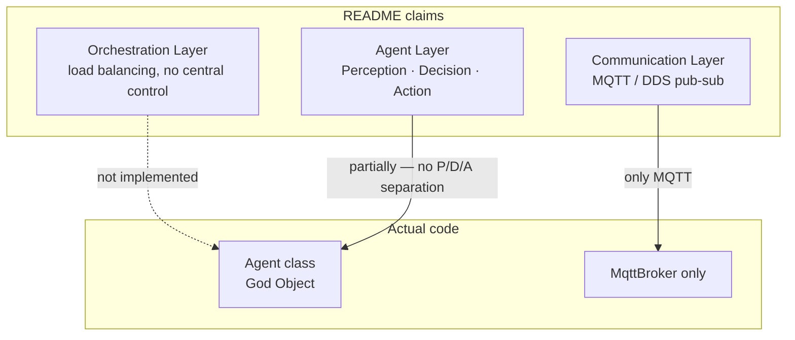

# 07 — README vs Implementation Gap

**Scope**: Compare each claim in `README.md` and the referenced paper concepts against the actual code.
**Rule**: Analysis only. No refactor recommendations.

---

## 7.1 Directory layout

| README (`README.md:78–88`) | Reality |
|---|---|
| `src/agentflow/broker/` | Present |
| `src/agentflow/core/` | Present |
| `src/agentflow/logistics/` | **Actual name is `logistic/`** — see R-23 |
| `unittest/` | **Actual name is `unit_test/`** — see R-23 |

---

## 7.2 Feature claims

Each row cites the README line and the code location that supports or contradicts it.

| README claim | README line | Code state |
|---|---|---|
| "Decentralized Decision Making … lightweight consensus" | 9–10 | Not implemented. All communication is centralized through the MQTT broker (`mqtt_broker.py`). No consensus algorithm exists in `src/`. |
| "Programmable Logistics Objects — Request/Response Logistics" | 12–13 | The `Logistic` ABC (`src/agentflow/logistic/logistic.py:7`) is a 20-line skeleton with no concrete subclasses. It even has an unresolvable import `from agent import Agent` (line 5). The only request/response code is `Agent.publish_sync` (`agent.py:321`), which does not use `Logistic`. |
| "Dynamic Service Election — real-time load and responsiveness" | 15–16 | No load metric collection, propagation, comparison, election protocol, timeout, or tiebreak in the code. |
| "Many-to-Many Coordination Model" | 18–19 | Only emergent behaviour from topic naming collisions (agents with the same name share topics — see R-09). Not an explicit coordination mechanism. |
| "Resilience and Fault Tolerance — agent-level fault containment and task reassignment" | 21–22 | No task model, no reassignment path, no unregister / heartbeat (R-18). Broker disconnect is not recovered (R-03). |
| "Modular Architecture — Holonic agents; MQTT/DDS communication" | 24–25 | Parent-child (holonic-like) relationships exist via `_children`/`_parents`. MQTT works. **DDS does not** (`dds_broker.py` is incomplete and not registered in the factory — R-22). |

---

## 7.3 Architecture overview diagram

README's three-layer diagram (`README.md:30–37`):

```
+----------------------------+
|     Orchestration Layer    |
+----------------------------+
|         Agent Layer        |
+----------------------------+
|     Communication Layer    |
+----------------------------+
```

Reality:



- **Orchestration Layer**: nothing in the code corresponds to this. There is no orchestrator, load balancer, or scheduling component.
- **Agent Layer**: exists as `Agent` (`agent.py:26`), but there is no separation of Perception / Decision / Action. `Agent` is a single God-Object class (Section 1.3 of `01-current-architecture.md`).
- **Communication Layer**: only MQTT is functional. DDS/ROS/Redis are stubs or broken (R-22).

---

## 7.4 "How it Works"

README (`README.md:39–46`):

| Claim | Reality |
|---|---|
| "event-driven publish-subscribe pattern with three logistics mechanisms" | Pub-sub yes (via broker). "Three logistics mechanisms" not implemented. |
| "Selective Request-Response: each client gets a unique topic to prevent message broadcasting" | Partially matches `publish_sync` return-topic scheme (`agent.py:316–319`) but that path leaks (R-02) and may loop (R-05). |
| "Dynamic Election: least-loaded agent" | Not implemented. |
| "Composite Coordination: coordinators manage agent clusters" | Not implemented. No Coordinator class exists. |

Formulas in README:
- `s* = argmin_{s ∈ S} Load(s)` — no `Load(s)` function, no `S` registry, no `argmin` selection code.
- `f: c_i → t_i` (communication mapping) — no explicit mapping function; topics are string-formatted from `Agent.name` (see F-section topic table in `02-runtime-message-flow.md`).

---

## 7.5 Experimental results

README (`README.md:59–69`):

| Metric | README | Code evidence |
|---|---|---|
| Task Success Rate | 98.5% | No task success/failure tracking exists |
| Task Assignment Latency | 30–63 ms | No assignment step; no timing |
| Election Convergence Time | ~18 ms | No election |
| MTTR under failure | < 30 s | No recovery |
| Orphaned Tasks (30% fail) | 14 / 1000+ | No orphan detection |

**Confidence: High** that these figures cannot be reproduced from this repository alone.
**Unknown U-7.1**: whether the maintainer has an external benchmark harness that measured these numbers. If so, it is not in this tree.

---

## 7.6 Applications

README lists "Smart warehouses and AMR fleets", "Industrial IoT and edge robotics", "Intelligent grid and healthcare logistics", "Programmable, real-time distributed systems" (`README.md:73–76`). None of these have example projects, adapters, or drivers in the repository.

---

## 7.7 Gap summary

```mermaid
flowchart LR
    subgraph claimed[README claims]
      c1[Decentralized decision]
      c2[Logistics objects]
      c3[Dynamic election]
      c4[Composite coordination]
      c5[Many-to-many]
      c6[Fault isolation]
      c7[Task reassignment]
      c8[MQTT / DDS abstraction]
      c9[Benchmarks]
    end
    subgraph impl[Actual code]
      i1[Broker-centric pub-sub]
      i2[Agent.publish_sync only<br/>with leaks R-02]
      i3[Parent/child registry<br/>monotonic - R-18]
      i4[MqttBroker only]
    end

    c1 -.x c1
    c2 --> i2
    c3 -.x c3
    c4 -.x c4
    c5 --> i3
    c6 -.x c6
    c7 -.x c7
    c8 --> i4
    c9 -.x c9

    classDef missing stroke-dasharray: 5 5,stroke:#c00
    class c1,c3,c4,c6,c7,c9 missing
```

Legend: dashed red = claimed but not implemented; solid arrow = at least partial code evidence.

---

## 7.8 Unknowns

- **U-7.1**: Provenance of the README experimental numbers. Not derivable from this repository.
- **U-7.2**: Whether an unreleased branch or private fork contains the Logistics, Election, and Coordination code.
- **U-7.3**: Whether the DDS broker was ever functional in a previous commit (git log shows a single "dds" commit `862d660` but not investigated in detail in this phase).
