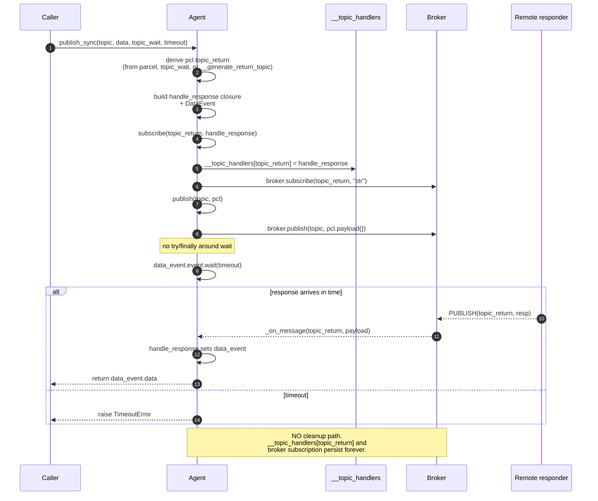

# RFC-001 — publish_sync subscription lifecycle

- **Status**: Draft
- **Author**: Audit follow-up
- **Depends on**: `docs/audit/05-risk-register.md` R-02
- **Scope**: only the cleanup of return-topic subscription and handler for `Agent.publish_sync`
- **Explicitly out of scope**: Parcel format changes, pickle security (R-01), version migration (R-19), message metadata (R-20), correlation ID as a message field, ProcessWorker architecture (R-06/R-08), broker reconnect (R-03)

---

## 1. Problem statement

`Agent.publish_sync` (`src/agentflow/core/agent.py:321-349`) registers a per-call response handler in `Agent.__topic_handlers` and issues a per-call subscribe to the broker's return topic. Neither is ever released.

- On success: handler entry stays, broker subscription stays.
- On timeout: handler entry stays, broker subscription stays.
- On broker `publish` failure: subscribe already happened before publish; handler and subscription stay.
- On late/duplicate response: the leaked handler is still invoked, mutating a `DataEvent` whose owner has already returned.

Consequences:
- Unbounded growth of `__topic_handlers` for any long-running agent that uses `publish_sync`.
- Unbounded growth of the broker's per-client subscription table.
- Late/duplicate responses run handler side-effects the caller can no longer observe.

This RFC proposes the smallest, safest, backward-compatible change that stops the leak and defines the intended cleanup contract for success, timeout, publish failure, exception, and late-response paths.

---

## 2. Runtime evidence

Confirmed by the characterization suite added in the previous phase.

File: `tests/unit/core/test_agent_publish_sync.py`.
Regression baseline: **58 passed, 4 strict xfailed in 2.04 s**.

| Behaviour | Test | Result |
|---|---|---|
| `__topic_handlers` grows +1 per success | `test_topic_handlers_grows_by_one_per_successful_publish_sync` | PASSED (pins leak) |
| `__topic_handlers` grows +1 per timeout | `test_topic_handlers_grows_by_one_per_timed_out_publish_sync` | PASSED (pins leak) |
| `broker.subscribe_calls` grows +1 per success; no unsubscribe | `test_broker_subscribe_calls_grow_by_one_per_successful_publish_sync` | PASSED (pins leak) |
| `broker.subscribe_calls` grows +1 per timeout; no unsubscribe | `test_broker_subscribe_calls_grow_by_one_per_timed_out_publish_sync` | PASSED (pins leak) |
| Handlers should be cleaned after success | `test_topic_handlers_should_be_cleaned_after_successful_publish_sync` | **XFAIL (strict)** |
| Handlers should be cleaned after timeout | `test_topic_handlers_should_be_cleaned_after_timed_out_publish_sync` | **XFAIL (strict)** |
| Broker should be unsubscribed after success | `test_broker_should_unsubscribe_after_successful_publish_sync` | **XFAIL (strict)** |
| Broker should be unsubscribed after timeout | `test_broker_should_unsubscribe_after_timed_out_publish_sync` | **XFAIL (strict)** |
| Late response after timeout invokes leaked handler | `test_late_response_after_timeout_still_dispatches_to_leaked_handler` | PASSED (pins leak) |
| Duplicate response after success invokes leaked handler | `test_publish_sync_returns_first_response_and_duplicate_still_dispatches` | PASSED (pins leak) |
| Subscribe still happens when publish raises | `test_publish_sync_subscribes_return_topic_even_when_publish_raises` | PASSED (pins leak) |

These form the acceptance-check set for §13.

---

## 3. Current sequence

Source: `src/agentflow/core/agent.py:321-349`, `src/agentflow/core/agent.py:353-364` (`Agent.subscribe`).



Post-condition (both branches):
- `topic_return in agent._Agent__topic_handlers` → True
- `broker.subscribe_calls` count +1
- `broker.unsubscribe_calls` empty (no such API exists)

---

## 4. Desired sequence

```mermaid
sequenceDiagram
    autonumber
    participant C as Caller
    participant A as Agent
    participant H as __topic_handlers
    participant B as Broker

    C->>A: publish_sync(topic, data, topic_wait, timeout)
    A->>A: derive pcl.topic_return
    A->>A: build handle_response closure<br/>+ DataEvent
    A->>A: subscribe(topic_return, handle_response)
    A->>H: __topic_handlers[topic_return] = handle_response
    A->>B: broker.subscribe(topic_return, "str")

    rect rgba(220, 245, 220, 0.5)
        Note over A: try:
        A->>A: publish(topic, pcl)
        A->>A: data_event.event.wait(timeout)
        alt success
            A-->>C: return data_event.data
        else timeout
            A-->>C: raise TimeoutError
        end
    end

    rect rgba(255, 235, 220, 0.7)
        Note over A: finally: (always runs)
        A->>A: if handlers[topic_return] is handle_response:<br/>&nbsp;&nbsp; pop from __topic_handlers
        A->>B: broker.unsubscribe(topic_return)
    end
```

Post-condition (both success and timeout, and publish-raise path):
- `topic_return not in agent._Agent__topic_handlers`
- `len(broker.unsubscribe_calls)` grew by 1

Late/duplicate response arriving after cleanup:
- Broker in-flight message may still hit `Agent._on_message` (paho UNSUBSCRIBE is asynchronous).
- Handler lookup falls through to default `Agent.on_message` (no-op by default).
- No mutation on stale `DataEvent` because `handle_response` is unreachable.

---

## 5. Options considered

### Option A — Cleanup `__topic_handlers` only; leave broker subscription

**Sketch** (in `publish_sync`):

```python
self.subscribe(pcl.topic_return, topic_handler=handle_response)
try:
    self.publish(topic, pcl)
    if data_event.event.wait(timeout):
        return data_event.data
    raise TimeoutError(...)
finally:
    self.__topic_handlers.pop(pcl.topic_return, None)
```

| Aspect | Analysis |
|---|---|
| Public API | Unchanged. Zero new methods. |
| MessageBroker contract | Unchanged. |
| Broker-side subscription table | **Still leaks.** Broker keeps `topic_return` subscribed until connection drops. Under many `publish_sync` calls, broker's per-client subscription table grows without bound. |
| Handler leak | Fixed. |
| Late response after cleanup | Still delivered from broker → hits `Agent._on_message` → falls back to `self.on_message` (no-op default). Safe in-agent. |
| Backward compat risk | Nil. |
| Migration cost | 1 file (`agent.py`), 4 lines. |

**Verdict**: Partial fix. Removes the in-memory Python leak but not the network-level leak. Rejected as the primary recommendation but acceptable as a first step if broker-side change is deferred.

---

### Option B — Add `MessageBroker.unsubscribe`; clean both handler and broker subscription (**RECOMMENDED**)

**Sketch** (`MessageBroker`):

```python
class MessageBroker(ABC):
    ...
    def unsubscribe(self, topic: str) -> None:
        """Release a prior subscription. Default no-op so existing
        subclasses remain valid; concrete brokers should override."""
        return None
```

**Sketch** (`Agent`):

```python
# Agent.unsubscribe: symmetric public method to Agent.subscribe.
@final
def unsubscribe(self, topic: str) -> None:
    self.__topic_handlers.pop(topic, None)
    if self._broker:
        self._broker.unsubscribe(topic)

# publish_sync: wrap wait/return in try/finally
self.subscribe(pcl.topic_return, topic_handler=handle_response)
try:
    self.publish(topic, pcl)
    if data_event.event.wait(timeout):
        return data_event.data
    raise TimeoutError(...)
finally:
    # Identity guard against concurrent-collision (see §10).
    if self.__topic_handlers.get(pcl.topic_return) is handle_response:
        self.unsubscribe(pcl.topic_return)
```

**Sketch** (`MqttBroker`):

```python
def unsubscribe(self, topic: str):
    return self._client.unsubscribe(topic)
```

| Aspect | Analysis |
|---|---|
| Public API | `Agent.unsubscribe(topic)` (new, symmetric to `subscribe`). `MessageBroker.unsubscribe` (new, default no-op). |
| MessageBroker contract | Extended by one **non-abstract** method with default no-op. Existing subclasses (including hypothetical third-party) continue to work. |
| Handler leak | Fixed. |
| Broker-side subscription | Fixed for MQTT. Stub brokers (Redis/ROS/Empty) get a documented no-op — acceptable because they are stubs. |
| Late response after cleanup | Handler entry gone; broker may still deliver in-flight message → falls to `on_message` default. Safe. |
| Backward compat risk | Very low. Default no-op preserves callability. Users overriding `MessageBroker` are unaffected until they choose to implement `unsubscribe`. |
| Migration cost | 5 files (`agent.py`, `message_broker.py`, `mqtt_broker.py`; optionally `empty_broker.py`, `redis_broker.py`, `ros_broker.py`, `dds_broker.py` for consistency). Under 25 lines total. |

**Verdict**: Recommended. Smallest change that fixes both leaks with zero forced downstream migration.

---

### Option C — Fixed shared response topic + correlation mapping

**Sketch**:

- Agent subscribes to one long-lived topic per lifetime, e.g. `_ret/{agent_id}` at activation.
- Every `publish_sync` places a per-call token in the request parcel (piggy-backed on `topic_return` as `_ret/{agent_id}/{token}`, or in a new metadata field).
- Agent keeps `pending: dict[token, DataEvent]`. `_on_message` for `_ret/{agent_id}/*` dispatches by token.
- Cleanup = `pending.pop(token)` on success/timeout.

| Aspect | Analysis |
|---|---|
| Public API | Same signature but semantic change: `topic_return` values become internal. Callers passing pre-set `topic_return` (test 15 characterizes this behaviour) get their intent silently ignored or need a new opt-out. |
| MessageBroker contract | No new method (nice), but broker must handle wildcard subscription (`_ret/{agent_id}/#` under MQTT). Requires MQTT semantics that are not part of MessageBroker ABC today. |
| Correlation mapping | Requires a token field. Two placement options: (i) hijack `topic_return` string (fragile, collides with existing pre-set semantics tested in `test_publish_sync_preserves_existing_topic_return_on_parcel`); (ii) add a new Parcel metadata field — **out of scope per this RFC**. |
| Handler leak | Solved differently: `pending` dict replaces `__topic_handlers` for sync requests. `__topic_handlers` still exists for regular `subscribe` and remains unchanged. |
| Broker-side subscription | Single subscription per agent lifetime instead of one per request. **Best runtime scalability** but at the cost of contract change. |
| Late/duplicate response | Delivered to the shared handler → token lookup fails → drop. Cleaner semantics. |
| Backward compat risk | **High.** Changes observable topic naming pattern (return topics no longer look like `{tag}-{rand}/{topic}`; tests 13-15 all need updating). Changes behaviour for callers passing pre-set `topic_return`. |
| Migration cost | Larger: introduces new pending-dispatch code path, wildcard-subscription lifecycle, and correlation-token concept. Overlaps with the deliberately-excluded correlation ID discussion. |

**Verdict**: Architecturally cleanest and highest scalability, but strictly outside this RFC's minimal-change scope. Deferred to a future RFC once correlation ID (R-20) and message metadata are on the roadmap.

---

### Comparison summary

| Criterion | A | B | C |
|---|---|---|---|
| Fixes handler leak | ✓ | ✓ | ✓ (different structure) |
| Fixes broker subscription leak | ✗ | ✓ | ✓ |
| Requires new MessageBroker method | ✗ | ✓ (default no-op) | ✗ |
| Requires wildcard subscription | ✗ | ✗ | ✓ |
| Breaks pre-set `topic_return` semantics | ✗ | ✗ | ✓ (tests 15 fail) |
| Depends on out-of-scope RFCs | ✗ | ✗ | ✓ (needs correlation ID) |
| Lines changed | ~4 | ~25 | ~150+ |
| Backward compat | ✓ | ✓ | ✗ |
| Recommendation | Fallback | **Chosen** | Deferred |

---

## 6. Recommended minimal design

Adopt **Option B** with the following concrete surface.

### 6.1 `MessageBroker` (`src/agentflow/broker/message_broker.py`)

Add one method, **non-abstract**, default no-op:

```python
def unsubscribe(self, topic: str) -> None:
    """Release a subscription previously registered via subscribe().
    Default implementation is a no-op so that pre-existing broker
    subclasses remain valid. Concrete brokers with a real network
    subscription table should override."""
    return None
```

Contract:
- Idempotent: calling twice on the same topic must not raise.
- Unknown topic: must not raise; may log at debug level.
- Return value: reserved for future use; callers must not depend on it.

### 6.2 `MqttBroker` (`src/agentflow/broker/mqtt_broker.py`)

Override:

```python
def unsubscribe(self, topic: str):
    return self._client.unsubscribe(topic)
```

Notes:
- paho `client.unsubscribe` is asynchronous; it returns `MessageInfo`, which we discard (consistent with existing `publish` / `subscribe` in this file). Observability improvements are out of scope (R-13).
- No need to change `_on_disconnect` here; reconnect handling is R-03, out of scope.

### 6.3 `EmptyBroker` / `RedisBroker` / `RosBroker` / `DdsBroker`

Do not override. The default no-op is correct semantics for these stub/broken brokers. This RFC does not attempt to complete them.

### 6.4 `Agent.unsubscribe` (`src/agentflow/core/agent.py`)

Add new public, `@final` method symmetric to `Agent.subscribe` (`agent.py:353-364`):

```python
@final
def unsubscribe(self, topic: str) -> None:
    """Reverse a prior subscribe(topic, topic_handler=...) call.
    Removes the topic from __topic_handlers (if present) and asks the
    broker to unsubscribe. Idempotent."""
    self.__topic_handlers.pop(topic, None)
    if self._broker:
        self._broker.unsubscribe(topic)
```

### 6.5 `Agent.publish_sync` (`src/agentflow/core/agent.py:321-349`)

Wrap the publish-and-wait region in `try/finally`. Use an identity guard so that a concurrent `subscribe` on the same `topic_return` (a pre-existing race, see §10) does not accidentally evict another caller's handler.

```python
self.subscribe(pcl.topic_return, topic_handler=handle_response)
try:
    self.publish(topic, pcl)
    if data_event.event.wait(timeout):
        return data_event.data
    raise TimeoutError(
        f"No response received within timeout period for topic: {pcl.topic_return}."
    )
finally:
    if self.__topic_handlers.get(pcl.topic_return) is handle_response:
        self.unsubscribe(pcl.topic_return)
```

Total prod code delta ≈ 25 lines across 3 files (plus optional documentation).

---

## 7. Public API impact

| Symbol | Before | After | Compatibility |
|---|---|---|---|
| `Agent.publish_sync(topic, data, topic_wait, timeout)` | Same signature | Same signature | **Compatible.** Behaviour change: cleans up on exit; late responses no longer invoke the caller's handler. |
| `Agent.subscribe(topic, data_type, topic_handler)` | — | — | Untouched. |
| `Agent.unsubscribe(topic)` | Not defined | New `@final` public method | **Additive.** No existing caller can conflict. |
| `MessageBroker.unsubscribe(topic)` | Not defined | New non-abstract method with default no-op | **Additive & non-breaking.** Existing subclasses continue to work without changes. |
| `MqttBroker.unsubscribe(topic)` | Not defined | Overrides base | Additive. |
| `Parcel` / `TextParcel` / `BinaryParcel` | — | — | **Untouched.** No schema change. |
| Message wire format | — | — | **Untouched.** |
| Topic naming rules | — | — | Untouched. Return topic still `{tag}-{10 alnum}/{topic}`. |

Nothing in `unit_test/` or `exe_test/` calls `MessageBroker.unsubscribe`; the new method surface cannot break the legacy suites.

---

## 8. Broker implementation impact

| Broker file | Change | Rationale |
|---|---|---|
| `broker/message_broker.py` | Add default `unsubscribe` (no-op) | Extension point; keeps all existing subclasses valid |
| `broker/mqtt_broker.py` | Override `unsubscribe` → `self._client.unsubscribe(topic)` | Only broker that has a real subscription table today |
| `broker/empty_broker.py` | No change | Default no-op is correct |
| `broker/redis_broker.py` | No change | Stub; symmetry with existing stubbed `subscribe` |
| `broker/ros_broker.py` | No change | Stub |
| `broker/dds_broker.py` | No change | Already broken (see R-22); outside scope |
| `broker/ros_noetic_broker.py` | No change | Not registered in factory |
| `broker/broker_maker.py` | No change | Factory unaffected |

No new imports required. No paho version bump (paho-mqtt 2.1.0 already ships `Client.unsubscribe`).

---

## 9. Backward compatibility

**Source compatibility**:
- All existing call sites of `Agent.publish`, `Agent.subscribe`, `Agent.publish_sync` continue to compile and behave the same on the success and timeout paths (return value and exception unchanged).
- Third-party `MessageBroker` subclasses need no changes; the default no-op preserves their runtime.

**Behavioural compatibility**:
- Callers relying on the CURRENT leaky behaviour (i.e. registering a handler via `publish_sync` and expecting a late/duplicate response to still fire it) will observe a semantic change.
  - No such call site exists in the codebase (grep-verified: no user code depends on the closure side-effect of `handle_response`).
  - The existing MQTT server may still deliver in-flight messages before its UNSUBSCRIBE takes effect; those are then routed to `Agent.on_message` default no-op, which is compatible with prior no-op behaviour of the default `on_message`.

**Wire compatibility**:
- No schema change, no metadata change, no topic naming change.
- MQTT clients on the other end are unaware that the requester unsubscribed sooner; requesters that never publish to a torn-down return topic see no wire difference.

---

## 10. Race conditions

### R.1 — Response between `event.set()` and `finally` cleanup
- Sequence: response arrives → handle_response sets event → wait returns True → return statement queues → finally runs → unsubscribe.
- No hazard. The response is fully processed before cleanup starts.

### R.2 — Response arrives after timeout but before `finally` runs
- Sequence: wait returns False → raise TimeoutError → finally runs cleanup → handle_response also fires on the same thread the broker uses.
- With Python GIL: whichever runs first, the outcome is deterministic per-thread. If handler runs before cleanup, `data_event.data` is set but caller has already raised. If cleanup runs first, handler falls through to `on_message` default.
- Result in both orders: no observable side effect on caller.

### R.3 — Broker delivers in-flight messages after `unsubscribe`
- paho `client.unsubscribe(topic)` is asynchronous. Broker may still deliver messages already queued.
- After cleanup, `__topic_handlers[topic_return]` is gone → falls back to `self.on_message` (no-op by default). Safe.
- Users overriding `on_message` should already be prepared for topics they didn't explicitly bind (see `Agent.subscribe(topic, data_type)` without `topic_handler` — same fall-through).

### R.4 — Concurrent `publish_sync` calls using the same `topic_wait`
- **Pre-existing race** (not introduced by this RFC): `Agent.subscribe` warns and overwrites when the same topic is already registered (`agent.py:360-362`).
- Under current code, caller 1 loses its handler when caller 2 subscribes → caller 1 times out.
- Under Option B: same effect, PLUS a naive `finally: unsubscribe(topic_return)` would evict caller 2's handler and abort caller 2 as well.
- **Mitigation in Option B**: identity guard in `finally` — only pop if the handler currently in the dict is still `handle_response`. Documented in §6.5.
- This is not a full fix for R.4 (concurrent same-topic still confuses caller 1); it just prevents Option B from making R.4 worse. R.4 is a separate issue that should be addressed by a future RFC (documented in §12 rollback context).

### R.5 — Concurrent `publish_sync` calls to distinct auto-generated `topic_return`
- `Agent.__generate_return_topic` produces `{tag}-{10 base-36 alnum}/{topic}` → ~40 bits of entropy.
- Collision probability across N concurrent calls is O(N² / 2^40); at N=1000 it is ~4.5 × 10⁻⁷. Treated as effectively zero; no change needed.

### R.6 — Cleanup interleaves with a concurrent `Agent.subscribe` on the same topic
- If a user thread calls `agent.subscribe(topic_return, custom_handler)` while a `publish_sync` finally is executing, the identity check protects the user's handler (they installed a different function reference).
- Their subscription persists after publish_sync cleanup. Correct.

---

## 11. Test migration plan

**Existing tests that will need to flip** (currently pin the leak):

| Test | File | Current | After fix |
|---|---|---|---|
| `test_topic_handlers_grows_by_one_per_successful_publish_sync` | `tests/unit/core/test_agent_publish_sync.py` | PASSED (asserts +N) | Must change: assert `len(handlers) == before` |
| `test_topic_handlers_grows_by_one_per_timed_out_publish_sync` | same | PASSED (asserts +N) | Must change: assert `== before` |
| `test_broker_subscribe_calls_grow_by_one_per_successful_publish_sync` | same | PASSED (asserts +N, unsubscribe=0) | Must change: assert `len(subscribe_calls) - before == N` **and** `len(unsubscribe_calls) - before == N` |
| `test_broker_subscribe_calls_grow_by_one_per_timed_out_publish_sync` | same | PASSED (asserts +N, unsubscribe=0) | Must change: as above |

**Existing xfails that will flip to XPASS** (and must lose `@pytest.mark.xfail`):

- `test_topic_handlers_should_be_cleaned_after_successful_publish_sync`
- `test_topic_handlers_should_be_cleaned_after_timed_out_publish_sync`
- `test_broker_should_unsubscribe_after_successful_publish_sync`
- `test_broker_should_unsubscribe_after_timed_out_publish_sync`

Because they are `strict=True`, if the fix lands without removing the marker, pytest fails with `XPASS(strict)`. This is the intended forcing-function signal.

**New tests to add in the same PR as the fix**:

| Test | Purpose |
|---|---|
| `test_late_response_after_cleanup_does_NOT_invoke_prior_handler` | Wrap-and-spy the intended handler, then trigger late deliver; assert spy is **not** called (fall-through to `on_message`) |
| `test_duplicate_response_after_cleanup_does_NOT_invoke_prior_handler` | Same shape as above but for the success path |
| `test_publish_sync_unsubscribes_when_publish_raises` | After R-13 forcing, verify cleanup still runs |
| `test_publish_sync_unsubscribes_when_handler_raises_are_absent` | Guard: the try/finally must run finally exactly once |
| `test_concurrent_publish_sync_with_distinct_topic_wait_all_clean_up` | Small N=5 threads; verify final `len(handlers) == baseline` |
| `test_publish_sync_identity_guard_preserves_foreign_handler_on_topic` | Register a user handler on same topic AFTER publish_sync's subscribe but BEFORE finally; assert finally does not evict user handler |

**Legacy tests** (`unit_test/*.py`): out of scope (already quarantined via `pyproject.toml` `norecursedirs`). No action required.

**FakeBroker update**: Option B introduces `Broker.unsubscribe`. Update `tests/fakes/fake_broker.py` to implement:

```python
def unsubscribe(self, topic: str) -> None:
    self.unsubscribe_calls.append(topic)
```

The existing `unsubscribe_calls: list[str]` attribute already exists (added as a witness in the previous phase) — the change is one line.

---

## 12. Rollback plan

**Preconditions**: fix lands as a single PR that:
1. Adds `MessageBroker.unsubscribe` default no-op.
2. Adds `MqttBroker.unsubscribe`.
3. Adds `Agent.unsubscribe`.
4. Wraps `publish_sync` in `try/finally` with identity guard.
5. Updates 4 pin tests and removes 4 xfail markers; adds ~6 new tests.
6. Updates `tests/fakes/fake_broker.py` to record `unsubscribe`.

**Rollback trigger**: if post-merge we observe any of:
- Broker deliveries missing on legitimate topics (indicates the identity guard or timing broke an unrelated path).
- User `on_message` handlers receiving unexpected traffic that used to be captured by `handle_response` (contradicts §9's assumption).
- Broker-side errors from paho on `unsubscribe` calls.

**Rollback procedure**: single `git revert` of the merge commit. Because:
- No wire schema change → no on-the-wire state to reconcile.
- No `Parcel` field change → no serialized payload version to migrate.
- The added `MessageBroker.unsubscribe` and `Agent.unsubscribe` are additive; removing them is safe (no external caller can have adopted them yet in the rollback window).
- The 4 pin tests will revert to asserting the leak; the 4 xfails will re-appear; new tests will disappear with the revert.

**Not rollback-safe**: any change made in the same PR to Parcel format, factory, or broker signatures. This RFC explicitly forbids bundling such changes.

---

## 13. Acceptance criteria

Before this RFC's implementation PR can merge:

1. `pytest tests/unit -v` reports **62 passed, 0 xfailed, 0 xpassed, 0 failed** (compared to current 58 passed + 4 xfailed).
   - 4 pin tests updated to assert `== baseline` (handlers) and `len(unsubscribe_calls) - baseline == N`.
   - 4 xfail markers removed.
   - ≥ 6 new tests from §11 added, all passing.
2. FakeBroker's `unsubscribe_calls` grows exactly once per `publish_sync` (success or timeout or publish-raise).
3. `__topic_handlers` size after any characterization test run equals its pre-test baseline.
4. Total test time stays under 3 seconds (current 2.04 s + ~6 short tests).
5. No changes to:
   - `src/agentflow/core/parcel.py`
   - `Parcel.HEAD`, `TextParcel.HEAD`, `BinaryParcel.HEAD`
   - `Agent.publish` / `Agent.subscribe` signatures
   - Topic naming rules
   - Wire schema
6. `MessageBroker.unsubscribe` default no-op is exercised by at least one test (an EmptyBroker path).
7. `MqttBroker.unsubscribe` is covered by a `tests/unit/test_mqtt_broker_lifecycle.py` addition asserting delegation to `client.unsubscribe(topic)`.
8. New RFC-referenced test names appear verbatim in the PR description for traceability.
9. This RFC file has status changed from `Draft` to `Accepted` in the same PR.

Out of scope (explicitly deferred to future RFCs):
- Introduction of correlation ID or message metadata → future RFC.
- MQTT reconnect and re-subscription semantics (R-03) → future RFC.
- Fixing R-04 (unbounded per-message threads) → future RFC.
- Concurrent-same-topic-wait race (§R.4) → future RFC.
- Broker-return-value observability (R-13) → future RFC.

---

## Appendix A — Code diff sketch (illustrative, not the implementation)

```diff
--- a/src/agentflow/broker/message_broker.py
+++ b/src/agentflow/broker/message_broker.py
@@
     @abstractmethod
     def subscribe(self, topic:str, data_type):
         """Subscribe the topic."""
+
+    def unsubscribe(self, topic: str) -> None:
+        """Release a prior subscription. Default no-op.
+        Concrete brokers with a real subscription table should override."""
+        return None
```

```diff
--- a/src/agentflow/broker/mqtt_broker.py
+++ b/src/agentflow/broker/mqtt_broker.py
@@
     def subscribe(self, topic: str, data_type):
         return self._client.subscribe(topic=topic)
+
+    def unsubscribe(self, topic: str):
+        return self._client.unsubscribe(topic)
```

```diff
--- a/src/agentflow/core/agent.py
+++ b/src/agentflow/core/agent.py
@@ publish_sync
     self.subscribe(pcl.topic_return, topic_handler=handle_response)
-    self.publish(topic, pcl)
-
-    if data_event.event.wait(timeout):
-        return data_event.data
-    else:
-        raise TimeoutError(
-            f"No response received within timeout period for topic: {pcl.topic_return}."
-        )
+    try:
+        self.publish(topic, pcl)
+        if data_event.event.wait(timeout):
+            return data_event.data
+        raise TimeoutError(
+            f"No response received within timeout period for topic: {pcl.topic_return}."
+        )
+    finally:
+        if self.__topic_handlers.get(pcl.topic_return) is handle_response:
+            self.unsubscribe(pcl.topic_return)
@@ subscribe
     @final
     def subscribe(self, topic, data_type:str="str", topic_handler=None):
         ...
+
+    @final
+    def unsubscribe(self, topic: str) -> None:
+        self.__topic_handlers.pop(topic, None)
+        if self._broker:
+            self._broker.unsubscribe(topic)
```

Line count: ~25 lines net addition across 3 files. Zero deletions from wire schema or public data.
