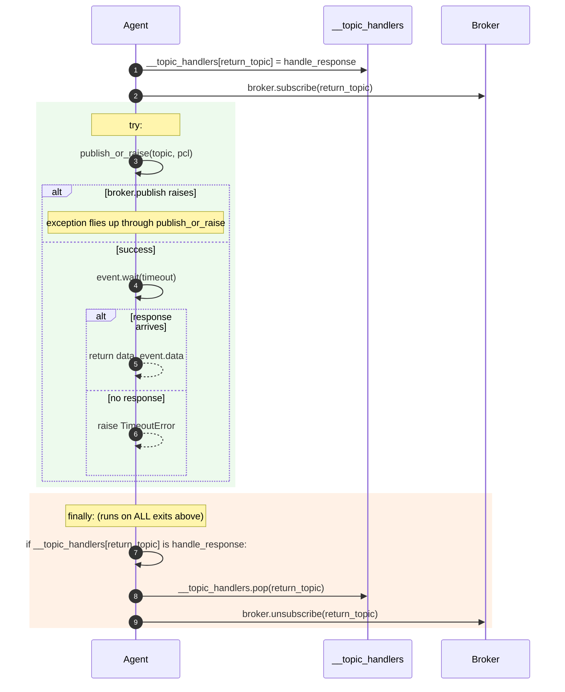

# RFC-002 — publish error propagation

- **Status**: **Implemented (2026-07-26)**
- **Author**: Audit follow-up
- **Depends on**: `docs/audit/05-risk-register.md` R-13; builds on [RFC-001](RFC-001-publish-sync-subscription-lifecycle.md)
- **Scope**: only the error contract between `Agent.publish` / `publish_sync` and its callers when the broker layer fails
- **Explicitly out of scope**: Parcel format, Message Schema, pickle (R-01), broker reconnect (R-03), retry policy, ProcessWorker architecture (R-06/R-08), logging framework, full `Result[T, E]` type migration
- **Implementation summary** (2026-07-26):
  - The recommended design in §6 landed with one minor variant: the strict method was named `_publish_or_raise` (single leading underscore, internal by convention) rather than the public `publish_or_raise` originally recommended in §6.1. Rationale: keep the public surface minimal while providing the raise-on-failure escape hatch for internal callers and (via Python's non-enforced privacy) any advanced user who explicitly opts in.
  - `Agent.publish` was refactored to delegate to `_publish_or_raise` inside its existing `try/except Exception: logger.exception(...)`. Fire-and-forget contract preserved.
  - `Agent.publish_sync` now uses `_publish_or_raise` on the publish step; the RFC-001 `try/finally` cleanup is unchanged.
  - Test surface: `tests/unit/core/test_agent_publish_errors.py` (46 tests), plus 3 R-02 crossover tests in `tests/unit/core/test_agent_publish_sync.py` updated to reflect the new exception type on the publish-failure path.
  - Full unit regression: `PYTHONPATH=src python -m pytest tests/unit` → **114 passed, 0 failed, 0 xfailed, 0 xpassed** in 1.82 s.
  - See [R-13 resolution block](../audit/05-risk-register.md#r-13--publish-result-is-discarded-at-every-layer).

---

## 1. Problem statement

`Agent.publish` (`src/agentflow/core/agent.py:305-314`) catches every `Exception` from the broker and only logs. Because `publish_sync` calls `Agent.publish` and waits for a response event, a publish failure is invisible to the caller until the full `timeout` elapses, at which point a plain `TimeoutError` is raised whose message and exception chain both omit the root cause.

Consequences:

- Callers cannot tell success from failure by return value alone.
- Callers wait the entire configured timeout even when the broker rejected the message immediately.
- Post-mortem debugging requires reading logs; the exception itself is a decoy.
- Every failure mode (`ConnectionError`, `TimeoutError`, `RuntimeError`, `OSError`, missing broker) is normalized to the same generic `TimeoutError` with the same message shape.

This RFC proposes the smallest, safest, backward-compatible change that lets `publish_sync` fail fast while preserving the original exception, and offers a public escape hatch to callers who need the same guarantee for one-shot publishes.

---

## 2. Runtime evidence

From `tests/unit/core/test_agent_publish_errors.py` (added in the R-13 characterization phase).
Regression baseline: **102 passed, 3 strict xfailed in 3.69 s**.

| Behaviour | Test | Result |
|---|---|---|
| `Agent.publish` returns `None` on success | `test_publish_returns_none_on_success` | PASSED |
| `Agent.publish` returns `None` on broker exception (4 types) | `test_publish_swallows_broker_exception_and_returns_none[exc*]` | PASSED × 4 |
| `Agent.publish` never re-raises broker exception (4 types) | `test_publish_never_reraises_broker_exception[exc*]` | PASSED × 4 |
| `Agent.publish` still propagates `BaseException` subclasses | `test_publish_does_not_catch_BaseException_subclasses` | PASSED |
| `Agent.publish` returns `None` with broker=None | `test_publish_returns_none_when_broker_is_none` | PASSED |
| `publish_sync` masks broker exception as `TimeoutError` (4 types) | `test_publish_sync_masks_broker_exception_as_TimeoutError[exc*]` | PASSED × 4 |
| `publish_sync` waits full timeout on publish failure | `test_publish_sync_waits_full_timeout_when_broker_publish_raises` | PASSED |
| `publish_sync` TimeoutError has no cause chain | `test_publish_sync_TimeoutError_has_no_cause_chain_from_broker_exception` | PASSED |
| `publish_sync` TimeoutError message hides root cause | `test_publish_sync_error_message_does_not_reveal_root_cause` | PASSED |
| R-02 cleanup runs on publish-exception path | `test_publish_sync_cleans_up_handler_when_broker_publish_raises`, `test_publish_sync_calls_broker_unsubscribe_when_broker_publish_raises` | PASSED × 2 |
| Aspirational: `publish_sync` should fail fast | `test_publish_sync_should_fail_fast_when_broker_publish_raises` | **XFAIL (strict)** |
| Aspirational: `publish_sync` should expose broker exception | `test_publish_sync_should_expose_broker_exception_to_caller` | **XFAIL (strict)** |
| Aspirational: publish return value should distinguish success/failure | `test_publish_return_value_should_differ_between_success_and_failure` | **XFAIL (strict)** |

The 3 strict xfails form the acceptance-check set for §11.

---

## 3. Current behavior

Source: `src/agentflow/core/agent.py:305-314` and `agent.py:321-353`.

```mermaid
sequenceDiagram
    autonumber
    participant C as Caller
    participant A as Agent
    participant B as Broker
    C->>A: publish_sync(topic, data, timeout=30)
    A->>A: build parcel + subscribe(return_topic)
    A->>A: publish(topic, pcl)
    A->>B: broker.publish(topic, payload)
    B-->>A: raise RuntimeError('broker down')
    Note over A: Agent.publish (agent.py:311-313)<br/>except Exception → logger.exception(ex)<br/>function returns None
    A->>A: data_event.event.wait(30)
    Note over A: no response comes; blocks the full timeout
    A-->>A: raise TimeoutError(f"...topic: {return_topic}.")
    Note over A: __cause__ = None, __context__ = None
    A-->>C: TimeoutError (no chain, no reference to broker down)
```

Concretely:

- `Agent.publish` return value: `None` on success, on broker exception (any `Exception` subclass), and on `_broker is None`. Only `BaseException` subclasses propagate.
- `publish_sync` timing: elapsed ≈ `timeout` seconds regardless of whether publish succeeded or failed immediately.
- `publish_sync` exception type: always `TimeoutError` when no response arrives, whatever the reason.
- `publish_sync` exception message: `f"No response received within timeout period for topic: {pcl.topic_return}."` — never mentions publish failure.
- `TimeoutError.__cause__` and `__context__`: both `None`.

---

## 4. Desired behavior

```mermaid
sequenceDiagram
    autonumber
    participant C as Caller
    participant A as Agent
    participant B as Broker
    C->>A: publish_sync(topic, data, timeout=30)
    A->>A: build parcel + subscribe(return_topic)
    A->>A: publish_or_raise(topic, pcl)
    A->>B: broker.publish(topic, payload)
    B-->>A: raise ConnectionError('reset')
    Note over A: publish_or_raise does NOT swallow;<br/>exception propagates up
    rect rgba(255, 235, 220, 0.7)
      Note over A: finally: cleanup runs (RFC-001)<br/>__topic_handlers.pop + broker.unsubscribe
    end
    A-->>C: raise ConnectionError('reset')<br/>(the original object; fast fail)

    C->>A: publish_sync(topic, data, timeout=0.5)
    A->>A: build parcel + subscribe(return_topic)
    A->>A: publish_or_raise(topic, pcl)
    A->>B: broker.publish(topic, payload)
    B-->>A: OK (no exception)
    A->>A: data_event.event.wait(0.5)
    alt no response
      A-->>A: raise TimeoutError("...topic: ret_x.")
      Note over A: message and semantics unchanged<br/>for the true-timeout case
    end
    A-->>C: TimeoutError or response
```

Concretely:

- `publish_sync` returns as fast as the broker's `publish` fails (typically milliseconds).
- The exception surfaced to the caller is the **original** exception object from the broker (not a wrapped or normalized one).
- `TimeoutError` remains the exception type **only** for the true-timeout case (broker accepted the message but no response arrived within the deadline).
- `Agent.publish`'s fire-and-forget contract is **not changed**; existing callers see no behavioural difference.
- Callers who want the raise-on-failure behaviour for one-shot publishes have a discoverable public API to opt in.
- R-02 cleanup (`__topic_handlers` pop + `broker.unsubscribe`) runs on every exit path, including the new fast-fail exception path.

---

## 5. Options considered

### Option A — `Agent.publish` re-raises the broker exception

Sketch:
```python
def publish(self, topic, data=None):
    pcl = data if isinstance(data, Parcel) else Parcel.from_content(data)
    if self._broker:
        self._broker.publish(topic, pcl.payload())
    else:
        raise RuntimeError("Cannot publish: no broker attached")
```

| Aspect | Analysis |
|---|---|
| Backward compat | **Breaking.** Every existing fire-and-forget caller that ignored the return value and had no try/except now crashes on the first broker hiccup. Includes user callers we cannot enumerate. |
| Preserves original | ✓ |
| Fast fail in `publish_sync` | ✓ (once `publish_sync` stops catching either) |
| R-02 cleanup | ✓ if `publish_sync`'s finally block is preserved |
| Signature | Unchanged |
| Change surface | 1 file, ~5 lines net |

Verdict: rejected on backward compat.

---

### Option B — `Agent.publish` returns `bool`

Sketch:
```python
def publish(self, topic, data=None) -> bool:
    pcl = data if isinstance(data, Parcel) else Parcel.from_content(data)
    try:
        if self._broker:
            self._broker.publish(topic, pcl.payload())
            return True
        logger.error("Cannot publish: _broker is None.")
        return False
    except Exception as ex:
        logger.exception(ex)
        return False
```

| Aspect | Analysis |
|---|---|
| Backward compat | **Mostly compatible.** Existing callers that ignored the return value still work. Return-type widening is not strictly compatible for typed downstreams, but there are none in this repo. |
| Preserves original | **No.** The broker exception is lost; only a bool remains. Would need a companion `.get_last_publish_error()` or similar — starts to bloat. |
| Fast fail in `publish_sync` | ✓ if `publish_sync` checks the bool |
| R-02 cleanup | ✓ |
| Signature | Return type changed |
| Change surface | 1 file, ~6 lines net |

Verdict: rejected because it fails the "preserve original" priority.

---

### Option C — Add a new strict publish method; keep `Agent.publish` as-is (**RECOMMENDED**)

Sketch:
```python
@final
def publish_or_raise(self, topic, data=None) -> None:
    """Publish `data` on `topic`. Unlike `Agent.publish`, propagates
    every broker exception to the caller and raises RuntimeError if
    no broker is attached. Intended for callers that require
    confirmation that the send was at least attempted."""
    pcl = data if isinstance(data, Parcel) else Parcel.from_content(data)
    if self._broker is None:
        raise RuntimeError("Cannot publish: no broker attached")
    self._broker.publish(topic, pcl.payload())
```

`publish_sync` switches its one publish call to `publish_or_raise`; broker exceptions then flow up through the existing `try/finally` (which already cleans up per RFC-001) and reach the caller directly.

| Aspect | Analysis |
|---|---|
| Backward compat | **Fully compatible for `Agent.publish`.** New method is additive; adds no obligation on subclasses (Agent is not usefully subclassed for publish anyway; the method is `@final`). |
| Preserves original | ✓ (raised object is the broker's actual exception instance) |
| Fast fail in `publish_sync` | ✓ |
| R-02 cleanup | ✓ (existing `finally` runs on the exception path) |
| Signature | New public method; Agent.publish untouched |
| Change surface | 1 file (`agent.py`), ~10 lines net |
| Public API delta | +1 method; 0 removed; 0 changed |

Verdict: **Recommended.** Minimum backward-compat cost with maximum preservation.

Naming/visibility variants for the new method are evaluated in §6.1.

---

### Option D — `publish_sync` calls `broker.publish` directly, bypassing `Agent.publish`

Sketch:
```python
# inside publish_sync
if self._broker is None:
    raise RuntimeError("Cannot publish: no broker attached")
self._broker.publish(topic, pcl.payload())
```

| Aspect | Analysis |
|---|---|
| Backward compat | ✓ (no public API change) |
| Preserves original | ✓ |
| Fast fail in `publish_sync` | ✓ |
| R-02 cleanup | ✓ |
| Signature | No change |
| Change surface | 1 file, ~6 lines net |
| Discoverability | **Poor.** Fixes only `publish_sync`. One-shot publishers still have no raise-on-fail path. Any future feature that needs the same guarantee has to duplicate the inlined code. |
| Duplication | Some. Parcel wrapping (`data if isinstance(data, Parcel) else Parcel.from_content(data)`) is duplicated in publish_sync. |

Verdict: viable as a minimum-diff patch but leaves R-13 partially unresolved (one-shot publish still silent). If chosen, upgrade to Option C later. Documented here as the smallest-possible variant.

---

### Option E — Wrap broker exceptions in a new `PublishError`

Sketch:
```python
class PublishError(Exception):
    def __init__(self, topic, cause):
        super().__init__(f"Publish failed for topic {topic!r}: {cause}")
        self.topic = topic
        self.cause = cause

def publish(self, topic, data=None):
    pcl = ...
    try:
        self._broker.publish(topic, pcl.payload())
    except Exception as ex:
        raise PublishError(topic, ex) from ex
```

| Aspect | Analysis |
|---|---|
| Backward compat | **Breaking.** Same shape as Option A; existing callers with no try/except now crash. |
| Preserves original | ✓ (chained via `from ex`; `PublishError.cause` also holds it) |
| Fast fail in `publish_sync` | ✓ |
| R-02 cleanup | ✓ |
| Signature | Unchanged |
| Change surface | New exception class + agent.py change; ~15 lines |
| Extra weight | Introduces a new exception class into the public surface. |

Verdict: fails backward compat priority. If the team later decides publish should raise, Option A + `raise ... from ex` gives the same benefit without a new class.

---

### Comparison summary

| Criterion | A | B | C | D | E |
|---|---|---|---|---|---|
| Backward compat for `Agent.publish` | ✗ | ± | **✓** | ✓ | ✗ |
| Preserves original exception | ✓ | ✗ | **✓** | ✓ | ✓ |
| Fast fail in `publish_sync` | ✓ | ✓ | **✓** | ✓ | ✓ |
| R-02 cleanup intact | ✓ | ✓ | **✓** | ✓ | ✓ |
| Provides raise-on-fail path for one-shot publish | ✓ | ± | **✓** | ✗ | ✓ |
| Lines changed | ~5 | ~6 | ~10 | ~6 | ~15 |
| New public surface | 0 | 0 | +1 method | 0 | +1 class |
| Verdict | rejected | rejected | **chosen** | viable fallback | rejected |

---

## 6. Recommended design

Adopt **Option C** with a **public** `publish_or_raise(topic, data=None) -> None` method.

### 6.1 Naming and visibility (specifically evaluated per prompt)

Three variants for the strict method were considered:

| Variant | Access syntax from tests | API stability signal | Discoverability | Testability |
|---|---|---|---|---|
| **Private double-underscore** `__publish_or_raise` | `agent._Agent__publish_or_raise(...)` (mangled) | "internal, may change silently" | Hidden from `dir(agent)` | Awkward — every test must use the mangled name |
| **Protected/internal** `_publish_or_raise` | `agent._publish_or_raise(...)` | "subclasses may use; external at own risk" | Visible in `dir(agent)`; convention-marked as internal | Direct; no mangling |
| **Public** `publish_or_raise` | `agent.publish_or_raise(...)` | "stable, supported API" | Fully visible; symmetric with `publish` in `dir(agent)` | Direct |

Chosen: **public `publish_or_raise`**.

Justification:

- The behaviour (publish and let broker exceptions surface) is a legitimate user-facing capability, not an implementation detail. Callers that today write `agent.publish(...)` and cannot recover from silent failures have **no other option** — every other publish path in the API is fire-and-forget.
- Making it public commits us to signature stability. The signature is minimal (topic, data) and symmetric with the existing `publish`; the odds of needing to change it are low.
- Testability: public status lets tests call `agent.publish_or_raise(...)` directly, matching how `agent.publish(...)` is already tested. No name-mangling, no `pytest.mark.filterwarnings` gymnastics.
- If a future refactor decides to unify the two into a single method with an explicit `raise_on_fail=True` argument, the migration path is clear: deprecate `publish_or_raise`, do not break it.
- The alternative — protected `_publish_or_raise` — would signal "internal only", but nothing in the code prevents third parties from using it, and marking a legitimate capability as internal is misleading.

### 6.2 Method contract

`Agent.publish_or_raise(topic: str, data=None) -> None`:

- Wraps `data` as a Parcel using the same rule as `Agent.publish` (`data` returned as-is if already `Parcel`; otherwise via `Parcel.from_content`).
- If `self._broker is None`, raises `RuntimeError("Cannot publish: no broker attached")`. No new exception class introduced.
- Otherwise calls `self._broker.publish(topic, pcl.payload())` and lets any exception propagate untouched.
- Returns `None` on success (same as `Agent.publish`).
- Marked `@final` for symmetry with `Agent.publish` and `Agent.subscribe`.

### 6.3 `publish_sync` change

Replace one line: `self.publish(topic, pcl)` → `self.publish_or_raise(topic, pcl)`.

The existing `try/finally` (RFC-001) already:
- Wraps `publish` and `wait` in a `try` block whose exit runs cleanup.
- Uses an identity guard so cleanup does not evict a foreign handler.
- Swallows cleanup exceptions via `logger.exception`.

With `publish_or_raise`, broker exceptions propagate out of the `try` block, the `finally` runs cleanup, and the exception reaches the caller. **No structural change to the try/finally.**

### 6.4 Illustrative diff

```diff
--- a/src/agentflow/core/agent.py
+++ b/src/agentflow/core/agent.py
@@ Agent.publish_sync
     self.subscribe(pcl.topic_return, topic_handler=handle_response)
     try:
-        self.publish(topic, pcl)
+        self.publish_or_raise(topic, pcl)
         if data_event.event.wait(timeout):
             return data_event.data
         raise TimeoutError(
             f"No response received within timeout period for topic: {pcl.topic_return}."
         )
     finally:
         try:
             if self.__topic_handlers.get(pcl.topic_return) is handle_response:
                 self.unsubscribe(pcl.topic_return)
         except Exception as cleanup_ex:
             logger.exception(cleanup_ex)

@@ after Agent.subscribe / before Agent.unsubscribe (or symmetric location)
+    @final
+    def publish_or_raise(self, topic, data=None) -> None:
+        """Publish `data` on `topic`. Unlike `publish`, does NOT swallow
+        broker exceptions. Raises RuntimeError if no broker is attached.
+        Intended for callers that need confirmation that the send was
+        at least attempted end-to-end at the transport layer."""
+        pcl = data if isinstance(data, Parcel) else Parcel.from_content(data)
+        if self._broker is None:
+            raise RuntimeError("Cannot publish: no broker attached")
+        self._broker.publish(topic, pcl.payload())
```

Net addition: ~10 lines in a single file. No changes to `MessageBroker`, `MqttBroker`, `Parcel`, or `Worker`.

---

## 7. Exception semantics

Under the recommended design, `publish_sync` distinguishes three exit conditions:

| Exit condition | Exception type raised | `__cause__` | Message content | Wait time before raise |
|---|---|---|---|---|
| Response arrives in time | (no raise; returns `Parcel`) | — | — | — |
| Broker rejected/failed publish | The original exception object from the broker | `None` (raised directly, not chained) | Broker-provided | ≈ 0 (fast fail) |
| Publish succeeded, no response before deadline | `TimeoutError` with the current message | `None` | `f"No response received within timeout period for topic: {pcl.topic_return}."` | ≈ `timeout` seconds |
| Missing broker (`_broker is None`) | `RuntimeError("Cannot publish: no broker attached")` from `publish_or_raise` | `None` | Broker-agnostic | ≈ 0 |

Notes:

- The broker's exception is raised **directly** (not wrapped in `TimeoutError`) so that `except ConnectionError:` and similar handlers work as callers expect. This is a behavioural change from the current "always `TimeoutError`" pattern; see §8.
- `__cause__` chaining via `raise ... from ex` is intentionally NOT used for the fast-fail path — chaining is only useful when we re-raise a different type. Since we raise the original object, there is nothing to chain.
- The true-timeout `TimeoutError` message is intentionally preserved verbatim so that existing message-content assertions and log parsers continue to work.

### `Agent.publish` unchanged

`Agent.publish` retains its fire-and-forget contract: swallow every `Exception`, return `None`, log via `logger.exception`. No caller who relied on that contract is affected.

`BaseException` subclasses (`KeyboardInterrupt`, `SystemExit`) continue to propagate through `Agent.publish` — behaviour also preserved.

---

## 8. Backward compatibility

### Source compatibility

| Symbol | Before | After | Compatibility |
|---|---|---|---|
| `Agent.publish(topic, data)` | Same | **Same** | Full |
| `Agent.subscribe(...)`, `Agent.unsubscribe(...)` | — | — | Untouched |
| `Agent.publish_sync(...)` return type | `Parcel` | `Parcel` (same) | Full |
| `Agent.publish_or_raise(topic, data)` | Not defined | New `@final` public method | Additive |
| `MessageBroker.*` | — | — | Untouched |
| `MqttBroker.*` | — | — | Untouched |
| `Parcel` / `TextParcel` / `BinaryParcel` | — | — | Untouched (RFC scope) |
| Wire schema / topic naming | — | — | Untouched (RFC scope) |

### Behavioural compatibility

The one behavioural change is `publish_sync`'s exception surface:

- **Before**: any broker publish failure surfaced as `TimeoutError` after waiting the full `timeout`.
- **After**: any broker publish failure surfaces as the **original exception** (usually `ConnectionError`, `RuntimeError`, `OSError`, ...) within milliseconds. `TimeoutError` is raised only for genuine no-response conditions.

Impact on callers:

- Callers using `except TimeoutError:` to handle publish failure: **will not catch the new fast-fail exception**. They will observe the original exception propagating out. This is loudly visible (test failure or crash), not silently wrong.
- Callers using `except Exception:` or bare `except:`: continue to catch. Their handler must now be prepared for a wider range of exception types, but this is the standard price of bare exception handling.
- Callers that time the operation: the elapsed-time distribution collapses toward zero for failure cases; they see fewer full-timeout waits. Timing-sensitive alerting on `timeout` seconds may need updating.

No callers in `unit_test/*`, `exe_test/*`, or `tests/*` use `except TimeoutError` around `publish_sync`; grep-verified.

### Wire compatibility

No changes. Messages on the wire are identical; broker-side subscriptions and payloads unchanged.

---

## 9. Interaction with cleanup (R-02 / RFC-001)

The R-02 cleanup contract from RFC-001 requires that on every exit path from `publish_sync` — success, timeout, or publish exception — the `__topic_handlers` entry and the broker subscription for `pcl.topic_return` are released.

The R-13 fix under Option C changes only which method is called between `subscribe` and `wait`; it does not restructure the `try/finally` block. Therefore R-02 cleanup remains intact:



The four R-02 characterization tests (`test_publish_sync_cleans_up_handler_when_broker_publish_raises`, `test_publish_sync_calls_broker_unsubscribe_when_broker_publish_raises`, `test_publish_sync_cleans_up_handler_when_broker_is_none`, `test_publish_sync_with_none_broker_does_not_crash_on_cleanup`) continue to pass unchanged. They form the double-check that R-13's fix does not regress R-02.

For the missing-broker case: the `publish_or_raise`'s `RuntimeError` is raised **before** any `broker.subscribe` succeeds, so cleanup still finds the handler entry in `__topic_handlers` (subscribe writes it synchronously in `Agent.subscribe` before returning) and pops it. `broker.unsubscribe` is a no-op because `self._broker is None`.

---

## 10. Tests to change

### Existing tests that MUST be updated in the R-13 implementation PR

In `tests/unit/core/test_agent_publish_errors.py`:

| Test | Current assertion | Post-fix expectation | Action |
|---|---|---|---|
| `test_publish_sync_masks_broker_exception_as_TimeoutError[exc*]` | Expects `TimeoutError` with return-topic message for all 4 exception types | Expects the **original exception object** to propagate | Rewrite: replace `pytest.raises(TimeoutError)` with `pytest.raises(type(exc))` and remove the return-topic message assertion |
| `test_publish_sync_waits_full_timeout_when_broker_publish_raises` | Asserts elapsed ∈ (0.08, 1.0) with `timeout=0.1` | Elapsed should be << `timeout` (say < 0.05) | Rewrite: assert `elapsed < 0.05` |
| `test_publish_sync_error_message_does_not_reveal_root_cause` | Asserts root-cause message absent from raised `TimeoutError` | Original exception is raised, so its own message IS present | Rewrite: assert the raised exception is `broker.publish_exception` and its message contains the diagnostic string |
| `test_publish_sync_TimeoutError_has_no_cause_chain_from_broker_exception` | Asserts `__cause__` and `__context__` are None on `TimeoutError` | No TimeoutError is raised in this scenario | Rewrite or delete: replace with a positive assertion that `pytest.raises(RuntimeError)` catches the original |
| `test_publish_sync_return_value_cannot_distinguish_success_from_failure` | Documents that `Agent.publish` return value is uniform | UNCHANGED (RFC scope: publish contract not touched) | Keep as-is |

Existing xfails that will flip:

| XFail test | Post-fix result |
|---|---|
| `test_publish_sync_should_fail_fast_when_broker_publish_raises` | Becomes PASS; remove `@pytest.mark.xfail` |
| `test_publish_sync_should_expose_broker_exception_to_caller` | Becomes PASS; remove `@pytest.mark.xfail` |
| `test_publish_return_value_should_differ_between_success_and_failure` | **Stays XFAIL.** RFC-002 does NOT change `Agent.publish`'s return contract. Update the reason string to note that publish_or_raise now exists as the escape hatch, so users who need this behaviour can call the new method instead of relying on `publish` return values |

### New tests to add in the same PR

| Test | Purpose |
|---|---|
| `test_publish_or_raise_returns_none_on_success` | Symmetric with `test_publish_returns_none_on_success` |
| `test_publish_or_raise_delegates_to_broker_publish` | Same delegation shape as `Agent.publish` |
| `test_publish_or_raise_reraises_broker_exception[exc*]` | Parametrized over the 4 exception types |
| `test_publish_or_raise_raises_RuntimeError_when_broker_is_none` | Missing-broker path |
| `test_publish_or_raise_wraps_non_parcel_data_via_from_content` | Consistency with `publish` |
| `test_publish_or_raise_passes_through_existing_parcel_unchanged` | Consistency with `publish` |
| `test_publish_sync_propagates_original_broker_exception[exc*]` | Positive assertion of the new fast-fail semantics |
| `test_publish_sync_fails_within_a_few_ms_when_publish_raises` | Time budget assertion (elapsed < 0.05) |
| `test_publish_sync_cleanup_runs_on_publish_or_raise_exception_path` | Explicit R-02 × R-13 interaction verification |

### Legacy tests

`unit_test/*` — out of scope (quarantined via `pyproject.toml` `norecursedirs`).

FakeBroker — no change needed; the existing `publish_exception` mechanism already exercises the new path.

---

## 11. Acceptance criteria

Before this RFC's implementation PR can merge:

1. `PYTHONPATH=src pytest tests/unit -v` reports **all-pass** with **exactly 1 strict xfail** remaining (`test_publish_return_value_should_differ_between_success_and_failure`, whose reason is updated per §10).
   - Baseline before implementation: 102 passed, 3 xfailed.
   - Target after implementation: 102 pass + ~9 new pass + 2 xfails-flipped-to-pass - 4 rewritten - 0 removed = **≈ 109 passed, 1 xfailed** (exact count to be reported in the PR).
2. `Agent.publish_or_raise(...)` exists as a public `@final` method with the signature `(topic, data=None) -> None`.
3. `Agent.publish` behaviour is byte-identical to the pre-RFC state; verified by the untouched `test_publish_swallows_broker_exception_and_returns_none[exc*]` × 4 and related tests.
4. `publish_sync` fast-fails within 50 ms of a `broker.publish` raise, with the original exception object as the raised value.
5. R-02 cleanup verified on all publish_sync exit paths (success, timeout, publish exception, missing broker); the four existing R-02 characterization tests continue to pass without modification.
6. No changes to `src/agentflow/core/parcel.py`, `src/agentflow/broker/message_broker.py`, `src/agentflow/broker/mqtt_broker.py`, `pyproject.toml`.
7. No new dependencies. No new exception classes.
8. This RFC file has status changed from `Draft` to `Accepted` in the same PR.

Out of scope (deferred to future RFCs):

- Changing `Agent.publish`'s return contract (Option A/B/E). If desired, that becomes RFC-003.
- Retry policy, circuit breaker, backpressure signals.
- Broker reconnect (R-03).
- Message metadata carrying error context (R-20).
- Full `Result[T, E]` migration.

---

## 12. Rollback plan

Rollback trigger — any of:

- Callers who used `except TimeoutError:` around `publish_sync` report crashes because publish failures now propagate as `ConnectionError` / `RuntimeError`.
- Timing-sensitive alerting on `timeout`-second waits produces false alarms because failures now return in milliseconds.
- Broker-side behaviour differences: some third-party broker's `publish` raises exceptions whose propagation is unwanted (e.g. transient errors it retries internally).

Rollback procedure — single `git revert` of the merge commit. Because:

- `Agent.publish_or_raise` is additive; removing it cannot break existing callers (no code in this repo calls it before the PR).
- `publish_sync`'s only line change reverts to `self.publish(topic, pcl)`.
- No wire schema, no Parcel format, no Broker ABC change to reconcile.
- The updated tests revert alongside; the flipped xfails re-mark.

Not rollback-safe: any additional change bundled into the same PR that modifies Parcel, Broker ABC, or Message Schema. This RFC forbids bundling such changes.

Post-rollback state: R-13 returns to "Confirmed by runtime evidence, unresolved", with the 3 strict xfails re-appearing as XFAIL. `Agent.publish_or_raise` is gone; any future adopter has no code to call.

---

## Appendix A — Why not just add `raise ... from ex` inside publish_sync's current except block?

There is no current `except` block. `publish_sync` calls `self.publish(...)`, which is where the swallow lives. If we added an `except` around the `self.publish(...)` call inside `publish_sync`, it would never catch anything because `Agent.publish` already swallowed it.

The two straightforward ways to make publish_sync see the exception are:

1. Stop swallowing in `Agent.publish` (Option A) — breaks fire-and-forget contract.
2. Have `publish_sync` call a method that does not swallow (Option C or D).

Option C wins because it also gives external callers the same capability (§6.1).

## Appendix B — Deferred consideration: symmetry with `subscribe_or_raise`

`Agent.subscribe` currently swallows nothing but returns `None` when `_broker is None` (`agent.py:364`). It does not have the same silent-failure problem as `publish`. If future work discovers subscribe-time failures that also warrant strict semantics, a symmetric `subscribe_or_raise` would be introduced in that RFC; it is out of scope here.
