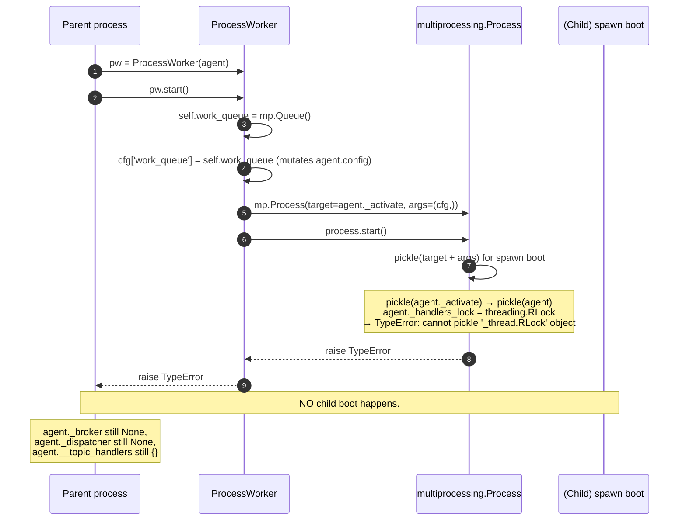

# RFC-008 — ProcessWorker lifecycle

- **Status**: **Implemented** (2026-07-28)
- **Author**: Audit follow-up
- **Depends on**: `docs/audit/05-risk-register.md` R-06; downstream of RFC-006 / RFC-007 (which introduced `_handlers_lock` and the ownership model)
- **Scope**: Making `ProcessWorker` actually usable — spawn-compatible Agent pickling, bounded shutdown with an escalation ladder, well-defined start-failure cleanup, repeated-start / repeated-stop semantics, exitcode observability, and an explicit parent-side Agent API contract under process mode
- **Explicitly out of scope**: heartbeat, watchdog thread, automatic restart, child-exception IPC serialisation, transparent parent-side `publish` / `subscribe` proxy, `ProcessDispatcher` redesign, Parcel / Message Schema, Broker API, correlation ID

---

## 0. Implementation summary (2026-07-28)

The following diverges from §6–§7 wherever explicitly noted; where not noted, the recommended design was implemented verbatim.

**Agent pickle protocol (`src/agentflow/core/agent.py`)**

- `Agent.__getstate__` returns `self.__dict__` minus a `_RUNTIME_ONLY_FIELDS` whitelist. Runtime-only fields (excluded from state): `_handlers_lock`, `_dispatcher_init_lock`, `_dispatcher`, `_broker`, `_agent_worker`, `_message_broker`, `_children`, `_parents`. `_children` / `_parents` are treated as runtime-only (they are populated by `_activate` / broker callbacks; shipping empty across the pickle boundary would still be a no-op, but including them in the runtime-only set makes the contract explicit and centralises the reinstatement policy).
- `__getstate__` runs a **picklability probe** for every remaining field: `config` is probed as a whole; every `_HandlerRecord.handler` in `__topic_handlers` is probed individually. **Fail-fast** on failure: raises `TypeError` naming the offending topic (for handlers) or the field `Agent.config` (for config), with a suggestion to move the handler / callback into `on_activate()`. §7.5's silent-omit-with-WARNING behaviour was **replaced with hard fail-fast** to match the stronger contract requested during implementation review.
- `Agent.__setstate__` restores declarative fields via `self.__dict__.update(state)` and reinstates every runtime-only field fresh: `_handlers_lock = threading.RLock()`, `_dispatcher_init_lock = threading.RLock()`, `_dispatcher = None`, `_broker = None`, `_agent_worker = None`, `_message_broker = None`, `_children = {}`, `_parents = {}`. The child's ownership contract (RFC-006 / RFC-007 `_HandlerRecord`) is preserved: `__topic_handlers` values survive pickle intact; only the guarding lock is rebuilt.

**ProcessWorker (`src/agentflow/core/agent_worker.py`)**

- `WorkerState(Enum)`: `NEW`, `STARTING`, `RUNNING`, `STOPPING`, `STOPPED`, `START_FAILED` (§7.8 + §7.12). All transitions are performed under `_state_lock: threading.RLock`. `state` and `exitcode` are exposed as read-only properties.
- `start()`: single-shot state machine. `NEW → STARTING → RUNNING`, or `NEW → STARTING → START_FAILED` on pickle / spawn error. Attempts from `STARTING`/`RUNNING` raise `RuntimeError("ProcessWorker.start called while state=…")`; attempts from `STOPPING`/`STOPPED`/`START_FAILED` raise `RuntimeError("ProcessWorker cannot be restarted … construct a fresh worker")`. **`agent.config` is not mutated** — `start()` builds `child_config = dict(self.initiator_agent.config)` and sets `child_config['work_queue'] = self.work_queue` on the copy. Diverges from §6.2 which showed `cfg = self.initiator_agent.config; cfg['work_queue'] = ...` (in-place mutation). The copy approach also means §7.7's rollback step 3 ("remove `work_queue` key from `agent.config`") is a no-op — `_cleanup_after_start_failure` no longer touches `agent.config` at all. `Process(daemon=False)` per §7.15.
- `_cleanup_after_start_failure()`: bounded rollback — if a `Process` object exists and is alive: `terminate() + join(1.0s)`, then `kill() + join(1.0s)` if still alive; then `queue.close() + queue.join_thread()`. All wrapped in best-effort swallowers of `ProcessLookupError` / `ValueError` / `OSError` / `Exception`. Sets `work_process` and `work_queue` to `None`.
- `stop(graceful_timeout_s=5.0, terminate_timeout_s=2.0, kill_timeout_s=1.0) -> Optional[int]`: bounded escalation ladder implementing §6.3 + §7.9. State-machine dispatch:
  - `NEW` → **no-op, state stays `NEW`, subsequent `start()` still allowed** (§7.12 modified during implementation review — instead of "flip `_stopped=True`" the state remains `NEW` so a caller who preemptively stopped can still start).
  - `START_FAILED` → no-op (resources already cleaned).
  - `STOPPED` → cached-exitcode replay (idempotent, §7.11).
  - `STOPPING` → **concurrent caller waits on `_stop_complete_event` and returns the same `_exitcode`** (RFC-004 pattern for concurrent-stop coordination).
  - `STARTING` → `RuntimeError`.
  - `RUNNING` → transitions to `STOPPING`, executes escalation ladder (`send terminate → join(graceful) → terminate + join(terminate_timeout) → kill + join(kill_timeout)`), sets `_exitcode = proc.exitcode`, then queue cleanup, then in `finally` sets `STOPPED` and sets `_stop_complete_event` so any concurrent waiters unblock even if the escalation body raised. Total wall time bounded by `graceful_timeout_s + terminate_timeout_s + kill_timeout_s = 8.0s` at defaults.
- `exitcode` property: `None` before `stop()`; cached `Optional[int]` after (§7.14).
- Log lines (§7.18): INFO on successful spawn (`"ProcessWorker started: pid=…"`), WARNING on each escalation step, ERROR on abandoned kill, INFO on clean stop (`"ProcessWorker stopped: exitcode=…"`).

**Parent-side Agent contract (§6.5, §7.16)**

Under process mode, the parent-side `Agent` instance is a **lifecycle controller stub**. Effective runtime state (`_broker`, `_dispatcher`, handler dispatch) lives in the child. Parent `publish` / `subscribe` / `publish_sync` calls are NOT proxied to the child (§7.17 explicitly deferred). Callers who need to interact with a running Agent must connect to the same broker (from the same or a different process) using a separate Agent instance. This is documented in `ProcessWorker`'s class docstring; no method-level guards raise.

**Divergences from §6–§7**

| RFC section | Design | Implementation | Reason |
|---|---|---|---|
| §7.5 | Non-picklable handler → silent omit + WARNING | **Fail-fast**: `TypeError` naming the topic + suggestion to use `on_activate()` | Silent omit was judged too easy to miss; explicit failure surfaces the mistake at `start()` time. |
| §7.6 | `agent.config` mutation before Process.start; pickle error propagates from spawn | **`child_config = dict(agent.config)`**; `agent.config` is never mutated | Prevents any pollution of the parent-side Agent config, regardless of success or failure. |
| §7.7 step 3 | Rollback removes `work_queue` key from `agent.config` | No-op — `agent.config` was never mutated | Consequence of §7.6 change. |
| §7.12 | `stop()` before `start()` sets `_stopped=True`, blocks future `start()` | **`stop()` before `start()` is a pure no-op; state stays `NEW`; subsequent `start()` still allowed** | Simplifies the "prepared but not yet launched" lifecycle. |
| §D 6.3 (concurrent stop) | Idempotent via `_stopped` flag | Idempotent via `WorkerState.STOPPED` **plus** `_stop_complete_event` for concurrent (rather than sequential) callers | Concurrent callers now block on the event until the first caller's escalation completes, then observe the same cached exitcode. |

**Runtime verification (2026-07-28)**

- RFC-008 dedicated file `tests/unit/core/test_process_worker_lifecycle.py`: **33 passed** in ~14 s (categories A pickle × 8, B state-machine × 5, C real-spawn × 3, D restart guards × 2, E escalation × 3, F concurrent × 2, G start-failure × 3, H observability × 2, I parent-child × 1, J baseline × 4).
- Full unit regression (RFC-008 tests included): `PYTHONPATH=src pytest tests/` → **289 passed, 0 failed, 0 xfailed(strict-pass), 2 xfailed** in ~26 s combined.
- 2 xfails preserved from RFC-007 (correlation ID / multi-handler fan-out — deferred to future RFC).
- No orphan process observed after `stop()`: verified via `os.kill(pid, 0) → ProcessLookupError` (`test_no_orphan_process_after_stop`).
- No regression across R-02 / R-03 / R-04 / R-05 / R-13 / RFC-006 / RFC-007 (256 tests, all pass unchanged).

**Files changed**

- `src/agentflow/core/agent.py` — +95 −0 lines (getstate/setstate + `_RUNTIME_ONLY_FIELDS`)
- `src/agentflow/core/agent_worker.py` — +294 −29 lines (WorkerState + rewritten ProcessWorker; ThreadWorker unchanged)
- `docs/rfc/RFC-008-process-worker-lifecycle.md` — this file (status flip)
- `tests/unit/core/test_process_worker_lifecycle.py` — new (33 tests)

**Not implemented (deferred to future RFCs)**

- Heartbeat / watchdog / `ProcessWorker.is_healthy()`
- Automatic restart on child crash
- Child exception IPC (parent observes only exit code)
- Transparent parent-side `publish` / `subscribe` proxy
- `ProcessDispatcher` (cross-process message dispatch)
- `ThreadWorker` bounded shutdown (RFC-008 explicitly scoped to `ProcessWorker`; `ThreadWorker.stop` remains blocking-join per §H of the review)

---

## 1. Problem statement

`ProcessWorker` (`src/agentflow/core/agent_worker.py`) exists as the framework's process-mode strategy but is **currently non-functional**. `Worker.__init__` forces `multiprocessing.set_start_method('spawn')` globally; `ProcessWorker.start()` creates a `multiprocessing.Process(target=agent._activate, args=(cfg,))` and calls `start()`. Under spawn, Python pickles the target (a bound method whose `self` is the Agent) to send to the child. Since RFC-006/RFC-007 landed, `Agent` holds `self._handlers_lock = threading.RLock()`, and `RLock` is not picklable. Result: `ProcessWorker.start()` raises `TypeError: cannot pickle '_thread.RLock' object` at pickle time in the parent, and no child is ever launched.

Additional problems, all pre-existing but only now runtime-confirmed:

- `ProcessWorker.stop()` posts `'terminate'` on the work queue and calls `self.work_process.join()` **with no timeout**. If the child wedges (or was never started), `Agent.terminate()` blocks the caller forever.
- `Process.daemon` defaults to `False`; a parent crash leaves the child as an orphan.
- No liveness / heartbeat / restart / kill primitives on `ProcessWorker`.
- Parent-side Agent state (`_broker`, `_dispatcher`, `__topic_handlers`) never populates — those are set by `_activate`, which runs in the child. The parent Agent instance is effectively a controller stub, not a full peer.

This RFC proposes the **minimum viable process-mode fix**: make Agent pickle-safe, add a bounded escalation-based shutdown, define start-failure and repeated-call semantics, expose child exit code, and explicitly document the parent-side controller contract. Heartbeat, watchdog, exception-forwarding IPC, and a proper `ProcessDispatcher` are all out of scope — they belong to a future RFC once the base case works.

---

## 2. Runtime evidence

Baseline: `PYTHONPATH=src pytest tests/unit` → **283 passed, 2 xfailed in 12.65 s**.

Confirmed by `tests/unit/core/test_process_worker_lifecycle.py` (27 characterisation tests):

| Behaviour | Test | Result |
|---|---|---|
| Worker forces `spawn` start method | `test_worker_init_forces_spawn_start_method` | PASSED |
| Agent holds `threading.RLock` | `test_agent_handlers_lock_is_threading_rlock` | PASSED |
| Agent is not picklable | `test_agent_is_not_picklable_due_to_handlers_lock` | PASSED |
| `ProcessWorker.start` raises at pickle time | `test_process_worker_start_raises_at_pickle_time` | PASSED |
| No child leaked on pickle failure | `test_process_worker_start_pickle_failure_leaves_no_running_child` | PASSED |
| `stop()` uses unbounded `join()` | `test_process_worker_stop_calls_join_without_timeout_by_source_inspection` | PASSED |
| `stop()` hangs on wedged child | `test_process_worker_stop_hangs_when_child_ignores_terminate_message` | PASSED |
| `stop()` returns quickly if child already exited | `test_process_worker_stop_returns_after_child_exits` | PASSED |
| No daemon flag | `test_multiprocessing_process_default_is_non_daemon` | PASSED |
| No kill / liveness / restart API | `test_process_worker_exposes_no_kill_or_liveness_api`, `_no_restart_api` | PASSED × 2 |
| Parent-side Agent state stays unchanged | `test_process_worker_pickle_failure_leaves_parent_agent_state_unchanged` | PASSED |
| Config gets `work_queue` mutation before pickle failure | `test_process_worker_start_mutates_agent_config_with_work_queue` | PASSED |

Full unit regression showed no orphans. All post-RFC-007 contracts (R-02 / R-03 / R-04 / R-05 / R-13 / RFC-006 / RFC-007 — 217 tests) pass unchanged.

---

## 3. Current state

Source: `src/agentflow/core/agent_worker.py` and `src/agentflow/core/agent.py`.



`ProcessWorker.stop()`:

```python
def stop(self):
    logger.debug(self.initiator_agent.M("Stopping.."))
    self.send_data('terminate')
    self.work_process.join()   # ← UNBOUNDED
    logger.debug(self.initiator_agent.M("Stopped."))
```

No timeout on `join`; no fallback `Process.terminate()`; no `kill()`; no cleanup of `work_queue`; no idempotence check.

---

## 4. Desired state

- `ProcessWorker.start()` **works**: the child process is spawned, unpickles a functional Agent, and runs `_activate` to completion of its normal lifecycle (broker init, `on_activate`, work-queue loop).
- Agent supports pickle-under-spawn via `__getstate__` / `__setstate__` that exclude runtime-only fields (locks, dispatcher, broker, worker back-reference) and reinstate them in the child.
- `ProcessWorker.stop(timeout_s=None)` follows a **bounded escalation ladder**: send-terminate → `join(graceful_timeout_s)` → `Process.terminate()` → `join(terminate_timeout_s)` → `Process.kill()` → `join(kill_timeout_s)`. Total wall time strictly bounded.
- `stop()` is **idempotent**; repeated calls are cheap and return the same outcome.
- `stop()` before `start()` is a **safe no-op**.
- `start()` after a successful `start()` **raises `RuntimeError`** (no restart in this RFC; a future RFC may add it).
- `start()` failure (pickle or otherwise) leaves the parent state clean: `work_process` set to `None` (or a non-live handle), `work_queue` closed, `agent.config['work_queue']` removed.
- `ProcessWorker.exitcode` property exposes the child's exit code once it has ended.
- Child `Process.daemon` remains **`False`** by default (RFC-004 §7.7 spirit: daemon is a last-resort exit safety net; graceful shutdown is the normal path).
- **Parent-side Agent API contract** is explicitly documented: in process mode, the parent-side `Agent` instance is a **controller stub** (start / stop / observe). Calls to `Agent.publish` / `subscribe` / `publish_sync` on the parent are not proxied to the child. This RFC does not change the behaviour — it makes the contract explicit and confines the runtime shape.

---

## 5. Options considered

### Option A — `Agent.__getstate__` / `__setstate__` (**recommended core**)

Split Agent attributes into two disjoint sets:

- **Declarative state** (picklable, meaningful in the child): identity fields, config, parent/child names, handler-registry snapshot if picklable.
- **Runtime-only state** (not picklable, or meaningless outside its owner context): locks, dispatcher, broker, worker back-reference, threading events, dispatcher-init lock.

`__getstate__` returns declarative fields only. `__setstate__` restores declarative fields and reinstates runtime-only fields as fresh `None` / `RLock()` / `{}` in the child.

| Aspect | Analysis |
|---|---|
| Enables spawn | ✓ |
| Preserves handler-registry declarative content | ✓ (only if the handlers themselves are picklable) |
| Preserves RFC-006/RFC-007 ownership contract | ✓ — child re-locks with fresh RLock; ownership types survive pickle as plain enum + dataclass |
| Public API surface | Signature-preserving; adds `__getstate__` / `__setstate__` (dunder methods, standard pickle protocol) |
| Handler picklability | If a caller registers a lambda / closure handler and then tries `start_process()`, pickle will still fail — but the failure will name the specific attribute, not the framework's own lock |
| Migration cost | Low — two methods on Agent |
| Verdict | **Recommended core** |

### Option B — Lazy-create locks only in child

Do not include the lock in `__init__` at all; create it lazily on first access via a property.

| Aspect | Analysis |
|---|---|
| Enables spawn | ✓ (if lock is never touched in parent, it's never created) |
| Interacts with RFC-006/007 | ✗ — RFC-006/007 rely on the lock existing whenever `publish_sync` / `subscribe` runs. Lazy creation would need double-checked-locking; error-prone. |
| Complexity | Higher than A |
| Verdict | Rejected — introduces new race territory for negligible benefit over A |

### Option C — ProcessWorker does not pickle Agent; instead ship a factory + config

Change `ProcessWorker.start()` to pass a factory callable (module-level function) plus config; the child calls `factory(config)` to build a fresh Agent locally.

| Aspect | Analysis |
|---|---|
| Enables spawn | ✓ |
| Public API impact | Larger — Agent subclasses that need custom construction have to expose a picklable factory; every user's Agent subclass has to opt in |
| Consistency with ThreadWorker | ThreadWorker uses the same Agent instance; Option C makes ProcessWorker semantics diverge |
| Handler registry propagation | Loses any parent-side handler registrations (if any); child starts fresh — this is arguably correct for process mode but breaks the current appearance of "same Agent, different worker" |
| Complexity | High |
| Verdict | Rejected as first-phase; may be revisited if Option A proves inadequate for a real workload |

### Option D — Fork-only mode

Remove the forced `set_start_method('spawn')`; rely on the platform default (Linux: fork).

| Aspect | Analysis |
|---|---|
| Enables spawn | N/A — sidesteps by using fork |
| Platform portability | Breaks on macOS (spawn default) and Windows (spawn only). Also incompatible with Python 3.14's move to forkserver on Linux. |
| Fork-specific hazards | Copies file descriptors including live broker sockets from parent; child then has a stolen socket → broken MQTT connection; broker.subscribe in child races with parent's connection state |
| Locks under fork | Fork copies lock objects but not the threads holding them → child inherits potentially-held locks with no owner → deadlock hazard |
| Verdict | Rejected — moves the failure into more dangerous territory |

### Option E — Deprecate process mode

Mark `CONCURRENCY_TYPE='process'` deprecated; support only ThreadWorker; remove ProcessWorker in a future release.

| Aspect | Analysis |
|---|---|
| Solves R-06 | By removing it |
| Backwards compat | Breaking for any user relying on process mode (unknown count; the audit found none in-tree) |
| Framework story | AgentFlow's positioning includes "fault isolation" — process mode is the only real isolation boundary the framework offers |
| Verdict | Rejected as first-phase — too destructive without a data-driven case. May be revisited if a future RFC-N proves process mode fundamentally unfixable. |

### Comparison summary

| Criterion | A | B | C | D | E |
|---|---|---|---|---|---|
| Enables spawn | ✓ | ✓ | ✓ | ✓ (via fork) | n/a |
| Preserves RFC-006/007 contract | ✓ | ✗ | ✓ | ✗ (fork lock hazard) | ✓ |
| Cross-platform | ✓ | ✓ | ✓ | ✗ | ✓ |
| No public API break | ✓ | ✓ | ✗ | ✓ | ✗ |
| Complexity | Low | Medium | High | Low (dangerous) | Low |
| Verdict | **chosen** | rejected | rejected | rejected | rejected |

---

## 6. Recommended design

Adopt **Option A** plus a bounded shutdown ladder in `ProcessWorker.stop()`, plus explicit start-failure cleanup, plus documented parent-side controller semantics.

### 6.1 Pickle state model (Agent)

```python
_DECLARATIVE_FIELDS = frozenset({
    'agent_id', 'name', 'tag', 'name_tag', 'parent_name',
    'interval_seconds', 'config',
    # NOTE: '_children' and '_parents' are declarative-in-shape but are
    # populated by _activate at runtime; snapshot value is empty at
    # pickle time in the current lifecycle, so shipping their empty
    # value is a no-op.
    '_children', '_parents',
    '_connected_once',
    # __topic_handlers is picklable IFF every registered handler is
    # picklable. Shipped conditionally (see §7.5).
})

_RUNTIME_ONLY_FIELDS = frozenset({
    '_handlers_lock',              # threading.RLock — not picklable
    '_dispatcher',                 # MessageDispatcher, holds Threads
    '_dispatcher_init_lock',       # threading.RLock
    '_broker',                     # MessageBroker with paho Client + threads
    '_agent_worker',               # back-reference to Worker (cycle + not meaningful in child)
    '_message_broker',             # legacy unused attribute
})
```

`__getstate__`:

```python
def __getstate__(self):
    state = self.__dict__.copy()
    for field in _RUNTIME_ONLY_FIELDS:
        state.pop(field, None)
    # Force-reset __topic_handlers if any registered handler is a
    # closure / bound method / partial that would fail to pickle.
    # Handled per §7.5.
    return state

def __setstate__(self, state):
    self.__dict__.update(state)
    # Reinstate runtime-only fields in the child.
    self._handlers_lock = threading.RLock()
    self._dispatcher = None
    self._dispatcher_init_lock = threading.RLock()
    self._broker = None
    self._agent_worker = None       # child does not know its worker
    self._message_broker = None
    # __topic_handlers may or may not be present; if omitted (§7.5), reset.
    if not hasattr(self, '_Agent__topic_handlers'):
        # Note: use name-mangled attribute name because __topic_handlers
        # is a private double-underscore attribute of Agent.
        self._Agent__topic_handlers = {}
```

Runtime-only reset in the child preserves the RFC-006/RFC-007 ownership contract: a fresh `_HandlerRecord` registry with a fresh lock. First `Agent.subscribe` or `Agent.publish_sync` call in the child rebuilds ownership through the normal paths.

### 6.2 ProcessWorker.start()

```python
def start(self):
    if self.work_process is not None and self.work_process.is_alive():
        raise RuntimeError("ProcessWorker.start called twice on the same instance")
    if self._stopped:
        raise RuntimeError("ProcessWorker cannot be restarted after stop; construct a fresh worker")

    self.work_queue = multiprocessing.Queue()
    cfg = self.initiator_agent.config
    cfg['work_queue'] = self.work_queue

    self.work_process = multiprocessing.Process(
        target=self.initiator_agent._activate, args=(cfg,),
    )
    try:
        self.work_process.start()
    except BaseException:
        # Roll back so parent state is clean.
        self._cleanup_after_start_failure()
        raise
    return self.work_process

def _cleanup_after_start_failure(self):
    # 1. If the Process was somehow launched, terminate + join with a short budget.
    proc = self.work_process
    self.work_process = None
    if proc is not None and proc.is_alive():
        try:
            proc.terminate()
            proc.join(1.0)
            if proc.is_alive():
                proc.kill()
                proc.join(1.0)
        except Exception:
            pass
    # 2. Close and drop the work_queue.
    try:
        self.work_queue.close()
        self.work_queue.join_thread()
    except Exception:
        pass
    self.work_queue = None
    # 3. Remove the mutated config key so the parent Agent is not left
    #    with a dangling Queue reference.
    self.initiator_agent.config.pop('work_queue', None)
```

### 6.3 ProcessWorker.stop()

Escalation ladder with bounded per-step timeouts. Overall wall-time bound: `graceful_timeout_s + terminate_timeout_s + kill_timeout_s` (default 5 + 2 + 1 = 8 s).

```python
def stop(self,
         graceful_timeout_s: float = 5.0,
         terminate_timeout_s: float = 2.0,
         kill_timeout_s: float = 1.0) -> int | None:
    # Idempotent: repeated calls return the cached first-call exitcode.
    with self._state_lock:
        if self._stopped:
            return self._exitcode
        self._stopped = True

    proc = self.work_process
    if proc is None:
        # stop before start — no-op.
        self._exitcode = None
        return None

    # Step 1: request cooperative termination.
    try:
        self.send_data('terminate')
    except Exception:
        pass  # queue may be closed; move to terminate below
    proc.join(graceful_timeout_s)

    # Step 2: SIGTERM if still alive.
    if proc.is_alive():
        logger.warning("ProcessWorker: graceful stop deadline exceeded; "
                       "issuing terminate()")
        try:
            proc.terminate()
        except Exception:
            pass
        proc.join(terminate_timeout_s)

    # Step 3: SIGKILL if still alive.
    if proc.is_alive():
        logger.warning("ProcessWorker: terminate deadline exceeded; "
                       "issuing kill()")
        try:
            proc.kill()
        except Exception:
            pass
        proc.join(kill_timeout_s)

    if proc.is_alive():
        logger.error("ProcessWorker: child still alive after kill(); "
                     "abandoning (potential zombie)")

    self._exitcode = proc.exitcode
    # Drain the work_queue so its feeder thread can exit cleanly.
    try:
        self.work_queue.close()
        self.work_queue.join_thread()
    except Exception:
        pass
    return self._exitcode
```

### 6.4 Observability additions

- `ProcessWorker.exitcode` property: returns `self._exitcode` (set by `stop()` after final join). `None` if never started, never stopped, or stop before start.
- `ProcessWorker.is_working()`: unchanged behaviour; still `Process.is_alive()` when a process exists.
- Log lines (INFO on success, WARNING on each escalation step, ERROR on abandoned kill) — no metrics attribute in first-phase RFC.

### 6.5 Parent-side Agent API contract

**Explicit documentation**, no code change:

- Under `CONCURRENCY_TYPE='process'`, the parent-side `Agent` instance is a **controller stub**. It exists to orchestrate lifecycle: `start()`, `terminate()`, and observation of `is_active()` / `worker.exitcode`.
- The parent-side Agent's `_broker`, `_dispatcher`, `__topic_handlers` remain at their `__init__` values.
- Parent-side calls to `Agent.publish`, `Agent.subscribe`, `Agent.publish_sync`, `Agent.on_message` are **not proxied** to the child. They operate on the empty parent state and are effectively no-ops (or, for `publish_sync` / `subscribe`, still work against the empty local registry — but no real broker traffic occurs since `_broker` is None).
- Callers who need to interact with the running Agent must connect to the same broker (from the same or a different process) using a normal Agent — not the process-mode controller stub.

This contract is documented in Agent's docstring; no behavioural change beyond what already happens today (post-fix, the child now actually runs, but the parent-controller behaviour is exactly what today's broken-spawn already implies).

---

## 7. Concrete decisions (all 20)

### 7.1 Declarative Agent fields

`agent_id`, `name`, `tag`, `name_tag`, `parent_name`, `interval_seconds`, `config` (contents pickle-checked at start time — see §7.6), `_children`, `_parents`, `_connected_once`, `__topic_handlers` (conditional per §7.5).

### 7.2 Runtime-only Agent fields

`_handlers_lock`, `_dispatcher_init_lock`, `_dispatcher`, `_broker`, `_agent_worker`, `_message_broker`. Excluded from `__getstate__`. Reinstated fresh in `__setstate__`.

### 7.3 `__getstate__` exclusion list

Exactly the runtime-only field set from §7.2. Plus optional exclusion of `__topic_handlers` when it contains a non-picklable handler (§7.5).

### 7.4 `__setstate__` reinstatement list

- `_handlers_lock = threading.RLock()`
- `_dispatcher = None`
- `_dispatcher_init_lock = threading.RLock()`
- `_broker = None`
- `_agent_worker = None`
- `_message_broker = None`
- `__topic_handlers = {}` if omitted from state

### 7.5 Non-picklable handler in `__topic_handlers`

`__getstate__` attempts to pickle the handler registry as a probe. If any handler fails (typically a closure / lambda / bound method with an unpicklable `self`), `__getstate__` **omits `__topic_handlers` entirely** and logs a WARNING naming the topics dropped. The child starts with an empty registry.

Rationale: raising at `__getstate__` time would leave `ProcessWorker.start()` in the same broken state as today. Silent drop with WARNING lets the child come up; the caller can rebind handlers in `on_activate` (which is the natural place under process mode).

### 7.6 Non-picklable objects in `config`

The `config` dict is included in the state. If it contains a non-picklable value (e.g. a `EventHandler.ON_ACTIVATE = <lambda>`), pickle raises at `Process.start()` time. `_cleanup_after_start_failure` runs; the caller sees the `PicklingError` / `TypeError` with the offending key traceable in the message.

The framework does not silently strip config; config is caller-supplied and its shape matters. The caller must supply pickle-safe callbacks (module-level functions) if they want process mode.

### 7.7 `ProcessWorker.start()` failure cleanup

Three-step rollback (§6.2 `_cleanup_after_start_failure`):

1. If a `Process` object was launched, `.terminate()` + `.join(1.0)`; if still alive, `.kill()` + `.join(1.0)`. Set `self.work_process = None`.
2. Close and join the `work_queue`; set `self.work_queue = None`.
3. Remove `work_queue` key from `agent.config` (undo the pre-start mutation).

The original exception is re-raised via `raise` after cleanup.

### 7.8 Repeated `start()`

`start()` after a successful `start()` where the child is still alive: raise `RuntimeError("ProcessWorker.start called twice on the same instance")`.

`start()` after `stop()` (whether graceful or timed-out): raise `RuntimeError("ProcessWorker cannot be restarted after stop; construct a fresh worker")`.

Restart is deliberately not supported in this RFC. A future RFC may add `ProcessWorker.restart()` that combines stop + fresh internal state, but the current design keeps ProcessWorker single-use.

### 7.9 `stop()` escalation ladder

Exactly the six steps of §6.3:

1. `send_data('terminate')` on the work queue (cooperative).
2. `join(graceful_timeout_s)`.
3. If alive → `Process.terminate()` (SIGTERM on POSIX / TerminateProcess on Windows).
4. `join(terminate_timeout_s)`.
5. If alive → `Process.kill()` (SIGKILL / TerminateProcess with more force).
6. `join(kill_timeout_s)`. If still alive after this, log ERROR and abandon.

### 7.10 Default timeouts

- `graceful_timeout_s = 5.0` (matches RFC-004 dispatcher's shutdown_timeout_s default)
- `terminate_timeout_s = 2.0`
- `kill_timeout_s = 1.0`

Total bounded wall time: 8.0 seconds. Configurable per-call and (later) via `agent_config['process_worker']`.

### 7.11 `stop()` idempotence

`stop()` uses a `_state_lock` and a `_stopped` boolean. First caller performs the escalation; subsequent callers observe `_stopped is True` and return the cached `_exitcode`. Matches RFC-004 §7.15 dispatcher idempotence pattern.

### 7.12 `stop()` before `start()`

No-op. Sets `_stopped = True`, returns `None` (no exit code). Prevents future accidental `start()` calls per §7.8.

### 7.13 `stop()` when child already exited

Sequence completes immediately: `send_data('terminate')` on the (still-open) queue succeeds; `join(graceful_timeout_s)` returns immediately (child is dead); Steps 3–6 skipped. Return `self._exitcode = proc.exitcode`.

### 7.14 exitcode observability

- `ProcessWorker.exitcode` property returns the cached value (or `None` if never stopped or never started).
- After `stop()`, callers can inspect `worker.exitcode` to distinguish clean exit (`0`), signal-triggered kill (`-signal_number`), or Python-level error (usually `1`).
- No new API for querying exitcode of an already-dead-but-not-yet-stopped child; caller should `stop()` first (idempotent).

### 7.15 daemon flag

`Process.daemon = False` (unchanged default). Rationale: RFC-004 §7.7 established that `daemon=True` is a last-resort exit protection, not a normal shutdown mechanism. Process mode is chosen for isolation; a daemon child would be terminated by a parent crash, defeating the isolation. If a specific deployment wants daemon behaviour, a future RFC can add a config flag; not first-phase.

### 7.16 Parent-side Agent API contract

Documented in Agent's docstring:

```
In process mode (CONCURRENCY_TYPE='process'), the parent-side Agent
instance is a controller stub. It owns start()/terminate() and can
observe is_active() / worker.exitcode. Calls to publish() /
subscribe() / publish_sync() on the parent-side instance operate on
uninitialised local state (_broker is None; __topic_handlers is
empty) and produce no broker traffic. Interact with the running
Agent by constructing a separate Agent (in the same or a different
process) that connects to the same broker.
```

No code change; no method-level guard raising. Rationale: callers who touch parent-side APIs today already get silent no-ops (`_broker is None` fast-fail per RFC-002); explicit raise would break existing tests that construct parent-side Agents for RFC-001~007 verification.

### 7.17 Parent publish/subscribe proxy

**Not implemented.** The parent Agent instance's `publish` / `subscribe` / `publish_sync` calls do NOT proxy to the child. See §7.16. A transparent proxy would require IPC for every message and is a full redesign — out of RFC-008 scope.

### 7.18 Metrics / logging

- INFO on successful spawn: `"ProcessWorker started: pid=<N>"` (from within Worker context; child's Agent logs its own on_connected etc.)
- WARNING on each escalation step (§6.3): graceful deadline exceeded, terminate deadline exceeded.
- ERROR on abandoned kill (child still alive after kill_timeout_s).
- INFO on clean stop: `"ProcessWorker stopped: exitcode=<N>"`.
- No metrics attributes in first-phase; can be added later without breaking API.

### 7.19 Acceptance criteria
See §10.

### 7.20 Rollback plan
See §11.

---

## 8. Backward compatibility

### Source compatibility

| Symbol | Before | After | Compatibility |
|---|---|---|---|
| `Agent.publish` / `publish_sync` / `subscribe` / `unsubscribe` / `_on_message` public signatures | Same | Same | Full |
| `Agent.__getstate__` / `__setstate__` | Not defined | New pickle-protocol dunders | Additive |
| `Agent.terminate()` | Same | Same signature; now bounded (via ProcessWorker.stop's bounded escalation) | Behavioural improvement |
| `Agent.start()` / `start_process()` / `start_thread()` | Same | Same; process mode now actually works | Behavioural improvement |
| `ProcessWorker.start()` | Raised at pickle time | Now succeeds; may raise `RuntimeError` on repeated call | See §7.8 |
| `ProcessWorker.stop()` | Unbounded join, no return | Bounded escalation, returns `Optional[int]` (exitcode) | Return type widening — no caller in tree relied on `None` return |
| `ProcessWorker.exitcode` | Not defined | New read-only property | Additive |
| `ProcessWorker._stopped`, `_state_lock`, `_exitcode` | Not defined | New internal attributes | Additive |
| Parcel / TextParcel / BinaryParcel / wire | — | — | Untouched |
| MessageBroker / MqttBroker | — | — | Untouched |

### Behavioural compatibility

- **Callers using thread mode** (default in most tests): zero change. Agent is now picklable (`__getstate__` / `__setstate__`) but nothing under thread mode tries to pickle it.
- **Callers using process mode**: process mode now **actually functions**. Previously every `start_process()` raised `TypeError` at pickle time. Any caller that already handled the exception will now see the child successfully start. Any caller that assumed `start_process()` was a no-op (unaware it was broken) will now spawn a real child.
- **Callers using pickle directly on Agent** (unusual, e.g. for state snapshotting): now succeeds where it previously raised. Only declarative state is preserved; the caller must not expect runtime state (broker, dispatcher, locks) to round-trip.
- **Callers registering closures / lambdas in `__topic_handlers` before `start_process()`**: previously blocked at pickle; now the framework silently omits the registry (WARNING logged) and starts with an empty registry in the child. Caller must re-register in `on_activate`.

### Wire compatibility

None. No wire changes.

---

## 9. Interaction with prior RFCs

- **RFC-001 (R-02 cleanup)**: unaffected. `publish_sync` runs on the caller's thread; `__topic_handlers` cleanup logic is unchanged. The child gets a fresh registry with `__setstate__`; RFC-001's semantics apply per-process.
- **RFC-002 (R-13 fast-fail)**: unaffected. `_publish_or_raise` is per-agent, per-process.
- **RFC-003 (R-05 auto-reply)**: unaffected. `_on_message` reads from the (child's) registry.
- **RFC-004 (R-04 bounded dispatch)**: unaffected. The dispatcher is created lazily inside the child (via `_get_dispatcher`); child's dispatcher is independent from the parent's (which stays `None`).
- **RFC-005 (R-03 subscription recovery)**: unaffected. `MqttBroker._registry` is broker-scoped; a child's broker has its own registry.
- **RFC-006 / RFC-007 (R.4 / R-14 __topic_handlers slice)**: **critical interaction — preserved**. The child gets a fresh `_handlers_lock` (RLock) and fresh `_HandlerRecord` registry in `__setstate__`. All RFC-006/RFC-007 ownership contracts apply per-process; the pickle protocol does not carry any lock or partial ownership state across the boundary.

The 217 tests spanning R-02 / R-03 / R-04 / R-05 / R-13 / RFC-006 / RFC-007 form the regression floor for RFC-008.

---

## 10. Test migration plan

### R-06 characterisation tests to FLIP under the fix

In `tests/unit/core/test_process_worker_lifecycle.py`:

| Test | Current | Post-RFC-008 |
|---|---|---|
| `test_agent_is_not_picklable_due_to_handlers_lock` | PASSED (asserts unpicklable) | **Invert**: assert `pickle.dumps(agent)` succeeds; assert unpickled Agent has fresh lock and empty runtime fields |
| `test_agent_pickle_error_message_mentions_lock` | PASSED | **Delete** — no error to inspect |
| `test_process_worker_start_raises_at_pickle_time` | PASSED (asserts raise) | **Invert**: assert `pw.start()` returns a live Process object; child runs `_activate` |
| `test_process_worker_start_pickle_failure_leaves_no_running_child` | PASSED | **Rewrite as** `test_process_worker_start_success_yields_running_child` |
| `test_process_worker_stop_calls_join_without_timeout_by_source_inspection` | PASSED | **Invert** to `test_process_worker_stop_uses_bounded_escalation` — source inspection now looks for `graceful_timeout_s`, `terminate_timeout_s`, `kill_timeout_s` |
| `test_process_worker_stop_hangs_when_child_ignores_terminate_message` | PASSED (asserts hangs) | **Invert**: assert `stop()` returns within total bounded budget even when child ignores 'terminate' (escalates to `terminate()` and `kill()`) |
| `test_process_worker_exposes_no_kill_or_liveness_api` | PASSED | **Rewrite**: `test_process_worker_exposes_exitcode_property` |
| `test_process_worker_pickle_failure_leaves_parent_agent_state_unchanged` | PASSED | **Rewrite**: parent-side Agent state stays uninitialised even after successful child spawn (§7.16 contract) |
| `test_process_worker_start_mutates_agent_config_with_work_queue` | PASSED | **Rewrite**: same mutation happens; additionally, `_cleanup_after_start_failure` reverts it on error |

### New tests to add

| Test | Purpose |
|---|---|
| `test_agent_pickles_after_getstate_and_setstate_round_trip` | Basic dunder verification |
| `test_agent_setstate_reinstates_fresh_handlers_lock` | RFC-007 preservation in the child |
| `test_agent_setstate_reinstates_none_broker_and_dispatcher` | Runtime state is fresh in child |
| `test_agent_topic_handlers_registry_survives_pickle_when_all_handlers_picklable` | Positive path for handler registry |
| `test_agent_topic_handlers_omitted_from_pickle_when_handler_is_lambda` | §7.5 fallback |
| `test_process_worker_start_spawns_functional_child` | End-to-end: child runs `_activate` and terminates cleanly |
| `test_process_worker_stop_graceful_when_child_cooperates` | Path 1 of escalation |
| `test_process_worker_stop_uses_terminate_when_graceful_deadline_exceeded` | Path 2 |
| `test_process_worker_stop_uses_kill_when_terminate_deadline_exceeded` | Path 3 |
| `test_process_worker_stop_returns_exitcode` | §7.14 |
| `test_process_worker_stop_idempotent_returns_cached_exitcode` | §7.11 |
| `test_process_worker_stop_before_start_is_no_op` | §7.12 |
| `test_process_worker_repeated_start_raises_runtime_error` | §7.8 |
| `test_process_worker_start_failure_cleans_up_queue_and_config` | §7.7 |
| `test_process_worker_config_with_lambda_callback_raises_at_start_time` | §7.6 |
| `test_no_orphan_process_after_stop` | Sanity: `os.kill(pid, 0)` raises ProcessLookupError |

### Existing R-02 / R-03 / R-04 / R-05 / R-13 / RFC-006 / RFC-007 tests

**Unchanged**. They construct `Agent` and use `FakeWorker` / `FakeBroker`, not `ProcessWorker`. RFC-008's changes to Agent (adding `__getstate__` / `__setstate__` methods) do not affect Agent construction, method behaviour, or any tested contract in thread mode.

### Legacy suites

`unit_test/*` and `exe_test/*` remain quarantined via `pyproject.toml` `norecursedirs`. Not affected.

FakeBroker / FakeWorker: no changes required.

---

## 11. Acceptance criteria

Before this RFC's implementation PR can merge:

1. `PYTHONPATH=src pytest tests/unit` reports **all-pass** with **exactly 2 strict xfailed** remaining (the same two RFC-006 out-of-scope items).
   - Baseline before implementation: 283 passed, 2 xfailed.
   - Target after implementation: ≈ 290 passed, 2 xfailed (9 R-06 characterisation tests inverted / rewritten; ≈ 16 new tests added; ≈ 4 R-06 tests kept unchanged).
2. `ProcessWorker.start()` on a minimal Agent (with `broker_type='empty'` or equivalent) **successfully spawns a child** that runs `Agent._activate` to completion. Verified end-to-end via a live-spawn test that observes `is_alive() → True → False` transition and `stop()` returns exit code `0`.
3. `Agent._activate` runs in the child context (verified by observing broker construction in the child, e.g. via a Queue-based sentinel that the child posts when `__activating` completes).
4. `ProcessWorker.stop()` returns within `graceful_timeout_s + terminate_timeout_s + kill_timeout_s` seconds even when the child ignores 'terminate'.
5. `ProcessWorker.stop()` after `Process.terminate()` fails to end the child, then invokes `Process.kill()`, is verified via a child that catches SIGTERM.
6. `ProcessWorker.stop()` is idempotent: two calls in succession return the same cached exit code and do not double-escalate.
7. `ProcessWorker.start()` failure (e.g. pickle error from a lambda callback in `config`) does not leave `agent.config['work_queue']` populated, does not leave a `Process` handle in `work_process`, and does not leak a `Queue`.
8. `ProcessWorker.exitcode` is observable after `stop()` on any code path.
9. **No orphan process**: verified by a test that spawns, stops, and asserts the child PID no longer exists (`os.kill(pid, 0) → ProcessLookupError`).
10. R-02 (27), R-03 (48), R-04 (33), R-05 (21), R-13 (46), RFC-006 same-API (21), RFC-007 (19) tests all pass **unchanged**.
11. No changes to:
    - `src/agentflow/core/parcel.py`
    - `src/agentflow/broker/*`
    - `pyproject.toml`
    - Wire format
12. This RFC file has status changed from `Draft` to `Implemented` in the same PR.
13. `docs/audit/05-risk-register.md` R-06 status changed to `Resolved` in the same PR.

Out of scope (deferred to future RFCs):

- Heartbeat / watchdog thread (`ProcessWorker.is_healthy()`).
- Automatic restart on child crash.
- Child exception IPC serialisation (parent observes only exit code).
- Transparent parent-side `publish` / `subscribe` proxy (Option F territory).
- `ProcessDispatcher` — a dispatcher purpose-built for cross-process work.
- config-key documentation for `agent_config['process_worker']` timeouts (initial design uses method-argument defaults).

---

## 12. Rollback plan

Rollback trigger — any of:

- A deployment that relied on `ProcessWorker.start()` failing loudly at pickle time (extremely unlikely; audit found no such caller).
- The `__setstate__` re-init misses a runtime-only field, causing subtle child-side bugs (would be caught by RFC-006/RFC-007 tests running under process mode).
- The stop escalation ladder ends processes that a specific deployment expected to shut down slowly (e.g. long-running database checkpoints in a handler) — timeouts are per-call configurable, but a bad default could break someone.
- Regression in R-02 / R-03 / R-04 / R-05 / R-13 / RFC-006 / RFC-007 tests.

Rollback procedure — single `git revert` of the merge commit. Because:

- `__getstate__` / `__setstate__` are additive dunders; without them, Python uses the default pickle behaviour (which is the pre-RFC-008 broken state).
- `ProcessWorker` internal fields (`_state_lock`, `_stopped`, `_exitcode`) are additive.
- `ProcessWorker.stop()` return type change from `None` to `Optional[int]` is source-compatible in both directions (callers who ignored the return still ignore it).
- No wire / schema / broker API changes to reconcile.
- Test-file rewrites revert alongside.

Not rollback-safe: any change bundled in the same PR that modifies Parcel, Broker ABC, or Message Schema. This RFC forbids bundling.

Post-rollback state: R-06 returns to "Confirmed by runtime evidence, unresolved". Process mode is again unusable. The 27 characterisation tests revert to their pre-RFC-008 form (documenting the broken state).

Interim mitigation (available without revert): a deployment that hits a new bug under process mode can pin to thread mode via `agent_config['CONCURRENCY_TYPE'] = 'thread'`. Thread mode is unchanged by RFC-008.

---

## Appendix A — Why not add `__reduce_ex__` instead of `__getstate__` / `__setstate__`?

`__reduce_ex__` gives finer control (custom constructor, args, state, iterator, dict updates). For Agent, we only need to filter attributes and reinstate a small fixed set — the standard `__getstate__` / `__setstate__` pair is sufficient and idiomatic. `__reduce_ex__` is heavier and easier to break. If a future RFC needs to customise the class or its construction (e.g. for a factory-based approach — Option C revisited), it can migrate then.

## Appendix B — Why not use `copyreg.pickle`?

Same reasoning as Appendix A. `copyreg` is for third-party types you don't control; Agent is our own class.

## Appendix C — What if the child needs to see the parent's `__topic_handlers`?

Currently no callers register `__topic_handlers` on the parent before `start_process()` — the typical flow is that all `subscribe` calls happen inside `_on_connect` (which runs in the child). §7.5 lets us ship the registry when its handlers are picklable, but this is a convenience for future callers rather than a required capability today.

If a specific deployment needs cross-process handler shipping and its handlers cannot be made picklable (e.g. closures over parent-side objects), it must refactor to use module-level functions or an on-connect registration pattern. This is a common Python multiprocessing constraint and not an AgentFlow-specific issue.

## Appendix D — Interaction with a future `ProcessDispatcher`

RFC-004 Appendix C flagged a potential `ProcessDispatcher` that would dispatch messages via `multiprocessing.Queue` + child processes. RFC-008's `__getstate__` / `__setstate__` are orthogonal — a `ProcessDispatcher` would still need a picklable Agent to ship into the worker pool. RFC-008 unblocks that future design without prejudging its shape.

## Appendix E — Why `Process.daemon = False` rather than `True`?

`daemon=True` would make the child die on parent exit — convenient for tests but contrary to process mode's purpose (isolation). A daemon child is also unable to spawn its own daemon Processes (Python restriction), which would prevent a child Agent from ever hosting its own bounded dispatcher's daemon threads (RFC-004). Keep `daemon=False`; graceful shutdown via the escalation ladder is the normal path.
