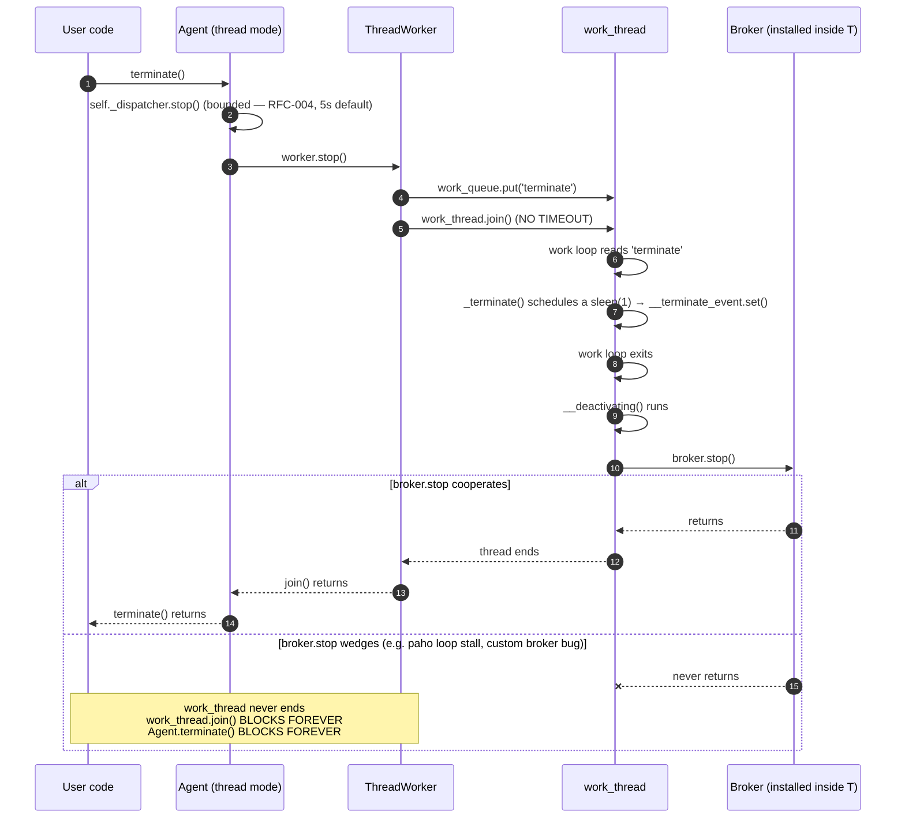
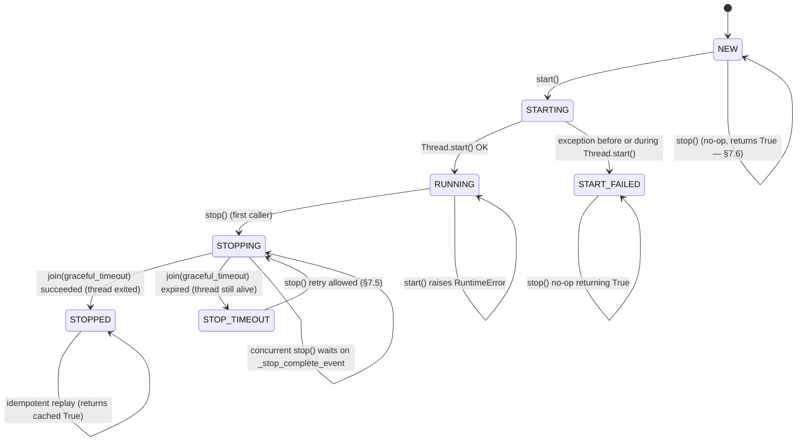

# RFC-009 — ThreadWorker lifecycle

- **Status**: **Implemented** (2026-07-28)
- **Author**: Audit follow-up
- **Depends on**: `docs/audit/05-risk-register.md` R-06 / R-10; downstream of RFC-004 (bounded dispatch) and RFC-008 (ProcessWorker lifecycle)
- **Scope**: Give `ThreadWorker` a bounded, cooperative shutdown contract with an explicit state machine, concurrent-stop coordination, timeout observability, and captured `_activate` exceptions. Aligns the thread-mode side with RFC-008 where the two contracts can be aligned, and *explicitly documents* where they cannot.
- **Explicitly out of scope**: forced thread cancellation (`ctypes.pythonapi.PyThreadState_SetAsyncExc`, `signal.pthread_kill` on non-main threads), heartbeat, watchdog, automatic restart, `ProcessWorker` changes, `Broker` API changes, `Parcel` / Message Schema changes, correlation-ID metadata, migration to `concurrent.futures` / `asyncio` executor architecture

---

## 0. Implementation summary (2026-07-28)

Diverges from §6–§7 wherever explicitly noted; where not noted, the recommended design was implemented verbatim.

**WorkerState (`src/agentflow/core/agent_worker.py`)**

- Extended the RFC-008 enum with two new members:
  - `STOP_TIMEOUT` — ThreadWorker-only. Cooperative stop deadline expired; thread still alive; retriable.
  - `FAILED` — ThreadWorker-only. `_activate` raised an `Exception` that was captured into `last_exception`; the thread ended.
- `ProcessWorker` never enters either state (it has SIGKILL and reports failure via exit code); the enum docstring documents the split.

**ThreadWorker rewrite (`src/agentflow/core/agent_worker.py`)**

- Full state machine `NEW → STARTING → RUNNING → STOPPING → STOPPED / STOP_TIMEOUT / FAILED / START_FAILED`, protected by `_state_lock: threading.RLock`.
- Read-only `state: WorkerState` property; read-only `last_exception: Optional[BaseException]` property.
- `start(self)`:
  - Enforces `NEW`-only precondition (any other state → `RuntimeError`); no restart supported.
  - Builds `queue.Queue()`, mutates `agent.config['work_queue']` **in place** (§7.15 shared-instance model preserved).
  - Constructs a **non-daemon** thread whose target is `self._run_target` (an exception-capturing wrapper, not `agent._activate` directly).
  - **Implementation refinement over §B**: transitions `STARTING → RUNNING` **before** `thread.start()` (not after). Rationale: `_run_target` may run immediately and update state to `STOPPED` on self-exit; if we set `RUNNING` after `thread.start()`, we race and can overwrite `STOPPED` with `RUNNING`. Rolling back to `START_FAILED` on `thread.start()` exception is unaffected.
  - On `BaseException` from thread construction / `thread.start()`: state → `START_FAILED`, `work_thread = None`, original exception re-raised.
- `_run_target(cfg)`:
  - Wraps `agent._activate(cfg)` in `try: … except Exception:` (RFC-009 §7.11 — **Exception only**, not `BaseException`).
  - On `Exception`: stores `self._last_exception`, `logger.exception(...)`, transitions state → `FAILED`, returns.
  - On normal return: transitions state `RUNNING → STOPPED` only. Never overwrites `STOPPING` / `STOP_TIMEOUT` / `FAILED` (RFC-009 §B race guard).
  - On `BaseException` (KeyboardInterrupt / SystemExit / GeneratorExit): thread dies without updating state; `stop()` will observe dead thread + `last_exception = None` and mark `STOPPED` (documented limitation — see §M "尚未處理" below).
- `stop(graceful_timeout_s=5.0) -> bool`:
  - Short state-lock section only (no I/O, join, send_data, or logger in the lock — RFC-009 §F lock hygiene).
  - Dispatch:
    - `NEW` → return `True`, state stays `NEW` (§7.6).
    - `STOPPED` / `START_FAILED` → return `True` (idempotent replay).
    - `FAILED` + thread not alive → return `True` (shortcut).
    - `STARTING` → `RuntimeError` (§7.10 stop-during-start refusal).
    - `STOPPING` → waiter path (bounded).
    - `RUNNING` / `STOP_TIMEOUT` → transition to `STOPPING`, `_stop_complete_event.clear()`, first-caller path.
  - First-caller path (lock-external):
    1. Best-effort `send_data('terminate')` (swallow exceptions).
    2. `work_thread.join(graceful_timeout_s)` (swallow exceptions).
    3. Read `work_thread.is_alive()`.
    4. Under lock: `alive → STOP_TIMEOUT + _last_stop_result=False`; `dead + last_exception → FAILED + True`; `dead → STOPPED + True`.
    5. `finally`: unconditional `_stop_complete_event.set()` — waiters never hang even if the escalation body raised.
    6. Lock-external log (INFO on success; WARNING on timeout with `daemon=False` interpreter-exit caveat).
  - Waiter path (bounded):
    - `_stop_complete_event.wait(graceful_timeout_s + 0.1)` — coordination margin 0.1 s.
    - Completed → return cached `_last_stop_result`.
    - **Not** completed → read `work_thread.is_alive()`, log WARNING, return `not alive`. Never unbounded wait.
- **Thread reference retained on `STOP_TIMEOUT`** — `is_working()` continues to reflect real `Thread.is_alive()`; a retry `stop()` re-joins the same thread with a fresh budget.

**Agent.terminate (`src/agentflow/core/agent.py`)**

- Public signature unchanged; never-raise contract preserved.
- `dispatcher.stop()` wrapped in `try: … except Exception:` — a broken dispatcher does not block the worker cleanup path.
- `worker.stop()` wrapped in `try: … except Exception:` — legacy or misbehaving worker `.stop()` never propagates.
- Observes `worker.stop()` return value:
  - `False` → log WARNING with `state`, `work_thread` and the daemon interpreter-exit caveat.
  - `True` / `None` (legacy `FakeWorker`) → silent.
- Docstring explicitly states: **bounded return of `terminate()` only guarantees this method returns; if worker ended at `STOP_TIMEOUT` and the thread is `daemon=False`, Python interpreter shutdown may still block on it (RFC-009 §H)**.

**Divergences from §6–§7**

| RFC section | Design | Implementation | Reason |
|---|---|---|---|
| §6.2 `start()` state ordering | `state = RUNNING` **after** `thread.start()` | `state = RUNNING` **before** `thread.start()` | Closes race where `_run_target` self-exits before start() finishes handoff, causing state to be overwritten from `STOPPED` back to `RUNNING`. |

Otherwise, decisions §7.1–§7.20 landed as designed. §7.5 STOP_TIMEOUT retry, §7.8 concurrent-stop coordination, §7.11 Exception-only capture, §7.13 `daemon=False`, §7.14 `Agent.terminate()` WARNING, §7.15 shared-instance config mutation — all preserved.

**Runtime verification (2026-07-28)**

- RFC-009 dedicated file `tests/unit/core/test_thread_worker_lifecycle.py`: **35 passed** in ~6 s (categories A start × 4, B state machine × 5, C bounded stop × 5, D STOP_TIMEOUT retry × 3, E concurrent × 3, F Agent.terminate × 4, G self-exit × 1, H exception + FAILED × 6, I observability API × 2, J baseline × 2).
- Full unit regression: `PYTHONPATH=src pytest tests/unit` → **324 passed, 0 failed, 0 xfailed(strict-pass), 2 xfailed** in ~34 s.
- ProcessWorker (RFC-008): 33 passed, unchanged.
- R-02 / R-03 / R-04 / R-05 / R-13 / RFC-006 / RFC-007 / RFC-008 — zero regression.
- 2 xfails preserved from RFC-007 (correlation ID / multi-handler fan-out — deferred).

**Files changed**

- `src/agentflow/core/agent_worker.py` — `WorkerState` + `STOP_TIMEOUT` / `FAILED`; `ThreadWorker` full rewrite; `ProcessWorker` untouched (~324 lines total delta).
- `src/agentflow/core/agent.py` — `Agent.terminate` only: observes `stop()` result, WARNING on `False`, `try/except` on `dispatcher.stop()` and `worker.stop()` (~54 lines delta).
- `docs/rfc/RFC-009-thread-worker-lifecycle.md` — this file (status flip).
- `tests/unit/core/test_thread_worker_lifecycle.py` — rewritten to the post-RFC-009 contract (35 tests).

**Daemon / interpreter-exit limitation NOT resolved**

- `work_thread.daemon = False` is preserved (§7.13). A worker that lands in `STOP_TIMEOUT` remains alive and non-daemon; Python interpreter shutdown will still block on it. RFC-009 **does not claim** to resolve orphan / non-daemon exit risk. This limitation is documented in three places: `ThreadWorker` docstring, `stop()` docstring, `Agent.terminate` docstring — plus WARNING log messages.

**Not implemented (deferred to future RFCs)**

- Broker-level bounded shutdown (a wedged `broker.stop()` is now surrounded by a bounded worker, but the root cause — broker itself hanging — is not fixed).
- Heartbeat / watchdog / `ThreadWorker.is_healthy()`.
- Automatic restart on `_activate` crash.
- Config-key surface for `graceful_timeout_s` (initial implementation uses method arg only).
- Metrics / counters on `ThreadWorker` (parity with RFC-008 §7.18).
- `BaseException` observability — RFC-009 §7.11 deliberately catches `Exception` only; a `BaseException` crash leaves state unchanged and, after `stop()`, gets marked `STOPPED` (masking the crash).

---

## 1. Problem statement

`ThreadWorker` (`src/agentflow/core/agent_worker.py:348-378`) is the thread-mode strategy that RFC-008 explicitly left unchanged. Runtime characterisation via `tests/unit/core/test_thread_worker_lifecycle.py` (23 tests, all currently green against the *broken* code — they document the current behaviour) confirms the following residual gaps, all of which the RFC-008 work resolved for `ProcessWorker` but left open here:

- **Unbounded `join()`**: `ThreadWorker.stop()` is
  ```python
  def stop(self):
      logger.debug(self.initiator_agent.M("Stopping.."))
      self.send_data('terminate')
      self.work_thread.join()   # ← no timeout
      logger.debug(self.initiator_agent.M("Stopped."))
  ```
  If the worker thread's `_activate` never returns — whether because `broker.stop()` inside `__deactivating` blocks (verified by `test_E2_agent_terminate_hangs_when_broker_stop_hangs_bounded_via_controller`) or because a user-supplied `on_activate` handler blocks — `Agent.terminate()` blocks its caller forever.
- **No state machine, no repeated-start guard, no concurrent-stop coordination**: repeated `start()` silently rebinds `self.work_thread` and orphans the previous one (`test_C1`, `test_H1`). `stop()` before `start()` raises `AttributeError` (`test_C2`) — a bug, not a feature. Concurrent `stop()` callers each enqueue their own `'terminate'` sentinel and each `join()` independently; the extra sentinels sit unread in the queue forever (`test_C4`).
- **No exception observability**: `_activate` exceptions are printed by `threading._bootstrap_inner` and lost. `ThreadWorker` exposes no `exception`, no `exitcode`, no `state` — `is_working()` merely wraps `Thread.is_alive()` (`test_G1` / `test_G2` / `test_G3`).
- **`daemon=False` orphan risk**: the worker thread is not daemonised (`test_A2`, `test_H2`). Because `daemon=False`, interpreter shutdown blocks until the thread exits — combined with the unbounded-`join()` hang this can prevent Python from exiting normally.
- **In-place `agent.config` mutation** (`test_B1`): `start()` writes `cfg['work_queue'] = self.work_queue` onto the shared Agent config dict. RFC-008 §7.6 made `ProcessWorker` do `child_config = dict(agent.config)` instead. Thread mode *depends* on the sharing (parent-side `send_data` uses the same `work_queue`), so we cannot simply mirror ProcessWorker's fix — the RFC needs an explicit decision.
- **Shared-state model (`test_B2`)**: the worker thread and the caller **share the same `Agent` instance**. `_broker`, `_dispatcher`, `__topic_handlers`, `_children`, `_parents` are all shared by reference. This is the reason parent-side `publish` / `subscribe` / `publish_sync` *work* in thread mode (contrast RFC-008 §6.5 for process mode). The RFC must preserve this shared-instance property, because breaking it would break every thread-mode test in the suite.

The framing is the same as RFC-008: give the thread-mode side a minimum viable bounded-shutdown story, without forced kill (which Python does not safely allow for threads), and without breaking the shared-instance semantics that thread mode's users already rely on.

---

## 2. Runtime evidence

Baseline before this RFC: `PYTHONPATH=src pytest tests/unit` → **312 passed, 2 xfailed** in ~29 s (post-RFC-008).

Confirmed by `tests/unit/core/test_thread_worker_lifecycle.py` (23 characterisation tests, all currently PASSED against the broken code):

| # | Behaviour | Test |
|---|---|---|
| A1 | `start()` creates a live `threading.Thread` and returns it | `test_A1_start_creates_a_worker_thread_and_returns_it` |
| A2 | Worker thread is **not** daemon | `test_A2_worker_thread_is_NOT_daemon` |
| A3 | `worker.initiator_agent` is the same object the caller passed | `test_A3_start_uses_original_agent_instance_by_identity` |
| B1 | `start()` mutates `agent.config['work_queue']` in place | `test_B1_start_mutates_agent_config_in_place_with_work_queue` |
| B2 | Broker/dispatcher/handler-registry are shared by reference | `test_B2_broker_dispatcher_and_handler_registry_are_shared_by_reference` |
| C1 | Repeated `start()` silently rebinds and orphans the prior thread | `test_C1_repeated_start_silently_overwrites_previous_thread_no_state_machine` |
| C2 | `stop()` before `start()` raises `AttributeError` | `test_C2_stop_before_start_raises_AttributeError` |
| C3 | `stop()` after a clean stop returns promptly but leaves an unread `'terminate'` sitting in the queue | `test_C3_repeated_stop_after_clean_stop_does_not_hang_no_idempotence_guard` |
| C4 | Concurrent `stop()` callers each post their own sentinel; no coordination | `test_C4_concurrent_stop_multiple_callers_all_return_bounded_no_coordination` |
| D1 | `ThreadWorker.stop`'s source contains `.work_thread.join()` with **no timeout** | `test_D1_stop_uses_unbounded_join_by_source_inspection` |
| D2 | Cooperative return time is small (positive control) | `test_D2_stop_returns_quickly_when_target_cooperates` |
| D3 | Wedged `_activate` → `stop()` **hangs** indefinitely (observed via daemon-controller + release Event) | `test_D3_stop_hangs_when_worker_target_never_exits_bounded_via_controller` |
| E1 | Wedged **handler** alone does NOT hang `Agent.terminate` (dispatcher.stop is bounded per RFC-004; worker thread still cooperates) | `test_E1_agent_terminate_returns_when_handler_wedges_but_worker_cooperates` |
| E2 | Wedged **broker.stop** DOES hang `Agent.terminate` (via `__deactivating` → `broker.stop()` inside worker thread → `join()` blocks) | `test_E2_agent_terminate_hangs_when_broker_stop_hangs_bounded_via_controller` |
| E3 | `Agent.terminate` calls `dispatcher.stop()` before `worker.stop()` (source inspection) | `test_E3_agent_terminate_calls_dispatcher_stop_before_worker_stop_by_source_inspection` |
| F1 | `stop()` on a thread that already exited returns immediately | `test_F1_stop_after_target_already_exited_returns_immediately` |
| G1 | `_activate` exception is printed by `threading` and lost; no framework observability | `test_G1_exception_in_activate_is_swallowed_by_thread_no_forwarding` |
| G2 | `is_working()` returns `False` after `_activate` raises — cannot distinguish clean exit from crash | `test_G2_is_working_returns_False_after_activate_raises` |
| G3 | `ThreadWorker` exposes no `state`/`exitcode`/`exception`/`_stop_complete_event` (contrast `ProcessWorker`) | `test_G3_thread_worker_has_no_state_or_exit_or_exception_public_api` |
| H1 | No `.restart()` API; repeated `start()` leaks the prior thread reference | `test_H1_thread_worker_has_no_restart_api_repeated_start_leaks_previous_thread` |
| H2 | `daemon=False` — orphan risk if `stop()` hangs | `test_H2_worker_thread_daemon_false_means_python_will_wait_at_exit` |
| I1 | `Worker.__init__` still forces `spawn` (baseline preserved) | `test_I1_worker_init_still_forces_spawn_start_method` |
| I2 | `create_event()` returns `threading.Event` (not `mp.Event`) | `test_I2_thread_worker_create_event_returns_threading_event_not_mp_event` |

Full unit regression showed no orphan threads. The two `xfail` items are RFC-006/007 correlation-ID / multi-handler follow-ups unrelated to R-06 / R-10.

---

## 3. Current state

Source: `src/agentflow/core/agent_worker.py:348-378` (ThreadWorker) and `src/agentflow/core/agent.py:251-263` (`Agent.terminate`).



`ThreadWorker.stop()` (verbatim):

```python
def stop(self):
    logger.debug(self.initiator_agent.M("Stopping.."))
    self.send_data('terminate')
    self.work_thread.join()   # ← UNBOUNDED
    logger.debug(self.initiator_agent.M("Stopped."))
```

No `_state`, no `_state_lock`, no `_stop_complete_event`, no `_last_exception`, no daemon flag on the worker thread. Repeated `start()` silently overwrites `self.work_thread`. `stop()` before `start()` reaches `self.work_queue.put(...)` on `None` and raises `AttributeError`. No `restart()` method (correctly — the RFC will keep it that way).

---

## 4. Desired state

- `ThreadWorker.stop(graceful_timeout_s=5.0) -> bool` follows a **bounded cooperative shutdown**: post the `'terminate'` sentinel → `work_thread.join(graceful_timeout_s)` → return `True` if the thread exited, `False` if it is still alive after the deadline.
- An explicit `WorkerState` state machine: `NEW → STARTING → RUNNING → STOPPING → STOPPED` (or `NEW → STARTING → RUNNING → STOPPING → STOP_TIMEOUT` for the wedged case; or `NEW → STARTING → START_FAILED` on a start error). All transitions under `_state_lock`.
- Concurrent `stop()` callers share exactly one shutdown attempt via `_stop_complete_event`; every caller returns the same cached `bool`.
- `stop()` before `start()` is a **no-op that returns `True`** (contrast the current AttributeError).
- Repeated `stop()` after a successful `STOPPED` transition is an idempotent replay returning `True`.
- `STOP_TIMEOUT` is **retriable**: a subsequent `stop()` re-issues the escalation attempt (bounded again) because the wedged thread may unwedge later.
- `start()` after `STARTING`/`RUNNING`/`STOPPING`/`STOPPED`/`START_FAILED` raises `RuntimeError` — restart is **not supported** (parity with RFC-008 §7.8). `STOP_TIMEOUT` also refuses `start()` because the leaked thread is still consuming resources on the shared `Agent`.
- `_activate` exceptions are **captured** into `self._last_exception: Optional[BaseException]` and logged at ERROR — no re-raise on `stop()` (would break the `Agent.terminate()` fire-and-forget contract).
- `is_working()` continues to reflect `work_thread.is_alive()` — the truthful runtime state, not the state-machine's abstract state.
- `Agent.terminate()` returns bounded regardless of broker / handler wedging behaviour, and logs a WARNING with the surviving state when the worker thread times out.
- **Daemon policy unchanged**: `work_thread.daemon = False`. Rationale: thread mode is chosen for in-process cooperation, and daemonising would let the worker be killed mid-`__deactivating` (e.g. mid `broker.stop()`) at interpreter exit — trading a hang for silent state corruption. Users who want auto-daemon behaviour can already opt into `sys.exit(0)` / `os._exit(0)` at their own risk.

---

## 5. Options considered

### Option A — Keep the unbounded `join()` (do nothing)

| Aspect | Analysis |
|---|---|
| Fixes R-10 residual for thread mode | ✗ |
| Backwards compat | Perfect |
| Complexity | Zero |
| Risk | Preserves the documented hang path (`test_E2`) |
| Verdict | Rejected — the runtime hang is characterised; a follow-up RFC is the whole point |

### Option B — `join(timeout)` and return, no state, no coordination

Change one line: `self.work_thread.join(5.0)`. Return `None` (or `bool`). Nothing else.

| Aspect | Analysis |
|---|---|
| Fixes hang | ✓ |
| Concurrent stop | Each caller enqueues its own sentinel; unread ones remain (unchanged) |
| Observability | Caller cannot tell whether the thread actually exited |
| Repeated start / stop before start | Bugs remain |
| Verdict | Rejected — solves the surface hang but preserves the surrounding pathologies (`test_C1` / `test_C2` / `test_G3`) |

### Option C — Daemon thread + bounded join

`start()` sets `self.work_thread.daemon = True`, `stop()` does bounded join.

| Aspect | Analysis |
|---|---|
| Fixes hang | ✓ |
| Orphan-at-exit risk | Removed — daemon threads die on interpreter exit |
| Trade-off | Interpreter exit while the worker is inside `__deactivating` → `broker.stop()` can leave the broker mid-close, mid-flush, mid-disconnect — silent data loss / half-published messages. The worker thread's *purpose* is to complete the broker teardown; daemonising it defeats that. |
| Verdict | Rejected — swaps a visible hang for silent shutdown corruption. Documented as "not chosen" per §7.14 rather than left implicit. |

### Option D — Non-daemon thread + bounded join + explicit `STOP_TIMEOUT` state (**recommended**)

Full lifecycle: `WorkerState` enum, bounded join, `STOP_TIMEOUT` for the wedged case, `_stop_complete_event` for concurrent-stop coordination, `_last_exception` capture, `stop()` returns `bool`, `Agent.terminate()` observes the return and logs.

| Aspect | Analysis |
|---|---|
| Fixes hang | ✓ (bounded) |
| Orphan-thread visibility | Explicit — `STOP_TIMEOUT` state + WARNING log; test can assert |
| Interpreter-exit hazard | Unchanged from today (daemon=False) but well-documented; user has escape hatches |
| Symmetry with RFC-008 | High — same shape of state machine + `_stop_complete_event` pattern |
| Complexity | Moderate — same footprint as RFC-008 for ProcessWorker |
| Verdict | **Recommended** |

### Option E — Force-kill wedged threads via `ctypes` async-exception injection

`ctypes.pythonapi.PyThreadState_SetAsyncExc(thread_id, SystemExit)` raises an exception in the target thread at the next bytecode boundary.

| Aspect | Analysis |
|---|---|
| Fixes hang | Sometimes |
| Reliability | Documented as unsafe: does not interrupt C extension calls; does not interrupt syscalls; can leave locks held; can crash the interpreter. |
| Portability | CPython-only; PyPy behaviour undefined; deprecated for external use in CPython docs |
| Precedent in AgentFlow | None |
| Verdict | Rejected — introduces a class of failures worse than the one being fixed |

### Option F — Move user work to a cancellable `concurrent.futures.ThreadPoolExecutor` or asyncio task

Restructure `Agent._activate` around an executor whose tasks can be individually cancelled.

| Aspect | Analysis |
|---|---|
| Fixes hang | ✓ (for cancellable operations) |
| Broker teardown still not cancellable | `broker.stop()` is a synchronous method whose implementation controls its own blocking — an executor cancel does not preempt a `client.disconnect()` mid-call |
| Complexity | Very high — full lifecycle refactor of `_activate` |
| Public API impact | Large — every caller who relies on shared-instance semantics is affected; on-connect handlers, `_on_message` dispatch, etc. |
| Verdict | Rejected as first-phase; deferred to a future architecture RFC (a "process/executor unification" RFC would revisit this) |

### Option G — Deprecate `ThreadWorker`

Mark thread mode deprecated and route everyone through `ProcessWorker` (post-RFC-008 it works).

| Aspect | Analysis |
|---|---|
| Solves R-10 thread-side | By removing it |
| Breaks in-tree tests | Yes — every current unit test uses shared-instance `Agent`, which process mode does not provide (RFC-008 §6.5 contract) |
| Positioning | AgentFlow's thread mode is the low-overhead, single-process default; removing it forces a broker dependency for every consumer |
| Verdict | Rejected — too destructive without a data-driven case. The characterisation tests show thread mode is heavily used inside the framework itself |

### Comparison summary

| Criterion | A | B | C | **D** | E | F | G |
|---|---|---|---|---|---|---|---|
| Bounds `stop()` return | ✗ | ✓ | ✓ | ✓ | ~ | ✓ | n/a |
| Preserves shared-instance semantics | ✓ | ✓ | ✓ | ✓ | ✓ | ✗ | n/a |
| Avoids silent shutdown corruption | ✓ | ✓ | ✗ | ✓ | ✗ | ✓ | n/a |
| Explicit timeout observability | ✗ | ~ | ✗ | ✓ | ✗ | ✓ | n/a |
| Concurrent-stop coordination | ✗ | ✗ | ✗ | ✓ | ✗ | ✓ | n/a |
| Repeated-start / stop-before-start fixed | ✗ | ✗ | ✗ | ✓ | ✗ | ✓ | n/a |
| Complexity | Low | Low | Low | **Med** | High | Very High | Very High |
| Public API breakage | None | Minimal | None | Minimal | None | Large | Total |
| Verdict | rejected | rejected | rejected | **chosen** | rejected | rejected | rejected |

---

## 6. Recommended design

Adopt **Option D**. Introduce `WorkerState`-style lifecycle for `ThreadWorker` using the same enum already introduced by RFC-008 (`src/agentflow/core/agent_worker.py:13-28`), extended with one new terminal state:

```python
class WorkerState(Enum):
    NEW = 'new'
    STARTING = 'starting'
    RUNNING = 'running'
    STOPPING = 'stopping'
    STOPPED = 'stopped'
    START_FAILED = 'start_failed'
    STOP_TIMEOUT = 'stop_timeout'   # NEW — thread survived the bounded join
```

`STOP_TIMEOUT` is added specifically because thread mode cannot force-terminate a wedged worker (Options E / F rejected). It communicates: "we asked cooperatively, we waited, we gave up; the thread reference is retained so a subsequent `stop()` (or the OS at interpreter exit) can still observe it." `ProcessWorker` does not need this state — it has SIGTERM/SIGKILL and always reaches `STOPPED`.

### 6.1 Lifecycle diagram



### 6.2 `ThreadWorker.start()`

```python
def start(self):
    with self._state_lock:
        current = self._state
        if current in (WorkerState.STARTING, WorkerState.RUNNING,
                       WorkerState.STOPPING):
            raise RuntimeError(
                f"ThreadWorker.start called while state={current.value}"
            )
        if current in (WorkerState.STOPPED, WorkerState.START_FAILED,
                       WorkerState.STOP_TIMEOUT):
            raise RuntimeError(
                f"ThreadWorker cannot be restarted (state={current.value}); "
                f"construct a fresh worker"
            )
        # current == NEW
        self._state = WorkerState.STARTING

    try:
        # Thread mode intentionally SHARES agent.config with the caller
        # so parent-side send_data uses the same work_queue reference.
        # See §7.15.
        self.work_queue = queue.Queue()
        cfg = self.initiator_agent.config
        cfg['work_queue'] = self.work_queue

        self.work_thread = threading.Thread(
            target=self._run_target,
            args=(cfg,),
            name=f'ThreadWorker-{self.initiator_agent.name_tag}',
            daemon=False,   # §7.13
        )
        self.work_thread.start()
    except BaseException:
        with self._state_lock:
            self._state = WorkerState.START_FAILED
        raise

    with self._state_lock:
        self._state = WorkerState.RUNNING
    return self.work_thread


def _run_target(self, cfg):
    """Wraps initiator_agent._activate to capture any uncaught
    exception into self._last_exception. Logs at ERROR. Does NOT
    re-raise — the thread ends normally either way."""
    try:
        self.initiator_agent._activate(cfg)
    except BaseException as ex:
        self._last_exception = ex
        logger.exception(
            "%s ThreadWorker: _activate raised; captured as last_exception",
            self.initiator_agent.M(),
        )
        # Deliberately swallow — see §7.11.
```

### 6.3 `ThreadWorker.stop()`

```python
def stop(self, graceful_timeout_s: float = 5.0) -> bool:
    """RFC-009 bounded cooperative shutdown.

    Returns True when the worker thread has exited (or was never
    started, or was already stopped). Returns False when the thread
    survived graceful_timeout_s — caller observes STOP_TIMEOUT via
    self.state and may retry.

    Idempotent: repeated calls after STOPPED return the cached True.
    Concurrent callers wait on _stop_complete_event and return the
    same result.
    """
    with self._state_lock:
        current = self._state
        if current in (WorkerState.NEW, WorkerState.START_FAILED):
            # No thread to stop.
            return True
        if current == WorkerState.STOPPED:
            return True
        if current == WorkerState.STARTING:
            raise RuntimeError(
                "ThreadWorker.stop called while start is in progress"
            )
        if current == WorkerState.STOPPING:
            already_stopping = True
        elif current == WorkerState.STOP_TIMEOUT:
            # Retry — re-issue the escalation. Clear the completion
            # event so the retry can signal completion independently.
            already_stopping = False
            self._state = WorkerState.STOPPING
            self._stop_complete_event.clear()
        else:                                # RUNNING
            already_stopping = False
            self._state = WorkerState.STOPPING

    if already_stopping:
        # Concurrent caller: wait for the in-flight attempt to finish.
        self._stop_complete_event.wait()
        return self._last_stop_result

    exited = False
    try:
        # Post exactly ONE sentinel; the in-flight terminate is
        # cooperative and additional 'terminate' items would sit
        # unread in the queue.
        try:
            self.send_data('terminate')
        except Exception:
            pass
        try:
            self.work_thread.join(graceful_timeout_s)
        except Exception:
            pass
        exited = not self.work_thread.is_alive()
    finally:
        with self._state_lock:
            if exited:
                self._state = WorkerState.STOPPED
                self._last_stop_result = True
            else:
                self._state = WorkerState.STOP_TIMEOUT
                self._last_stop_result = False
                try:
                    logger.warning(
                        "%s ThreadWorker.stop timeout after %.1fs; "
                        "thread=%r still alive. Retry stop() to try again.",
                        self.initiator_agent.M(),
                        graceful_timeout_s,
                        self.work_thread,
                    )
                except Exception:
                    pass
        self._stop_complete_event.set()
    return self._last_stop_result
```

### 6.4 `Agent.terminate()` — observing the return value

**Minimal change** (§7.14). `Agent.terminate()` inspects the worker's return and logs at WARNING if it timed out; it never raises. The public signature is unchanged.

```python
def terminate(self):
    if self._dispatcher is not None:
        self._dispatcher.stop()   # RFC-004: bounded
    if self._agent_worker:
        # RFC-009: bounded return. worker.stop() logs its own WARNING
        # on timeout; Agent.terminate() surfaces the outcome to callers
        # who inspect the return value.
        ok = self._agent_worker.stop()
        if ok is False:
            logger.warning(self.M(
                f"terminate: worker did not stop within its deadline; "
                f"state={getattr(self._agent_worker, 'state', 'unknown')}"
            ))
    else:
        logger.warning(self.M("The agent might not have started yet."))
```

The `ok is False` guard preserves compatibility with any hypothetical worker subclass whose `stop()` still returns `None`.

### 6.5 New attributes on `ThreadWorker`

- `_state_lock: threading.RLock`
- `_state: WorkerState` — protected by `_state_lock`; exposed as read-only `state` property
- `_stop_complete_event: threading.Event`
- `_last_stop_result: bool = True` — cached first-attempt result; updated on `STOPPED` and `STOP_TIMEOUT`
- `_last_exception: Optional[BaseException] = None` — captured `_activate` exception; exposed as read-only `last_exception` property

No new public **method** surface. Two new read-only **properties** (`state`, `last_exception`) — additive.

---

## 7. Concrete decisions (all 20)

### 7.1 Default `join` timeout

`graceful_timeout_s = 5.0`. Matches `MessageDispatcher.shutdown_timeout_s` default (RFC-004) and RFC-008 `ProcessWorker.stop`'s `graceful_timeout_s`. Configurable per-call. Not (yet) settable via `agent_config`; deferred to whenever a real deployment surfaces a need.

### 7.2 `stop()` return type

`bool`. `True` = thread exited (or was never started, or was already stopped). `False` = thread survived the deadline (`STOP_TIMEOUT`). Return-type widening from the current `None` is source-compatible because no in-tree caller inspects the return.

### 7.3 State on timeout

`WorkerState.STOP_TIMEOUT`. Distinct from `STOPPED`. Retriable (§7.5).

### 7.4 Thread reference on timeout

**Retained**. `self.work_thread` still references the (still-live) thread so that a subsequent `stop()` retry can `join()` it, and so that `is_working()` continues to reflect the true `Thread.is_alive()`. Only `STOPPED` and `STOPPING` (during handoff) transitions ever clear thread state in this RFC — and neither does so in practice, since we do not have a `work_thread = None` write path.

### 7.5 Retry after `STOP_TIMEOUT`

Allowed. `stop()` from `STOP_TIMEOUT` transitions to `STOPPING`, clears `_stop_complete_event`, posts another sentinel (best-effort), joins with `graceful_timeout_s` again. If the thread has unwedged in the meantime, this reaches `STOPPED`; otherwise back to `STOP_TIMEOUT`.

### 7.6 `stop()` before `start()`

No-op that returns `True`. Fixes the current `AttributeError` (`test_C2`). `stop()` from `NEW` leaves the state at `NEW` so a subsequent `start()` is still allowed — same shape as RFC-008 §7.12 (the RFC-008 refinement over the original design).

### 7.7 Repeated `stop()` after `STOPPED`

Idempotent replay — returns the cached `True` immediately. No re-post of `'terminate'`, no re-`join()`.

### 7.8 Concurrent `stop()`

Only the first caller executes the escalation. Subsequent callers observe `STOPPING`, wait on `_stop_complete_event`, and return the same cached `_last_stop_result`. In the `STOP_TIMEOUT` retry case the completion event is cleared so a fresh retry can signal completion independently.

### 7.9 `start()` twice

Raises `RuntimeError`. Restart is not supported (§7.10). This closes `test_C1` / `test_H1`'s orphan-thread leak.

### 7.10 Restart

**Not supported**. `start()` from any state other than `NEW` raises `RuntimeError`. Callers who want a fresh lifecycle must construct a fresh `ThreadWorker` (matches RFC-008 §7.8). `STOP_TIMEOUT` also refuses `start()` because the leaked thread is still consuming resources on the shared `Agent`.

### 7.11 `_activate` exception handling

Captured into `self._last_exception` and logged at ERROR by the `_run_target` wrapper (§6.2). Not re-raised — the worker thread ends normally. `Agent.terminate()`'s fire-and-forget contract is preserved. Callers that want to inspect the exception can read `worker.last_exception` after `stop()`.

### 7.12 `last_exception` observability

Yes — new read-only property `ThreadWorker.last_exception`. Returns the last uncaught `BaseException` from `_activate`, or `None`. Never cleared (it is a diagnostic, not a queue).

### 7.13 Daemon policy

`work_thread.daemon = False` (unchanged from today). Rationale documented at length in §5 Option C and §4. If a future deployment requires daemon behaviour, a config-flag knob can be added without breaking the default.

### 7.14 `Agent.terminate()` timeout reporting

`Agent.terminate()` receives the `bool` return from `worker.stop()` and, on `False`, logs at WARNING with the worker's `state`. Does not raise. Does not change return type (still `None`). See §6.4.

### 7.15 Config-sharing model

`ThreadWorker.start()` continues to mutate `agent.config['work_queue']` in place (contrast RFC-008 §7.6 for `ProcessWorker`, which uses `child_config = dict(agent.config)`). Rationale: **thread mode's whole point is that the parent-side `Agent` and the worker thread share the same object graph**. Making the copy would either break parent-side `send_data` (which reads `work_queue` off the shared config) or force a second attribute to track the "real" queue — added complexity for no benefit inside thread mode. Callers who need copy semantics use `ProcessWorker`.

### 7.16 Dispatcher / ThreadWorker shutdown order

Preserved: `Agent.terminate()` calls `dispatcher.stop()` **before** `worker.stop()` (source-inspected in `test_E3`). Dispatcher.stop is bounded (RFC-004); it may leave straggler consumer threads (daemon) that do not block interpreter exit. worker.stop is now also bounded (this RFC). Total `Agent.terminate()` wall time is bounded by `dispatcher.shutdown_timeout_s + worker.graceful_timeout_s ≈ 10 s` at defaults.

### 7.17 `broker.stop()` wedging

Not directly fixed by this RFC (it belongs to broker-side hygiene — a future RFC on broker lifecycle observability). The effect is bounded by §6.3: `worker.stop()` returns `False` after `graceful_timeout_s` even if `broker.stop()` inside the worker thread is wedged; `Agent.terminate()` returns and logs; the wedged thread is left alive with `STOP_TIMEOUT` visible via `worker.state`.

### 7.18 Handler wedging

Not directly caused by `ThreadWorker`. Handler execution happens on `MessageDispatcher`'s daemon consumer pool (RFC-004). `dispatcher.stop()` is bounded independently. `test_E1` already confirmed handler wedging alone does NOT hang `Agent.terminate()` in thread mode. RFC-009's bounded `worker.stop()` further ensures that even a hypothetical handler that somehow blocks `_activate` (e.g. a synchronous `on_activate()` that never returns) surfaces as `STOP_TIMEOUT`.

### 7.19 Logging

- INFO at successful `start()`: `"ThreadWorker started: name=..."` (once, from `start()`).
- ERROR when `_activate` raises: captured via `_run_target`; message includes exception type/message; traceback via `logger.exception`.
- WARNING on `stop()` timeout: as shown in §6.3.
- INFO on clean `stop()`: `"ThreadWorker stopped"` (once, from `stop()`).
- WARNING from `Agent.terminate()` when worker timed out: as shown in §6.4.

No metrics attributes in this phase — consistent with RFC-008 §7.18.

### 7.20 Acceptance criteria

See §9.

### 7.21 Rollback plan

See §10.

---

## 8. Backward compatibility

### Source compatibility

| Symbol | Before | After | Compatibility |
|---|---|---|---|
| `ThreadWorker.__init__(initiator_agent)` | Same | Same signature; adds `_state`, `_state_lock`, `_stop_complete_event`, `_last_stop_result`, `_last_exception` internal attributes | Additive |
| `ThreadWorker.start()` | Silent rebind on repeat | Raises `RuntimeError` from any state ≠ `NEW` | **Behavioural** — closes `test_C1` / `test_H1` orphan leak. In-tree callers (`Agent._get_worker().start()`) call `start()` exactly once. |
| `ThreadWorker.stop()` | Unbounded join; returns `None`; `AttributeError` on stop-before-start | Bounded `join(5.0)`; returns `bool`; no-op returning `True` on stop-before-start | Behavioural, but strictly safer. Return-type widening is source-compatible. |
| `ThreadWorker.send_data(data)` | Same | Same | Full |
| `ThreadWorker.is_working()` | Same | Same | Full |
| `ThreadWorker.create_event()` | Same | Same | Full |
| `ThreadWorker.state` | Not defined | New read-only property | Additive |
| `ThreadWorker.last_exception` | Not defined | New read-only property | Additive |
| `WorkerState.STOP_TIMEOUT` | Not defined | New enum member | Additive |
| `Agent.terminate()` | Same | Same signature; now logs a WARNING when worker.stop returns False | Behavioural (log-only) |
| Parcel / Broker API / Message Schema | — | — | Untouched |
| `ProcessWorker` (any attribute) | — | — | Untouched |

### Behavioural compatibility

- **Every in-tree thread-mode test** currently uses either `FakeWorker` (which is unaffected by this RFC — it does not subclass `Worker`) or does not exercise repeated `start()` / stop-before-start. The 23 characterisation tests in `test_thread_worker_lifecycle.py` document the current *broken* behaviour; **RFC-009 explicitly plans to invert / rewrite them** (see §9).
- **Callers relying on `stop()` returning `None`** — none exist in-tree (grep-verified). `Agent.terminate()` currently discards the return.
- **Callers relying on `AttributeError` from stop-before-start** — none. The behaviour was an unintended bug.
- **Callers relying on silent-rebind of `start()`** — none. This is the orphan-thread leak we are fixing.

### Wire compatibility

None. No wire changes.

---

## 9. Interaction with prior RFCs / test migration plan

### Prior RFCs

- **RFC-001 (R-02 publish_sync cleanup)** — unaffected. `publish_sync` runs on the caller's thread; `_handlers_lock` is per-Agent.
- **RFC-002 (R-13 fast-fail publish)** — unaffected.
- **RFC-003 (R-05 auto-reply)** — unaffected.
- **RFC-004 (R-04 bounded dispatch)** — **preserved and reinforced**. `Agent.terminate()` still calls `dispatcher.stop()` before `worker.stop()` (§7.16). Handler wedging remains bounded via dispatcher timeout; RFC-009 adds a second layer of bounding at the worker level.
- **RFC-005 (R-03 subscription recovery)** — unaffected. Broker registry is broker-scoped.
- **RFC-006 / RFC-007 (R.4 / R-14 `__topic_handlers`)** — unaffected. `_handlers_lock` and `_HandlerRecord` shape are per-Agent and independent of worker choice.
- **RFC-008 (R-06 ProcessWorker lifecycle)** — **complementary**. RFC-008's `WorkerState` enum is reused with one addition (`STOP_TIMEOUT`). The `_state_lock` / `_stop_complete_event` / cached-outcome pattern is repeated symmetrically. `ProcessWorker` reaches `STOPPED` via SIGKILL; `ThreadWorker` cannot force-kill and thus needs `STOP_TIMEOUT` as a separate terminal state. Neither RFC affects the other's implementation.

### Test migration plan

Tests in `tests/unit/core/test_thread_worker_lifecycle.py` currently pass by documenting the broken behaviour. Post-RFC-009 they must be **inverted or rewritten**:

| Test | Current | Post-RFC-009 |
|---|---|---|
| `test_A1_start_creates_a_worker_thread_and_returns_it` | PASS | **Keep** — behavior preserved |
| `test_A2_worker_thread_is_NOT_daemon` | PASS | **Keep** (baseline preserved per §7.13) |
| `test_A3_start_uses_original_agent_instance_by_identity` | PASS | **Keep** (§7.15 preserved) |
| `test_B1_start_mutates_agent_config_in_place_with_work_queue` | PASS | **Keep** (§7.15 preserved) |
| `test_B2_broker_dispatcher_and_handler_registry_are_shared_by_reference` | PASS | **Keep** |
| `test_C1_repeated_start_silently_overwrites_previous_thread_no_state_machine` | PASS | **Invert** → `test_repeated_start_raises_RuntimeError` |
| `test_C2_stop_before_start_raises_AttributeError` | PASS | **Invert** → `test_stop_before_start_is_noop_returning_True_and_state_stays_NEW` |
| `test_C3_repeated_stop_after_clean_stop_does_not_hang_no_idempotence_guard` | PASS | **Refactor** → `test_stop_after_STOPPED_is_idempotent_replay_returning_cached_True_no_extra_sentinel` |
| `test_C4_concurrent_stop_multiple_callers_all_return_bounded_no_coordination` | PASS | **Refactor** → `test_concurrent_stop_callers_share_single_shutdown_via_stop_complete_event` |
| `test_D1_stop_uses_unbounded_join_by_source_inspection` | PASS | **Invert** → `test_stop_uses_bounded_join_with_graceful_timeout_by_source_inspection` |
| `test_D2_stop_returns_quickly_when_target_cooperates` | PASS | **Keep** (positive control) |
| `test_D3_stop_hangs_when_worker_target_never_exits_bounded_via_controller` | PASS | **Invert** → `test_stop_returns_False_and_state_STOP_TIMEOUT_when_target_wedges` |
| `test_E1_agent_terminate_returns_when_handler_wedges_but_worker_cooperates` | PASS | **Keep** |
| `test_E2_agent_terminate_hangs_when_broker_stop_hangs_bounded_via_controller` | PASS | **Invert** → `test_agent_terminate_returns_bounded_and_logs_WARNING_when_broker_stop_wedges` |
| `test_E3_agent_terminate_calls_dispatcher_stop_before_worker_stop_by_source_inspection` | PASS | **Keep** (§7.16 preserved) |
| `test_F1_stop_after_target_already_exited_returns_immediately` | PASS | **Keep** — reaches `STOPPED` fast |
| `test_G1_exception_in_activate_is_swallowed_by_thread_no_forwarding` | PASS | **Invert** → `test_activate_exception_captured_into_last_exception_and_logged` |
| `test_G2_is_working_returns_False_after_activate_raises` | PASS | **Keep** (§6.5: `is_working` still reflects `Thread.is_alive`) |
| `test_G3_thread_worker_has_no_state_or_exit_or_exception_public_api` | PASS | **Invert** → `test_thread_worker_exposes_state_and_last_exception_properties` |
| `test_H1_thread_worker_has_no_restart_api_repeated_start_leaks_previous_thread` | PASS | **Refactor** → `test_no_restart_api_and_repeated_start_raises_RuntimeError_no_leak` |
| `test_H2_worker_thread_daemon_false_means_python_will_wait_at_exit` | PASS | **Keep** (baseline preserved) |
| `test_I1_worker_init_still_forces_spawn_start_method` | PASS | **Keep** |
| `test_I2_thread_worker_create_event_returns_threading_event_not_mp_event` | PASS | **Keep** |

New tests to add (post-RFC-009):

| Test | Purpose |
|---|---|
| `test_state_transitions_NEW_STARTING_RUNNING_STOPPING_STOPPED_happy_path` | §6.1 diagram traversal |
| `test_STOP_TIMEOUT_retry_reaches_STOPPED_when_thread_unwedges` | §7.5 retry semantics |
| `test_STOP_TIMEOUT_retry_stays_STOP_TIMEOUT_when_thread_still_wedged` | §7.5 negative retry |
| `test_start_from_STOP_TIMEOUT_raises_RuntimeError` | §7.10 restart guard |
| `test_start_from_STOPPED_raises_RuntimeError` | §7.10 restart guard |
| `test_agent_terminate_logs_WARNING_and_returns_when_worker_stop_returns_False` | §6.4 / §7.14 |
| `test_agent_terminate_does_not_raise_when_worker_stop_returns_False` | §7.14 |
| `test_stop_return_type_is_bool` | §7.2 |
| `test_last_exception_captures_uncaught_activate_error` | §7.11 / §7.12 |
| `test_last_exception_is_None_after_clean_run` | §7.12 |

### Existing R-02 / R-03 / R-04 / R-05 / R-13 / RFC-006 / RFC-007 / RFC-008 tests

**Unchanged**. They use `FakeWorker` (`tests/fakes/fake_broker.py`), which does not subclass `Worker`, or they use `ProcessWorker` directly. RFC-009's `ThreadWorker` changes are invisible to those tests.

---

## 10. Acceptance criteria

Before RFC-009's implementation PR can merge:

1. `PYTHONPATH=src pytest tests/unit` reports **all-pass** with **exactly 2 strict xfailed** remaining (the RFC-006/007 correlation-ID / multi-handler follow-ups).
   - Baseline before implementation: 312 passed, 2 xfailed (post-RFC-008, per §2).
   - Target after implementation: ~ 320 passed, 2 xfailed (≈ 8–10 new tests added; ~ 9 R-06 characterisation tests inverted; the rest kept).
2. `ThreadWorker.stop(graceful_timeout_s=5.0)` returns `True` within the deadline when `_activate` cooperates, and returns `False` within the deadline when `_activate` is wedged. Total wall time bounded by `graceful_timeout_s`.
3. `ThreadWorker.state` transitions `NEW → STARTING → RUNNING → STOPPING → STOPPED` on the happy path; `NEW → STARTING → RUNNING → STOPPING → STOP_TIMEOUT` on the wedge path; `NEW → STARTING → START_FAILED` on start error.
4. `stop()` from `STOP_TIMEOUT` reaches `STOPPED` when the thread has unwedged in the interim; stays at `STOP_TIMEOUT` otherwise.
5. `stop()` before `start()` returns `True` and state stays `NEW` (§7.6); subsequent `start()` is still allowed.
6. Repeated `stop()` after `STOPPED` is idempotent (returns cached `True`; no new sentinel enqueued; verified via `work_queue.qsize()` unchanged).
7. Concurrent `stop()` callers observe a coherent single-attempt outcome: N callers → 1 sentinel enqueued (best-effort), 1 join, all N return the same `bool`.
8. `start()` from any state other than `NEW` raises `RuntimeError`.
9. `_activate` exception is captured into `worker.last_exception` and logged at ERROR; `stop()` does not re-raise.
10. `Agent.terminate()` returns within `dispatcher.shutdown_timeout_s + graceful_timeout_s` (≈ 10 s at defaults) regardless of broker / handler / worker wedging. Emits a WARNING when `worker.stop()` returns `False`. Never raises.
11. `work_thread.daemon` remains `False` (baseline preserved per §7.13).
12. R-02 (27), R-03 (48), R-04 (33), R-05 (21), R-13 (46), RFC-006 (21), RFC-007 (19), RFC-008 (33) tests all pass **unchanged**. No test uses `ctypes` or forced thread cancellation.
13. No changes to:
    - `src/agentflow/core/parcel.py`
    - `src/agentflow/broker/*`
    - `src/agentflow/core/agent.py` **methods other than** `Agent.terminate()` (which gains only the log-and-observe change from §6.4)
    - `ProcessWorker` (any attribute or method)
    - `pyproject.toml`
    - Wire format
14. This RFC file has status changed from `Draft` to `Implemented` in the same PR.
15. `docs/audit/05-risk-register.md` R-10 status changed to `Resolved` (or `Partially Resolved` if the RFC leaves the process-side handled and thread-side handled but broker wedging still Open) in the same PR.

### Out of scope (deferred to future RFCs)

- Forced thread cancellation (ctypes / async-exception injection).
- Heartbeat / watchdog thread health checks.
- Automatic restart on `_activate` crash.
- `ProcessDispatcher` (RFC-004 Appendix C follow-up).
- Broker-level bounded `stop()` — RFC-009 works around a wedged `broker.stop()` by bounding the worker, but does not fix the broker's own hang.
- Migration to `concurrent.futures.ThreadPoolExecutor` or asyncio (Option F).
- `agent_config['thread_worker']` config-key surface for `graceful_timeout_s` (initial design uses method argument only).
- Metrics / counters on `ThreadWorker` (parity with RFC-008 §7.18).

---

## 11. Rollback plan

Rollback trigger — any of:

- A deployment that relied on `ThreadWorker.stop()` hanging (extraordinarily unlikely; the characterisation tests prove this is broken).
- The bounded `stop()` returns `False` in a scenario where the previous unbounded `stop()` would have eventually returned `True` — i.e. the caller's `_activate` genuinely needs longer than 5.0 s to shut down. Mitigation: the timeout is per-call configurable; the caller can pass `graceful_timeout_s=30.0`. Full rollback only needed if no timeout is acceptable.
- A regression in R-02 / R-03 / R-04 / R-05 / R-13 / RFC-006 / RFC-007 / RFC-008 tests.
- `STOP_TIMEOUT` retry semantics (§7.5) surface a scenario where the retry executes twice and one of them succeeds, leaving `_last_stop_result` inconsistent with `state`. Mitigation: the `finally` block in §6.3 rewrites both under `_state_lock` atomically; verified by concurrent-stop and retry tests.

Rollback procedure — single `git revert` of the merge commit. Because:

- All new `ThreadWorker` attributes are internal; removing them by revert leaves the pre-RFC state.
- `WorkerState.STOP_TIMEOUT` is a new enum member; unused enum members are harmless if left behind, and revert removes it.
- `stop()` return-type change from `None` to `bool` is source-compatible in both directions (callers who ignored the return still ignore it).
- The `Agent.terminate()` log-and-observe change is additive; revert removes the WARNING but restores the pre-RFC hang path.
- Test-file rewrites revert alongside; the current characterisation tests (which document the *broken* behaviour) return to being the "up-to-date" state.

Not rollback-safe: any change bundled in the same PR that modifies `Parcel`, `Broker` ABC, `ProcessWorker`, or `MessageDispatcher`. This RFC forbids bundling.

Post-rollback state: R-10 thread-side residual returns to "Confirmed by runtime evidence, unresolved". `test_D3` / `test_E2` again document the hang path. Thread mode is again unbounded on `stop()`.

Interim mitigation available without revert: a deployment that hits a new bug can pin `graceful_timeout_s` to a large value per call, or switch to `ProcessWorker` (post-RFC-008 process mode works end-to-end for picklable agents).

---

## Appendix A — Why `STOP_TIMEOUT` instead of extending `STOPPED`

`STOPPED` in RFC-008 means "the worker (process) has ended and its exit code is cached". For `ProcessWorker` this is always achievable via SIGKILL. For `ThreadWorker` there is no equivalent primitive: a wedged thread cannot be forced to exit without endangering the interpreter (Option E rejected). Reusing `STOPPED` for both "the thread exited" and "we gave up waiting" would silently conflate cooperative shutdown with abandonment. `STOP_TIMEOUT` makes the difference observable: `worker.state == WorkerState.STOP_TIMEOUT` communicates "the OS still owns this thread; it may unwedge; retry is legal".

## Appendix B — Why not raise on `stop()` timeout instead of returning `False`

Raising would break `Agent.terminate()`'s current "never raise" contract, which is relied on by every caller that treats termination as fire-and-forget cleanup (typically inside a `finally`). Returning `False` + logging + exposing `state` gives callers who care the information they need, and callers who do not care behave exactly as before.

## Appendix C — Why `STOP_TIMEOUT` allows retry but `STOPPED` / `START_FAILED` do not allow `start()`

`STOP_TIMEOUT` is fundamentally different from `STOPPED`: the thread is still alive. Retrying `stop()` merely re-issues the same cooperative attempt against a possibly-progressing thread — safe and idempotent under the `_state_lock` handoff. Contrast `start()` from `STOPPED`: this would try to construct a second Thread while the shared `Agent`'s internal state (broker socket, dispatcher pool, handler registry) still reflects the first run — a pattern that neither this RFC nor RFC-008 supports because the state cleanup on a torn-down `Agent` is not defined.

## Appendix D — Why not a config knob for `graceful_timeout_s`

Consistency with RFC-008: neither `ProcessWorker` nor `ThreadWorker` expose their timeouts through `agent_config` in first-phase. Callers who want a different default pass it to `worker.stop(graceful_timeout_s=...)`. `Agent.terminate()` uses the worker's default. A future RFC can add `agent_config['thread_worker']['graceful_timeout_s']` if a deployment surfaces a need — the plumbing is trivial and non-breaking.
