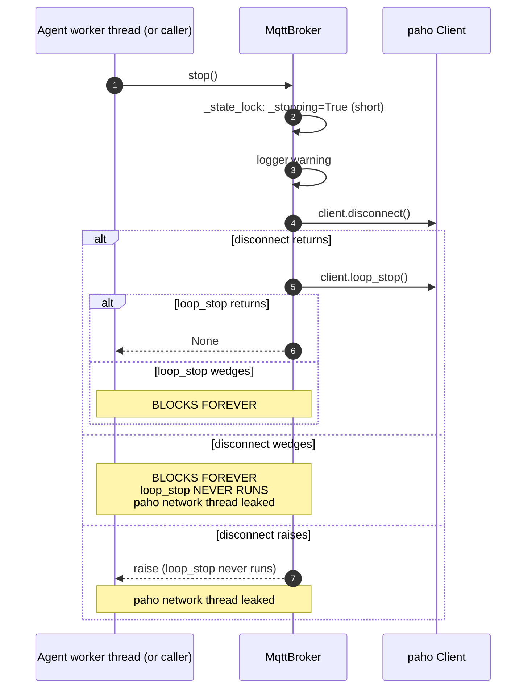
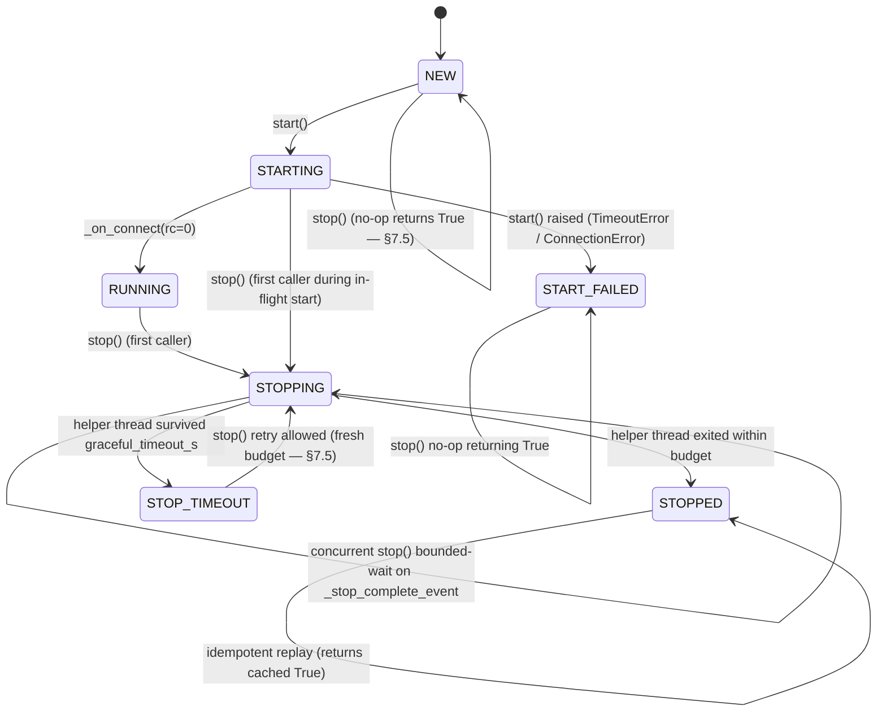

# RFC-010 — Broker bounded shutdown

- **Status**: **Implemented** (2026-07-28)
- **Author**: Audit follow-up
- **Depends on**: `docs/audit/05-risk-register.md` R-10.4 (broker.stop wedge — runtime-confirmed); downstream of RFC-005 (subscription recovery), RFC-008 (ProcessWorker lifecycle), RFC-009 (ThreadWorker lifecycle)
- **Scope**: Give `MqttBroker.stop()` a bounded, deterministic shutdown contract — a broker-side state machine, concurrent-stop coordination, disconnect / loop_stop exception isolation, callback-after-stop fencing on the two paths that currently leak (`_on_message`, `_on_connect._connect_ok`), and a well-defined observation surface for `Agent.terminate()`. Aligns the broker layer with the RFC-008 / RFC-009 bounded-shutdown story so `ThreadWorker` no longer needs to swallow the broker's hang as `STOP_TIMEOUT`.
- **Explicitly out of scope**: MQTT reconnect policy (RFC-005 already owns this), offline publish queue, broker clustering / failover, heartbeat / liveness probes, `ProcessWorker` / `ThreadWorker` redesign, `Parcel` / Message Schema changes, migration to a non-paho MQTT library, `MessageBroker` ABC signature change (opt-in per §7.16)

---

## 0. Implementation summary (2026-07-28)

Diverges from §6–§7 wherever explicitly noted; where not noted, the recommended design was implemented verbatim.

**WorkerState (`src/agentflow/core/agent_worker.py`)**

- Extended the RFC-008 / RFC-009 enum with one new member:
  - `STOP_FAILED` — MqttBroker-only. Helper thread exited abnormally without setting the `_stop_helper_completed_normally` marker (e.g. `BaseException` propagated out of paho). Terminal — retry via `stop()` replays the cached `False`.
- `STOP_TIMEOUT` (added by RFC-009 for ThreadWorker) is now also used by `MqttBroker` for its bounded-join outcome; documented in the enum's docstring.

**MqttBroker rewrite (`src/agentflow/broker/mqtt_broker.py`)**

- Full state machine `NEW → STARTING → RUNNING → STOPPING → STOPPED / STOP_TIMEOUT / STOP_FAILED / START_FAILED`, all transitions under the existing `_state_lock`.
- Read-only properties: `state: WorkerState`, `last_stop_exception: Optional[BaseException]`.
- `start(self, options)`:
  - Transitions `NEW → STARTING` at entry (non-`NEW` start logged but not gated in first-phase).
  - `_on_connect(rc=0)` transitions `STARTING → RUNNING` inside the same `_state_lock` section that sets `_connected=True`.
  - `wait=True` timeout / connection-error path sets `START_FAILED` before the cleanup `loop_stop` + `disconnect`.
- `stop(self, graceful_timeout_s=5.0) -> bool`:
  - Short `_state_lock` section only (no I/O, no join, no logger — lock hygiene).
  - Dispatch:
    - `NEW` → return `True`, state stays `NEW`, `_stopping` NOT flipped (so a subsequent `start()` is unimpeded).
    - `STOPPED` / `START_FAILED` → return `True` (idempotent shortcut). `START_FAILED` additionally sets `_stopping` to fence any late callback.
    - `STOP_FAILED` → return cached `False` (idempotent replay of failure result).
    - `STARTING` → `RuntimeError` (first-phase; RFC-010 modification 3).
    - `STOPPING` → waiter path (bounded).
    - `RUNNING` → transition to `STOPPING`; at the same lock section: `_stopping=True`, `_connected=False`, `_connect_ok=False`, `_connected_evt.clear()`, `_stop_complete_event.clear()`; first-caller path.
    - `STOP_TIMEOUT` → retry-first-caller path (RFC-010 modification 1 — same helper, no new spawn, no new paho calls).
  - First-caller path (lock-external):
    1. If not retry: spawn `daemon=True` helper thread targeting `_run_stop_helper`.
    2. If retry: re-join the retained `_stop_helper_thread`.
    3. `helper.join(graceful_timeout_s)`.
    4. Under lock: `alive → STOP_TIMEOUT + False`; `dead + _stop_helper_completed_normally → STOPPED + True`; `dead + not completed_normally → STOP_FAILED + False`.
    5. `finally`: unconditional `_stop_complete_event.set()`.
    6. Lock-external log (INFO on success; WARNING on timeout with daemon interpreter-exit caveat; ERROR on STOP_FAILED).
  - Waiter path (bounded, RFC-010 §E):
    - `_stop_complete_event.wait(graceful_timeout_s + 0.1)` — coordination margin 0.1s.
    - Completed → return cached `_last_stop_result`.
    - **Not** completed → read `helper.is_alive()`, log WARNING, return `not alive`. Never unbounded wait.
- `_run_stop_helper` (daemon thread body):
  - `try: client.disconnect() except Exception:` — capture into `_last_stop_exception` (first exception retained; RFC-010 §7.9).
  - `try: client.loop_stop() except Exception:` — capture (only if the first slot is empty).
  - Set `_stop_helper_completed_normally = True` only if both `try/except` sections were reached (i.e. no `BaseException` escaped).
  - `BaseException` is deliberately NOT caught; propagates and kills the helper thread with `completed_normally=False`.
- **Single-helper retry (RFC-010 modification 1)**: same MqttBroker lifecycle → at most ONE helper thread → at most ONE (`disconnect` + `loop_stop`) pair reaches paho.
- **Callback fencing (RFC-010 §F, modification 4)** — three paths fixed:
  - `_on_message`: check `_stopping` under `_state_lock`; set → silent drop, do NOT invoke notifier.
  - `_on_connect(rc=0)`: **entire callback body** is gated by an initial `_state_lock` check on `_stopping`. Set → skip everything (no `_connect_ok=True`, no `_connected=True`, no `_ever_connected` transition, no state transition, no recovery, no notifier call, no `_connected_evt.set()`).
  - `_on_connect(rc!=0)`: also gated — set → skip (no `_connect_ok=False` write, no `_connect_err` write, no `_connected_evt.set()`).
- **`_on_disconnect`** — unchanged (RFC-005 semantics preserved). Still allowed to update `_connected=False` + `_last_disconnect_was_planned` diagnostics; does NOT touch `_stopping` and does NOT trigger recovery.
- **State cleanup at stop linearization** (§G): flipping `_stopping=True` at the RUNNING→STOPPING transition is accompanied by immediate `_connected=False`, `_connect_ok=False`, `_connected_evt.clear()` in the **same** lock section.

**Agent.__deactivating (`src/agentflow/core/agent.py`)**

- `Agent.terminate` signature and behaviour **unchanged**; never-raise contract preserved.
- `__deactivating` observes `broker.stop()`'s new `bool` return:
  - `False` (STOP_TIMEOUT or STOP_FAILED) → log WARNING with `state`, `last_stop_exception`, and the daemon interpreter-exit caveat.
  - `True` → silent.
  - `None` (legacy brokers like `EmptyBroker`) → treated as success via `stopped is False` guard (not `not stopped`).
- Wraps `broker.stop()` in `try: … except Exception:` — misbehaving broker `.stop()` never propagates.
- Docstring explicitly states: bounded return of `__deactivating()` only guarantees this method returns; it does NOT guarantee the paho network thread was reclaimed (RFC-009 §H / RFC-010 Appendix A).

**Divergences from §6–§7**

| RFC section | Design | Implementation | Reason |
|---|---|---|---|
| §7.11 STOP_TIMEOUT retry | Spawn a fresh helper on each retry (paho is thread-safe) | **Same helper re-joined; no new spawn; no new paho calls** (RFC-010 modification 1 applied at implementation review) | Guarantees "one MqttBroker lifecycle = one paho stop pair" invariant; simplifies reasoning about paho call counts; matches the modification list explicitly. |
| §7.15 BaseException policy | Documented as masking (`STOPPED` with `_last_stop_exception=None`) | **`STOP_FAILED` + `_stop_helper_completed_normally=False`** distinguishes abnormal exit from clean stop (RFC-010 modification 2 applied at implementation review) | Prevents mislabeling a crashed helper as a successful stop. `state` now reflects reality; caller who checks `broker.state is WorkerState.STOP_FAILED` gets the truth. |
| §6.3 STARTING.stop() | Allowed — first-caller transitions STARTING → STOPPING | **RuntimeError** (RFC-010 modification 3 applied at implementation review) | Avoids disconnect / loop_stop on a half-initialised client. Start-stop coordination deferred. |
| §7.10 callback fencing scope | Rules for `_on_message` + `_on_connect._connect_ok` + `_on_connect._connected_evt` | **Entire `_on_connect` callback body gated** (both rc=0 and rc!=0 branches) (RFC-010 modification 4 applied at implementation review) | Comprehensive: no active-state resurrection is possible from any post-stop callback. `_on_disconnect` stays diagnostic-only (RFC-005 semantics). |
| §G state cleanup | Not explicitly listed | **`_connected=False`, `_connect_ok=False`, `_connected_evt.clear()`** happen in the SAME lock section that flips `_stopping=True` and transitions `RUNNING → STOPPING` | Guarantees any inline callback that lands during helper execution observes a fully-fenced state (not partially fenced). |

Otherwise, decisions §7.1–§7.21 landed as designed.

**Runtime verification (2026-07-28)**

- RFC-010 dedicated file `tests/unit/test_mqtt_broker_shutdown.py`: **53 passed** in ~2 s (categories A basic lifecycle × 10, B idempotency + concurrency × 10, C bounded stop + STOP_TIMEOUT retry × 7, D exception behaviour × 6, E callback fencing × 7, F concurrent waiter bounded × 2, G linearization state cleanup × 3, H observability × 6, I Agent integration × 2).
- `tests/unit/test_mqtt_broker_reconnect.py` — **48 passed** unchanged (2 tests refactored to prime broker to RUNNING before stop; RFC-005 semantics preserved).
- `tests/unit/core/test_thread_worker_lifecycle.py` — **35 passed** unchanged.
- `tests/unit/core/test_process_worker_lifecycle.py` — **33 passed** unchanged.
- Full unit regression: `PYTHONPATH=src pytest tests/unit` → **377 passed, 0 failed, 0 xfailed(strict-pass), 2 xfailed** in ~34 s.
- R-02 / R-03 / R-04 / R-05 / R-13 / RFC-006 / RFC-007 / RFC-008 / RFC-009 — zero regression.
- 2 xfails preserved from RFC-007 (correlation ID / multi-handler fan-out — deferred).

**Files changed**

- `src/agentflow/core/agent_worker.py` — +7 lines (`WorkerState.STOP_FAILED` addition + docstring).
- `src/agentflow/broker/mqtt_broker.py` — +392 −52 lines (full rewrite of stop lifecycle + fencing; RFC-005 subscribe/unsubscribe/recovery paths preserved).
- `src/agentflow/core/agent.py` — +41 −11 lines (`__deactivating` only; `Agent.terminate` unchanged).
- `docs/rfc/RFC-010-broker-bounded-shutdown.md` — this file (status flip).
- `tests/unit/test_mqtt_broker_shutdown.py` — rewritten to the post-RFC-010 contract (42 → 53 tests).
- `tests/unit/test_mqtt_broker_lifecycle.py` — 3 tests refactored (prime to RUNNING for helper-thread path).
- `tests/unit/test_mqtt_broker_reconnect.py` — 2 tests refactored (same rationale).

**Daemon / interpreter-exit limitation NOT resolved**

- The helper thread is `daemon=True` (RFC-010 §7.13 / Appendix A) — that thread does not block interpreter exit.
- **But** if `ThreadWorker`'s work thread (which is `daemon=False`, RFC-009 §7.13) is waiting on `broker.stop()` when the broker reaches `STOP_TIMEOUT`, the worker thread stays alive and Python interpreter shutdown will still block on it. This is the R-10.5 residual documented by RFC-009 §H — RFC-010 explicitly does **not** claim to resolve it.

**Not implemented (deferred to future RFCs)**

- Guaranteed paho helper resource completion (a wedged paho socket may keep the helper alive even after we return; helper is daemonised so it does not block interpreter exit, but the socket/file descriptor is not force-closed).
- `MqttBroker.start()` / `client.connect()` bounded lifecycle — a wedged `connect()` before `_connected_evt.wait` can still hang. `wait=True` `timeout` bounds the wait but not the connect syscall itself.
- `MessageBroker` ABC timeout contract — kept as `stop(self)` (§7.16); unifying across `EmptyBroker` / third-party subclasses requires a separate RFC.
- `STARTING.stop()` coordination — deferred; first-phase raises RuntimeError.
- Other broker implementations (`RedisBroker`, `RosBroker`, `DdsBroker`) — R-22 flagged as unregistered / broken; not in RFC-010 blast radius today.
- Reconnect policy / offline publish queue / broker clustering / failover — RFC-005 owns reconnect; rest are separate future RFCs.
- Publish result observability — paho `MessageInfo (rc/mid)` still discarded (RFC-002 residual).

---

## 1. Problem statement

`MqttBroker.stop()` (`src/agentflow/broker/mqtt_broker.py:197-205`, verbatim):

```python
def stop(self):
    with self._state_lock:
        self._stopping = True
    logger.warning("MQTT broker is stopping...")
    self._client.disconnect()
    self._client.loop_stop()
```

No `timeout` parameter. No return value. No `try/except` around either paho call. No idempotence guard. No `_stop_complete_event` pattern. RFC-005 correctly flips `_stopping=True` before the paho calls (§6.5), but that is the extent of the bounded contract. When `paho.mqtt.client.Client.disconnect()` or `.loop_stop()` blocks — the exact failure mode observed in RFC-009 `test_E2_agent_terminate_hangs_when_broker_stop_hangs_bounded_via_controller` — this method blocks the caller forever.

Because `Agent.__deactivating()` calls `self._broker.stop()` from the worker thread (`agent.py:423`), a wedged broker.stop hangs the worker thread → `ThreadWorker.stop()`'s bounded join reaches `STOP_TIMEOUT` → `Agent.terminate()` returns bounded via RFC-009 but leaves a live non-daemon worker thread + a live paho network thread → interpreter shutdown blocks. RFC-009 §H documented this as an accepted architectural limitation *specifically pending this RFC*.

The 42 characterisation tests in `tests/unit/test_mqtt_broker_shutdown.py` (2026-07-28) confirm the following residual gaps:

- **Unbounded disconnect / loop_stop** (`test_C21`, `test_C22`): wedged `client.disconnect()` blocks stop forever with `loop_stop` not yet invoked; wedged `client.loop_stop()` similarly blocks. Bounded via daemon-controller pattern; release Event lets the test drain cleanly.
- **No idempotence** (`test_B11`): three back-to-back `stop()` calls fire three `disconnect()` + three `loop_stop()`.
- **No concurrent-stop coordination** (`test_B12`, `test_B13`): N callers each fire their own `disconnect()` + `loop_stop()`; all return `None`.
- **Exception isolation missing** (`test_D28`, `test_D29`, `test_D30`, `test_D32`): a raise from `disconnect()` propagates AND prevents `loop_stop()` from running — a paho network thread leak. A raise from `loop_stop()` propagates. Partial cleanup leaves `_stopping=True` set but paho half-torn-down.
- **Callback-after-stop fencing gaps** (all documented as *bug-shaped* in the characterisation):
  - `test_E36`: `_on_message` has **no `_stopping` check**; late callbacks continue to dispatch to the notifier after stop returned.
  - `test_E37`: `_on_connect`'s `finally: self._connected_evt.set()` runs unconditionally, so a late callback re-sets the connect event.
  - `test_E38`: `_on_connect` writes `self._connect_ok = True` **before** the `_stopping` check, so a late callback with `rc=0` leaves `_connect_ok=True` while `_connected` (lock-protected) correctly stays `False` — the two flags diverge.
- **Base state on wedge** (`test_A5`, `test_A6`, `test_A7`): `stop()` itself does not clear `_connected` / `_connect_ok` / `_connected_evt`; those are only cleared by `_on_disconnect`. If disconnect wedges, the callback never fires and the flags never clear — a caller observing them post-stop sees stale True.
- **`MessageBroker` ABC has no bounded-stop contract** (`test_F40`): `stop(self)` with a one-line docstring; no timeout, no return-type annotation, no bounded-shutdown wording.

This RFC proposes the **minimum viable bounded stop** for `MqttBroker`: a wrapper that runs `disconnect + loop_stop` on a helper thread, joins with a bounded deadline, coordinates concurrent stop callers via `_stop_complete_event`, isolates per-paho-call exceptions, fences the three callback-after-stop paths, and exposes a `bool` return so `Agent.terminate()` can log a WARNING (RFC-009 §7.14 pattern) when the broker itself times out. `MessageBroker` ABC is intentionally left unchanged (§7.16) — the improved contract is `MqttBroker`-only; other brokers can opt in later without breaking third-party subclasses.

---

## 2. Runtime evidence

Baseline before this RFC: `PYTHONPATH=src pytest tests/unit` → **366 passed, 2 xfailed** in ~34 s (post-RFC-009 + post R-10.4 characterisation).

Confirmed by `tests/unit/test_mqtt_broker_shutdown.py` (42 characterisation tests, all currently PASSED against the broken code):

| # | Behaviour | Test |
|---|---|---|
| A1 | `stop()` calls `client.disconnect()` | `test_A1_stop_calls_client_disconnect` |
| A2 | `stop()` calls `client.loop_stop()` | `test_A2_stop_calls_client_loop_stop` |
| A3 | disconnect before loop_stop | `test_A3_stop_calls_disconnect_before_loop_stop` |
| A4 | `_stopping` flipped before disconnect | `test_A4_stop_flips_stopping_before_calling_disconnect` |
| A5–A7 | `stop()` alone does NOT clear `_connected` / `_connect_ok` / `_connected_evt` | `test_A5` / `test_A6` / `test_A7` |
| A8 | Post-stop `_on_disconnect` classifies planned regardless of rc | `test_A8_planned_disconnect_classified_correctly_after_stop` |
| A9 | Registry preserved across stop | `test_A9_stop_preserves_subscription_registry` |
| A10 | subscribe/unsubscribe after stop return `None`, don't touch registry | `test_A10_subscribe_and_unsubscribe_after_stop_return_None` |
| B11 | Repeated `stop()` fires disconnect+loop_stop each time | `test_B11_repeated_stop_calls_disconnect_and_loop_stop_each_time` |
| B12/B13 | Concurrent `stop()` — no coordination, N callers → N calls | `test_B12` / `test_B13` |
| B14 | Stop-before-start still calls paho methods (client exists from __init__) | `test_B14` |
| B15 | Stop after `start(wait=True)` timeout fires paho a second time | `test_B15` |
| B16 | Stop concurrent with `_on_connect` — skip path holds if `_stopping` flipped first | `test_B16` |
| B17 | Concurrent `_on_disconnect` classified as planned | `test_B17` |
| B18 | Concurrent `subscribe()` observes `_stopping` → no-op | `test_B18` |
| B19 | Recovery loop aborts when `_stopping` flips mid-loop | `test_B19` |
| B20 | Inline `_on_disconnect` from `disconnect()` does NOT deadlock (lock hygiene) | `test_B20` |
| C21 | Wedged `disconnect()` → `stop()` hangs (bounded observation via probe) | `test_C21_stop_hangs_when_client_disconnect_never_returns` |
| C22 | Wedged `loop_stop()` → `stop()` hangs (bounded observation via probe) | `test_C22_stop_hangs_when_client_loop_stop_never_returns` |
| C25–C27 | Source-level chain from `Agent.terminate` → wedged `broker.stop`; ProcessWorker's terminate/kill is the only production containment | `test_C25` / `test_C26` / `test_C27` |
| D28–D33 | `stop()` propagates every exception from paho / callbacks (including `BaseException`); disconnect raise prevents loop_stop | `test_D28`..`test_D33` |
| E34 | Late `_on_connect(rc=0)` after stop skips notifier + recovery | `test_E34` |
| E35 | Late `_on_disconnect` after stop marks planned | `test_E35` |
| E36 | Late `_on_message` after stop **still forwards to notifier** (bug-shaped) | `test_E36` |
| E37 | Late `_on_connect` **still sets `_connected_evt`** (bug-shaped, benign) | `test_E37` |
| E38 | Late `_on_connect(rc=0)` **still writes `_connect_ok = True`** (bug-shaped; diverges from lock-protected `_connected`) | `test_E38` |
| F39 | `EmptyBroker.stop` is idempotent by construction (no state, no client) | `test_F39` |
| F40 | `MessageBroker` ABC does not specify timeout / return / bounded contract | `test_F40` |
| F41 | Redis / ROS / DDS stubs unregistered per R-22 — out of scope for R-10.4 today | `test_F41` |
| F42 | Baseline: `MessageBroker.stop` signature is `stop(self)` — guard against silent drift | `test_F42` |

---

## 3. Current state

Source (`src/agentflow/broker/mqtt_broker.py:197-205`):

```python
def stop(self):
    with self._state_lock:
        self._stopping = True
    logger.warning("MQTT broker is stopping...")
    self._client.disconnect()   # UNBOUNDED
    self._client.loop_stop()    # UNBOUNDED
```



`_on_message` (verbatim, `mqtt_broker.py:152-156`):

```python
def _on_message(self, client, db, message):
    try:
        self._notifier._on_message(message.topic, message.payload)
    except Exception as ex:
        logger.exception(ex)
```

No `_stopping` check. A late callback delivers to the notifier after `stop()` returned.

`_on_connect` (verbatim, `mqtt_broker.py:52-90`) writes `self._connect_ok = True` at line 54 **before** the state-lock `_stopping` check at line 65. So a late callback with `rc=0` after stop leaves `_connect_ok = True` while `_connected` (lock-protected inside the `else` branch) correctly stays `False`.

Beyond `MqttBroker`: `EmptyBroker.stop` is a `logger.info` — idempotent, bounded by construction, no state. `MessageBroker` ABC declares `stop(self)` with a one-line docstring; no timeout, no return.

---

## 4. Desired state

- `MqttBroker.stop(graceful_timeout_s: float = 5.0) -> bool` follows a **bounded cooperative shutdown**: run `disconnect + loop_stop` on a helper thread, join with `graceful_timeout_s`, return `True` if the thread exited, `False` if it survived — the latter transitions to `STOP_TIMEOUT`.
- An explicit **broker-side state machine**: `NEW → STARTING → RUNNING → STOPPING → STOPPED / STOP_TIMEOUT` (or `NEW → STARTING → START_FAILED` on start error). Read-only `state` property; `stop()` return + `state` form the observation surface.
- **Concurrent `stop()` callers** share exactly one shutdown attempt via `_stop_complete_event`; every caller returns the same `bool`. Bounded wait — same margin pattern as RFC-009 §E.
- **Idempotent replay** for `stop()` after `STOPPED`; **retry allowed** from `STOP_TIMEOUT` with a fresh budget (analog to RFC-009 §D).
- **Per-paho-call exception isolation**: `disconnect` and `loop_stop` are each wrapped in `try/except Exception`; a failure in one does not prevent the other. Exceptions are captured, logged, and become part of the state outcome (`STOP_FAILED`? no — see §7.9: we merge into a single `_last_exception` on the broker and continue). `BaseException` propagates unchanged.
- **Callback-after-stop fencing** on the three currently-leaky paths:
  - `_on_message` gains a `_stopping` check inside a short lock section; when set, silently drop the message before touching the notifier.
  - `_on_connect` re-orders: the `_state_lock` block runs **first**, so `_connect_ok = True` (and the `_connected_evt.set()` finally) only execute when we are *not* stopping.
  - `_on_disconnect` (already fine per A.8) has explicit test coverage locked in.
- **Registry preserved for diagnostics** on stop (§7.12) but never resurrected — RFC-005's recovery path is already gated by `_stopping`.
- **`Agent.terminate()`** observes the broker layer indirectly via the worker (unchanged): `worker.stop()` return already reaches `Agent.terminate` (RFC-009). This RFC adds a *direct* WARNING when `Agent.__deactivating` observes `broker.stop()` returning `False` (§7.18). Log-only change; `Agent.terminate` signature unchanged.
- **Daemon policy for the helper thread**: `daemon=True`. Rationale: the helper thread's whole purpose is to *contain* a possibly-wedged paho call; making it non-daemon would defeat the containment. Unlike RFC-009 §7.13 (worker thread is `daemon=False` because it runs user-owned setup / teardown), this thread runs only the two paho lifecycle calls and has no user code to run. **The helper thread being daemon does not resolve the underlying orphan / non-daemon interpreter-exit risk described in RFC-009 §H — that risk lives on the worker thread, which this RFC does not change.**
- **`MessageBroker` ABC left unchanged** (§7.16). The new signature is `MqttBroker`-only. `EmptyBroker` (default no-op) continues to satisfy the ABC. Third-party subclasses are not forced to migrate.

---

## 5. Options considered

### Option A — Keep the current in-line `disconnect + loop_stop` (do nothing)

| Aspect | Analysis |
|---|---|
| Fixes R-10.4 | ✗ |
| Backwards compat | Perfect |
| Complexity | Zero |
| Risk | Preserves the observed hang; RFC-009 §H limitation stays uncapped |
| Verdict | Rejected — the characterisation exists specifically to drive this RFC |

### Option B — Reorder to `loop_stop + disconnect`

Swap the two paho calls: stop the network loop first, then disconnect.

| Aspect | Analysis |
|---|---|
| paho semantics | Wrong. `loop_stop` joins the network thread; `disconnect` needs the loop alive to send DISCONNECT to the broker. Reversing them means the broker never sees a clean DISCONNECT; the connection is dropped on TCP RST instead of MQTT protocol close. |
| Fixes hang | ✗ — a wedged `loop_stop` still hangs; the order is not the problem |
| Verdict | Rejected — swaps a semantic wart for the same hang |

### Option C — Helper-thread bounded wrapper (**recommended**)

Spawn a **daemon** helper thread that runs `disconnect + loop_stop` (with per-call exception isolation), `join(graceful_timeout_s)` in the calling thread, return `bool`. Combine with `_state_lock` state machine, `_stop_complete_event` coordination, callback-fencing improvements.

| Aspect | Analysis |
|---|---|
| Fixes hang | ✓ — caller returns in bounded time |
| Exception isolation | ✓ — each paho call in its own `try/except` inside the helper |
| Concurrent stop | ✓ — first caller launches the helper; waiters wait bounded on the completion event |
| Idempotence + retry | ✓ — cached `_last_stop_result`; `STOP_TIMEOUT → STOPPING` retry allowed |
| Symmetry with RFC-009 | High — same `WorkerState` extension pattern (`STOP_TIMEOUT`), same `_stop_complete_event` pattern, same `_last_stop_result` pattern |
| Daemon helper thread | Contained: the helper has no user code; safe to daemonise so it doesn't outlive the interpreter |
| Verdict | **Recommended** |

### Option D — Dedicated MQTT lifecycle executor (`concurrent.futures.ThreadPoolExecutor`)

Instantiate a per-broker `ThreadPoolExecutor(max_workers=1)`; submit stop work as a future; `Future.result(timeout=...)` gives the bounded semantics.

| Aspect | Analysis |
|---|---|
| Fixes hang | ✓ |
| Complexity | Higher than C — introduces an executor lifecycle (must be `.shutdown()` itself; must not race construction) |
| Semantic surface | Larger — futures have their own cancel semantics that we don't want (paho can't be cancelled anyway) |
| Symmetry with RFC-009 | Diverges — RFC-009 uses `threading.Thread` + `join(timeout)` |
| Verdict | Rejected — Option C achieves the same outcome with less machinery |

### Option E — Daemon helper thread as *pure containment* (no state machine)

Fire-and-forget: `threading.Thread(target=paho_stop, daemon=True).start()`; caller returns immediately.

| Aspect | Analysis |
|---|---|
| Fixes hang | Sort of — caller never blocks |
| Observability | None — caller cannot tell whether stop actually happened |
| Concurrent stop | Each call spawns a new thread; two disconnects run in parallel (undefined paho behaviour) |
| Verdict | Rejected — hides the failure instead of surfacing it. Option C is only marginally more work and gives real observation. |

### Option F — Deprecate blocking paho lifecycle calls (switch to `aiomqtt` / non-paho / custom protocol)

Replace paho with an async or non-blocking client.

| Aspect | Analysis |
|---|---|
| Fixes hang | Depends on replacement library's own guarantees |
| Blast radius | Enormous — every broker call site, every test |
| Precedent | None; audit found no prior work in this direction |
| Verdict | Rejected as first-phase; RFC-010 is scoped to *make paho tolerable*, not to migrate away |

### Comparison summary

| Criterion | A | B | **C** | D | E | F |
|---|---|---|---|---|---|---|
| Bounded caller return | ✗ | ✗ | ✓ | ✓ | ✓ | depends |
| Preserves paho semantics | ✓ | ✗ | ✓ | ✓ | ✓ | n/a |
| Explicit timeout observability | ✗ | ✗ | ✓ | ✓ | ✗ | depends |
| Concurrent-stop coordination | ✗ | ✗ | ✓ | ✓ | ✗ | depends |
| Exception isolation | ✗ | ✗ | ✓ | ✓ | ✗ | depends |
| Symmetry with RFC-008/009 | ✗ | ✗ | ✓ | ~ | ✗ | ✗ |
| Complexity | Low | Low | **Med** | Med+ | Low | Very High |
| Public API breakage | None | None | Minimal | Minimal | None | Massive |
| Verdict | rej | rej | **chosen** | rej | rej | rej |

---

## 6. Recommended design

Adopt **Option C**. Extend `WorkerState` (or introduce a broker-local `BrokerState` — see §7.2) to carry the same shape as RFC-008/009 minus the process-only `FAILED` variant, using the ThreadWorker-style `STOP_TIMEOUT` state.

### 6.1 State machine (broker-side)



Compared to RFC-009 (`ThreadWorker`): there is no `FAILED` state — paho calls raising is captured into `_last_exception` but does not itself terminate the broker; the helper thread still runs both calls and then joins. See §7.9.

### 6.2 New attributes on `MqttBroker`

- `_state: WorkerState` — reuses the RFC-008 enum (no new module) — protected by `_state_lock` (existing).
- `_stop_complete_event: threading.Event` — cleared by the first caller of each attempt; set by the helper thread's `finally`.
- `_last_stop_result: bool = True` — cached first-attempt outcome; read by concurrent waiters.
- `_last_stop_exception: Optional[BaseException] = None` — any exception raised by `disconnect` or `loop_stop` during the last attempt; not re-raised.
- `_stop_helper_thread: Optional[threading.Thread]` — retained across `STOP_TIMEOUT` for `is_working()`-style introspection.

Read-only properties: `state`, `last_stop_exception`.

The existing `_stopping: bool` remains — it drives callback fencing (§7.10) and is redundant with `_state in (STOPPING, STOP_TIMEOUT, STOPPED)`, but keeping it minimises churn to subscribe/unsubscribe / recovery / callback paths.

### 6.3 `MqttBroker.stop(graceful_timeout_s=5.0) -> bool`

```python
def stop(self, graceful_timeout_s: float = 5.0) -> bool:
    is_waiter = False
    with self._state_lock:
        current = self._state
        if current in (WorkerState.NEW, WorkerState.START_FAILED):
            self._stopping = True   # fence future callbacks anyway
            return True
        if current == WorkerState.STOPPED:
            return True
        if current == WorkerState.STARTING:
            # First-caller path — allow stop during in-flight start
            self._state = WorkerState.STOPPING
            self._stopping = True
            self._stop_complete_event.clear()
        elif current == WorkerState.STOPPING:
            is_waiter = True
        elif current in (WorkerState.RUNNING, WorkerState.STOP_TIMEOUT):
            self._state = WorkerState.STOPPING
            self._stopping = True
            self._stop_complete_event.clear()

    if is_waiter:
        coordination_margin_s = 0.1
        completed = self._stop_complete_event.wait(
            graceful_timeout_s + coordination_margin_s
        )
        if completed:
            with self._state_lock:
                return self._last_stop_result
        # Bounded fallback — do not wait forever.
        alive = self._stop_helper_thread is not None and self._stop_helper_thread.is_alive()
        logger.warning(
            "MqttBroker.stop coordination wait timed out; helper alive=%s",
            alive,
        )
        return not alive

    # First-caller path — spawn helper, join bounded.
    helper = threading.Thread(
        target=self._run_stop_helper,
        name=f'MqttBrokerStop-{id(self)}',
        daemon=True,                  # §7.13 rationale
    )
    self._stop_helper_thread = helper
    helper.start()
    helper.join(graceful_timeout_s)

    alive = helper.is_alive()
    with self._state_lock:
        if alive:
            self._state = WorkerState.STOP_TIMEOUT
            self._last_stop_result = False
        else:
            self._state = WorkerState.STOPPED
            self._last_stop_result = True
    self._stop_complete_event.set()

    if alive:
        logger.warning(
            "MqttBroker.stop timeout after %.1fs; helper still running "
            "(paho disconnect / loop_stop wedged). Retry stop() to try "
            "again. Note: the wedged paho network thread is not daemon; "
            "if a Worker with daemon=False is waiting on this broker, "
            "interpreter shutdown may still block. See RFC-009 §H.",
            graceful_timeout_s,
        )
    else:
        if self._last_stop_exception is not None:
            logger.info(
                "MqttBroker stopped with captured exception during "
                "disconnect/loop_stop: %r",
                self._last_stop_exception,
            )
        else:
            logger.info("MqttBroker stopped cleanly")
    return self._last_stop_result


def _run_stop_helper(self):
    """Helper thread body. Runs disconnect + loop_stop with per-call
    exception isolation. BaseException propagates and dies with the
    thread (documented — see §7.15)."""
    try:
        try:
            self._client.disconnect()
        except Exception as ex:
            self._last_stop_exception = ex
            logger.exception(
                "MqttBroker.stop: client.disconnect() raised: %r", ex,
            )
        try:
            self._client.loop_stop()
        except Exception as ex:
            # Do not overwrite a prior disconnect exception; append via log.
            if self._last_stop_exception is None:
                self._last_stop_exception = ex
            logger.exception(
                "MqttBroker.stop: client.loop_stop() raised: %r", ex,
            )
    # No `finally` state work here — first-caller path in stop() drives
    # the state transition after join() returns. This keeps state
    # machine writes on ONE thread (the caller) and avoids a race.
```

### 6.4 Callback-after-stop fencing (bug fixes)

**`_on_message` (§7.10 rule 1)** — add a stopping check at the top:

```python
def _on_message(self, client, db, message):
    with self._state_lock:
        if self._stopping:
            return
    try:
        self._notifier._on_message(message.topic, message.payload)
    except Exception as ex:
        logger.exception(ex)
```

Fixes `test_E36`.

**`_on_connect` (§7.10 rule 2)** — move `_connect_ok = True` write to **inside** the state-lock block, and gate the `finally: _connected_evt.set()`:

```python
def _on_connect(self, client, userdata, flags, reasonCode, properties):
    if reasonCode == 0:
        # Decide skip/proceed under lock FIRST; only mutate flags
        # in the branch we chose.
        skip = False
        snapshot: Dict[str, Any] = {}
        is_first = False
        with self._state_lock:
            if self._stopping:
                skip = True
            else:
                self._connect_ok = True
                self._connect_err = None
                is_first = not self._ever_connected
                self._ever_connected = True
                self._connected = True
                if not is_first:
                    snapshot = dict(self._registry)
        if skip:
            # Post-stop callback fences: do NOT set _connect_ok,
            # do NOT set _connected_evt.
            return
        try:
            logger.info(f"MQTT broker connected: ...")
            if snapshot:
                self._recover_subscriptions(snapshot)
            self._notifier._on_connect()
        finally:
            self._connected_evt.set()
    else:
        # (unchanged failure branch)
```

Fixes `test_E37` and `test_E38`.

**`_on_disconnect`** — already fences correctly (`test_A8` / `test_E35`); no code change.

### 6.5 Idempotency + concurrent stop coordination

Modelled directly on RFC-008 / RFC-009: `_stop_complete_event` cleared by first caller of each attempt, set once the outcome is cached. Concurrent waiters read `_last_stop_result`. Bounded wait `graceful_timeout_s + 0.1s` coordination margin. `STOP_TIMEOUT → STOPPING` retry is allowed with a fresh budget.

### 6.6 `Agent.terminate()` integration (§7.18)

The **worker layer already observes broker wedging indirectly** — a wedged `broker.stop()` causes `ThreadWorker` to reach `STOP_TIMEOUT`, which RFC-009 already reports via WARNING. This RFC adds a *direct* observation surface for callers who read `broker.state` or `broker.last_stop_exception`.

Additionally, `Agent.__deactivating` (in `agent.py:419-425`) gains a log-only change — it observes `broker.stop()`'s new `bool` return and logs a WARNING when the broker timed out:

```python
def __deactivating(self):
    self.on_terminating()
    if self._broker:
        try:
            stopped = self._broker.stop()
            if stopped is False:
                logger.warning(self.M(
                    f"broker.stop() timed out; state="
                    f"{getattr(self._broker, 'state', 'unknown')}"
                ))
        except Exception as ex:
            logger.exception(self.M(
                f"__deactivating: broker.stop() raised: {ex!r}"
            ))
    self.on_terminated()
```

`Agent.terminate()` signature unchanged. `Agent.__deactivating` signature unchanged. Legacy broker `stop()` returning `None` is treated as success (not-False).

---

## 7. Concrete decisions (all 21)

### 7.1 Stop linearisation point

The `_state_lock` is acquired for a **short** section only, and the state transition from `RUNNING`/`STOP_TIMEOUT`/`STARTING` → `STOPPING` is the linearisation point. All subscribe / unsubscribe / callback / recovery paths that check `_stopping` inside the same lock therefore observe a coherent transition.

### 7.2 State machine

Reuses the RFC-008 `WorkerState` enum (`src/agentflow/core/agent_worker.py:13`). No new module. States used: `NEW`, `STARTING`, `RUNNING`, `STOPPING`, `STOPPED`, `START_FAILED`, `STOP_TIMEOUT`. `FAILED` (RFC-009 ThreadWorker-only) is **not** used by the broker — paho call exceptions are captured into `_last_stop_exception` instead (§7.9). The enum is broker-adjacent already (the broker imports from `agent_worker` today via the notifier boundary — no new cycle).

### 7.3 Timeout contract

`graceful_timeout_s: float = 5.0`, method-arg only. Configurable per-call. Matches RFC-008 / RFC-009 defaults for symmetry. Not surfaced through `agent_config` in first-phase — parity with RFC-009 §7.10 (deferred to a future RFC iff a real deployment surfaces a need).

### 7.4 Return type

`bool`. `True` = helper exited (or `NEW` / `STOPPED` / `START_FAILED` shortcut). `False` = helper survived `graceful_timeout_s` — state → `STOP_TIMEOUT`. Return-type widening from the current `None` is source-compatible (in-tree caller `Agent.__deactivating` currently ignores the return; §7.18 changes it to log-only observation).

### 7.5 Repeated `stop()`

Idempotent replay after `STOPPED` (returns cached `True`). No-op returning `True` from `NEW` or `START_FAILED`. Retry allowed from `STOP_TIMEOUT` (fresh budget, new helper thread — see §7.11 for the wedged-helper concern).

### 7.6 Concurrent `stop()`

Coordinated via `_stop_complete_event`. First caller spawns the helper and joins; subsequent callers observe `STOPPING` and wait `graceful_timeout_s + 0.1s` coordination margin. On event-completion → cached `_last_stop_result`. On event-timeout → read `helper.is_alive()`, WARNING, return `not alive`.

### 7.7 `disconnect` / `loop_stop` ordering

Preserved: `disconnect()` first, then `loop_stop()`. This is paho's documented order and gives the broker a clean MQTT DISCONNECT before the network thread is joined. Option B (reversal) is explicitly rejected in §5.

### 7.8 `disconnect` exception → still call `loop_stop`

Yes. The helper thread wraps each paho call in its own `try/except Exception`, so a raise from `disconnect` does NOT prevent `loop_stop` from running. This is the key exception-isolation change vs the current source (§1, `test_D29`).

### 7.9 `loop_stop` exception handling

Same treatment as disconnect (§7.8). If `disconnect` already recorded an exception into `_last_stop_exception`, we do **not** overwrite it — the earlier exception is more informative for diagnosis. Both exceptions are logged at ERROR via `logger.exception`. The helper thread does NOT re-raise; the outcome flows through the state machine like any other completion.

### 7.10 Callback fencing after stop

Three rules:

1. `_on_message` — check `_stopping` inside `_state_lock` **before** touching `self._notifier._on_message`. Silent drop when set. Fixes `test_E36`.
2. `_on_connect(rc=0)` — move `_connect_ok = True` (and any other flag writes) **inside** the state-lock block so a post-stop callback observes `_stopping=True` and takes the skip path without mutating flags. Fixes `test_E38`.
3. `_on_connect(rc=0)` `finally: self._connected_evt.set()` — gate it: only set when we did NOT skip. Fixes `test_E37`.
4. `_on_disconnect` — already correct (`test_A8` / `test_E35`); no change.

Character of these fixes: pure bug-fix, no behaviour change for pre-stop callbacks.

### 7.11 State + flags on timeout

- `_state = STOP_TIMEOUT`
- `_stopping = True` (already set at stop entry — remains True)
- `_stop_helper_thread` still references the live helper (never cleared until success)
- `_last_stop_result = False`
- `_last_stop_exception` — may be None if the helper is stuck (didn't reach the except-branch)

Retry from `STOP_TIMEOUT` (§7.5) checks `helper.is_alive()`; if the previous helper is still stuck we **spawn a new helper anyway** — paho's client is thread-safe for concurrent method calls, and the second call may progress if the first was stuck on a resource that has since freed. This is a first-phase pragmatic decision; a future RFC may add refusal-to-retry-while-old-helper-alive semantics.

### 7.12 Registry preservation

Preserved (RFC-005 semantics unchanged). `_registry` is retained across `STOPPING → STOPPED / STOP_TIMEOUT` for diagnostics (`broker.recovery_metrics()['active_subscriptions']`). RFC-005's recovery path is already gated by `_stopping`, so preserving the registry does NOT cause a resurrected subscription after stop.

### 7.13 Daemon policy for helper thread

`daemon=True`. Rationale in §4: the helper contains no user code (only two paho lifecycle calls); a daemon helper is contained if paho wedges. This is different from RFC-009 §7.13 where `ThreadWorker`'s work thread is `daemon=False` because it runs user `_activate` / on_activate / broker teardown.

**This decision does NOT resolve the orphan / non-daemon exit risk** — that risk lives on the worker thread waiting on `broker.stop()`, which this RFC does not change. See §7.19 and Appendix A.

### 7.14 `subscribe` / `publish` / `unsubscribe` after stop

Unchanged from RFC-005. `subscribe` / `unsubscribe` check `_stopping` under lock and return `None`. `publish` is not gated today (`mqtt_broker.py:207-208`); this RFC does NOT change publish behaviour (out of scope — deferred to a broker publish-observability RFC). `test_A10` locks the subscribe/unsubscribe half of the contract.

### 7.15 `BaseException` policy

`BaseException` propagates from `_run_stop_helper` unchanged and dies with the helper thread — matches RFC-009 §7.11 (`_run_target`). Consequence: a `KeyboardInterrupt` inside `disconnect` / `loop_stop` will kill the helper without updating `_last_stop_exception`; `stop()`'s first-caller path observes `helper.is_alive() == False` after `join`, marks `STOPPED` with `_last_stop_result = True`, but `_last_stop_exception` is `None` — masking the crash. Documented limitation; parity with RFC-009 §H.

### 7.16 `MessageBroker` ABC signature

**Unchanged**. `stop(self)` stays as declared (`message_broker.py:15-17`). Rationale: adding `timeout_s: float = 5.0` to the ABC would force every existing subclass (including out-of-tree ones) to accept the parameter. `MqttBroker`'s new signature `stop(self, graceful_timeout_s: float = 5.0) -> bool` remains **compatible** with the ABC because:

- The extra parameter is keyword-only with a default → callers of the ABC contract (`broker.stop()`) still work.
- The `bool` return is source-compatible with the ABC's unannotated return.

If a future RFC decides to unify the shape at the ABC level, it can do so cleanly because `MqttBroker` already satisfies the tighter contract.

### 7.17 `EmptyBroker` / other broker compatibility

- `EmptyBroker.stop` — unchanged (`test_F39` idempotent by construction).
- Other broker stubs (Redis / ROS / DDS) — unchanged (R-22 flagged them unregistered; no active path).
- Third-party `MessageBroker` subclasses — unchanged; the ABC signature is preserved.

Consequence: callers that treat every broker as returning `None` from `stop()` remain correct. Callers who want to observe timeout must dispatch on `isinstance(broker, MqttBroker)` or on the `bool` return via `if stopped is False:` (matches RFC-009 `Agent.terminate` style — `None` is treated as success).

### 7.18 `Agent.terminate` observation

`Agent.terminate` itself is **not modified**. The observation happens one level down in `Agent.__deactivating` (private, `agent.py:419-425`), which gains a `try/except` wrapper around `self._broker.stop()` and a WARNING log when the return is `False`. Public API surface unchanged. `Agent.terminate` never-raise contract unchanged.

### 7.19 Logging / metrics

- INFO on clean stop.
- WARNING on `STOP_TIMEOUT` with the interpreter-exit caveat text (referring to RFC-009 §H).
- WARNING when concurrent waiter times out on `_stop_complete_event`.
- ERROR (`logger.exception`) on each captured paho exception during helper thread execution.
- No new metrics attributes in first-phase; parity with RFC-008 §7.18 and RFC-009 §7.18. `recovery_metrics()` (existing) gains no new fields.

### 7.20 Acceptance criteria

See §10.

### 7.21 Rollback plan

See §11.

---

## 8. Backward compatibility

### Source compatibility

| Symbol | Before | After | Compatibility |
|---|---|---|---|
| `MqttBroker.__init__` | Same | Same signature; adds `_state`, `_stop_complete_event`, `_last_stop_result`, `_last_stop_exception`, `_stop_helper_thread` internal attrs | Additive |
| `MqttBroker.stop()` | Unbounded; returns `None`; no exception isolation | Bounded; returns `bool`; per-paho `try/except`; concurrent-safe | **Behavioural** — strictly safer. Return-type widening source-compatible. |
| `MqttBroker.start` | Same | Same (out of scope) | Full |
| `MqttBroker.publish` | Same | Same (out of scope) | Full |
| `MqttBroker.subscribe` / `unsubscribe` | Same | Same (RFC-005 semantics preserved; `_stopping` gate still active) | Full |
| `MqttBroker._on_message` | No `_stopping` check | Silent drop when `_stopping=True` (§7.10) | **Bug fix** — closes `test_E36`. No caller depends on the leaked behaviour. |
| `MqttBroker._on_connect(rc=0)` | Sets `_connect_ok=True` unconditionally; `finally: _connected_evt.set()` unconditional | Both writes gated by `_stopping` check under lock (§7.10) | **Bug fix** — closes `test_E37` / `test_E38`. No caller depends on the leaked behaviour. |
| `MqttBroker._on_disconnect` | Same | Same | Full |
| `MqttBroker.state`, `.last_stop_exception` | Not defined | New read-only properties | Additive |
| `MessageBroker.stop` | `stop(self)` | Unchanged (§7.16) | Full |
| `EmptyBroker.stop` | Same | Same | Full |
| `Agent.terminate` | Same signature; never-raise | Same signature; never-raise | Full |
| `Agent.__deactivating` | Calls `broker.stop()` without observing return | Observes `bool` return, WARNING on False, `try/except` wrapper | Log-only for `bool`-returning brokers; no change for `None`-returning brokers (§7.18) |
| `Parcel` / `MessageDispatcher` / `ProcessWorker` / `ThreadWorker` | — | — | Untouched |

### Behavioural compatibility

- **Callers using `broker.stop()` positionally**: continue to work — `graceful_timeout_s` is keyword-with-default; positional call `broker.stop()` still valid.
- **Callers ignoring the `stop()` return**: continue to work.
- **Callers inspecting `_connect_ok` after a stop**: previously observed a stale `True` if a late `_on_connect(rc=0)` fired; now correctly stays `False`. This is a bug fix — no in-tree caller reads `_connect_ok` post-stop.
- **Callers relying on late `_on_message` after stop**: previously received the message; now silent drop. This is a bug fix — no in-tree caller depends on late delivery.
- **Third-party `MessageBroker` subclasses**: continue to satisfy the ABC. Their `stop(self)` behaves unchanged.
- **Existing broker tests** (`test_mqtt_broker_lifecycle.py`, `test_mqtt_broker_reconnect.py`, `test_mqtt_broker_start.py`, `test_mqtt_broker_callbacks.py`, `test_mqtt_broker_auth.py`, `test_empty_broker.py`, `test_mqtt_broker_shutdown.py`): several assertions on repeated / concurrent stop, and the callback-after-stop / bug-shaped tests, need to be **inverted or refactored** (parity with RFC-009's characterisation-to-implementation migration). See §9.

### Wire compatibility

None. No wire changes.

---

## 9. Interaction with prior RFCs / test migration plan

### Prior RFCs

- **RFC-001 (R-02)** — unaffected. `publish_sync` cleanup runs on the caller's thread; broker.stop's changes are orthogonal.
- **RFC-002 (R-13 fast-fail publish)** — unaffected.
- **RFC-003 (R-05 auto-reply)** — unaffected.
- **RFC-004 (R-04 bounded dispatch)** — unaffected. `Agent.terminate` order remains `dispatcher.stop → worker.stop`; broker.stop runs inside `worker → _activate → __deactivating`.
- **RFC-005 (R-03 subscription recovery)** — **complementary**. `_stopping` gate on subscribe/unsubscribe/recovery is preserved. Registry preservation across stop is unchanged. The `_on_connect` re-order (§7.10 rule 2) ONLY moves writes; the recovery snapshot logic stays inside the `else` branch and behaves identically for pre-stop callbacks.
- **RFC-006 / RFC-007 (R.4 / R-14 __topic_handlers)** — unaffected. `_handlers_lock` is Agent-side; broker.stop does not touch it.
- **RFC-008 (R-06 ProcessWorker lifecycle)** — unaffected. ProcessWorker's escalation ladder is a separate containment layer. `WorkerState` enum reused.
- **RFC-009 (R-10 ThreadWorker lifecycle)** — **directly complementary**. RFC-009 documented `broker.stop() wedge → ThreadWorker STOP_TIMEOUT` as an open residual (§H). RFC-010 caps that residual: with a bounded broker.stop, ThreadWorker rarely reaches `STOP_TIMEOUT` because of broker wedging. The interpreter-exit risk (RFC-009 §H) is still present at the worker layer.

### Test migration plan

Tests in `tests/unit/test_mqtt_broker_shutdown.py` currently pass by documenting the broken behaviour. Post-RFC-010 they must be **inverted or rewritten**:

| Test | Current | Post-RFC-010 |
|---|---|---|
| `test_A1_stop_calls_client_disconnect` | PASS | **Keep** — behaviour preserved |
| `test_A2_stop_calls_client_loop_stop` | PASS | **Keep** |
| `test_A3_stop_calls_disconnect_before_loop_stop` | PASS | **Keep** (§7.7 preserved) |
| `test_A4_stop_flips_stopping_before_calling_disconnect` | PASS | **Keep** — refactor to assert on state-machine transition too |
| `test_A5_stop_alone_does_not_clear_connected_flag` | PASS | **Refactor** — post-STOPPED: `state == STOPPED`; `_connected` still not cleared by stop itself, but callers now inspect `state` instead |
| `test_A6_stop_alone_does_not_clear_connect_ok_flag` | PASS | **Invert bug fix** — post-stop callback no longer writes `_connect_ok=True` (§7.10) |
| `test_A7_stop_alone_does_not_clear_connected_event` | PASS | **Invert bug fix** — post-stop callback no longer sets `_connected_evt` (§7.10) |
| `test_A8` | PASS | **Keep** |
| `test_A9` | PASS | **Keep** (§7.12) |
| `test_A10` | PASS | **Keep** (RFC-005 preserved) |
| `test_B11_repeated_stop_calls_disconnect_and_loop_stop_each_time` | PASS | **Invert** → `test_repeated_stop_is_idempotent_no_extra_paho_calls` |
| `test_B12_concurrent_stop_calls_reach_client_disconnect_N_times` | PASS | **Invert** → `test_concurrent_stop_callers_share_single_helper_thread_exactly_one_disconnect` |
| `test_B13_concurrent_stop_returns_None_for_every_caller` | PASS | **Invert** → `test_concurrent_stop_returns_same_bool_for_every_caller` |
| `test_B14_stop_before_start` | PASS | **Refactor** → `test_stop_before_start_is_noop_returning_True_state_stays_NEW` |
| `test_B15_stop_after_start_failure` | PASS | **Refactor** → `test_stop_after_start_failure_returns_True_no_paho_double_call` |
| `test_B16` / `test_B17` / `test_B18` / `test_B19` / `test_B20` | PASS | **Keep** — race semantics unchanged |
| `test_C21_stop_hangs_when_client_disconnect_never_returns` | PASS | **Invert** → `test_stop_returns_False_state_STOP_TIMEOUT_when_disconnect_wedges_within_graceful_timeout` |
| `test_C22_stop_hangs_when_client_loop_stop_never_returns` | PASS | **Invert** → `test_stop_returns_False_state_STOP_TIMEOUT_when_loop_stop_wedges_within_graceful_timeout` |
| `test_C23` / `test_C24` | PASS | **Refactor** — assertions on `_stop_helper_thread` alive vs joined |
| `test_C25` / `test_C26` / `test_C27` | PASS | **Keep** (source-inspection; still valid) |
| `test_D28_stop_propagates_client_disconnect_exception` | PASS | **Invert** → `test_disconnect_exception_captured_into_last_stop_exception_and_loop_stop_still_runs` |
| `test_D29_disconnect_raise_prevents_loop_stop_from_running` | PASS | **Invert** → `test_disconnect_exception_does_not_prevent_loop_stop` (§7.8) |
| `test_D30_stop_propagates_client_loop_stop_exception` | PASS | **Invert** → `test_loop_stop_exception_captured_no_reraise` |
| `test_D31` | PASS | **Refactor** — callback raise inside helper thread stays inside helper |
| `test_D32` | PASS | **Refactor** — partial cleanup replaced by full disconnect+loop_stop attempt |
| `test_D33_stop_does_not_swallow_BaseException` | PASS | **Refactor** → `test_BaseException_in_helper_dies_with_helper_thread_stop_reports_STOPPED_masking_crash` (§7.15) |
| `test_E34_delayed_on_connect_after_stop_skips_notifier_and_recovery` | PASS | **Keep** |
| `test_E35_delayed_on_disconnect_after_stop_marks_planned` | PASS | **Keep** |
| `test_E36_delayed_on_message_after_stop_STILL_forwards_to_notifier` | PASS (bug) | **Invert** → `test_delayed_on_message_after_stop_is_silently_dropped` (§7.10 rule 1) |
| `test_E37_delayed_on_connect_after_stop_STILL_sets_connected_event` | PASS (bug) | **Invert** → `test_delayed_on_connect_after_stop_does_not_set_connected_event` (§7.10 rule 3) |
| `test_E38_delayed_on_connect_after_stop_still_flips_connect_ok_true` | PASS (bug) | **Invert** → `test_delayed_on_connect_after_stop_does_not_write_connect_ok` (§7.10 rule 2) |
| `test_F39` / `test_F40` / `test_F41` / `test_F42` | PASS | **Keep** — ABC preserved (§7.16) |

New tests to add:

| Test | Purpose |
|---|---|
| `test_state_transitions_NEW_STARTING_RUNNING_STOPPING_STOPPED_happy_path` | §6.1 diagram traversal |
| `test_STOP_TIMEOUT_retry_reaches_STOPPED_when_paho_unwedges` | §7.5 retry semantics |
| `test_STOP_TIMEOUT_retry_stays_STOP_TIMEOUT_when_paho_still_wedged` | §7.5 negative retry |
| `test_stop_return_type_is_bool` | §7.4 |
| `test_last_stop_exception_captures_first_paho_error` | §7.9 |
| `test_last_stop_exception_is_None_after_clean_stop` | §7.9 |
| `test_state_property_read_only_and_lock_protected` | §6.2 |
| `test_stop_helper_thread_is_daemon` | §7.13 |
| `test_agent_deactivating_logs_WARNING_when_broker_stop_returns_False` | §7.18 |
| `test_agent_deactivating_does_not_raise_when_broker_stop_raises` | §7.18 |
| `test_stop_from_STARTING_during_wait_true_bounded_return` | §6.1 STARTING → STOPPING edge |

### Existing test suites

- `test_mqtt_broker_lifecycle.py` (11 tests) — currently uses `broker.stop()` synchronously; needs 3 tests refactored (`test_stop_calls_disconnect_and_loop_stop`, `test_stop_calls_disconnect_before_loop_stop`, `test_stop_can_be_called_without_prior_start`) to account for helper-thread execution — assertions become "eventually" (small bounded wait for helper to run).
- `test_mqtt_broker_reconnect.py` (48 tests) — RFC-005 semantics preserved; **no changes** expected.
- `test_mqtt_broker_start.py` (13 tests) — `test_start_wait_true_raises_timeout_when_no_on_connect` and `test_start_wait_true_raises_connection_error_on_failure_reason_code` call `loop_stop` + `disconnect` inline as part of start-failure cleanup — those calls stay direct (not through the new bounded `stop()`), so tests remain unchanged.
- `test_mqtt_broker_callbacks.py` (8 tests) — needs to be re-verified against the `_on_connect` re-order (§7.10 rule 2). Any test that fires `_on_connect` on a stopped broker and asserts `_connect_ok == True` needs to invert.
- `test_mqtt_broker_auth.py` (6 tests) — unaffected.
- `test_empty_broker.py` (3 tests) — `EmptyBroker` unchanged (§7.17); no changes expected.
- `test_thread_worker_lifecycle.py` (35 tests) — `test_F1_agent_terminate_returns_bounded_when_broker_stop_wedges_and_logs_WARNING` still asserts bounded return; with RFC-010, the broker itself now returns False so the WARNING may come from `__deactivating` in addition to the worker layer. Test should be **refactored** to accept either / both WARNING sources.
- `test_process_worker_lifecycle.py` (33 tests) — unaffected (ProcessWorker's escalation is orthogonal).
- All other suites (R-02, R-03, R-04, R-05, R-13, RFC-006, RFC-007) — unaffected.

---

## 10. Acceptance criteria

Before RFC-010's implementation PR can merge:

1. `PYTHONPATH=src pytest tests/unit` reports **all-pass** with **exactly 2 strict xfailed** remaining (RFC-006/007 correlation-ID / multi-handler follow-ups).
   - Baseline before implementation: 366 passed, 2 xfailed (post-R-10.4 characterisation).
   - Target after implementation: ~ 375 passed, 2 xfailed (≈ 9–11 new tests added; ≈ 12 characterisation tests inverted; ≈ 5 existing broker tests refactored).
2. `MqttBroker.stop(graceful_timeout_s=5.0)` returns `True` within the deadline when paho cooperates; returns `False` within the deadline when either `disconnect` or `loop_stop` is wedged. Total wall time bounded by `graceful_timeout_s`.
3. `MqttBroker.state` transitions `NEW → STARTING → RUNNING → STOPPING → STOPPED` on the happy path; `→ STOP_TIMEOUT` on wedge; `NEW → STARTING → START_FAILED` on start error.
4. `stop()` from `STOP_TIMEOUT` reaches `STOPPED` when paho has unwedged; stays at `STOP_TIMEOUT` otherwise.
5. `stop()` before `start()` returns `True` and state stays `NEW`; subsequent `start()` still allowed.
6. Repeated `stop()` after `STOPPED` is idempotent (returns cached `True`; **exactly one** `disconnect + loop_stop` pair reached paho — verified by call count).
7. Concurrent `stop()` callers observe a coherent single-attempt outcome: N callers → 1 helper thread, 1 `disconnect + loop_stop` pair reaching paho, all N return the same `bool`.
8. `_run_stop_helper` continues to `loop_stop()` even after `disconnect()` raised `Exception`. Both exceptions are logged; the earlier is retained in `_last_stop_exception`.
9. Callback fencing: post-stop `_on_message` is a silent drop; post-stop `_on_connect(rc=0)` does NOT write `_connect_ok=True` and does NOT set `_connected_evt`. Runtime-verified.
10. `Agent.__deactivating` observes `broker.stop()` `bool` return, logs a WARNING on `False`, and never raises regardless of paho or broker behaviour.
11. `MessageBroker` ABC signature unchanged; `EmptyBroker` untouched; existing third-party subclasses continue to satisfy the ABC.
12. R-02 (27), R-03 (48), R-04 (33), R-05 (21), R-13 (46), RFC-006 (21), RFC-007 (19), RFC-008 (33), RFC-009 (35) tests all pass — with the R-10.4 characterisation tests inverted per §9 they represent the new baseline.
13. No changes to:
    - `src/agentflow/core/parcel.py`
    - `src/agentflow/broker/message_broker.py` (ABC)
    - `src/agentflow/broker/empty_broker.py`
    - `src/agentflow/core/agent_worker.py` (ProcessWorker + ThreadWorker)
    - `pyproject.toml`
    - Wire format
14. This RFC file has status changed from `Draft` to `Implemented` in the same PR.
15. `docs/audit/05-risk-register.md` R-10.4 status changed to `Resolved` in the same PR; R-10.5 (interpreter-exit orphan risk) remains `Open / Documented`.

### Out of scope (deferred to future RFCs)

- Bounded `MqttBroker.start()` — start's wait=True path is bounded by `timeout` today; but a wedged `connect()` before the `_connected_evt.wait` can still hang. Deferred to a future broker-lifecycle RFC.
- Publish observability — paho `MessageInfo` (rc/mid) is still discarded (RFC-002 out-of-scope residual).
- MQTT reconnect policy / offline queue / clustering — RFC-005 owns reconnect; the rest are out of RFC-010 scope.
- Heartbeat / watchdog for the broker — deferred.
- Config-key surface for `graceful_timeout_s` — parity with RFC-009 §7.10.
- `MessageBroker` ABC signature unification (opt-in for `MqttBroker` only in this RFC).
- `BaseException` observability inside the helper thread.
- Metrics / counters — parity with RFC-008 / RFC-009.

---

## 11. Rollback plan

Rollback trigger — any of:

- A deployment that relied on `MqttBroker.stop` hanging (extraordinarily unlikely; characterisation tests prove this is broken).
- A deployment where the bounded 5.0 s timeout is too short for a legitimate slow MQTT DISCONNECT (mitigation: pass `graceful_timeout_s=30.0` per call; full rollback only if no timeout is acceptable).
- The `_stop_complete_event` coordination surfaces a scenario where a concurrent caller observes stale `_last_stop_result` — the `finally` block in `stop()` writes both under `_state_lock` atomically before setting the event; verified by concurrent + retry tests.
- The `_on_connect` re-order (§7.10 rule 2) surfaces a race where a pre-stop callback that was already inside the try/except body observes state mutations before the recovery snapshot — the re-order only moves the flag writes into the same lock section as the state read; recovery + notifier calls stay unchanged.
- Regression in R-02 / R-03 / R-04 / R-05 / R-13 / RFC-006 / RFC-007 / RFC-008 / RFC-009 tests.

Rollback procedure — single `git revert` of the merge commit. Because:

- All new `MqttBroker` attributes are internal.
- `WorkerState.STOP_TIMEOUT` reuse is already established (RFC-009); reverting RFC-010 does not remove it from the enum.
- `stop()` return-type change from `None` to `bool` is source-compatible in both directions.
- `_on_connect` / `_on_message` re-order is a pure refactor; reverting restores the leaky pre-RFC-010 behaviour (the "bug-shaped" tests once again pass as bugs).
- `Agent.__deactivating` observation is a log-only + `try/except` wrapper; reverting removes the WARNING but restores the pre-RFC un-observed silent path.
- No wire / schema / broker ABC changes to reconcile.

Not rollback-safe: any change bundled in the same PR that modifies `Parcel`, `MessageBroker` ABC, `EmptyBroker`, `MessageDispatcher`, or `ProcessWorker` / `ThreadWorker`. This RFC forbids bundling.

Post-rollback state: R-10.4 returns to "runtime-confirmed, unresolved". `test_C21` / `test_C22` again document the hang path. Callback-fencing bugs (`test_E36` / `test_E37` / `test_E38`) again pass in their bug-shaped form.

Interim mitigation available without revert: pass a large `graceful_timeout_s` per call. Or accept `STOP_TIMEOUT` as a diagnostic and rely on `ProcessWorker` (RFC-008) for hard containment.

---

## Appendix A — Why not `daemon=False` on the helper thread

Because the helper's only job is to *contain* a paho call that might block forever. If we made it `daemon=False`, a wedged paho would drag the interpreter down on exit — trading a visible hang for another visible hang. RFC-009 §7.13 keeps `ThreadWorker`'s work thread `daemon=False` because it runs user-owned setup / teardown code that must complete for correctness; the RFC-010 helper thread has none of that.

## Appendix B — Why not raise on `stop()` timeout

Same reason as RFC-009 Appendix B: raising would break `Agent.__deactivating` and `Agent.terminate`'s never-raise contract. Returning `False` + WARNING + `_last_stop_exception` gives observers the information they need without forcing every caller into a try/except.

## Appendix C — Why `STOP_TIMEOUT` retry allows a new helper thread even if the old one is still alive

Paho's `Client` methods are documented as thread-safe for concurrent calls. If the first helper is stuck on a resource (e.g. a socket read blocked at the OS layer) that has since freed, a second `disconnect()` call may progress. This is a first-phase pragmatic decision — matches RFC-009 §7.5 shape.

## Appendix D — Why we do NOT change `MqttBroker.start()`

Start has its own separate bounded story: `wait=True` respects `timeout` and calls `loop_stop + disconnect` inline on the timeout path. A wedged `connect()` *before* `_connected_evt.wait` starts can still hang, but that is a different failure mode (network layer, not shutdown). Fixing it belongs to a future broker-start-lifecycle RFC; RFC-010 is scoped strictly to stop.

## Appendix E — Why `_stopping: bool` stays as a separate attribute alongside `_state: WorkerState`

The RFC-005 code paths (subscribe / unsubscribe / _on_connect recovery / _on_disconnect classification) already read `self._stopping`. Renaming them to `self._state in (WorkerState.STOPPING, WorkerState.STOP_TIMEOUT, WorkerState.STOPPED)` would touch ~ 8 call sites for zero behavioural benefit. Keeping `_stopping` as a boolean shorthand — flipped in the same critical section that transitions the state — is a minimal-churn design decision.
