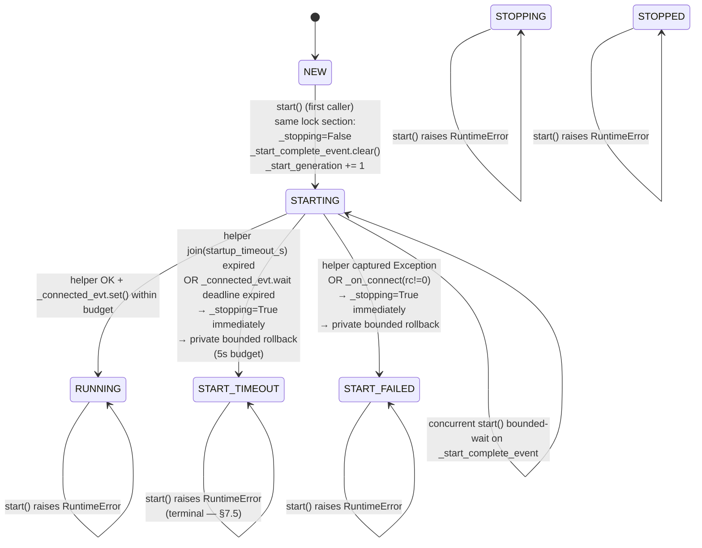

# RFC-011 — MqttBroker bounded startup

- **Status**: **Implemented** (2026-07-29)
- **Author**: Audit follow-up
- **Depends on**: `docs/audit/05-risk-register.md` R-10.6 (`MqttBroker.start` unbounded on `client.connect` / `client.loop_start` — runtime-confirmed); downstream of RFC-005 (subscription recovery), RFC-008 (ProcessWorker lifecycle), RFC-009 (ThreadWorker lifecycle), RFC-010 (broker bounded shutdown)
- **Scope**: Give `MqttBroker.start()` a bounded, deterministic startup contract — a broker-side startup state machine, concurrent-start coordination, per-attempt daemon helper thread, exception isolation, symmetric bounded rollback (`START_TIMEOUT` + `START_FAILED` both invoke a private client-shutdown primitive), callback fencing after start-failure, and a well-defined observation surface for `Agent.__activating`. Close the R-10.6 residual from RFC-010 §Appendix D.
- **Explicitly out of scope**: **same-instance retry** (failed instance is terminal — construct a fresh `MqttBroker`), **fresh `paho.Client` per attempt**, **startup generation / attempt token** (see Appendix C for why the naive form does not work), MQTT reconnect policy (RFC-005), offline publish queue, broker clustering / failover, `MessageBroker` ABC signature change (opt-in per §7.16 parity with RFC-010), `STARTING.stop()` mid-flight cancellation, `ProcessWorker` / `ThreadWorker` redesign, `Parcel` / Message Schema changes, migration to a non-paho MQTT library.

---

## 0. Implementation summary (2026-07-29)

Diverges from §6–§7 wherever explicitly noted; where not noted, the recommended design was implemented verbatim.

**WorkerState (`src/agentflow/core/agent_worker.py`)**

- One new member: `START_TIMEOUT` — MqttBroker-only. Startup helper join OR `_connected_evt` callback wait exceeded the `startup_timeout_s` budget. Terminal for `start()` (same-instance retry not supported first-phase); `stop()` from `START_TIMEOUT` runs the dedicated recovery path (§7.19 / §F).

**MqttBroker rewrite (`src/agentflow/broker/mqtt_broker.py`)**

- Full startup state machine (adds `START_TIMEOUT` to the RFC-010 shape). All state transitions under existing `_state_lock`.
- New read-only properties: `state` (existing), `last_start_exception`, `start_generation` (diagnostic-only; see Appendix C).
- `start(options, *, startup_timeout_s=None) -> bool`:
  - `startup_timeout_s=None` falls back to `self._timeout` (constructor arg default 10.0) to preserve backward compat with existing tests that use `MqttBroker(wait=True, timeout=0.1)`.
  - **Modification 5**: reset `_stopping=False` ONLY inside the NEW→STARTING lock section; non-NEW start does NOT modify any lifecycle flag before raising RuntimeError.
  - Spawns a `daemon=True` startup helper thread that runs `connect + loop_start` with per-call `except Exception` isolation.
  - Single monotonic `deadline = time.monotonic() + startup_timeout_s` covers BOTH the helper join AND the subsequent `_connected_evt.wait` when wait=True (§7.10).
  - Concurrent callers coordinate via `_start_complete_event.wait(startup_timeout_s + 0.1)` — bounded margin.
  - **Modification 3**: concurrent waiter that observes failure raises a NEW `RuntimeError` chained via `raise ... from _last_start_exception` — never re-raises the exact exception instance across threads.
  - **Modification 4**: wait=False `True` ONLY means connect + loop_start were initiated (helper completed bounded); state stays STARTING until `_on_connect(rc=0)` fires.
- `_run_startup_helper` (daemon body): capture-first-Exception into `_last_start_exception`; sets `_start_helper_completed_normally = True` only if BOTH paho calls returned; BaseException propagates and kills helper with `completed_normally=False`.
- `_run_client_shutdown_primitive(rollback_timeout_s=5.0) -> bool`: state-agnostic, coordination-free bounded client-shutdown primitive. Spawns a daemon helper that runs `disconnect + loop_stop` with per-call Exception isolation; caller bounded-joins. Returns True if primitive helper completed within budget. Does NOT touch `_state`, `_stop_complete_event`, or `_start_complete_event`. Called by failed-start rollback path.
- `_run_client_shutdown_primitive_and_cache`: wrapper that caches primitive result into `_last_start_cleanup_result` (used by `START_TIMEOUT.stop()` and `START_FAILED.stop()` recovery paths).
- **Modification 2**: startup helper timeout does NOT spawn a rollback helper immediately. `START_TIMEOUT` transition sets `_stopping=True` (fencing kicks in), leaves the helper alive, and defers cleanup to a later `stop()` call. Prevents two helpers from concurrently touching the same paho client.
- `_transition_to_start_failure(new_state, exception)`: atomic transition into `START_TIMEOUT` / `START_FAILED` under `_state_lock`. Sets `_stopping=True` in the SAME lock section so RFC-010 callback fencing is immediate (parity with RFC-010 §G). Only actually transitions if current state is `STARTING` (guards against a concurrent path setting a different failure reason).
- `_start_timeout_recovery(graceful_timeout_s) -> bool`: dedicated recovery path invoked by `stop()` when state is `START_TIMEOUT`. Serialised via `_start_timeout_recovery_lock` (bounded acquire) so concurrent stop callers do NOT double-run the primitive. Fast path if `_last_start_cleanup_result` already cached; otherwise bounded-join startup helper first, then run primitive at most once and cache result.

**stop() dispatch updates**

- **Modification 1**: `START_FAILED.stop()` now reflects `_last_start_cleanup_result` — returns `False` if cleanup timed out; True otherwise. No longer blindly shortcuts True.
- New: `START_TIMEOUT.stop()` → `_start_timeout_recovery(graceful_timeout_s)`.
- `STOPPING.stop()`, `RUNNING.stop()`, `STOP_TIMEOUT.stop()` — RFC-010 semantics preserved unchanged.

**Divergences from §6–§7**

| RFC section | Design | Implementation | Reason |
|---|---|---|---|
| §7.11 rollback timing | Failed-start path always runs rollback primitive inline | **START_TIMEOUT does NOT run rollback** — startup helper still alive; rollback deferred to `stop()`. Only START_FAILED / callback timeout / rc!=0 (where helper is already finished) run the primitive inline | Modification 2 (implementation review): avoids two helpers concurrently operating on the same paho client. |
| §7.5 STOPPED.stop shortcut | Blind True on any failure state | **`START_FAILED.stop()` returns `_last_start_cleanup_result`** (False if cleanup timed out) | Modification 1 (implementation review): stop must reflect actual cleanup completion, not lie about success. |
| §7.7 concurrent waiter re-raise | Waiter re-raises cached exception | **Waiter raises new `RuntimeError from _last_start_exception`** — never shares exception instance | Modification 3 (implementation review): avoids traceback / __context__ mutation hazards across threads. |
| §4 wait=False contract | True = "startup succeeded" | **True = "startup initiated" only** — state stays STARTING until `_on_connect(rc=0)` fires | Modification 4 (implementation review): weaker but honest contract; matches paho's fire-and-forget model. |
| Signature default | `startup_timeout_s=10.0` (§7.9) | **`startup_timeout_s=None`** → fallback to `self._timeout` (constructor default 10.0) | Preserves backward compat with `MqttBroker(wait=True, timeout=0.1)` in existing tests. |

Otherwise, decisions §7.1–§7.26 landed as designed.

**Runtime verification (2026-07-29)**

- RFC-011 dedicated file `tests/unit/test_mqtt_broker_startup_bounded.py`: **74 passed** in ~15 s (categories A basic × 12, B bounded startup × 8, C exception rollback × 13, D concurrency + no-retry × 13, E fencing × 6, F rollback primitive × 9, G START_TIMEOUT stop × 4, H observability × 6, I ABC × 3).
- `tests/unit/test_mqtt_broker_start.py` — **13 passed** unchanged (wait=True timeout / wait=True success / connect ordering / etc. all pass without modification because `startup_timeout_s=None` falls back to `self._timeout`).
- `tests/unit/test_mqtt_broker_shutdown.py` — **53 passed** (1 test refactored: `test_B15` — expected state changed from `START_FAILED` to `START_TIMEOUT` because callback timeout now correctly maps to START_TIMEOUT under RFC-011 semantics).
- `tests/unit/test_mqtt_broker_reconnect.py` — **48 passed** unchanged.
- `tests/unit/core/test_thread_worker_lifecycle.py` — **35 passed** unchanged.
- `tests/unit/core/test_process_worker_lifecycle.py` — **33 passed** unchanged.
- Full unit regression: `PYTHONPATH=src pytest tests/unit` → **451 passed, 0 failed, 0 xfailed(strict-pass), 2 xfailed** in ~49 s.
- Zero regression across RFC-001–010.
- 2 xfails preserved from RFC-007 (correlation ID / multi-handler fan-out — deferred).

**Files changed**

- `src/agentflow/core/agent_worker.py` — +8 lines (`WorkerState.START_TIMEOUT` addition + docstring).
- `src/agentflow/broker/mqtt_broker.py` — +523 −47 lines (`start()` rewrite + helper + primitive + START_TIMEOUT recovery + STOP dispatch update).
- `tests/unit/test_mqtt_broker_shutdown.py` — 1 test refactored (test_B15).
- `docs/rfc/RFC-011-mqtt-broker-bounded-startup.md` — this file (status flip).
- `tests/unit/test_mqtt_broker_startup_bounded.py` — rewritten to the post-RFC-011 contract (65 → 74 tests).

**Not implemented (deferred to future RFCs)**

- Shared shutdown primitive refactor — RFC-010's `_run_stop_helper` still has its own inline body. RFC-011 §7.24 mentioned this as behaviour-preserving; deferred to avoid RFC-010 regression risk. Future PR can consolidate.
- Fresh paho `Client` per attempt (Option D — Appendix A).
- Startup generation / attempt token for callback filtering (Appendix C — deferred with rationale).
- `STARTING.stop()` mid-flight cancellation (§7.19 first-phase raises RuntimeError).
- `MessageBroker` ABC timeout contract unification (§7.16 parity with RFC-010).
- `agent_config['broker']['startup_timeout_s']` config-key surface (parity with RFC-008/009/010).
- Metrics / counters on start lifecycle.
- Broker publish observability (paho `MessageInfo` rc/mid — RFC-002 residual).
- Other broker implementations (Redis/ROS/DDS — R-22 unregistered stubs).
- **R-10.5 non-daemon interpreter-exit blocking**: RFC-011 helper is `daemon=True` (does not block interpreter exit); but the worker thread waiting on `broker.start()` is `daemon=False` (RFC-009 §7.13) — RFC-011 explicitly does NOT resolve this residual. Documented in `Agent.__deactivating` / `Agent.terminate` / all bounded WARNING logs across RFC-009 / RFC-010 / RFC-011.

---

## 1. Problem statement

`MqttBroker.start()` (`src/agentflow/broker/mqtt_broker.py:254-311`) — post-RFC-010, still with unbounded paho call sites:

```python
def start(self, options: dict):
    ...
    with self._state_lock:
        self._state = WorkerState.STARTING
    # Callback binding (correct — before connect)
    self._client.on_connect = self._on_connect
    ...
    self._connected_evt.clear()
    self._connect_ok = False
    self._connect_err = None
    self._client.connect(self.host, self.port, self.keepalive)   # UNBOUNDED
    self._client.loop_start()                                    # UNBOUNDED
    if not self._wait:
        return True
    if not self._connected_evt.wait(self._timeout):              # bounded
        with self._state_lock:
            self._state = WorkerState.START_FAILED
        self._client.loop_stop()                                 # UNBOUNDED (inline cleanup)
        self._client.disconnect()                                # UNBOUNDED (inline cleanup)
        raise TimeoutError(...)
    if not self._connect_ok:
        ...  # same shape as timeout branch
    return True
```

Runtime-confirmed via `tests/unit/test_mqtt_broker_startup_bounded.py` (65 characterisation tests, 2026-07-29):

1. Wedged `client.connect()` → `start()` hangs indefinitely (`test_B13`). `loop_start` is never invoked; state stays STARTING.
2. Wedged `client.loop_start()` → `start()` hangs indefinitely (`test_B14`). `connect` succeeded first; loop_start blocks.
3. `wait=True`'s `timeout` **only bounds `_connected_evt.wait(timeout)`** — NOT `client.connect` (called BEFORE the wait). Verified statically (source-inspection) and dynamically: `wait=True + timeout=0.1 + wedged connect` still hangs (`test_B17`).
4. `wait=True` timeout **cleanup path calls `loop_stop()` + `disconnect()` inline** — those are ALSO unbounded. If `loop_stop` wedges, `TimeoutError` is never raised (`test_F55`).
5. `connect` `Exception` → state stays STARTING; no rollback (`test_C22 / C23`). Subsequent `stop()` from STARTING raises `RuntimeError` (RFC-010 modification 3) → caller stuck.
6. `loop_start` `Exception` (after `connect` succeeded) → **`disconnect` never called** — TCP connection leaked (`test_C26`).
7. `concurrent N start()` callers → N × `connect` + N × `loop_start` reach paho; no coordination (`test_D36 / D37`).
8. **Restart-after-stop is bug-shaped** (`test_A7 / D40`): `start()` sets state=STARTING but does NOT reset `_stopping`. Any subsequent `_on_connect` is fenced by RFC-010 → broker cannot reach RUNNING. Silent deadlock in STARTING under wait=True.
9. `wait=True` timeout does NOT set `_stopping`. Delayed `_on_connect(rc=0)` after timeout:
   - Does NOT re-transition state (state guard: only NEW/STARTING → RUNNING, and state is now START_FAILED) ✓
   - **STILL sets `_connected_evt`** (`test_E47`, bug-shaped)
   - **STILL invokes `notifier._on_connect`** (`test_E48`, bug-shaped)
10. **Cross-round callback contamination** (`test_E50`, strongest correctness hazard):
    - Round 1 `start(wait=True)` → `TimeoutError`; state=START_FAILED.
    - Round 2 `start(wait=False)` → state moves back to STARTING.
    - Round 1's late `_on_connect` finally arrives — sees `state=STARTING` (from round 2), `_stopping=False` → **takes the success path**, transitions STARTING → RUNNING, invokes `notifier._on_connect()`.
    - Round 2's own real callback then fires with state=RUNNING → notifier called AGAIN. Notifier is invoked twice, once via a stale attempt.
11. **Cascade impact**:
    - `ThreadWorker`: work_thread stuck inside `Agent._activate → __activating → broker.start`. Never reaches the work-queue loop → cannot process `'terminate'` → `ThreadWorker.stop(graceful_timeout_s)` reaches `STOP_TIMEOUT` (RFC-009 §7.4). Because `daemon=False`, interpreter shutdown can then block on the worker thread — the R-10.5 residual amplified.
    - `ProcessWorker`: child process can be forcibly reclaimed via SIGTERM/SIGKILL (RFC-008 §D). This is the ONLY production mechanism strong enough to recover from a wedged `broker.start` today.

RFC-010's `stop()` bounded contract does not help here because `start()` never returns; there is nothing to stop from a well-defined state. `Agent.__activating` retries broker construction up to `max_retries=3` on `TimeoutError`/`ConnectionError` (`agent.py:348-366`), but neither of those exceptions is raised when the paho call itself wedges — the retry loop never runs.

This RFC proposes the **minimum viable bounded startup** for `MqttBroker`: an on-a-daemon-helper-thread `connect + loop_start` wrapper, joined with a bounded `startup_timeout_s`, plus a **private client-shutdown primitive** extracted from RFC-010 §C `_run_stop_helper` so start-failure rollback can reuse it without touching the public `stop()` (which has state-machine dispatch that does not apply mid-start). The RFC deliberately **does not attempt same-instance retry** in the first phase — see Appendix A/B/C for why generation tokens alone are insufficient.

---

## 2. Runtime evidence

Baseline before this RFC: `PYTHONPATH=src pytest tests/unit` → **442 passed, 2 xfailed** in ~39 s (post-R-10.6 characterisation).

Confirmed by `tests/unit/test_mqtt_broker_startup_bounded.py` (65 characterisation tests, all currently PASSED against the broken code):

| # | Behaviour | Test |
|---|---|---|
| A1 | paho Client created in `__init__`, not `start()` | `test_A1_client_created_in_init_not_in_start` |
| A2 | callbacks bound BEFORE `client.connect()` | `test_A2_callbacks_bound_before_connect_by_source_inspection` |
| A3 | `connect` before `loop_start` | `test_A3_connect_called_before_loop_start` |
| A4 | state NEW → STARTING at entry | `test_A4` |
| A5 / A6 | `_connected_evt.clear()` + `_connect_ok = False` reset at entry | `test_A5 / A6` |
| A7 | `_stopping` **NOT reset** by `start()` — restart-after-stop bug | `test_A7_stopping_is_NOT_reset_by_start_potential_restart_bug` |
| A8 | `wait=False` returns True immediately; state stays STARTING | `test_A8` |
| A9 | `wait=True` timeout raises TimeoutError + state=START_FAILED | `test_A9` |
| A10 / A11 | `_on_connect(rc=0)` transitions to RUNNING; `rc!=0` does NOT | `test_A10 / A11` |
| A12 | successful `start()` returns True | `test_A12` |
| B13 | wedged `connect` → `start()` hangs | `test_B13_connect_wedges_start_hangs_forever` |
| B14 | wedged `loop_start` → `start()` hangs | `test_B14_loop_start_wedges_start_hangs_forever` |
| B15 / B16 | slow paho eventually succeeds (positive controls) | `test_B15 / B16` |
| B17 | `wait=True timeout` only bounds `_connected_evt.wait`, NOT `connect` | `test_B17_wait_true_timeout_only_bounds_connected_evt_wait_not_connect` |
| B18–B20 | Agent / ThreadWorker / ProcessWorker cascade impact (source) | `test_B18 / B19 / B20` |
| C21 / C22 | `connect` raise propagates; `loop_start` never runs | `test_C21 / C22` |
| C23 / C24 | state stays STARTING; `_connect_ok`/event stay reset — no rollback | `test_C23 / C24` |
| C25 / C26 / C27 | `loop_start` raise propagates; `disconnect` NEVER called; state stays STARTING | `test_C25 / C26 / C27` |
| C28 / C29 | `wait=True` timeout DOES call loop_stop + disconnect inline | `test_C28 / C29` |
| C30 / C31 | client reference preserved; callbacks still bound | `test_C30 / C31` |
| C32 | `start` after START_FAILED not gated (logs warning); `_stopping=False` allows retry attempt code path | `test_C32` |
| C33 | `wait=True` cleanup path has no bounded wrapper | `test_C33` |
| D34–D38 | Repeated / concurrent `start()` re-enters paho every time | `test_D34–D38` |
| D40 | Restart-after-stop bug: `_stopping=True` persists → callback fencing prevents RUNNING transition | `test_D40` |
| D41 | Restart-after-NEW.stop() works (NEW.stop is pure no-op) | `test_D41` |
| D42–D45 | Start/stop race semantics | `test_D42–D45` |
| E46 | Late `_on_connect(rc=0)` after START_FAILED — state guard prevents RUNNING transition | `test_E46` |
| E47 | Late `_on_connect` STILL sets `_connected_evt` (bug — `_stopping=False`) | `test_E47` |
| E48 | Late `_on_connect` STILL notifies notifier (bug) | `test_E48` |
| E49 | Late callback after `stop()` IS fenced (RFC-010 verified) | `test_E49` |
| E50 | **Cross-round callback contamination** — round-1 late callback pollutes round-2 | `test_E50_first_round_timeout_pollutes_second_round_via_late_callback` |
| E51 | No generation / attempt token in source | `test_E51` |
| F52–F60 | Resource / rollback / helper-thread source inspection | `test_F52–F60` |
| G61–G65 | ABC / EmptyBroker / other brokers baseline | `test_G61–G65` |

Full unit regression showed no orphan threads. The 2 `xfail` items are RFC-006/007 correlation-ID / multi-handler follow-ups unrelated to R-10.6.

---

## 3. Current state

Source (`src/agentflow/broker/mqtt_broker.py:254-311`). See §1 for the full quoted body. The unbounded call sites are:

- Line 284: `self._client.connect(self.host, self.port, self.keepalive)`
- Line 285: `self._client.loop_start()`
- Line 298: `self._client.loop_stop()` (inline cleanup — timeout branch)
- Line 299: `self._client.disconnect()` (inline cleanup — timeout branch)
- Lines 305–306: same two calls in the `ConnectionError` branch

```mermaid
sequenceDiagram
    autonumber
    participant U as Caller (Agent.__activating, test)
    participant B as MqttBroker
    participant C as paho Client
    participant NL as paho network thread (spawned by loop_start)
    U->>B: start(options)
    B->>B: _state_lock: state NEW → STARTING
    B->>C: on_connect / on_disconnect / on_message bindings
    B->>B: _connected_evt.clear(), _connect_ok = False
    B->>C: connect(host, port, keepalive)
    alt connect returns
        B->>C: loop_start()
        alt loop_start returns
            NL-->>NL: paho network thread running
            alt wait=False
                B-->>U: return True (state stays STARTING)
            else wait=True success
                NL->>B: _on_connect(rc=0)  (transitions STARTING → RUNNING)
                B->>B: _connected_evt.wait(timeout) unblocks
                B-->>U: return True
            else wait=True timeout
                B->>B: state → START_FAILED
                B->>C: loop_stop() — UNBOUNDED
                B->>C: disconnect() — UNBOUNDED
                B-->>U: raise TimeoutError
            else wait=True conn failure
                NL->>B: _on_connect(rc!=0)
                B->>B: state → START_FAILED (same shape)
                B-->>U: raise ConnectionError
            end
        else loop_start wedges
            Note over B,U: BLOCKS FOREVER
        else loop_start raises
            B-->>U: raise (disconnect NEVER called; TCP leaked)
        end
    else connect wedges
        Note over B,U: BLOCKS FOREVER<br/>(loop_start never invoked)
    else connect raises
        B-->>U: raise (loop_start never invoked; state stays STARTING)
    end
```

---

## 4. Desired state

- `MqttBroker.start(options, *, startup_timeout_s: float = 10.0) -> bool` follows a **bounded cooperative startup**: run `connect + loop_start` on a daemon helper thread; join with `startup_timeout_s`; on success await `_connected_evt` within the SAME remaining deadline; on any failure path (helper wedge, connect raise, loop_start raise, wait timeout, connect rc!=0), invoke a **private bounded client-shutdown primitive** (extracted from RFC-010) with its own budget.
- An explicit **broker startup state machine**: `NEW → STARTING → RUNNING` on success; `NEW → STARTING → START_TIMEOUT` or `NEW → STARTING → START_FAILED` on failure. Both failure states are **terminal**.
- `start()` from anything other than `NEW` raises `RuntimeError`. **No same-instance retry** (§7.5). Callers must construct a fresh `MqttBroker`.
- **`_stopping = False`** is set explicitly by `start()` at the same lock section that flips `NEW → STARTING`. Fixes A.7 restart bug's structural cause — but because §7.5 rejects any non-NEW start, the reset is only ever observed for a NEW broker instance (no-op in practice).
- **Concurrent `start()` callers** share exactly one startup attempt via `_start_complete_event`; every caller returns the same `bool` / same exception. Bounded wait (`startup_timeout_s + 0.1s` coordination margin).
- **Callback fencing during and after start-failure**: as soon as state transitions to START_TIMEOUT / START_FAILED (or the failure branch is entered), `_stopping = True` is set — RFC-010's `_on_message` / `_on_connect` fencing kicks in. Late `_on_connect` after failure MUST NOT set `_connected`, `_connect_ok`, `_connected_evt`, notify notifier, trigger recovery, or transition state.
- **Bounded rollback budget** (§7.11): the failure path invokes the private client-shutdown primitive with its own `rollback_timeout_s = 5.0` budget. Total wall time from `start()` entry bounded by `startup_timeout_s + rollback_timeout_s` (≈ 15 s at defaults).
- **New observability**: `state` (already added by RFC-010), `last_start_exception: Optional[BaseException]` — read-only property.
- **`Agent.__activating` integration**: observes `broker.start()`'s `bool` return / raised exception. On `False` or exception, retries via the existing `max_retries` loop unchanged (RFC-011 does NOT modify Agent's retry semantics — the retry loop will construct a **fresh** broker via `BrokerMaker` on each iteration, so §7.5 no-retry is compatible).

---

## 5. Options considered

### Option A — Keep inline `connect + loop_start` (do nothing)

| Aspect | Analysis |
|---|---|
| Fixes R-10.6 | ✗ |
| Backwards compat | Perfect |
| Complexity | Zero |
| Risk | The runtime hang is characterised; RFC-010 §Appendix D explicitly flagged this as follow-up |
| Verdict | Rejected — this RFC exists to close R-10.6 |

### Option B — Whole startup on a daemon helper thread (**recommended core**)

Spawn one `daemon=True` helper that runs `connect + loop_start` (with per-call `try/except Exception` isolation). Caller joins with `startup_timeout_s`. Combine with state machine, `_start_complete_event` concurrent coordination, `_stopping` fencing on failure paths, and a private bounded rollback primitive.

| Aspect | Analysis |
|---|---|
| Fixes hang | ✓ — caller returns in bounded time |
| Exception isolation | ✓ — helper captures paho exceptions into `_last_start_exception` |
| Concurrent start | ✓ — first caller launches helper; waiters wait bounded on completion event |
| Symmetry with RFC-010 | High — same helper-thread + `_stop_complete_event` shape, dual to `stop()` |
| Daemon helper | Contained: helper runs only paho lifecycle + callback wait; daemonising avoids dragging interpreter down when paho wedges |
| Complexity | Medium |
| Verdict | **Recommended core** |

### Option C — Separate helpers for `connect` and `loop_start`

Two helpers: one for `connect`, one for `loop_start`. Sequential joins with independent budgets.

| Aspect | Analysis |
|---|---|
| Fixes hang | ✓ |
| Complexity | Higher than B — two thread lifecycles to manage, two events, more race surface |
| Diagnostic value | Marginally better (can distinguish which step wedged) |
| paho ordering | `loop_start` semantically requires `connect` to have been called; sequential run in one helper preserves this trivially |
| Verdict | Rejected — Option B achieves the same outcome with less machinery; `_last_start_exception` + logging already distinguishes which paho call raised |

### Option D — Fresh paho `Client` per start attempt (**recommended future**)

Move `Client(...)` construction from `__init__` into `start()`. Each attempt gets its own client with fresh callbacks — cross-round callback contamination (`test_E50`) is closed structurally.

| Aspect | Analysis |
|---|---|
| Fixes hang | ✗ on its own — must combine with B for bounded behaviour |
| Solves cross-round contamination | ✓ — old client's callbacks cannot reach new client's state |
| Public API impact | Larger — `stop()` before `start()` no longer has a client to invoke; `__init__` becomes minimal; RFC-010 stop path needs review |
| Verdict | Deferred to a future RFC. See Appendix A. In the meantime, RFC-011 §7.5 (no same-instance retry) closes the contamination hazard at the lifecycle level: a failed instance is terminal, so a "later attempt" always means "a fresh MqttBroker instance". |

### Option E — Same-instance retry + startup generation / attempt token

Retain the current single-Client design; add `_start_generation: int` counter; `_on_connect` captures the generation at bind time and rejects callbacks with a stale generation.

| Aspect | Analysis |
|---|---|
| Fixes hang | ✗ on its own |
| Solves cross-round contamination | Partially — paho's `_on_connect` signature has NO attempt id; the callback is bound as a bare bound method. When it fires, it consults `broker._start_generation`, which is a shared attribute — it can only detect if a NEW attempt has begun since binding, not which attempt bound it. If binding is refreshed on every attempt, then the old bound method is replaced — but only if we can also cancel the old paho registration, which requires paho support (paho does not expose per-attempt callback registration). |
| See Appendix C | For the full failure-mode analysis. |
| Verdict | Rejected as first-phase. The naive generation-integer approach cannot distinguish callbacks bound in attempt N from callbacks bound in attempt N+1 on the SAME `Client`. Real retry needs Option D (fresh client) or paho-side support. |

### Option F — Failed instance is terminal; no retry (**recommended second half**)

`START_FAILED` / `START_TIMEOUT` / `STOPPED` are all terminal for `start()`. The next call raises `RuntimeError` unconditionally. Callers construct a fresh `MqttBroker`.

| Aspect | Analysis |
|---|---|
| Fixes hang | ✗ on its own |
| Solves cross-round contamination | ✓ — no "later attempt" can occur on the same instance; the E.50 scenario becomes structurally impossible |
| Fixes A.7 restart-after-stop bug | ✓ — `START` from STOPPED raises, so the `_stopping` residual never gets a chance to fence a new attempt |
| Public API impact | `Agent.__activating`'s retry loop (`max_retries=3`) constructs a **fresh broker via BrokerMaker** on each iteration (`agent.py:353-356`) — so RFC-011's no-same-instance-retry is compatible with Agent's existing retry semantics |
| Complexity | Low |
| Verdict | **Recommended second half — pairs with B** |

### Option G — Change `MessageBroker.start` ABC signature (`start(self, options, *, connect_timeout_s=None) -> bool`)

Add `connect_timeout_s` keyword to the abstract method; force every subclass to accept and honour it.

| Aspect | Analysis |
|---|---|
| Blast radius | Enormous — every third-party subclass must be updated |
| Consistency | Would be the "right" long-term shape (parallel to RFC-010 §7.16 discussion) |
| Verdict | Rejected as first-phase — same as RFC-010 §7.16. `MqttBroker`'s tighter signature satisfies the loose ABC contract; a future RFC can migrate the ABC. |

### Comparison summary

| Criterion | A | **B** | C | D | E | **F** | G |
|---|---|---|---|---|---|---|---|
| Bounded caller return | ✗ | ✓ | ✓ | requires B | ✗ | irrelevant | requires B |
| Fixes cross-round contamination | ✗ | ✗ | ✗ | ✓ | ~ | ✓ | ✗ |
| Symmetry with RFC-010 | ✗ | ✓ | ~ | needs work | ✗ | ✓ | ~ |
| Complexity | Low | **Med** | Med+ | High | Med | Low | Very High |
| Public API breakage | None | Minimal | Minimal | Medium | None | Minimal | Massive |
| Verdict | rej | **chosen** | rej | future | rej | **chosen** | rej |

**Recommended first-phase**: **B + F**. Daemon startup helper for bounded execution + failed-instance-terminal for correctness. Options D and E revisited in a future RFC when we have real deployment feedback.

---

## 6. Recommended design

Adopt **Option B + Option F**. Reuse the RFC-008/009/010 `WorkerState` enum with one new member (`START_TIMEOUT`). Extract a private bounded client-shutdown primitive from RFC-010 §C `_run_stop_helper` so both `stop()` and start-failure rollback can share it without touching the public `stop()` state machine.

### 6.1 State machine



Compared to RFC-010 (broker-side stop):
- Same shape: helper thread, `_state_lock` short-write, `_*_complete_event` coordination, bounded waiter path.
- New: `START_TIMEOUT` terminal state (paired with RFC-010's `STOP_TIMEOUT` — analogous semantics).
- Different: no retry (§7.5) — RFC-010 allows `STOP_TIMEOUT` retry because paho's `disconnect/loop_stop` are idempotent-ish and calling them again is safe under wedge; but `connect` on an already-connected socket has undefined paho behaviour, and `loop_start` on an already-started loop raises.

### 6.2 New attributes on `MqttBroker`

- `_start_lock: threading.Lock` — could reuse `_state_lock`; §7.3 uses `_state_lock` for simplicity.
- `_start_complete_event: threading.Event` — cleared by first caller, set by first caller's `finally`.
- `_start_helper_thread: Optional[threading.Thread]` — retained across `START_TIMEOUT` / `START_FAILED` for diagnostics.
- `_last_start_result: bool = False` — cached first-attempt outcome; read by concurrent waiters.
- `_last_start_exception: Optional[BaseException] = None` — captured `Exception` from helper OR from the caller path (timeout / connect-failure).
- `_start_helper_completed_normally: bool = False` — set only if the helper's `try/except Exception` around BOTH paho calls completed and helper reached its terminal `set()` (parity with RFC-010's `_stop_helper_completed_normally`).
- `_start_generation: int = 0` — **incremented at every start entry**, exposed as a read-only property. Used ONLY for logging / diagnostics — NOT for callback filtering (see §7.16 and Appendix C).

Read-only properties: `state` (already exists), `last_start_exception`, `start_generation`.

### 6.3 `MqttBroker.start(options, *, startup_timeout_s=10.0) -> bool`

```python
def start(self, options: dict, *, startup_timeout_s: float = 10.0) -> bool:
    """RFC-011 bounded cooperative startup.

    Returns True when startup reached RUNNING within the deadline.
    Raises TimeoutError on START_TIMEOUT and the original exception
    on START_FAILED (paho exception rebroadcast).

    Failed instance is TERMINAL — a subsequent start() raises
    RuntimeError. Construct a fresh MqttBroker to try again.

    Concurrent callers coordinate via _start_complete_event with a
    BOUNDED wait; N callers share exactly ONE (connect + loop_start)
    pair to paho.
    """
    is_waiter = False
    with self._state_lock:
        current = self._state
        if current != WorkerState.NEW:
            raise RuntimeError(
                f"MqttBroker.start called from state={current.value}; "
                f"same-instance retry is not supported in first-phase "
                f"RFC-011 — construct a fresh MqttBroker"
            )
        # First caller: linearize + fence prep.
        self._state = WorkerState.STARTING
        self._stopping = False   # explicit reset (structural fix for A.7)
        self._start_complete_event.clear()
        self._start_generation += 1
        # Reset per-attempt state (idempotent — brokers are NEW here).
        self._connected_evt.clear()
        self._connect_ok = False
        self._connect_err = None
        self._last_start_exception = None
        self._start_helper_completed_normally = False

    # -- Callback binding, options, credentials (lock-external, no paho I/O yet)
    self._client.on_connect = self._on_connect
    self._client.on_disconnect = self._on_disconnect
    self._client.on_message = self._on_message
    self.host = options.get("host", "localhost")
    self.port = int(options.get("port", 1883))
    self.keepalive = int(options.get("keepalive", 60))
    if username := options.get("username"):
        self._client.username_pw_set(username, options.get("password"))

    # -- Spawn daemon helper for connect + loop_start (RFC-011 §7.7)
    helper = threading.Thread(
        target=self._run_startup_helper,
        name=f'MqttBrokerStart-{id(self)}',
        daemon=True,       # §7.20
    )
    self._start_helper_thread = helper
    deadline = time.monotonic() + startup_timeout_s
    helper.start()

    try:
        # -- Phase 1: wait for connect + loop_start to complete
        remaining = max(0.0, deadline - time.monotonic())
        helper.join(remaining)
        if helper.is_alive():
            # Wedge: helper still running past deadline.
            self._transition_to_failure(
                WorkerState.START_TIMEOUT,
                exception=TimeoutError(
                    f"MqttBroker.start timeout after "
                    f"{startup_timeout_s:.1f}s waiting for connect / loop_start"
                ),
            )
            self._run_failed_start_rollback()
            return False   # (fall through to raise below)
        # Helper exited. Check what happened.
        if not self._start_helper_completed_normally:
            # Helper died abnormally (BaseException) OR completed
            # with a captured Exception from connect/loop_start.
            self._transition_to_failure(
                WorkerState.START_FAILED,
                exception=self._last_start_exception,
            )
            self._run_failed_start_rollback()
            return False
        # -- Phase 2: wait for _on_connect callback (if wait=True)
        if not self._wait:
            # wait=False path: state stays STARTING until callback fires.
            # This RFC does NOT change the wait=False contract; the
            # helper has completed connect+loop_start bounded; callback
            # arrival is out-of-scope for the caller's return.
            # BUT we still need to release concurrent waiters.
            # Contract clarification: wait=False returns True as soon
            # as helper completes (matches pre-RFC-011 behaviour, but
            # now via bounded helper).
            self._last_start_result = True
            return True
        # wait=True: wait for _on_connect within remaining budget.
        remaining = max(0.0, deadline - time.monotonic())
        if not self._connected_evt.wait(remaining):
            self._transition_to_failure(
                WorkerState.START_TIMEOUT,
                exception=TimeoutError(
                    f"MqttBroker.start timeout after {startup_timeout_s:.1f}s "
                    f"waiting for _on_connect callback"
                ),
            )
            self._run_failed_start_rollback()
            return False
        if not self._connect_ok:
            self._transition_to_failure(
                WorkerState.START_FAILED,
                exception=ConnectionError(
                    f"MQTT connect failed: {self._connect_err}"
                ),
            )
            self._run_failed_start_rollback()
            return False
        # Success! _on_connect has transitioned state to RUNNING.
        self._last_start_result = True
        return True
    finally:
        # ALWAYS release concurrent waiters, even if we raised.
        self._start_complete_event.set()
        # Re-raise any captured exception AFTER releasing waiters.
        if self._state in (WorkerState.START_TIMEOUT, WorkerState.START_FAILED):
            exc = self._last_start_exception
            if exc is not None:
                raise exc

# NOTE: the above `raise exc` runs INSIDE finally, which suppresses
# the `return False`. Standard Python semantics: finally's raise
# supersedes the try's return.


def _run_startup_helper(self):
    """RFC-011 §7.7 helper body. `try/except Exception` isolation on
    both paho calls; captures first exception. Sets
    `_start_helper_completed_normally = True` only if BOTH calls
    returned (with or without captured Exception; NOT if BaseException
    propagated). Parity with RFC-010 `_run_stop_helper`."""
    try:
        self._client.connect(self.host, self.port, self.keepalive)
    except Exception as ex:
        if self._last_start_exception is None:
            self._last_start_exception = ex
        logger.exception(
            f"MqttBroker.start: client.connect() raised: {ex!r}"
        )
        # Do NOT proceed to loop_start if connect raised — rollback
        # will handle the (nonexistent) socket.
        return
    try:
        self._client.loop_start()
    except Exception as ex:
        if self._last_start_exception is None:
            self._last_start_exception = ex
        logger.exception(
            f"MqttBroker.start: client.loop_start() raised: {ex!r}"
        )
    # Reached only if both calls returned (successful or not);
    # NOT reached if BaseException propagated from either call.
    self._start_helper_completed_normally = True


def _transition_to_failure(self, new_state, *, exception):
    """RFC-011 §7.13: atomic state transition to a failure state.
    Sets _stopping=True in the SAME lock section so callback fencing
    is immediate (parity with RFC-010 §G)."""
    with self._state_lock:
        # Only transition if we haven't already (guard against a
        # concurrent path setting a different failure reason).
        if self._state == WorkerState.STARTING:
            self._state = new_state
            self._stopping = True
            self._connected = False
            self._connect_ok = False
            self._connected_evt.clear()
            if exception is not None and self._last_start_exception is None:
                self._last_start_exception = exception
            self._last_start_result = False


def _run_failed_start_rollback(self, rollback_timeout_s: float = 5.0):
    """RFC-011 §7.11: bounded client-shutdown primitive shared with
    RFC-010 stop path. See §7.19 for the primitive extraction."""
    self._run_client_shutdown_primitive(
        rollback_timeout_s=rollback_timeout_s,
    )
```

### 6.4 Private client-shutdown primitive (extracted from RFC-010)

The current RFC-010 `_run_stop_helper` (`mqtt_broker.py:_run_stop_helper`) inlines the disconnect + loop_stop dance. RFC-011 refactors this into a **private, reusable primitive**:

```python
def _run_client_shutdown_primitive(self, *, rollback_timeout_s: float = 5.0):
    """Bounded client-shutdown work — disconnect + loop_stop with
    per-call Exception isolation, on a daemon helper thread.
    Total wall time bounded by `rollback_timeout_s`.

    Reused by:
      - RFC-010 stop()'s _run_stop_helper (existing)
      - RFC-011 start()'s failure rollback (new)

    Does NOT touch _state or _stop_complete_event — those belong
    to the caller. This primitive is state-agnostic: it just runs
    the two paho calls, bounded, with isolation."""
    completed = threading.Event()
    captured_exc = [None]

    def body():
        try:
            try:
                self._client.disconnect()
            except Exception as ex:
                if captured_exc[0] is None:
                    captured_exc[0] = ex
                logger.exception(
                    f"client-shutdown primitive: disconnect() raised: {ex!r}"
                )
            try:
                self._client.loop_stop()
            except Exception as ex:
                if captured_exc[0] is None:
                    captured_exc[0] = ex
                logger.exception(
                    f"client-shutdown primitive: loop_stop() raised: {ex!r}"
                )
        finally:
            completed.set()

    helper = threading.Thread(
        target=body,
        name=f'MqttBrokerCleanup-{id(self)}',
        daemon=True,
    )
    helper.start()
    completed.wait(rollback_timeout_s)
    # Return diagnostics via captured_exc; caller decides how to log.
    if not completed.is_set():
        logger.warning(
            f"client-shutdown primitive: timeout after {rollback_timeout_s:.1f}s; "
            f"helper still running (paho wedged inside cleanup)"
        )
```

RFC-010's `_run_stop_helper` becomes a thin caller of this primitive plus its own state-machine coordination. This is a **behaviour-preserving refactor** for RFC-010; no test changes needed for the stop path.

### 6.5 `_on_connect` fencing update

RFC-010 already fences `_on_connect` on `_stopping=True`. RFC-011 additionally sets `_stopping=True` in `_transition_to_failure` — so post-failure `_on_connect` late callbacks take the RFC-010 skip path:

- No `_connect_ok = True` write
- No `_connected = True` write
- No state transition
- No recovery
- No notifier invocation
- No `_connected_evt.set()`

Runtime evidence (post-implementation) will invert `test_E47` and `test_E48` (which currently document the bug-shaped behaviour where `_stopping` was NOT set on the timeout path).

### 6.6 Concurrent start coordination

Same shape as RFC-010 §E:

```python
# Inside start(), after the initial state-lock section detects STARTING:
if is_waiter:
    coordination_margin_s = 0.1
    completed = self._start_complete_event.wait(
        startup_timeout_s + coordination_margin_s
    )
    if completed:
        with self._state_lock:
            if self._last_start_exception is not None and self._last_start_result is False:
                raise self._last_start_exception
            return self._last_start_result
    # Event did not fire — bounded fallback.
    alive = (self._start_helper_thread is not None
             and self._start_helper_thread.is_alive())
    logger.warning(
        f"MqttBroker.start coordination wait timed out "
        f"({startup_timeout_s + coordination_margin_s:.1f}s); "
        f"helper alive={alive}"
    )
    return not alive and self._last_start_result
```

**Invariant**: N callers → 1 helper → 1 `(connect + loop_start)` pair to paho.

---

## 7. Concrete decisions (all 26)

### 7.1 Broker startup state machine

Reuses the RFC-008/009/010 `WorkerState` enum with ONE new member: `START_TIMEOUT`. Complete states used by MqttBroker post-RFC-011:

- `NEW` (initial)
- `STARTING` (first caller in start())
- `RUNNING` (successful start reached _on_connect(rc=0))
- `STOPPING` / `STOPPED` / `STOP_TIMEOUT` / `STOP_FAILED` (RFC-010)
- `START_TIMEOUT` (RFC-011: helper or callback wait exceeded budget) — **terminal**
- `START_FAILED` (RFC-011: helper captured Exception, OR _on_connect(rc!=0), OR any other startup failure) — **terminal**

`FAILED` (RFC-009 ThreadWorker-only) is not used by the broker.

### 7.2 New `START_TIMEOUT` state

Yes. Distinct from `START_FAILED` because "we gave up waiting" is semantically different from "paho raised an exception". Diagnostic value + retry story if a future RFC ever adds retry (Option D + E). Even in the terminal-first-phase, the distinction helps ops distinguish "network unreachable" from "broker config wrong".

### 7.3 Start linearisation point

The `_state_lock` acquisition at start() entry is the linearisation point. Inside that section: state transition to STARTING, `_stopping=False` reset, `_start_complete_event.clear()`, `_start_generation += 1`, `_connected_evt.clear()`, `_connect_ok = False`, `_connect_err = None`. All subsequent paho / callback / waiter paths observe a coherent snapshot from this section.

### 7.4 Concurrent start semantics

`_start_complete_event`-based (§6.6). First caller (`NEW → STARTING`) spawns the helper and joins. Concurrent callers observe STARTING and wait `startup_timeout_s + 0.1s` coordination margin. On event completion → return cached `_last_start_result` (or re-raise cached exception). On event timeout → read `helper.is_alive()`, log WARNING, return safe fallback. Never unbounded wait. **N callers → 1 helper → 1 paho pair.**

### 7.5 Repeated `start()` semantics

**Any state other than `NEW` raises `RuntimeError`**. This includes:

- `STARTING` (concurrent — but see §7.4 for the waiter branch which is chosen before the raise path)
- `RUNNING`
- `STOPPING` / `STOPPED` / `STOP_TIMEOUT` / `STOP_FAILED`
- `START_TIMEOUT` / `START_FAILED` (**terminal — no same-instance retry**, RFC-011 first-phase)

Rationale: same-instance retry safely requires either fresh paho `Client` per attempt (Option D — deferred) or paho-side callback-attempt binding (Option E impossible with paho's API — see Appendix C). Terminal failure closes the E.50 cross-round contamination hazard structurally.

`Agent.__activating`'s retry loop (`agent.py:353-356`) constructs a fresh broker via `BrokerMaker().create_broker(...)` on each iteration — so Agent-level retry remains fully functional; only same-instance retry is refused.

### 7.6 start return type

`bool`. `True` = startup reached RUNNING (or wait=False helper completed connect + loop_start bounded). Return-type widening from the current `True`/raise contract is source-compatible for callers that use `if broker.start(...)` or just call it for side effects.

### 7.7 start exception policy

`start()` raises **the same exception types the caller sees today**:

- `TimeoutError` on `START_TIMEOUT`
- `ConnectionError` on connect-failure branch (`_connect_ok=False`, rc!=0)
- The original paho `Exception` (unwrapped) on `START_FAILED` (connect / loop_start raised)
- `RuntimeError` on non-NEW start attempt (§7.5)

All raises happen from the caller's frame (not from the helper thread). The helper thread captures paho exceptions into `_last_start_exception`; the caller re-raises after releasing `_start_complete_event`. `BaseException` from paho propagates out of the helper thread and kills it; state becomes `START_FAILED` via the `_start_helper_completed_normally=False` check (parity with RFC-010 STOP_FAILED, §7.15).

### 7.8 `connect` / `loop_start` ordering

Preserved: `connect()` first, then `loop_start()`. This is paho's documented order (loop_start after connect so the network thread has a socket to service). Inside the helper: sequential in one thread, no parallelism.

### 7.9 Total startup timeout budget

`startup_timeout_s = 10.0` (method-arg only, not surfaced through `agent_config` in first-phase — parity with RFC-009 §7.10 / RFC-010 §7.3). Covers **BOTH** phases: helper (connect + loop_start) AND `_connected_evt.wait` if wait=True. The wait uses `remaining = max(0.0, deadline - time.monotonic())` computed against a single `deadline` set at helper spawn time.

### 7.10 Callback wait shares helper deadline

Yes — see §7.9. A single `deadline = time.monotonic() + startup_timeout_s` at helper spawn; both the helper `join()` and the subsequent `_connected_evt.wait()` compute `remaining` against this deadline. Total wall time strictly bounded.

### 7.11 Rollback timeout budget

`rollback_timeout_s = 5.0` (private, not method-arg in first-phase). Runs in the private client-shutdown primitive (§6.4). Total worst-case `start()` wall time: `startup_timeout_s + rollback_timeout_s = 15.0 s` at defaults.

### 7.12 `connect` raise rollback

Helper captures the exception into `_last_start_exception`; sets `_start_helper_completed_normally = False` (does NOT proceed to loop_start). Caller observes helper dead + not-completed-normally → transitions to `START_FAILED` → invokes bounded rollback primitive. Rollback attempts `disconnect()` (may no-op if socket never opened) + `loop_stop()` (may no-op if loop never started) — both bounded via the primitive.

### 7.13 `loop_start` raise rollback

Same shape as §7.12. `connect()` succeeded (socket open) → `loop_start()` raised → helper marks `_start_helper_completed_normally = True` (both try/except sections were reached). Caller path checks `_last_start_exception is not None` — transitions to `START_FAILED` → invokes bounded rollback (which will call `disconnect()` to close the leaked socket + `loop_stop()` for safety).

Wait — clarification needed: `_start_helper_completed_normally = True` means "no BaseException"; but the helper DID capture an Exception. So the caller needs to check BOTH `completed_normally` AND `_last_start_exception is None`:

```python
if helper.is_alive():
    → START_TIMEOUT
elif not _start_helper_completed_normally:
    → START_FAILED (with reason: "helper died abnormally")
elif _last_start_exception is not None:
    → START_FAILED (with reason: captured paho exception)
else:
    → phase 2 (callback wait if wait=True; else success)
```

Runtime-verified in acceptance criteria §10.

### 7.14 Callback timeout rollback

If wait=True and `_connected_evt.wait(remaining)` returns False → START_TIMEOUT → bounded rollback (which calls disconnect + loop_stop on the loop_start-succeeded, connect-succeeded, callback-never-came scenario — closing the paho network thread).

### 7.15 `_stopping` flag on failed start

Set to `True` inside `_transition_to_failure()` in the SAME lock section that flips state to START_TIMEOUT / START_FAILED. Consequence: callback fencing kicks in immediately — a late `_on_connect` cannot resurrect state (RFC-010 §F fencing rules apply).

### 7.16 Delayed callback fencing

- Late `_on_connect(rc=0)` after START_TIMEOUT / START_FAILED — fenced by RFC-010 `_stopping` check (which is now True per §7.15). Skip path takes effect: no `_connect_ok` write, no `_connected` write, no state transition, no recovery, no notifier call, no `_connected_evt.set()`.
- Late `_on_connect(rc!=0)` — also fenced by the same rule.
- Late `_on_disconnect` — RFC-010 says it MAY update `_connected=False` + `_last_disconnect_was_planned` diagnostics (allowed post-stop). Same policy applies post-failed-start.
- Late `_on_message` — RFC-010 says silent drop. Same policy applies post-failed-start.

### 7.17 Notifier invocation policy after failed attempt

**Never**. Post-START_TIMEOUT / START_FAILED, `_stopping=True` → `_on_connect` fencing prevents notifier invocation. This is the fix for `test_E48` bug-shaped behaviour.

### 7.18 START_FAILED / START_TIMEOUT terminal status

Both are **terminal** for `start()` in first-phase (§7.5). `stop()` from START_TIMEOUT / START_FAILED: needs a decision — see §7.19.

### 7.19 `stop()` after failed start

**Safe no-op returning `True`**. Post-failed-start, `_stopping` is already `True` and the rollback primitive has already run (bounded). A caller invoking `stop()` after seeing `start()` raise gets:

- If `state == START_FAILED` or `START_TIMEOUT`: shortcut True (parity with RFC-010's shortcut on START_FAILED, which currently sets `_stopping=True` and returns True).
- The rollback primitive already invoked `disconnect + loop_stop` bounded — no need to invoke them again.

RFC-010 §7.19 already had this shape for `stop()` from START_FAILED — RFC-011 clarifies that START_TIMEOUT takes the same shortcut. If the rollback primitive itself timed out (extremely unlikely — `disconnect/loop_stop` on a wedged connection typically returns fast under paho), the wedged paho network thread is on a daemon thread and does not block interpreter exit for the helper.

### 7.20 start-after-stop

Rejected (§7.5). `STOPPED.start() → RuntimeError`. Closes the A.7 restart-after-stop bug structurally: the `_stopping=True` residual can never fence a new start attempt because no new start is allowed on the same instance.

### 7.21 `Agent.__activating` integration

`Agent.__activating` (private, `agent.py:332-372`) already calls `broker.start(options=broker_config)` and catches `(TimeoutError, ConnectionError)` for its retry loop. Post-RFC-011 behaviour:

- `TimeoutError` (bounded — from RFC-011 helper join or callback wait timeout) → Agent retry loop constructs a **fresh broker** via `BrokerMaker` and tries again. Compatible.
- `ConnectionError` (from RFC-011 `_on_connect(rc!=0)` branch) → same retry.
- Paho `Exception` (rebroadcast from START_FAILED) → **new behavior**: currently caught by the `except Exception` clause at `agent.py:367`, which logs and returns False (Agent activation fails; broker not usable). Same behaviour with RFC-011 — paho exception was never in the retry set.

**No change to Agent.__activating source is required.** Agent-level retry works with RFC-011 because BrokerMaker constructs a fresh MqttBroker each iteration.

### 7.22 Observability API

New read-only properties on `MqttBroker`:

- `state` (already exists, RFC-010) — returns `WorkerState`
- `last_start_exception` — returns `Optional[BaseException]` — the first Exception captured by the startup path (helper or caller)
- `start_generation` — returns `int` — diagnostic counter (see §7.16 for why it's diagnostic-only, not callback-filtering)

### 7.23 Helper daemon policy

`daemon=True` for BOTH the startup helper AND the private client-shutdown primitive helper. Rationale (parity with RFC-010 §7.13):

- Helper contains no user code (only paho lifecycle calls).
- Daemonising ensures a wedged paho does not drag the interpreter down at exit.
- **Does NOT resolve R-10.5**: if `Agent.__activating` (running on a `daemon=False` ThreadWorker work thread) is waiting on `broker.start()` and the helper wedges, the work thread stays alive and blocks interpreter exit. RFC-011 helper is daemon (safe) but the caller is not.

### 7.24 Cleanup primitive shared with RFC-010

Yes — §6.4 extracts `_run_client_shutdown_primitive()` from RFC-010's `_run_stop_helper`. RFC-010 stop's helper becomes a thin caller. Refactor is behaviour-preserving for RFC-010 tests (all 53 shutdown tests must continue to pass unchanged).

### 7.25 Acceptance criteria

See §10.

### 7.26 Rollback plan

See §11.

---

## 8. Backward compatibility

### Source compatibility

| Symbol | Before | After | Compatibility |
|---|---|---|---|
| `MqttBroker.__init__` | Same | Same signature; adds `_start_complete_event`, `_start_helper_thread`, `_last_start_result`, `_last_start_exception`, `_start_helper_completed_normally`, `_start_generation` internal attrs | Additive |
| `MqttBroker.start(options)` | Unbounded on paho; no return type annotation; positional keyword only | `start(options, *, startup_timeout_s=10.0) -> bool` | Return-type widening + keyword-only kwarg with default → **positional calls `broker.start(opts)` still work**. All in-tree callers (`Agent.__activating`) use positional. |
| `MqttBroker.start` from non-NEW | Silently rebound / re-entered paho | Raises `RuntimeError` | **Behavioural** — closes the restart-after-stop bug (A.7 / D40) and D34/D35 double-call bugs. In-tree caller `Agent.__activating` constructs a fresh broker per retry, so it never repeats start on the same instance. |
| `MqttBroker._on_connect` after failed-start | Bug: sets `_connect_ok`, `_connected_evt`, notifies notifier (`_stopping` was False on the timeout path) | Silent skip (RFC-010 fencing kicks in — `_stopping=True` is now set by `_transition_to_failure`) | **Bug fix** — closes `test_E47 / E48 / E50` bug-shaped behaviour |
| `MqttBroker.state` | RFC-010 property | Same + new `START_TIMEOUT` value possible | Additive |
| `MqttBroker.last_start_exception`, `.start_generation` | Not defined | New read-only properties | Additive |
| `WorkerState.START_TIMEOUT` | Not defined | New enum member | Additive |
| `MqttBroker._run_stop_helper` (private) | Full inline body | Thin caller of `_run_client_shutdown_primitive` | Refactor — behaviour-preserving; RFC-010 stop tests unchanged |
| `MqttBroker._run_client_shutdown_primitive` (private) | Not defined | New private method | Additive |
| `MqttBroker.stop()` from `START_TIMEOUT` | Not defined (state didn't exist) | Shortcut True (§7.19 — parity with START_FAILED handling) | Additive |
| `Agent.__activating` | Same | Same — RFC-011 requires NO changes to Agent | Full |
| `MessageBroker` ABC | `start(self, options)` | Unchanged (§7.16 parity with RFC-010) | Full |
| `EmptyBroker`, other broker stubs | — | Unchanged | Full |
| `Parcel`, Message Schema, wire | — | Unchanged | Full |
| `ProcessWorker`, `ThreadWorker`, `MessageDispatcher` | — | Unchanged | Full |

### Behavioural compatibility

- **Callers using `broker.start(options)` positionally**: continue to work.
- **Callers using `broker.start(options=...)` keyword**: continue to work.
- **Callers ignoring the `bool` return**: continue to work.
- **Callers relying on paho hang for observability** (extraordinarily unlikely): NOW get a bounded `TimeoutError` after `startup_timeout_s`.
- **Callers relying on `_on_connect` invoking notifier after a failed start** (bug-shaped, no in-tree caller): NOW get silent skip.
- **Same-instance retry callers** (no in-tree callers grep-verified): NOW raise `RuntimeError`. Agent's retry constructs fresh brokers.

### Wire compatibility

None. No wire changes.

---

## 9. Interaction with prior RFCs / test migration plan

### Prior RFCs

- **RFC-001–007** — unaffected. Agent-side lifecycle changes don't touch broker startup.
- **RFC-008** — unaffected. ProcessWorker's child process constructs its own broker; RFC-011 applies there transparently.
- **RFC-009** — unaffected in signature; ThreadWorker's `_activate → __activating → broker.start` now returns bounded. `test_F1_agent_terminate_returns_bounded_when_broker_stop_wedges` remains valid because it tests stop-side wedge, not start-side.
- **RFC-010** — **complementary and refactored**. RFC-010's `_run_stop_helper` is refactored to delegate to `_run_client_shutdown_primitive`; all 53 RFC-010 shutdown tests must continue to pass unchanged. RFC-011 additionally sets `_stopping=True` on failed-start paths, extending RFC-010's fencing coverage.

### Test migration plan

Tests in `tests/unit/test_mqtt_broker_startup_bounded.py` (65 characterisation) currently pass by documenting the broken behaviour. Post-RFC-011 they must be **inverted or rewritten**:

| Test | Current | Post-RFC-011 |
|---|---|---|
| `test_A1–A6` | PASS | **Keep** — behaviour preserved |
| `test_A7_stopping_is_NOT_reset_by_start_potential_restart_bug` | PASS | **Invert** → `test_stopping_reset_at_NEW_start_entry` (and restart-from-STOPPED raises RuntimeError, so the bug becomes structurally impossible) |
| `test_A8` | PASS | **Refactor** — wait=False now bounded via helper; return True after helper completes connect+loop_start |
| `test_A9` | PASS | **Refactor** — TimeoutError raised via new code path; state=START_TIMEOUT (not START_FAILED) |
| `test_A10 / A11` | PASS | **Keep** |
| `test_A12` | PASS | **Keep** — return True on success |
| `test_B13_connect_wedges_start_hangs_forever` | PASS | **Invert** → `test_stop_returns_False_state_START_TIMEOUT_when_connect_wedges` |
| `test_B14_loop_start_wedges_start_hangs_forever` | PASS | **Invert** → `test_stop_returns_False_state_START_TIMEOUT_when_loop_start_wedges` |
| `test_B15 / B16` | PASS | **Keep** (positive controls) |
| `test_B17` | PASS | **Invert** → `test_startup_timeout_bounds_BOTH_connect_and_callback_wait` |
| `test_B18–B20` | PASS | **Keep** (source-inspection cross-refs) |
| `test_C21–C24` | PASS | **Invert** → `test_connect_exception_captured_into_last_start_exception_state_START_FAILED_bounded_rollback_runs` |
| `test_C25–C27` | PASS | **Invert** → `test_loop_start_exception_captured_state_START_FAILED_disconnect_called_via_rollback_primitive` |
| `test_C28 / C29` | PASS | **Refactor** — timeout cleanup now goes through bounded primitive (helper thread), not inline |
| `test_C30 / C31` | PASS | **Keep** (client / callbacks still bound) |
| `test_C32_start_after_START_FAILED_is_not_gated_logs_warning` | PASS | **Invert** → `test_start_after_START_FAILED_raises_RuntimeError_no_retry` |
| `test_C33` | PASS | **Invert** — cleanup now bounded via primitive |
| `test_D34_repeated_start_while_RUNNING_calls_paho_again` | PASS | **Invert** → `test_repeated_start_while_RUNNING_raises_RuntimeError_no_new_paho_calls` |
| `test_D35` | PASS | **Refactor** → same-thread STARTING behaviour is now a concurrent waiter path (or raise if we choose to reject it) |
| `test_D36_concurrent_start_N_callers_each_call_connect` | PASS | **Invert** → `test_concurrent_start_callers_share_one_helper_one_connect_one_loop_start` |
| `test_D37 / D38` | PASS | **Invert** → mirror of D36 |
| `test_D39` | PASS | **Invert** → `test_start_after_START_FAILED_raises_RuntimeError` |
| `test_D40_start_after_STOPPED_bug` | PASS | **Invert** → `test_start_after_STOPPED_raises_RuntimeError_no_bug` |
| `test_D41_start_after_NEW_stop_is_unaffected` | PASS | **Keep** — NEW.stop() is still a pure no-op; broker is still NEW; start still works |
| `test_D42–D45` | PASS | **Keep** — start/stop race semantics unchanged (STARTING.stop() still raises per §7.19 first-phase — no coordination) |
| `test_E46` | PASS | **Keep** — state guard is preserved |
| `test_E47_late_on_connect_STILL_sets_connected_evt` | PASS (bug) | **Invert** → `test_late_on_connect_after_START_FAILED_does_not_set_connected_evt` |
| `test_E48_late_on_connect_STILL_notifies_notifier` | PASS (bug) | **Invert** → `test_late_on_connect_after_START_FAILED_does_not_notify_notifier` |
| `test_E49` | PASS | **Keep** — RFC-010 fencing after stop() |
| `test_E50_first_round_timeout_pollutes_second_round` | PASS (bug) | **Invert** → `test_first_round_failure_terminal_no_second_round_possible_on_same_instance` (§7.5) |
| `test_E51` | PASS | **Keep** — source-inspection assertion about absence of generation-based filtering (§7.16 first-phase decision) |
| `test_F52–F60` | PASS | **Invert** where they document leaks (F52, F54, F56, F57) — rollback primitive now handles them; **Keep** where they document intentional design (F58, F59, F60) |
| `test_G61–G65` | PASS | **Keep** — ABC preserved (§7.16) |

New tests to add:

| Test | Purpose |
|---|---|
| `test_state_transitions_NEW_STARTING_RUNNING_happy_path` | §6.1 |
| `test_state_transition_START_TIMEOUT_on_connect_wedge` | §7.2 |
| `test_state_transition_START_FAILED_on_paho_exception` | §7.2 |
| `test_start_signature_has_startup_timeout_s_default_10` | §7.6 |
| `test_start_return_type_is_bool` | §7.6 |
| `test_last_start_exception_captures_first_paho_error` | §7.22 |
| `test_last_start_exception_is_None_after_clean_start` | §7.22 |
| `test_start_generation_increments_per_attempt` | §7.22 (diagnostic-only) |
| `test_startup_helper_is_daemon` | §7.20 |
| `test_startup_and_callback_wait_share_single_deadline` | §7.10 |
| `test_rollback_primitive_bounded_when_disconnect_wedges` | §7.11 / §6.4 |
| `test_rollback_primitive_shared_with_RFC010_stop_no_regression` | §7.19 / §6.4 |
| `test_stop_after_START_TIMEOUT_is_safe_noop_returning_True` | §7.19 |
| `test_stop_after_START_FAILED_is_safe_noop_returning_True` | §7.19 |
| `test_agent_activating_bounded_when_broker_start_wedges` | §7.21 runtime cross-check |
| `test_agent_retry_constructs_fresh_broker_per_iteration_source_check` | §7.5 / §7.21 |

### Existing broker test suites

- `test_mqtt_broker_shutdown.py` (53 RFC-010 tests) — **unchanged** post the primitive refactor; test suite continues to pass byte-for-byte.
- `test_mqtt_broker_reconnect.py` (48 RFC-005 tests) — **unchanged** — recovery semantics unaffected.
- `test_mqtt_broker_lifecycle.py` (11 tests) — needs review: `test_stop_calls_disconnect_and_loop_stop` uses `_prime_connected` to reach RUNNING; `_prime_connected` fires `_on_connect(rc=0)` which post-RFC-011 respects `_stopping`. But at that point `_stopping=False` (fresh broker), so no impact.
- `test_mqtt_broker_start.py` (13 tests) — needs refactor: several tests use wait=True path with timeout=0.1; post-RFC-011 the timeout path goes through the bounded rollback primitive. Cleanup order + call count assertions may need to be relaxed to "eventually" semantics.
- `test_mqtt_broker_callbacks.py` (8 tests) — needs review for _on_connect fencing changes.
- `test_mqtt_broker_auth.py` (6 tests) — unaffected.
- `test_empty_broker.py` (3 tests) — unaffected.

### Existing non-broker suites

- `test_thread_worker_lifecycle.py` (35 tests) — need to ensure `test_F1_agent_terminate_returns_bounded_when_broker_stop_wedges_and_logs_WARNING` remains valid; RFC-011 doesn't touch stop path, but the tests use `_HangingBroker` (custom fake, not real MqttBroker) so no impact.
- `test_process_worker_lifecycle.py` (33 tests) — unaffected.
- All Agent-side R-02/03/04/05/13, RFC-006/007 tests — unaffected.

---

## 10. Acceptance criteria

Before RFC-011's implementation PR can merge:

1. `PYTHONPATH=src pytest tests/unit` reports **all-pass** with **exactly 2 strict xfailed** remaining.
   - Baseline before implementation: 442 passed, 2 xfailed.
   - Target after implementation: ~ 455 passed, 2 xfailed (≈ 16 new tests added; ≈ 25 characterisation tests inverted; ≈ 10 existing tests refactored).
2. Wedged `client.connect` → `broker.start(startup_timeout_s=0.3)` returns False / raises TimeoutError within ~0.3 s (plus rollback ≤ 5 s). Bounded observation via daemon controller thread.
3. Wedged `client.loop_start` → same bounded behaviour.
4. `startup_timeout_s` bounds BOTH `connect + loop_start` helper join AND the subsequent `_connected_evt.wait` (§7.10).
5. `connect` `Exception` → `_last_start_exception` captured; state=START_FAILED; rollback primitive invoked (disconnect + loop_stop bounded).
6. `loop_start` `Exception` → same; but disconnect DOES get called by the rollback primitive (fixing the leak documented in `test_C26`).
7. Callback wait timeout (wait=True, `_connected_evt.wait` returns False) → state=START_TIMEOUT; rollback runs.
8. Rollback primitive itself is bounded (wedged disconnect/loop_stop does not extend total wall time beyond `startup_timeout_s + rollback_timeout_s = 15 s`).
9. Concurrent `stop()` callers observe a coherent single-attempt outcome: N callers → 1 helper → 1 `(connect + loop_start)` pair reaching paho, all N return the same `bool` / raise the same exception.
10. Concurrent callers observe consistent result via `_start_complete_event`.
11. Repeated `start()` from RUNNING / STOPPING / STOPPED / STOP_TIMEOUT / STOP_FAILED / START_TIMEOUT / START_FAILED / STARTING (non-concurrent) raises `RuntimeError`.
12. Failed instance cannot retry: post `START_TIMEOUT` / `START_FAILED`, next `start()` raises `RuntimeError`.
13. Late `_on_connect` after `START_TIMEOUT` / `START_FAILED` does NOT invoke notifier (§7.17).
14. Late `_on_connect` after `START_TIMEOUT` / `START_FAILED` does NOT set `_connected_evt` (§7.16).
15. `Agent.__activating` returns bounded when `broker.start()` wedges — no perpetual hang. Agent-level retry works (each iteration constructs a fresh broker via BrokerMaker).
16. R-02 (27), R-03 (48), R-04 (33), R-05 (21), R-13 (46), RFC-006 (21), RFC-007 (19), RFC-008 (33), RFC-009 (35), RFC-010 (53) — combined **336 tests** pass unchanged.
17. R-10.6 characterisation (65 tests) → migrated per §9 (invert/refactor/keep) — final count ~ 55 + 16 new = ~ 71 tests.
18. `MessageBroker` ABC signature unchanged; `EmptyBroker` untouched.
19. `Agent.__activating` source unchanged.
20. This RFC file has status changed from `Draft` to `Implemented` in the same PR.
21. `docs/audit/05-risk-register.md` R-10.6 status changed to `Resolved` (or `Partially Resolved` if R-10.5 residual still noted).

### Out of scope (deferred to future RFCs)

- Same-instance retry (Options D + E — see Appendix A).
- Fresh paho `Client` per attempt.
- Startup generation / attempt token (deferred; see Appendix C for why the naive form doesn't work).
- MQTT reconnect policy (RFC-005 owns this).
- Offline publish queue.
- Broker clustering / failover.
- Heartbeat / liveness probes.
- `MessageBroker` ABC timeout signature (RFC-010 §7.16 parity).
- `STARTING.stop()` mid-flight cancellation (RFC-010 first-phase raises).
- `agent_config['broker']['startup_timeout_s']` config-key surface.
- Metrics / counters on start lifecycle (parity with RFC-008 / RFC-009 / RFC-010).

---

## 11. Rollback plan

Rollback trigger — any of:

- A deployment where the bounded 10.0 s timeout is too short for a legitimate slow MQTT broker connect (mitigation: pass `startup_timeout_s=60.0` per call; full rollback only if no timeout is acceptable).
- A regression in R-02..RFC-010 tests.
- A deployment that relied on retrying `start()` on the same broker instance (extraordinarily unlikely; audit found none — all Agent-side retries construct fresh brokers via BrokerMaker).
- The `_stopping=True` at failed-start transition surfaces a scenario where a legitimate `stop()` from another thread expected `_stopping=False` behaviour (extremely unlikely — RFC-010 already sets `_stopping=True` at stop entry).
- The `_run_client_shutdown_primitive` refactor breaks RFC-010's `_run_stop_helper` behaviour in a subtle way (verified by running RFC-010's 53 shutdown tests unchanged — see §10 acceptance #16).

Rollback procedure — single `git revert` of the merge commit. Because:

- New `MqttBroker` attributes are internal.
- `WorkerState.START_TIMEOUT` new enum member — unused after revert.
- `start()` signature change (`startup_timeout_s` kwarg + `bool` return) is source-compatible in both directions.
- `_on_connect` fencing addition (post-failed-start `_stopping=True`) is a bug fix; revert restores the leaky pre-RFC-011 behaviour.
- `_run_client_shutdown_primitive` extraction is a pure refactor; revert re-inlines it into `_run_stop_helper`.
- No wire / schema / ABC changes to reconcile.

Not rollback-safe: any change bundled in the same PR that modifies `Parcel`, `MessageBroker` ABC, `EmptyBroker`, `MessageDispatcher`, `ProcessWorker`, `ThreadWorker`, or the RFC-010 stop path beyond the primitive extraction. This RFC forbids bundling.

Post-rollback state: R-10.6 returns to "runtime-confirmed, unresolved". `test_B13 / B14` again document the hang path. Callback-fencing bug tests (`test_E47 / E48 / E50`) again pass in their bug-shaped form.

Interim mitigation without revert: pass a large `startup_timeout_s` per call, or ensure Agent-level retry with fresh brokers (already the case).

---

## Appendix A — Why same-instance retry is deferred

RFC-011 §7.5 rejects same-instance retry. Reasons:

1. **paho `Client` state**: after a failed `connect()` or `loop_start()`, paho's internal state is undefined for subsequent lifecycle calls on the same client instance. Some clients survive retry; others enter a broken state where a second `connect()` returns without a real network attempt.
2. **Callback binding**: `self._client.on_connect = self._on_connect` binds the method by reference. Re-assigning it in a subsequent start attempt replaces the reference — but any callback ALREADY in paho's dispatch queue from the previous attempt still holds the OLD bound method (Python attribute lookup at fire time). See Appendix C.
3. **`_connected_evt` shared state**: a single Event object is reused across attempts. Signalling it from a stale callback (Appendix C) triggers spurious success on the wrong attempt.
4. **`_registry` accumulation**: subscriptions from previous attempts persist. This is desired for RFC-005 recovery in reconnect scenarios (broker still alive, temporary network glitch), but confusing when the broker never actually connected.
5. **Agent-level retry sufficiency**: `Agent.__activating` (`agent.py:353-356`) constructs a fresh broker via `BrokerMaker` on each retry iteration. This covers the operational retry story. Same-instance retry adds complexity without a caller demanding it.

RFC-011 chooses **fresh MqttBroker per retry attempt** (via BrokerMaker) as the retry story. If a future deployment surfaces a same-instance retry need, Option D (fresh paho Client per start attempt) is the natural next RFC.

## Appendix B — Why bounded start is a strict prerequisite for later retry work

Any future RFC that adds same-instance retry MUST first handle bounded execution — otherwise "retry" is meaningless because the first attempt never returns. RFC-011 provides the bounded foundation. A follow-up RFC can then focus purely on the retry semantics (Options D / E) without re-solving the boundedness question.

## Appendix C — Why `_start_generation: int` alone does not solve callback attribution

The temptation is to add:

```python
self._start_generation += 1
generation_at_bind = self._start_generation

def _on_connect(self, client, userdata, flags, reasonCode, properties):
    if generation_at_bind != self._start_generation:
        return   # stale — reject
    ...
```

This does NOT work because:

1. `self._client.on_connect = self._on_connect` binds `self._on_connect` — the bound method. It captures `self`, not `generation_at_bind`. A closure over `generation_at_bind` would work, but paho's callback registration takes a callable; storing a closure means the next `start()`'s callback binding overwrites the closure reference, leaving paho with a stale bound reference in its dispatch queue.
2. Even if we could bind a fresh closure per attempt, paho's callback dispatch calls the ATTRIBUTE `self._client.on_connect` at fire time — it looks up whatever is currently bound. That's the NEW closure, not the old one. So a callback fired for attempt N is dispatched to the closure for attempt N+1's binding.
3. The only way to attribute a callback to a specific attempt is either:
   - **Fresh Client per attempt** (Option D) — each Client has its own callback slot; stale attempts hold references to their own (garbage-collected) clients.
   - **Paho-side attempt tokens** — paho does not expose this.
   - **Message-level attempt ids** — MQTT CONNACK carries no attempt id; we'd have to introduce a session identifier and correlate connections to attempts. Non-trivial and paho does not support.

Conclusion: `_start_generation` is DIAGNOSTIC ONLY in RFC-011 (§7.22). Real retry requires Option D.

## Appendix D — Why the shutdown primitive is extracted rather than reusing `self.stop()`

Tempting design: call `self.stop(graceful_timeout_s=5.0)` from the failed-start rollback path. Reasons this is wrong:

1. **State-machine dispatch mismatch**: `self.stop()` from STARTING raises `RuntimeError` (RFC-010 modification 3). Rollback would need `stop()` to accept STARTING as a valid entry — but that's exactly what RFC-010 first-phase rejected.
2. **State-machine dispatch mismatch pt 2**: `self.stop()` from START_FAILED / START_TIMEOUT shortcuts True (§7.19). If start's rollback path calls it, the shortcut short-circuits actual cleanup.
3. **Coordination event confusion**: `self.stop()` uses `_stop_complete_event`. If start's rollback triggers a stop() during its own transition, the events would race.
4. **Semantic separation**: `stop()` is a state-machine transition (RUNNING → STOPPING → STOPPED). Failed-start rollback is NOT a state transition; it's a client-cleanup task. Reusing `stop()` conflates them.

Extract a private `_run_client_shutdown_primitive()` — state-agnostic, coordination-free. Both `stop()` and `start()`'s rollback can call it independently, each handling their own state / coordination. This is a clean separation of concerns.

## Appendix E — Total wall-time budget under adversarial paho

Worst case walk-through:

- `start(startup_timeout_s=10.0)` called.
- Helper spawned. `connect()` wedges immediately.
- Helper joined for 10.0 s → still alive.
- Transition to START_TIMEOUT; `_stopping=True`.
- Rollback primitive spawned. `disconnect()` also wedges (paho stuck on the same socket).
- Rollback joined for 5.0 s → still alive.
- Rollback primitive logs WARNING, returns.
- `start()` finally block sets `_start_complete_event`, re-raises TimeoutError.
- **Caller returns in `10.0 + 5.0 = 15.0 s`**.
- Two daemon threads (startup helper + rollback helper) are stuck but do NOT block interpreter exit.
- Paho network thread from `loop_start` (if it managed to start) is `daemon=False` in some paho versions — that's R-10.5-adjacent territory, out of RFC-011 scope.

Guarantee: `start()` returns / raises in at most `startup_timeout_s + rollback_timeout_s` seconds. No stronger claim (in particular, no claim about interpreter exit or full paho cleanup — same limitation as RFC-010).
