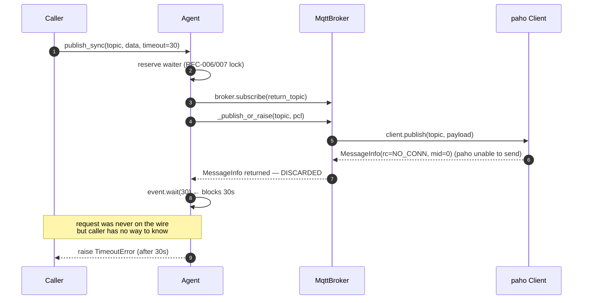

# RFC-012 — MQTT publish result contract

- **Status**: **Implemented** (2026-08-02)
- **Author**: Audit follow-up
- **Depends on**: `docs/audit/05-risk-register.md` R-10.7 (`MqttBroker.publish` silently swallows paho `MessageInfo.rc` failures — runtime-confirmed); downstream of RFC-002 (publish error propagation), RFC-005 (subscription recovery), RFC-010 (broker bounded shutdown), RFC-011 (broker bounded startup)
- **Scope**: Give `MqttBroker.publish()` a deterministic, observable result contract — parse the paho immediate result (`MessageInfo.rc` / `(rc, mid)` tuple), raise a dedicated `MqttPublishError` on `rc != MQTT_ERR_SUCCESS`, gate publish on broker lifecycle state (only `RUNNING + connected + not stopping`), preserve `Agent.publish` fire-and-forget contract, and restore RFC-002 fast-fail semantics for `Agent._publish_or_raise` / `Agent.publish_sync` so callers no longer wait the full response timeout for a request that was never on the wire. Close R-10.7.
- **Explicitly out of scope**: QoS 1/2 acknowledgment via `wait_for_publish` (delivery-confirmation is a separate RFC), per-call `qos` / `retain` public kwargs, broker acknowledgment (`is_published()` semantics), `MessageBroker` ABC signature change (opt-in parity with RFC-010 §7.16 / RFC-011 §7.16), publish metrics / counters, shared `last_publish_error` field (§H rejects), offline publish queue, retry / backoff, reconnect policy (RFC-005 owns this), publish batching, publish rate limiting.

---

## 0. Implementation summary (2026-08-02)

Diverges from §6–§7 wherever explicitly noted; where not noted, the recommended design was implemented verbatim.

**New public symbols (`src/agentflow/broker/mqtt_broker.py`, re-exported via `agentflow.broker.__init__`)**:

- `MqttPublishReason` (Enum) — stable short-code enum: `BROKER_NOT_RUNNING`, `BROKER_STOPPING`, `BROKER_DISCONNECTED`, `PAHO_REJECTED`, `UNSUPPORTED_RESULT`. RFC-012 modification 1: replaces the frozen-string design in §7.5 with an explicit enum so callers can dispatch on identity (`err.reason is MqttPublishReason.PAHO_REJECTED`).
- `MqttPublishError(RuntimeError)` — dedicated exception with seven queryable fields:
  - `topic: str` (required)
  - `reason: MqttPublishReason` (required)
  - `rc: Optional[int]` (gate-time raises → `None`)
  - `mid: Optional[int]`
  - `state: Optional[WorkerState]` (populated for gate-time raises)
  - `result_type: Optional[str]` (populated for `UNSUPPORTED_RESULT`)
  - `detail: Optional[str]` (populated for rc/mid coercion failures)

Message format (frozen — Appendix D):

```
MQTT publish failed: topic=<repr>, rc=<int|None>, mid=<int|None>, reason=<code>[, state=<state.value>][, result_type=<type>][, detail=<repr>]
```

`__cause__` preservation via `raise ... from ex` for rc/mid coercion failures (§7.9 / §C).

**MqttBroker.publish rewrite (`mqtt_broker.py`)**:

- Pre-call state snapshot under `_state_lock` — reads `_state`, `_stopping`, `_connected` atomically.
- Lock released BEFORE `client.publish()` (parity with RFC-005/010/011 lock hygiene — statically verified by `test_C29`).
- Gate priority (RFC-012 modification 2, §B):
  1. `_stopping=True` → `MqttPublishError(BROKER_STOPPING)` — highest priority
  2. `state != RUNNING` → `MqttPublishError(BROKER_NOT_RUNNING, state=<state>)`
  3. `not _connected` → `MqttPublishError(BROKER_DISCONNECTED)`
  4. else → invoke paho
- **Explicit docstring** (RFC-012 modification 2): "gate is PRE-CALL best-effort snapshot; NOT full linearization barrier with stop(). Concurrent stop() may flip `_stopping=True` AFTER our snapshot but BEFORE `client.publish()` runs. paho's immediate rc is the second, authoritative layer."
- After paho call: `_normalise_publish_result` parses `MessageInfo` / v1 tuple / rejects `None` / unknown shape.
- `rc != MQTT_ERR_SUCCESS` → `MqttPublishError(PAHO_REJECTED, rc, mid)`.
- Success → return paho's original result unchanged (backward-compat for callers that inspect `.mid`).

**Result normaliser** (`_normalise_publish_result` — private):

- Object with `.rc` (v2 MessageInfo or duck-type) → `int(result.rc)`, `int(getattr(result, 'mid', None))` if non-None.
- Tuple with `len >= 1` (v1 shape) → `int(result[0])`, `int(result[1])` if available and non-None.
- Coercion failure → `MqttPublishError(UNSUPPORTED_RESULT, detail='invalid rc'|'invalid mid')` with original exception as `__cause__`.
- Anything else → `MqttPublishError(UNSUPPORTED_RESULT, result_type=type(result).__name__)`.

**Divergences from §6–§7**

| RFC section | Design | Implementation | Reason |
|---|---|---|---|
| §7.5 reason as frozen string | `reason: str` with fixed enumeration by string identity | **`reason: MqttPublishReason` enum** with stable string `.value` | RFC-012 modification 1 applied at implementation review: enum enables identity dispatch (`err.reason is ...`), avoids typos, keeps log-string stability via `.value`. |
| §7.4 fields (4) | topic, rc, mid, reason | **7 fields**: topic, rc, mid, reason, state, result_type, detail | RFC-012 modification 1: caller-actionable diagnostics (state on gate reject, result_type/detail on UNSUPPORTED_RESULT). |
| §6.3 result normaliser | Basic shape validation | **Additional rc/mid coercion error path** raising UNSUPPORTED_RESULT with `raise ... from ex` cause preservation | RFC-012 modification 1 / §C: fake / third-party clients that return non-int rc/mid should not silently pass through. |
| §6.2 gate priority | `state` checked before `_stopping` (§7.15 mentioned `_stopping` precedence but §6.2 pseudocode had state first) | **`_stopping` check FIRST** (RFC-012 §B modification 2 codified) | modification 2: fresh stop() request must win — a broker mid-stop should not be publish-able even if state happened to still be RUNNING. |
| §6.4 `Agent._publish_or_raise` shape | Same code | Same code (no explicit change needed) | Implementation confirms: `MqttPublishError` propagates naturally through `_publish_or_raise` (it's just an unhandled exception in that method). RFC-002 fast-fail restored automatically. |
| §11 no full linearization | Not explicitly discussed | **Explicit docstring paragraph + `test_C30` source check + `test_C31` documents race** | RFC-012 modification 2: honesty about the boundary; a future "publish/stop operation barrier" RFC can close the residual race. |

Otherwise, decisions §7.1–§7.26 landed as designed.

**`Agent.publish` / `_publish_or_raise` / `publish_sync` — code unchanged; behaviour restored**

- `Agent.publish` continues to catch `Exception` (which catches `MqttPublishError` via `RuntimeError`); logs; returns None. RFC-002 fire-and-forget preserved byte-for-byte.
- `Agent._publish_or_raise` — no `try/except` around the broker call; `MqttPublishError` naturally propagates.
- `Agent.publish_sync` — `_publish_or_raise` raises BEFORE `event.wait(timeout)` reaches. RFC-002 fast-fail restored for rc failures. `finally` cleanup (RFC-006/007) still runs.

**Runtime verification (2026-08-02)**

- RFC-012 dedicated file `tests/unit/test_mqtt_broker_publish_result.py`: **74 passed** in ~0.15 s (9 categories: A basic lifecycle × 10, B rc validation × 13, C state gate × 11, D QoS unchanged × 4, E Agent integration × 10, F auto-reply / dispatcher × 3, G exception contract × 13, H payload × 4, I concurrency × 6).
- `tests/unit/test_mqtt_broker_lifecycle.py` — **11 passed** (3 tests refactored to use `_prime_connected` + `_RFC012SuccessInfo` fixture).
- `tests/unit/test_mqtt_broker_start.py` — **13 passed** unchanged.
- `tests/unit/test_mqtt_broker_shutdown.py` — **53 passed** unchanged.
- `tests/unit/test_mqtt_broker_startup_bounded.py` — **74 passed** unchanged.
- `tests/unit/test_mqtt_broker_reconnect.py` — **48 passed** unchanged.
- `tests/unit/core/test_agent_publish_errors.py` — **46 passed** unchanged (uses `FakeBroker`, not `MqttBroker`).
- `tests/unit/core/test_agent_publish_sync.py` — **27 passed** unchanged (same).
- Full unit regression: `PYTHONPATH=src pytest tests/unit` → **525 passed, 0 failed, 0 xfailed(strict-pass), 2 xfailed** in ~49 s.
- Zero regression across RFC-001–011.

**Files changed**

- `src/agentflow/broker/mqtt_broker.py` — +245 −0 lines (MQTT_ERR_SUCCESS const, MqttPublishReason enum, MqttPublishError class, publish rewrite, _normalise_publish_result helper).
- `src/agentflow/broker/__init__.py` — +12 −1 lines (re-export + `__all__`).
- `tests/unit/test_mqtt_broker_lifecycle.py` — 3 tests refactored (`_prime_connected` + `_RFC012SuccessInfo`).
- `docs/rfc/RFC-012-mqtt-publish-result-contract.md` — this file (status flip).
- `tests/unit/test_mqtt_broker_publish_result.py` — rewritten to post-RFC-012 contract (75 → 74 tests: characterisation inverted; new gate / normaliser / cleanup verification tests added).

**Not implemented (deferred to future RFCs)**

- Full stop-linearised publish barrier — RFC-012 §B modification 2 explicitly acknowledges the residual race; deferred to a future "publish/stop operation barrier" RFC.
- QoS 1/2 acknowledgment (`wait_for_publish` bounded pattern) — deferred to "MQTT delivery confirmation" RFC.
- Public `qos` / `retain` kwargs — deferred (paired with QoS RFC).
- `MessageBroker` ABC signature unification — parity with RFC-010 §7.16 / RFC-011 §7.16.
- Publish metrics / counters — parity with RFC-008/009/010/011.
- Offline queue / retry / backoff / batching — separate RFCs.
- Other broker implementations (Redis / ROS / DDS) — R-22 unregistered stubs.
- R-10.5 non-daemon interpreter-exit blocking — RFC-012 does not address; documented across RFC-009/010/011.

---

## 1. Problem statement

`MqttBroker.publish()` (`src/agentflow/broker/mqtt_broker.py:962-963`, verbatim):

```python
def publish(self, topic: str, payload):
    return self._client.publish(topic=topic, payload=payload)
```

is a bare passthrough. It does NOT:

- inspect the returned `MQTTMessageInfo`;
- check `.rc`;
- call `wait_for_publish()` / `is_published()`;
- gate on broker lifecycle state (`_stopping` / `_state` / `_connected`);
- distinguish paho v1 `(rc, mid)` tuple from v2 `MQTTMessageInfo` from `None`;
- pass `qos` / `retain`.

`Agent._publish_or_raise()` (`agent.py:556-570`) discards the broker's return value entirely — only `_broker is None` raises. Every paho `rc != MQTT_ERR_SUCCESS` code (`NO_CONN=4`, `QUEUE_SIZE=14`, `PROTOCOL=2`, unknown non-zero) is silently swallowed at both the broker and Agent layers.

**Impact chain** — runtime-confirmed via `tests/unit/test_mqtt_broker_publish_result.py` (75 characterisation tests, 2026-07-31):

1. `Agent.publish(topic, data)` — RFC-002 fire-and-forget contract preserved by design; RC failure is invisible (`test_E41`).
2. `Agent._publish_or_raise(topic, data)` — RFC-002 fast-fail promise **broken for RC failures** (`test_E42`). Only `Exception` from `broker.publish` propagates. `rc=NO_CONN` silently returns.
3. `Agent.publish_sync(topic, data, timeout=30)` — request publishes via `_publish_or_raise`. When paho returns `rc=NO_CONN`, the request never actually reached the wire, but `publish_sync` proceeds to `event.wait(timeout=30)` and **waits the FULL 30 seconds** for a response that will never arrive (`test_E43`, elapsed >= 0.19 s vs 0.2 s bound — the full timeout). Compare `test_E44`: when paho *raises* the same underlying error, `publish_sync` fast-fails in < 0.5 s (RFC-002 works as designed).
4. `Agent._on_message` auto-reply (RFC-003) — reply publish via `Agent.publish`. RC failure silently drops the reply; caller gets no response; dispatcher continues (`test_E48` / `test_E49`).
5. **No lifecycle gate** — publish reaches paho from every state (`test_C21` NEW, `test_C22` STARTING, `test_C25` STOPPED, `test_C26` START_FAILED, `test_C27` `_stopping=True`, `test_C28` `_connected=False`). Contrast RFC-005: subscribe/unsubscribe correctly fence on `_stopping=True`. Publish has no equivalent fence.
6. **Same root cause manifests two ways** (`test_E45`): paho returning `rc=NO_CONN` vs paho raising `ConnectionError` produce different Agent-layer behaviour. RFC-002's Agent contract stability is compromised.

**Additional characterisations**:

- Return shapes pass through untouched (`test_B17` None, `test_B18` tuple, `test_B19` MessageInfo) — no shape validation, no version-adaptation layer.
- No `last_publish_error` / `last_publish_rc` / `publish_metrics` field on `MqttBroker` (`test_B20`) — post-hoc observability nil.
- `qos` and `retain` never forwarded (`test_A3` / `test_D40`) — QoS 0 default forever.
- `wait_for_publish` / `is_published` never called (`test_A7` / `test_A8`) — QoS 1/2 acknowledgment structurally unavailable.
- No lock around publish (`test_H70`) — paho Client's own thread-safety is relied on; no in-tree serialisation.
- Post-stop publish still reaches paho (`test_H73`) — separate fencing gap from R-10.4 / R-10.6.

RFC-002 explicitly deferred broker-side `MessageInfo` (`Known issues NOT resolved by this fix`) to a future RFC. RFC-010 §7.15 and RFC-011 §7.5 also referenced publish observability as a residual. This RFC closes those cross-references.

**Non-goals restated** (bear repeating in a RFC that is easy to over-scope):

- Delivery acknowledgment (`wait_for_publish`) is a fundamentally different problem — it involves potential blocking, bounded-timeout patterns, and QoS 1/2 semantic redesign. Deferred to a future "MQTT delivery confirmation" RFC.
- Adding `qos` / `retain` kwargs would let callers request higher delivery guarantees; deferred because the Agent-layer callers don't have use cases yet.
- Changing `MessageBroker` ABC would force third-party subclasses to migrate; RFC-010 §7.16 and RFC-011 §7.16 chose "leave ABC alone" for compatibility; RFC-012 follows the same discipline.

---

## 2. Runtime evidence

Baseline before this RFC: `PYTHONPATH=src pytest tests/unit` → **526 passed, 2 xfailed** in ~52 s (post-RFC-011 + R-10.7 characterisation).

Confirmed by `tests/unit/test_mqtt_broker_publish_result.py` (75 characterisation tests, all currently PASSED against the broken code):

| # | Behaviour | Test |
|---|---|---|
| A1 | `publish` delegates topic/payload to `client.publish` | `test_A1_publish_delegates_to_client_publish` |
| A2 | keyword-only args (`topic=`, `payload=`) | `test_A2_publish_uses_keyword_args_topic_and_payload` |
| A3 | qos / retain NOT passed | `test_A3_publish_does_NOT_pass_qos_or_retain` |
| A4 / A5 | TextParcel `text/json|` head; BinaryParcel `application/pickle|` head | `test_A4 / A5` |
| A6 | returns underlying MessageInfo unchanged | `test_A6` |
| A7 / A8 / A9 | source has no `wait_for_publish`, no `is_published`, no `.rc` or `MQTT_ERR` | `test_A7 / A8 / A9` |
| A10 | `client.publish` raise propagates | `test_A10` |
| B11 | rc SUCCESS returns normally | `test_B11` |
| B12 | rc NO_CONN silently swallowed | `test_B12_rc_NO_CONN_is_SILENTLY_SWALLOWED` |
| B13 / B14 / B15 | rc QUEUE_SIZE / PROTOCOL / unknown-nonzero silently swallowed | `test_B13 / B14 / B15` |
| B16 / B17 / B18 / B19 | MessageInfo without rc / None / tuple / MessageInfo — all pass through | `test_B16-B19` |
| B20 | no observability on broker (no `last_publish_error` etc.) | `test_B20` |
| C21–C31 | publish reaches paho from ANY state (NEW / STARTING / RUNNING / STOPPING / STOPPED / STOP_TIMEOUT / STOP_FAILED / START_FAILED / `_stopping=True` / `_connected=False`) | `test_C21-C31` |
| D32 | qos not passed (paho default = 0) | `test_D32` |
| D33 / D34 / D35 | `wait_for_publish` never invoked; QoS 1/2 acknowledgment structurally unavailable | `test_D33-D35` |
| D37 | `mid` available in return but broker never captures | `test_D37` |
| D38 / D39 | `is_published` distinction hidden | `test_D38 / D39` |
| D40 | retain flag not passed | `test_D40` |
| E41 | `Agent.publish` returns None regardless of rc | `test_E41` |
| E42 | `Agent._publish_or_raise` does NOT raise on rc failure | `test_E42` |
| E43 | `publish_sync` waits FULL timeout on rc failure (runtime demo, elapsed >= 0.19 s vs 0.2 s bound) | `test_E43_publish_sync_waits_full_timeout_when_request_publish_rc_fails` |
| E44 | `publish_sync` fast-fails on `Exception` from broker (< 0.5 s) — RFC-002 works | `test_E44` |
| E45 | rc failure vs Exception behave DIFFERENTLY at Agent layer | `test_E45` |
| E46 | Agent.publish fire-and-forget contract source-stable | `test_E46` |
| E48 / E49 / E50 | reply / auto-reply publish RC failure silently dropped; dispatcher unaffected | `test_E48-E50` |
| F51 / F52 | no return annotation on `MqttBroker.publish` or `MessageBroker.publish` | `test_F51 / F52` |
| F53 / F54 | `EmptyBroker` / `FakeBroker` return None | `test_F53 / F54` |
| F57 | no `MqttPublishError` class exists | `test_F57` |
| H69 / H70 | multi-thread publish works (paho thread-safe); no lock in `MqttBroker.publish` | `test_H69 / H70` |
| H73 | post-stop publish still reaches paho — fencing gap | `test_H73_post_stop_publish_still_reaches_paho_client` |
| H74 / H75 | concurrent rc failures per-call isolated; no shared `last_publish_error` (documented DESIGN constraint) | `test_H74 / H75` |

---

## 3. Current state

Source (`src/agentflow/broker/mqtt_broker.py:962-963`):

```python
def publish(self, topic: str, payload):
    return self._client.publish(topic=topic, payload=payload)
```

`Agent._publish_or_raise` (`agent.py:556-570`):

```python
def _publish_or_raise(self, topic, data=None) -> None:
    pcl = data if isinstance(data, Parcel) else Parcel.from_content(data)
    if self._broker is None:
        raise RuntimeError("Cannot publish: no broker attached")
    self._broker.publish(topic, pcl.payload())  # return value discarded
```

`Agent.publish` (`agent.py:543-552`):

```python
@final
def publish(self, topic, data=None):
    try:
        self._publish_or_raise(topic, data)
    except Exception as ex:
        logger.exception(ex)
```

`Agent.publish_sync` (`agent.py:575`ff, condensed):

```python
@final
def publish_sync(self, topic, data=None, topic_wait=None, timeout=30) -> Parcel:
    ...
    # 1. Reserve waiter (RFC-006/007 collision lock)
    ...
    try:
        # 2. broker.subscribe outside collision lock
        if self._broker:
            self._broker.subscribe(pcl.topic_return, "str")
        # 3. Publish request via _publish_or_raise
        self._publish_or_raise(topic, pcl)
        # 4. Wait for response — this is where R-10.7 costs the caller
        if data_event.event.wait(timeout):
            return data_event.data
        raise TimeoutError(...)
    finally:
        # 5. Waiter cleanup (RFC-006 §7.5 / RFC-007 §7.8)
        ...
```



---

## 4. Desired state

- `MqttBroker.publish(topic, payload)` inspects the paho immediate result:
  - Normalise return shape (v1 tuple `(rc, mid)`, v2 `MQTTMessageInfo`, or `None`/unknown).
  - On `rc != MQTT_ERR_SUCCESS` → **raise `MqttPublishError(topic, rc, mid, reason)`**.
  - On unsupported result shape → raise `MqttPublishError(topic, rc=None, mid=None, reason='unsupported publish result')`.
  - On success → return the original result (backward-compat for any caller that inspects it).
- **State gate** (RFC-012 §7.12): only `RUNNING + _connected=True + _stopping=False` may publish; every other combination raises `MqttPublishError(reason=...)` BEFORE calling paho.
- Snapshot of `_state` / `_stopping` / `_connected` under a short `_state_lock` acquisition; paho call happens OUTSIDE the lock (parity with RFC-005/010/011 lock hygiene).
- `Agent._publish_or_raise` unchanged in signature — but now propagates `MqttPublishError` in addition to the existing `RuntimeError("Cannot publish: no broker attached")`.
- `Agent.publish` unchanged in shape — the fire-and-forget `try / except Exception` catches `MqttPublishError` (subclass of `RuntimeError` → subclass of `Exception`); logs; returns None. RFC-002's fire-and-forget contract preserved byte-for-byte.
- `Agent.publish_sync` unchanged in shape — because `_publish_or_raise` now raises on rc failure, the raise happens BEFORE `event.wait(timeout)` is reached. RFC-002 fast-fail contract is **restored** for the RC failure class. Waiter cleanup in `finally` still runs (RFC-006/007 preserved).
- Auto-reply publish failure (RFC-003) — since it goes through `Agent.publish` (fire-and-forget), the `MqttPublishError` is caught + logged; dispatcher continues; RFC-003 semantics preserved.
- **`MessageBroker` ABC unchanged** — `MqttPublishError` is broker-specific behaviour, not enforced by the ABC. Third-party subclasses (`EmptyBroker`, custom brokers) continue with their own return contract.
- **QoS unchanged** (default 0). **`wait_for_publish` NOT called.** Delivery-confirmation semantics are out of scope; this RFC only addresses the immediate result path.
- **No shared `last_publish_error` field** (§H rejects the design). Concurrent publishers get per-call raises; no cross-thread state leakage.

---

## 5. Options considered

### Option A — Keep passthrough; caller inspects return

Callers of `MqttBroker.publish` inspect the returned `MessageInfo.rc` themselves.

| Aspect | Analysis |
|---|---|
| Fixes R-10.7 | ✗ — moves the problem to every caller (currently: `Agent._publish_or_raise` is the only caller in-tree; every future caller would need to remember) |
| Backwards compat | Perfect |
| Complexity | Zero |
| Risk | Preserves the RFC-002 fast-fail bug on `publish_sync` |
| Verdict | Rejected |

### Option B — `MqttBroker.publish` raises `RuntimeError` on rc failure

Use the existing `RuntimeError` type (RFC-002 uses it for `"Cannot publish: no broker attached"`).

| Aspect | Analysis |
|---|---|
| Fixes R-10.7 fast-fail | ✓ |
| Caller distinguishability | ✗ — cannot distinguish "no broker" from "rc failure" from arbitrary paho `RuntimeError` |
| Structured diagnostics | ✗ — message string only |
| Verdict | Rejected in favour of Option C |

### Option C — New `MqttPublishError(RuntimeError)` with structured fields (**recommended**)

Dedicated exception type with `topic`, `rc`, `mid`, `reason` fields. Subclass of `RuntimeError` so any existing `except RuntimeError` / `except Exception` catches it (backward-compat with `Agent.publish` fire-and-forget).

| Aspect | Analysis |
|---|---|
| Fixes R-10.7 fast-fail | ✓ |
| Caller distinguishability | ✓ — `except MqttPublishError` targets exactly this class |
| Structured diagnostics | ✓ — fields queryable programmatically; formatted message includes them |
| RFC-002 compat | ✓ — `Agent.publish`'s `except Exception` catches it; `_publish_or_raise` re-propagates; `publish_sync` gets fast-fail restored |
| Complexity | Low — one new class, small helper function to normalise paho return |
| Verdict | **Recommended core** |

### Option D — `MqttBroker.publish -> bool`

Change return type to `bool`. `True` = accepted; `False` = rejected.

| Aspect | Analysis |
|---|---|
| Fixes R-10.7 | Partial — caller can distinguish, but must remember to check (like Option A) |
| Diagnostic detail | ✗ — no rc/mid/reason on the boolean |
| Return-type change | Breaking for `Agent._publish_or_raise` if it were to start inspecting; safe if it doesn't |
| Verdict | Rejected — silently ignoring a `False` return is easy to do; raising is safer |

### Option E — Return `MessageInfo` but validate rc

Keep return type as `MessageInfo` (or a normalised wrapper). Validate rc; if bad, raise (like C); if good, return the info.

| Aspect | Analysis |
|---|---|
| Fixes R-10.7 | ✓ — because it raises on bad rc (same as C) |
| Return-type stability | Better — anyone inspecting `.rc` / `.mid` on success gets what they expected |
| Distinctness from C | Marginal — C returns success verbatim too (§6.3) |
| Verdict | **Merged into C** — RFC-012's recommendation returns the original result on success (rc==0), so this is functionally the same. |

### Option F — State gate: only RUNNING + connected + not stopping may publish (**recommended**)

Add a pre-publish check on `_state` / `_stopping` / `_connected`. States that cannot publish → raise `MqttPublishError(reason=...)` BEFORE calling paho.

| Aspect | Analysis |
|---|---|
| Fixes R-10.7 state-gate gap | ✓ — closes `test_C21-C31` / `test_H73` |
| Fixes rc=NO_CONN "detectable in-broker" scenarios | ✓ — many disconnected publishes would have returned NO_CONN anyway; now they raise BEFORE reaching paho with a clearer reason |
| Consistency with RFC-005 | ✓ — subscribe/unsubscribe already fence on `_stopping` |
| Consistency with RFC-010 / RFC-011 fencing | ✓ — same `_state_lock` pattern |
| Complexity | Low — 5-line lock section |
| Verdict | **Recommended** — pairs with C |

### Option G — QoS >= 1 bounded `wait_for_publish(timeout)`

Introduce QoS 1/2 acknowledgment via `wait_for_publish`.

| Aspect | Analysis |
|---|---|
| Fixes R-10.7 immediate-result | ✗ — orthogonal issue |
| Public API impact | Large — new kwargs, new timeout budget, new bounded-wait pattern |
| Delivery guarantee | Adds QoS semantics genuinely |
| Verdict | Deferred to a separate "MQTT delivery confirmation" RFC — see §Out of scope |

### Option H — Change `MessageBroker` ABC return contract

Force every broker to return `bool` / raise on failure at the ABC level.

| Aspect | Analysis |
|---|---|
| Fixes R-10.7 | Partially — for MqttBroker; but forces `EmptyBroker` / third-party changes |
| Blast radius | Enormous |
| Verdict | Rejected — parity with RFC-010 §7.16 / RFC-011 §7.16 |

### Comparison summary

| Criterion | A | B | **C** | D | E | **F** | G | H |
|---|---|---|---|---|---|---|---|---|
| Fast-fail on rc failure | ✗ | ✓ | ✓ | ~ | ✓ | ✓ | n/a | ✓ |
| Structured diagnostics | ✗ | ✗ | ✓ | ✗ | ✓ | ✓ | n/a | ~ |
| Caller distinguishability | ✗ | ✗ | ✓ | ✓ | ✓ | ✓ | n/a | ✗ |
| Preserves RFC-002 fire-and-forget | ✓ | ✓ | ✓ | ✓ | ✓ | ✓ | ✓ | ✗ |
| Restores RFC-002 fast-fail on `publish_sync` | ✗ | ✓ | ✓ | ~ | ✓ | ~ | ~ | ~ |
| Closes state-gate gap | ✗ | ✗ | ✗ | ✗ | ✗ | ✓ | ✗ | ~ |
| Third-party broker impact | none | none | none | none | none | none | none | breaking |
| Complexity | Low | Low | **Med** | Low | Med | **Med** | High | Very High |
| Verdict | rej | rej | **chosen** | rej | merged→C | **chosen** | deferred | rej |

**Recommended first-phase**: **C + F**. Dedicated `MqttPublishError` for rc failures + state gate for lifecycle correctness. Options G/H are separate future RFCs.

---

## 6. Recommended design

Adopt **Option C + Option F**. Introduce `MqttPublishError(RuntimeError)` with structured fields. Gate publish on `_state == RUNNING and _connected and not _stopping`. Normalise paho return shape. Raise on rc failure. Preserve `MessageBroker` ABC and all other broker implementations.

### 6.1 `MqttPublishError` class

```python
class MqttPublishError(RuntimeError):
    """RFC-012: raised by MqttBroker.publish when the immediate publish
    result indicates failure.

    Subclass of RuntimeError so that any existing `except RuntimeError`
    / `except Exception` catches it (RFC-002 fire-and-forget compat).

    Attributes:
      topic  — the MQTT topic passed to publish()
      rc     — paho MQTTErrorCode int, or None if unavailable
      mid    — paho message id (int), or None if unavailable
      reason — short human-readable classifier: one of
               {'broker not running', 'broker stopping', 'broker disconnected',
                'paho rejected publish', 'unsupported publish result'}
    """

    def __init__(self, topic: str, rc: Optional[int], mid: Optional[int],
                 reason: str):
        self.topic = topic
        self.rc = rc
        self.mid = mid
        self.reason = reason
        # Formatted message: consistent field order for log-mining.
        super().__init__(
            f"MQTT publish failed: topic={topic!r}, "
            f"rc={rc}, mid={mid}, reason={reason!r}"
        )
```

**Location**: `src/agentflow/broker/mqtt_broker.py` (module-level, alongside `MqttBroker`). Rationale: broker-specific behaviour; no cross-module dependency; keeps the type close to its raiser.

**Export**: Re-exported from `agentflow.broker.__init__` (matches how `MqttBroker` / `EmptyBroker` are already re-exported today).

### 6.2 State snapshot + gate

```python
def publish(self, topic: str, payload):
    """RFC-012 publish with immediate-result validation.

    Raises MqttPublishError when:
      - broker is not currently running (state != RUNNING)
      - broker is stopping (_stopping=True)
      - broker is not connected (_connected=False)
      - paho returned a non-success rc
      - paho returned an unsupported result shape

    Returns paho's original result unchanged on success.
    """
    # Short state-lock snapshot (no I/O in lock).
    with self._state_lock:
        state = self._state
        stopping = self._stopping
        connected = self._connected

    # Gate decisions (lock-external).
    if state is not WorkerState.RUNNING:
        raise MqttPublishError(
            topic=topic, rc=None, mid=None,
            reason=f'broker not running (state={state.value})',
        )
    if stopping:
        raise MqttPublishError(
            topic=topic, rc=None, mid=None,
            reason='broker stopping',
        )
    if not connected:
        raise MqttPublishError(
            topic=topic, rc=None, mid=None,
            reason='broker disconnected',
        )

    # paho call OUTSIDE the state lock (RFC-005 / RFC-010 / RFC-011
    # lock hygiene: never hold state lock across paho I/O).
    result = self._client.publish(topic=topic, payload=payload)

    # Normalise + validate immediate result.
    rc, mid = self._normalise_publish_result(topic, result)
    if rc != MQTT_ERR_SUCCESS:
        raise MqttPublishError(
            topic=topic, rc=rc, mid=mid,
            reason='paho rejected publish',
        )
    return result
```

### 6.3 Result normalisation

```python
def _normalise_publish_result(self, topic: str, result):
    """RFC-012 §7.6-§7.9: paho's publish() returns different shapes
    across versions. Normalise to (rc, mid) for validation; leave
    the original `result` alone for caller.

    Supported shapes:
      - paho v2: MQTTMessageInfo with .rc and .mid attributes
      - paho v1: tuple (rc, mid) or (rc, mid, ...)
      - fakes / third-party: anything with .rc / [0] access
    Unsupported: None, arbitrary objects without .rc or [0].
    """
    # v2 MessageInfo (or any object with .rc)
    if hasattr(result, 'rc'):
        return int(result.rc), getattr(result, 'mid', None)
    # v1 tuple / tuple-like
    if isinstance(result, tuple) and len(result) >= 1:
        rc = int(result[0])
        mid = int(result[1]) if len(result) >= 2 else None
        return rc, mid
    # Unsupported (None, other objects) — raise before returning.
    raise MqttPublishError(
        topic=topic, rc=None, mid=None,
        reason=f'unsupported publish result: {type(result).__name__}',
    )
```

**Note**: `_normalise_publish_result` raises `MqttPublishError` directly for unsupported shapes. The outer `publish()` does not need to re-wrap — the raise short-circuits back to the caller of `publish()`.

### 6.4 `Agent._publish_or_raise` (unchanged in signature)

```python
def _publish_or_raise(self, topic, data=None) -> None:
    pcl = data if isinstance(data, Parcel) else Parcel.from_content(data)
    if self._broker is None:
        raise RuntimeError("Cannot publish: no broker attached")
    self._broker.publish(topic, pcl.payload())
    # (No new code — MqttPublishError propagates naturally from
    # broker.publish; the `-> None` annotation is preserved because
    # we still return None on success.)
```

The **behavioural change**: `MqttPublishError` now propagates from `broker.publish` on rc failure — previously only `Exception` propagations did. Callers of `_publish_or_raise`:

- `Agent.publish` — catches `Exception` (which catches `MqttPublishError` via `RuntimeError`); logs; returns None. Contract preserved.
- `Agent.publish_sync` — no `try` around the `_publish_or_raise` call itself; `MqttPublishError` bubbles up BEFORE `event.wait(timeout)` runs. But the `try/finally` around the whole publish→wait block still fires cleanup. See §6.5.

### 6.5 `Agent.publish_sync` (unchanged in code, behaviour restored)

```python
try:
    if self._broker:
        self._broker.subscribe(pcl.topic_return, "str")
    self._publish_or_raise(topic, pcl)   # ← now raises on rc failure
    if data_event.event.wait(timeout):
        return data_event.data
    raise TimeoutError(...)
finally:
    # RFC-006 §7.5 / RFC-007 §7.8 cleanup (unchanged).
    with self._handlers_lock:
        ...
    if need_broker_unsubscribe:
        try:
            if self._broker:
                self._broker.unsubscribe(pcl.topic_return)
        except Exception as cleanup_ex:
            logger.exception(cleanup_ex)
```

**Behavioural change**: when `_publish_or_raise` raises `MqttPublishError`, `event.wait(timeout)` is never reached. `finally` runs the RFC-006/007 waiter cleanup. Caller sees `MqttPublishError` in < 50 ms instead of a `TimeoutError` after 30 s.

### 6.6 `Agent.publish` (unchanged)

```python
@final
def publish(self, topic, data=None):
    try:
        self._publish_or_raise(topic, data)
    except Exception as ex:
        logger.exception(ex)
```

The `except Exception` clause catches `MqttPublishError` (via RuntimeError → Exception). Fire-and-forget contract preserved.

### 6.7 Auto-reply (RFC-003) containment

`Agent._on_message` (auto-reply path, `agent.py:_on_message.handle_message`):

```python
if should_auto_reply:
    ...
    self.publish(pcl.topic_return, data_resp)
    # publish is fire-and-forget → MqttPublishError caught + logged
    # → dispatcher continues → next message processed.
```

**No source change required** — `Agent.publish` already swallows `MqttPublishError` via its own try/except. Dispatcher-worker thread continues (RFC-004 preserved).

---

## 7. Concrete decisions (all 26)

### 7.1 `MqttPublishError` class location

`src/agentflow/broker/mqtt_broker.py`, module-level. Re-exported from `agentflow.broker.__init__` (matches existing `MqttBroker` / `EmptyBroker` re-exports).

### 7.2 Public export

Yes. `agentflow.broker.MqttPublishError` is public API so callers can `from agentflow.broker import MqttPublishError` and use `except MqttPublishError`. Callers who prefer catching by base class use `except RuntimeError` / `except Exception`.

### 7.3 Exception inheritance

`MqttPublishError(RuntimeError)`. Rationale:

- `RuntimeError` matches RFC-002's convention (`_publish_or_raise` already raises `RuntimeError("Cannot publish: no broker attached")`).
- `except Exception` in `Agent.publish` catches it → fire-and-forget preserved.
- `except RuntimeError` (a common catch-all pattern) also works.
- Not `IOError` / `ConnectionError` / `OSError` — those are for actual socket-layer failures; a paho `rc=INVAL` is a protocol / config issue, not a network fault.

### 7.4 Structured fields

Four public attributes: `topic: str`, `rc: Optional[int]`, `mid: Optional[int]`, `reason: str`.

- `topic` — always set (the caller's topic argument).
- `rc` — the paho error code int, or `None` when the gate rejected before paho was called, or `None` when the result shape was unsupported.
- `mid` — the paho message id int, or `None` when unavailable.
- `reason` — a short classifier chosen from a fixed enumeration (§7.5) for log-mining stability.

### 7.5 Error message format

Format: `MQTT publish failed: topic={topic!r}, rc={rc}, mid={mid}, reason={reason!r}`.

Fixed classifier enumeration for `reason`:
- `'broker not running (state=<state>)'`
- `'broker stopping'`
- `'broker disconnected'`
- `'paho rejected publish'`
- `'unsupported publish result: <type-name>'`

Example: `MQTT publish failed: topic='some/topic', rc=4, mid=17, reason='paho rejected publish'`

### 7.6 Supported paho return shapes

Documented in `_normalise_publish_result` docstring:

- **paho v2**: `MQTTMessageInfo` with `.rc` and `.mid` attributes (primary support)
- **paho v1**: `tuple` of `(rc, mid)` or longer (backward-compat)
- **Any object with `.rc`**: duck-typed (fakes, third-party wrappers)

Unsupported: `None`, arbitrary objects without `.rc` or `[0]`.

### 7.7 `MessageInfo.rc` parsing

`int(result.rc)` — coerces from paho's `MQTTErrorCode` enum (or from any int-compatible value). Success comparison uses the pinned constant `MQTT_ERR_SUCCESS = 0` (defined at module top; not imported from `paho` to keep test independence).

### 7.8 `(rc, mid)` tuple parsing

`isinstance(result, tuple) and len(result) >= 1`:
- `rc = int(result[0])`
- `mid = int(result[1]) if len(result) >= 2 else None`

Longer tuples (paho v1 rarely returns >2 elements but future-proof): extra elements ignored.

### 7.9 `None` / unknown object behaviour

Raise `MqttPublishError(topic, rc=None, mid=None, reason='unsupported publish result: <type-name>')`. Rationale: silently accepting `None` (as today) hides the fact that paho did not return the expected shape — usually indicative of a broken fake / stale mock / wrong paho version.

**Compatibility note**: some existing tests pass `fake_client.publish.return_value = None` (implicit — MagicMock default). Those tests either need to explicitly set a return value with `rc=0`, or accept that the broker raises. See §9 test migration plan.

### 7.10 Success return value

Return **the original paho result unchanged**. This preserves any caller that inspects `.mid` on success (e.g. for logging correlation IDs). It also preserves backward-compat with existing tests that assert `broker.publish(...) is fake_client.publish.return_value` (`test_A6_publish_returns_underlying_MessageInfo_unchanged`).

### 7.11 Unknown non-zero rc behaviour

Same as any other non-zero rc: raise `MqttPublishError(rc=<value>, ...)`. Forward-compat with future paho error codes.

### 7.12 State gate scope

Publish is allowed only when ALL three hold:
- `_state == WorkerState.RUNNING`
- `_stopping is False`
- `_connected is True`

Any other combination → `MqttPublishError` before calling paho.

### 7.13 NEW publish

Rejected → `MqttPublishError(reason='broker not running (state=new)')`.

### 7.14 STARTING publish

Rejected → `MqttPublishError(reason='broker not running (state=starting)')`.

Rationale: `_on_connect` may or may not have fired; even if callbacks are bound, publishing before the broker acknowledges the connection is invitational for `rc=NO_CONN` from paho anyway. Cleaner to reject early with a specific reason.

### 7.15 RUNNING but `_connected=False`

Rejected → `MqttPublishError(reason='broker disconnected')`.

This is a genuine transient state (e.g. between `_on_disconnect` firing and reconnect completing — RFC-005 recovery in flight). The publish would have returned `rc=NO_CONN` from paho anyway; we reject earlier with a clearer reason.

### 7.16 STOPPING / STOPPED / STOP_TIMEOUT / STOP_FAILED / START_FAILED / START_TIMEOUT

All rejected. Reason strings differentiate:
- `STOPPING` → `'broker stopping'` (because `_stopping=True` is set by RFC-010/011 at these transitions)
- `STOPPED` / terminal states → `'broker not running (state=<state>)'`

### 7.17 `_stopping` and `_state` inconsistency

`_stopping=True` takes precedence over state. Rationale: `_stopping` is the RFC-010 / RFC-011 callback-fencing signal; if it's True, any publish is arriving after a stop() request and should be refused with the `'broker stopping'` reason regardless of state.

### 7.18 `Agent.publish` handling

Unchanged code, unchanged contract. The existing `try: … except Exception:` catches `MqttPublishError` (via RuntimeError → Exception). Fire-and-forget preserved.

### 7.19 `Agent._publish_or_raise` handling

Unchanged code. `MqttPublishError` propagates naturally. `-> None` return annotation preserved (only returns on success, still returns None). The new behaviour is that `RFC-002`'s fast-fail promise now covers rc failures.

### 7.20 `Agent.publish_sync` immediate raise

Yes. Because `_publish_or_raise` now raises before `event.wait(timeout)` is reached, `publish_sync` sees the `MqttPublishError` in the same fast-fail window as it currently sees other Exceptions (< 50 ms in the RFC-002 test suite). `TimeoutError` is only raised for genuine "response never arrived" scenarios.

### 7.21 Waiter cleanup execution

Yes — the `try/finally` in `publish_sync` runs cleanup regardless of exception type. `MqttPublishError` before `event.wait` means:

- Waiter registered in `__topic_handlers` (RFC-006/007 collision lock)
- `broker.subscribe(return_topic)` attempted (may itself have raised due to broker state gate; caught by outer try/except in the current code)
- `_publish_or_raise` raised MqttPublishError
- `finally`: RFC-006/007 identity-guard cleanup runs; unsubscribes if we own the record

Post-RFC-012, if `broker.subscribe` ALSO raises (e.g. same broker-not-connected reason), the cleanup handles it as usual (`except Exception as cleanup_ex: logger.exception(...)`).

### 7.22 Reply / auto-reply error isolation

Auto-reply (RFC-003) goes through `Agent.publish` → fire-and-forget → `MqttPublishError` caught + logged. Dispatcher worker thread's `handle_message` continues to the next message. **No source change to RFC-003 required.**

### 7.23 BaseException policy

`BaseException` from paho (e.g. `KeyboardInterrupt` mid-publish, `SystemExit`) propagates unchanged — MqttBroker.publish does NOT try/except `BaseException`. Parity with RFC-009 §7.11 / RFC-010 §7.15 / RFC-011 §7.15.

### 7.24 Concurrency contract

- No lock held across `client.publish` (paho is thread-safe; adding a broker-level lock would serialise unnecessarily).
- State snapshot uses `_state_lock` for consistency, released before paho call.
- Each publish call raises its own `MqttPublishError` (no shared state).
- **No shared `last_publish_error` field** (§H rejects this design; `test_H75` characterises it).

### 7.25 Acceptance criteria

See §10.

### 7.26 Rollback plan

See §11.

---

## 8. Backward compatibility

### Source compatibility

| Symbol | Before | After | Compatibility |
|---|---|---|---|
| `MqttBroker.publish(topic, payload)` | passthrough; returns `MessageInfo` | `publish(topic, payload)` — same signature, same success return, but **raises `MqttPublishError`** on failure paths | **Behavioural**: `Exception` subclass raised on rc failure / state gate rejection. In-tree caller `Agent._publish_or_raise` handles via natural propagation; `Agent.publish` swallows via existing `except Exception`. |
| `MqttBroker._normalise_publish_result` | Not defined | New private helper | Additive |
| `MqttPublishError` | Not defined | New class in `agentflow.broker.mqtt_broker`, re-exported from `agentflow.broker` | Additive |
| `MqttBroker.publish` signature return annotation | None | None (unchanged — success returns paho's own type; failure raises) | Full |
| `MessageBroker` ABC | — | **Unchanged** | Full |
| `EmptyBroker.publish` | — | **Unchanged** | Full |
| `FakeBroker.publish` (in-tree test fake) | — | **Unchanged** | Full |
| `Agent.publish(topic, data)` | fire-and-forget | fire-and-forget (unchanged) | Full |
| `Agent._publish_or_raise(topic, data) -> None` | Raises `RuntimeError("Cannot publish: no broker attached")` OR broker.publish `Exception` | Same + `MqttPublishError` from broker | **Behavioural** — restores RFC-002 fast-fail for rc failures. In-tree callers (`publish_sync`) get earlier raise. |
| `Agent.publish_sync(topic, ..., timeout=30)` | Full timeout wait on rc failure | Fast-fail (< 50ms) on rc failure; `TimeoutError` only for genuine no-response case | **Behavioural** — restores RFC-002 fast-fail. |
| Parcel / Message Schema / wire | — | Unchanged | Full |
| ProcessWorker / ThreadWorker / MessageDispatcher | — | Unchanged | Full |

### Behavioural compatibility

Fire-and-forget contract (RFC-002 §7) fully preserved. `Agent.publish` catches every `Exception` (including `MqttPublishError`) and returns None. No caller of `Agent.publish` will observe a new exception.

Fast-fail contract (RFC-002 §7 for `publish_sync`) **restored** for rc failures. Callers who relied on `publish_sync` returning after full timeout even on rc failures (extremely unlikely — full-timeout return was strictly less useful than fast-fail) will see faster raises. `TimeoutError` remains the exception type for actual no-response cases.

State gate is a new behavioural change:
- Publish from `NEW` / `STARTING` — previously reached paho (returned NO_CONN usually); now raises `MqttPublishError('broker not running')`. No in-tree caller publishes from these states.
- Publish from `STOPPED` / other terminal — previously reached paho; now raises. No in-tree caller.
- Publish from `RUNNING + _connected=False` (post-`_on_disconnect`, pre-reconnect) — previously reached paho (returned NO_CONN); now raises with clearer reason. Recoverable when reconnect fires.

### Wire compatibility

None. No wire changes.

---

## 9. Interaction with prior RFCs / test migration plan

### Prior RFCs

- **RFC-001** (R-02 publish_sync cleanup): unaffected. `try/finally` cleanup still runs on `MqttPublishError`.
- **RFC-002** (R-13 publish error propagation): **RESTORED**. Fast-fail contract now covers rc failures as originally intended; RFC-002 §Known-issues residual closes.
- **RFC-003** (R-05 auto-reply): unaffected. Auto-reply goes through fire-and-forget `Agent.publish`; RC failure is caught + logged.
- **RFC-004** (R-04 bounded dispatch): unaffected. Dispatcher worker continues after MqttPublishError.
- **RFC-005** (R-03 subscription recovery): unaffected. Subscribe/unsubscribe fencing unchanged; publish now has its own analogous gate.
- **RFC-006 / RFC-007** (R.4 / R-14 publish_sync collision): unaffected. Collision lock unchanged; `_publish_or_raise` failure runs `finally` cleanup as before.
- **RFC-008** (R-06 ProcessWorker): unaffected.
- **RFC-009** (R-10 ThreadWorker): unaffected.
- **RFC-010** (R-10.4 broker bounded shutdown): **complementary**. `_stopping=True` fencing set by stop() now triggers `MqttPublishError('broker stopping')` for late publishes — a new fencing path.
- **RFC-011** (R-10.6 broker bounded startup): **complementary**. `_stopping=True` fencing set by `_transition_to_start_failure` extends to publish (previously only subscribe/unsubscribe).

### Test migration plan

Tests in `tests/unit/test_mqtt_broker_publish_result.py` currently pass by documenting the broken behaviour. Post-RFC-012 they need **inversion / refactor** per the following breakdown (~40 of 75):

| Test | Current | Post-RFC-012 |
|---|---|---|
| `test_A1–A6` | PASS | **Keep** — publish still delegates to paho on success; return preserved |
| `test_A7 / A8 / A9` | PASS | **Refactor** — source now contains `.rc`, `MQTT_ERR_SUCCESS`; assert new shape (state gate + rc check) |
| `test_A10` | PASS | **Keep** — client.publish raise still propagates |
| `test_B11` | PASS | **Keep** — success returns normally |
| `test_B12–B15` (rc failures silently swallowed) | PASS (bug) | **Invert** → `test_rc_NO_CONN_raises_MqttPublishError_with_topic_rc_mid_reason` etc. |
| `test_B16` (no rc attribute) | PASS | **Invert** → `test_unsupported_result_shape_raises_MqttPublishError` |
| `test_B17` (None) | PASS | **Invert** → `test_None_return_raises_MqttPublishError_unsupported_result` |
| `test_B18–B19` (tuple / MessageInfo passed through) | PASS | **Refactor** — both shapes now parsed for rc; success = pass through, failure = raise |
| `test_B20` (no last_publish_error field) | PASS | **Keep** — post-RFC-012 still no shared field (§H) |
| `test_C21–C31` (publish from every state) | PASS (bug — no gate) | **Invert** — each state raises `MqttPublishError` except `RUNNING + connected + not stopping` |
| `test_D32–D40` (QoS) | PASS | **Keep** — RFC-012 explicitly out of scope for QoS |
| `test_E41` (Agent.publish returns None) | PASS | **Keep** — fire-and-forget preserved |
| `test_E42` (`_publish_or_raise` does NOT raise on rc) | PASS (bug) | **Invert** → `test_publish_or_raise_raises_MqttPublishError_on_rc_failure` |
| `test_E43` (publish_sync waits full timeout on rc) | PASS (bug) | **Invert** → `test_publish_sync_fast_fails_on_rc_failure_within_50ms` |
| `test_E44` (publish_sync fast-fails on Exception) | PASS | **Keep** — control test |
| `test_E45` (rc vs Exception different behaviour) | PASS (bug) | **Invert** → `test_rc_failure_and_Exception_both_fast_fail_at_Agent_layer` |
| `test_E46` | PASS | **Keep** — fire-and-forget source-stable |
| `test_E47` (desired post-fix — currently full timeout) | PASS (bug baseline) | **Invert** → `test_publish_sync_fast_fails_within_50ms_matching_RFC002_shape` |
| `test_E48–E50` (auto-reply drop) | PASS | **Keep** — auto-reply still absorbs failure via fire-and-forget |
| `test_F51–F52` (no return annotation) | PASS | **Keep** — signature unchanged |
| `test_F53–F54` (EmptyBroker / FakeBroker return None) | PASS | **Keep** — third-party brokers unchanged |
| `test_F57` (no MqttPublishError class) | PASS (bug baseline) | **Invert** → `test_MqttPublishError_class_exists_in_agentflow_broker` |
| `test_F58 / F59 / F60` | PASS | **Keep** — design pins |
| `test_G61–G68` | PASS | **Keep** — payload validation unaffected |
| `test_H69 / H70` | PASS | **Refactor** — publish now has short state-lock section; assert lock hygiene (no lock across paho call) |
| `test_H71 / H72` | PASS | **Refactor** — publish now raises MqttPublishError from STOPPING state |
| `test_H73` (post-stop publish reaches paho) | PASS (bug) | **Invert** → `test_post_stop_publish_raises_MqttPublishError_not_reach_paho` |
| `test_H74` (concurrent rc failures per-call) | PASS | **Refactor** — concurrent MqttPublishError raises per-call, no shared state |
| `test_H75` (no shared last_publish_error) | PASS | **Keep** — RFC-012 §H rejects |

Approximately **~30 tests inverted** (bug-shape → RFC-012-shape) + **~10 refactored** (assertions adjusted) + **~35 kept**. Plus **~10 new tests** for state gate transitions, MqttPublishError field extraction, RFC-006/007 cleanup interaction, RFC-010/011 fencing interaction.

Target post-migration count: `~85 tests` in `test_mqtt_broker_publish_result.py`.

### Adjacent test suites

- `tests/unit/core/test_agent_publish_errors.py` (46 RFC-002 tests): **~5 new tests** covering rc-failure fast-fail parity with Exception fast-fail. No existing tests broken (they test Exception paths).
- `tests/unit/core/test_agent_publish_sync.py` (27 tests): **~2 new tests** covering rc-failure waiter cleanup. Existing tests use Exception paths — preserved.
- `tests/unit/test_mqtt_broker_shutdown.py` (53 RFC-010): unaffected.
- `tests/unit/test_mqtt_broker_startup_bounded.py` (74 RFC-011): unaffected.
- `tests/unit/test_mqtt_broker_lifecycle.py`: `test_publish_delegates_topic_and_payload_by_keyword` uses default MagicMock return (which is `MagicMock` object, not tuple/MessageInfo) — will need to explicitly set `fake_client.publish.return_value = _fake_success_info()` or the broker gate rejects (state is NEW). **Refactor: ~2 tests**.
- `tests/unit/test_mqtt_broker_reconnect.py` (48 RFC-005 tests): unaffected.

### Legacy tests

`unit_test/` / `exe_test/` remain excluded per `pyproject.toml norecursedirs`. Not affected.

---

## 10. Acceptance criteria

Before RFC-012's implementation PR can merge:

1. `PYTHONPATH=src pytest tests/unit` reports **all-pass** with **exactly 2 strict xfailed** remaining.
   - Baseline before implementation: 526 passed, 2 xfailed.
   - Target after implementation: ≈ 540 passed, 2 xfailed (~40 characterisation tests inverted; ~10 new tests added; ~10 refactored across adjacent suites).
2. `rc == MQTT_ERR_SUCCESS` — `MqttBroker.publish` returns paho's original result unchanged (no exception).
3. `rc == MQTT_ERR_NO_CONN` — raises `MqttPublishError(topic=..., rc=4, mid=..., reason='paho rejected publish')`.
4. `rc == MQTT_ERR_QUEUE_SIZE` — raises `MqttPublishError(rc=<queue_size code>, reason='paho rejected publish')`.
5. `rc == MQTT_ERR_PROTOCOL` — raises analogously.
6. Unknown non-zero `rc` (e.g. 99) — raises analogously; forward-compat verified.
7. paho v1 `(rc, mid)` tuple — supported; validated and raised on rc!=0.
8. paho v2 `MessageInfo` — supported; validated and raised on rc!=0.
9. `None` or unknown result shape — raises `MqttPublishError(rc=None, mid=None, reason='unsupported publish result: <type>')`.
10. `MqttPublishError.topic`, `.rc`, `.mid`, `.reason` all queryable programmatically.
11. `MqttBroker.publish` from state `NEW` — raises `MqttPublishError(reason='broker not running (state=new)')`.
12. From state `STARTING` — raises analogously.
13. From state `RUNNING` with `_connected=True` and `_stopping=False` — allowed.
14. From state `RUNNING` with `_connected=False` — raises `MqttPublishError(reason='broker disconnected')`.
15. With `_stopping=True` (regardless of state) — raises `MqttPublishError(reason='broker stopping')`.
16. From `STOPPED` / `STOP_TIMEOUT` / `STOP_FAILED` / `START_FAILED` / `START_TIMEOUT` — raises with appropriate reason.
17. `Agent.publish` still returns None; catches `MqttPublishError` via `except Exception`; logs.
18. `Agent._publish_or_raise` propagates `MqttPublishError` (RFC-002 fast-fail contract restored).
19. `Agent.publish_sync` fast-fails within < 50 ms on rc failure (verified via elapsed timing test).
20. `Agent.publish_sync` runs `finally` cleanup on `MqttPublishError`: `__topic_handlers[return_topic]` removed; `broker.unsubscribe(return_topic)` called (matches RFC-006/007 cleanup).
21. Auto-reply publish failure does NOT terminate the dispatcher worker (RFC-003 / RFC-004 preserved).
22. Concurrent publishes → each raises its own `MqttPublishError` with its own topic/rc/mid; no shared `last_publish_error` field.
23. QoS still not passed to paho; `wait_for_publish` still not called.
24. `MessageBroker` ABC signature unchanged. `EmptyBroker` / `FakeBroker` unchanged.
25. R-01 to R-10.6 tests all pass unchanged (aside from the ~10 refactor items in §9).
26. `tests/unit/test_mqtt_broker_publish_result.py` — inversion + refactor + additions land per §9; ~85 tests final.
27. `tests/unit` complete with 2 xfailed preserved.

### Out of scope (deferred to future RFCs)

- QoS 1 / 2 acknowledgment via `wait_for_publish(timeout)` — separate "MQTT delivery confirmation" RFC.
- Public `qos` / `retain` kwargs on `MqttBroker.publish` / `Agent.publish` — separate RFC.
- Broker-side acknowledgment (`is_published()`) — same RFC as delivery confirmation.
- `MessageBroker` ABC return-type unification — separate RFC (parity with RFC-010 §7.16 / RFC-011 §7.16 deferrals).
- Publish metrics / counters — separate observability RFC (parity with RFC-008/009/010/011 metrics deferrals).
- Shared `last_publish_error` field — REJECTED (§H characterisation `test_H75`).
- Offline publish queue — separate RFC.
- Retry / backoff on rc failure — separate RFC.
- Reconnect policy triggered by publish failure — RFC-005 owns reconnect; not extending here.
- Publish batching / rate limiting — separate RFC.
- `agent_config['broker']['publish_timeout_s']` — no publish timeout in this RFC (publish is immediate; delivery-confirmation is out of scope).

---

## 11. Rollback plan

Rollback trigger — any of:

- A deployment that relied on `publish_sync` waiting the full timeout on rc failure (extraordinarily unlikely; the runtime evidence documents this as a bug).
- The state gate rejects a legitimate publish that would have succeeded once paho's own retry kicked in (currently paho does NOT auto-retry publish; but if the broker's `_connected` flag is stale and paho would have succeeded anyway, the gate is too strict).
- A regression in R-01 / R-02 / R-03 / R-04 / R-05 / R-13 / RFC-006 / RFC-007 / RFC-008 / RFC-009 / RFC-010 / RFC-011 tests.
- `MqttPublishError` frequency in production logs vs prior `logger.exception` frequency: if the gate + rc check surface many more failures than the pre-RFC state, this is EITHER a real bug being uncovered (do not roll back — investigate) OR a genuine deployment where connectivity is flaky and the gate is over-eager (may roll back gate; keep rc check).

Rollback procedure — single `git revert` of the merge commit. Because:

- `MqttPublishError` is a new class — reverting removes it; no existing code depends on it (the removal path is clean).
- `MqttBroker.publish` reverts to bare passthrough; behavior returns to pre-RFC-012 state.
- `MessageBroker` ABC unchanged — no third-party subclasses affected.
- `Agent._publish_or_raise` unchanged in code — the behaviour change comes from the broker raising; reverting the broker reverts the behaviour.
- `Agent.publish` / `Agent.publish_sync` unchanged in code — behaviour reverts with the broker.
- Test-file rewrites revert alongside.

Not rollback-safe: any change bundled in the same PR that modifies `Parcel`, `MessageBroker` ABC, `EmptyBroker`, worker classes, or dispatcher. This RFC forbids bundling.

Post-rollback state: R-10.7 returns to "runtime-confirmed, unresolved". `publish_sync` again waits the full timeout on rc failure. Characterisation tests (75) again pass in bug-shape form.

Interim mitigation without revert:
- Callers who need per-call bypass of the state gate: not supported (design decision — the gate is centralised). Alternative: monkeypatch `MqttBroker.publish` in test / experimental code.
- Callers who see too many `MqttPublishError('broker disconnected')` in a flaky-network deployment: temporarily catch and retry at the Agent-application layer (outside RFC-012 scope).

---

## Appendix A — Why not a shared `last_publish_error` field

Tempting design:

```python
class MqttBroker:
    def __init__(self, ...):
        ...
        self.last_publish_error: Optional[MqttPublishError] = None

    def publish(self, topic, payload):
        try:
            ... (RFC-012 gate + rc check)
        except MqttPublishError as ex:
            self.last_publish_error = ex   # for post-hoc inspection
            raise
```

Reasons this is REJECTED:

1. **Concurrent publishers race** on the field. Two threads publishing simultaneously → whichever fails second overwrites the first's error → the caller who reads `broker.last_publish_error` after seeing an exception may see the OTHER thread's error.
2. **`test_H75` characterisation** explicitly locks in "no shared field" as a design invariant.
3. **The exception itself carries all the diagnostic** — `topic`, `rc`, `mid`, `reason`. Callers wanting post-hoc analysis should capture the exception, not read a stale broker field.
4. Metrics belong in a metrics API (deferred to future RFC), not on a broker instance attribute.

## Appendix B — Why not `qos` / `retain` kwargs in this RFC

Adding `qos=0` / `retain=False` as public kwargs on `MqttBroker.publish` (and `Agent.publish` / `Agent._publish_or_raise` / `Agent.publish_sync`) would seem like a natural companion. But:

1. **QoS 1 / 2 semantics require `wait_for_publish`**: the whole point of higher QoS is delivery acknowledgment. Without `wait_for_publish`, `qos=1` is just paho-side buffering; the caller cannot tell if delivery actually happened.
2. **`wait_for_publish` is potentially blocking** — needs a bounded-timeout pattern analogous to RFC-010's stop primitive. That's a larger design.
3. **`retain` has security implications** — retained messages persist in the broker. Adding it as a per-call flag needs a governance discussion (who can retain what).
4. **Scope creep**: RFC-012 aims to close R-10.7 (immediate-result observability), not to redesign the publish API.

Deferred to a separate "MQTT delivery confirmation" RFC that would address `wait_for_publish` bounding + QoS 1/2 semantics + `qos` / `retain` kwargs together.

## Appendix C — Why not modify `MessageBroker` ABC

RFC-010 §7.16 and RFC-011 §7.16 both chose to leave the ABC signature untouched. RFC-012 continues that discipline.

Modifying `MessageBroker.publish` to return `bool` or to declare a raise contract would:

1. Force `EmptyBroker` / `FakeBroker` / third-party subclasses to update.
2. Constrain non-MQTT brokers (Redis, ROS — R-22 stubs; and any future in-tree or external subclass) to a paho-shaped result contract, which may not fit their native semantics.

If a future RFC unifies the broker-level shutdown / startup / publish contracts at the ABC level, it can do so cleanly because `MqttBroker`'s tighter behaviour is already a strict subset. Deferred.

## Appendix D — Error message format stability for log-mining

The `reason` field enumeration in §7.5 is **frozen** by this RFC for log-mining stability:

```
'broker not running (state=<state>)'
'broker stopping'
'broker disconnected'
'paho rejected publish'
'unsupported publish result: <type-name>'
```

Ops tooling can regex-match these patterns. Adding new reasons in future RFCs is allowed; changing existing reason strings is a breaking log-schema change and requires its own RFC.

The full formatted message shape is:
```
MQTT publish failed: topic=<repr>, rc=<int or None>, mid=<int or None>, reason=<repr>
```

Also frozen for log-mining. Fields appear in this order; separator is `", "`; all values are repr'd for unambiguous parsing.

## Appendix E — Interaction with paho version drift

paho v1 → v2 changed publish return from `(rc, mid)` tuple to `MQTTMessageInfo` object. RFC-012's `_normalise_publish_result` handles both. If paho v3 changes shape again, adding a new branch to `_normalise_publish_result` is a one-line change; the `MqttPublishError` API remains stable.

Pinning `MQTT_ERR_SUCCESS = 0` at module top (rather than importing from `paho.mqtt.enums`) insulates against paho internal restructuring. The comparison is `int(result.rc) != MQTT_ERR_SUCCESS`, which works for any int / enum-like value.
